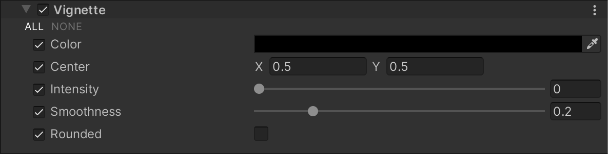

# 渐晕（Vignette）

在摄影中，渐晕指的是图像边缘较中心部分变暗和/或去饱和的效果。在现实中，较厚或叠加的滤镜、次级镜头以及不合适的遮光罩通常是导致这种效果的原因。您可以使用渐晕将注意力集中在图像中心。

## 使用 Vignette

**Vignette** 使用 [Volume](Volumes.md) 系统，因此要启用和修改 **Vignette** 属性，必须将 **Vignette** 覆盖添加到场景中的 [Volume](Volumes.md) 中。

要将 **Vignette** 添加到 Volume：

1. 在 Scene 或 Hierarchy 视图中，选择一个包含 Volume 组件的游戏对象，以便在 Inspector 中查看它。
2. 在 Inspector 中，导航到 **Add Override > Post-processing**，然后点击 **Vignette**。Universal Render Pipeline 会将 **Vignette** 应用于该 Volume 影响的任何相机。

## 属性

| **属性**   | **描述**                                              |
| -------------- | ------------------------------------------------------------ |
| **Color**      | 使用颜色选择器设置渐晕的颜色。                               |
| **Center**     | 设置渐晕的中心点。参考值：屏幕中心为 [0.5, 0.5]。            |
| **Intensity**  | 设置渐晕效果的强度。                                          |
| **Smoothness** | 使用滑块设置渐晕边界的平滑度。取值范围为 0.01 到 1。值越大，渐晕边界越平滑。默认值为 0.2。 |
| **Rounded**    | 启用后，渐晕为完全圆形。禁用后，渐晕与当前宽高比的形状匹配。 |
