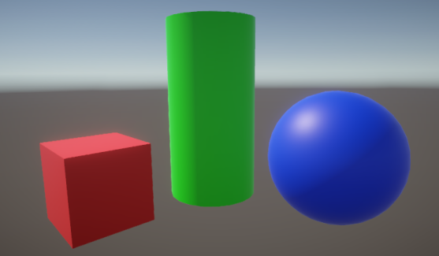

# 自定义后处理

通用渲染管线（URP）提供了多种预构建的[后处理效果](integration-with-post-processing.html)，您可以调整这些效果来实现特定的视觉风格或效果。URP 还允许您使用[全屏通道渲染器功能](../renderer-features/renderer-feature-full-screen-pass.md)创建自定义后处理效果。例如，您可以实现灰度效果，以指示玩家生命值耗尽。

  
 *未应用后处理效果的场景。*

  
 *应用灰度自定义后处理效果的场景。*

以下页面介绍了如何使用[全屏通道渲染器功能](../renderer-features/renderer-feature-full-screen-pass.md)创建自定义后处理效果：

* [如何创建自定义后处理效果](post-processing-custom-effect-low-code.md)。