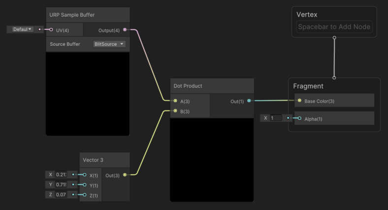
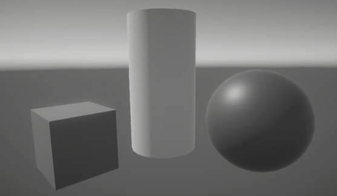

# 如何创建自定义后处理效果

本页面的示例展示如何使用全屏渲染通道创建灰度自定义后处理效果。

## 前提条件

该示例需要以下内容：

- 已安装 URP 包的 Unity 项目。

- **Scriptable Render Pipeline Settings** 属性已指向 URP 资源（**Project Settings** > **Graphics** > **Scriptable Render Pipeline Settings**）。

## 创建全屏 Shader Graph

您需要创建全屏 Shader Graph 来实现自定义后处理效果。

1. 在项目窗口中右键单击，选择 **Create** > **Shader Graph** > **URP** > **Fullscreen Shader Graph**，创建一个新的 Shader Graph。
2. 在 Shader Graph 窗口中右键单击，选择 **Create Node**，然后找到并选择 **URP Sample Buffer** 节点。
3. 在 **URP Sample Buffer** 节点的 **Source Buffer** 下拉菜单中，选择 **BlitSource**。
4. 添加一个 **Vector 3** 节点。
5. 为 **Vector 3** 节点分配以下数值：
    - **X** = 0.2126
    - **Y** = 0.7152
    - **Z** = 0.0722
6. 添加一个 **Dot Product** 节点。
7. 按照下图连接节点：

    

    | 节点                   | 连接                              |
    | --------------------- | ---------------------------------- |
    | **URP Sample Buffer** | **Output** 连接到 **Dot Product A** |
    | **Vector 3**          | **Out** 连接到 **Dot Product B**   |
    | **Dot Product**       | **Out** 连接到 **Fragment Base Color** |

8. 保存 Shader Graph。
9. 在项目窗口中右键单击，选择 **Create** > **Material**，创建一个新的材质。
10. 在检查器中打开材质，选择 **Shader** > **Shader Graphs**，然后选择之前创建的 Shader Graph，将其应用到材质上。

## 在全屏通道渲染器功能中使用材质

创建兼容的 Shader Graph 和材质后，您可以通过全屏通道渲染器功能将材质用作自定义后处理效果。

1. 在项目窗口中选择一个 URP 渲染器。
2. 在检查器中点击 **Add Renderer Feature**，选择 **Full Screen Pass Renderer Feature**。有关添加渲染器功能的更多信息，请参考[如何向渲染器添加渲染器功能](./../urp-renderer-feature-how-to-add.md)。
3. 将 **Post Process Material** 设置为使用全屏 Shader Graph 创建的材质。
4. 将 **Injection Point** 设置为 **After Rendering Post Processing**。
5. 将 **Requirements** 设置为 **Color**。

现在，您应该可以在场景视图和游戏视图中看到效果。

  
 *应用灰度自定义后处理效果的示例场景。*
