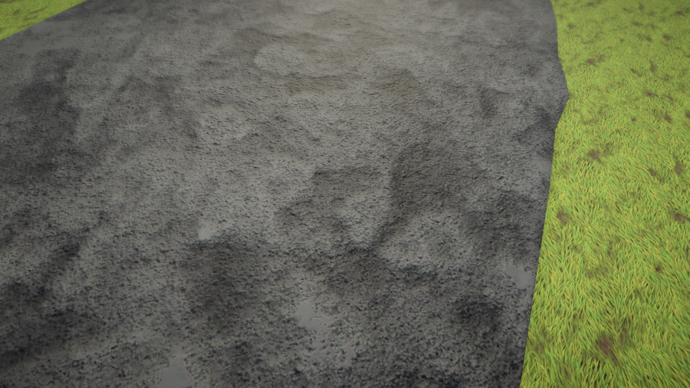
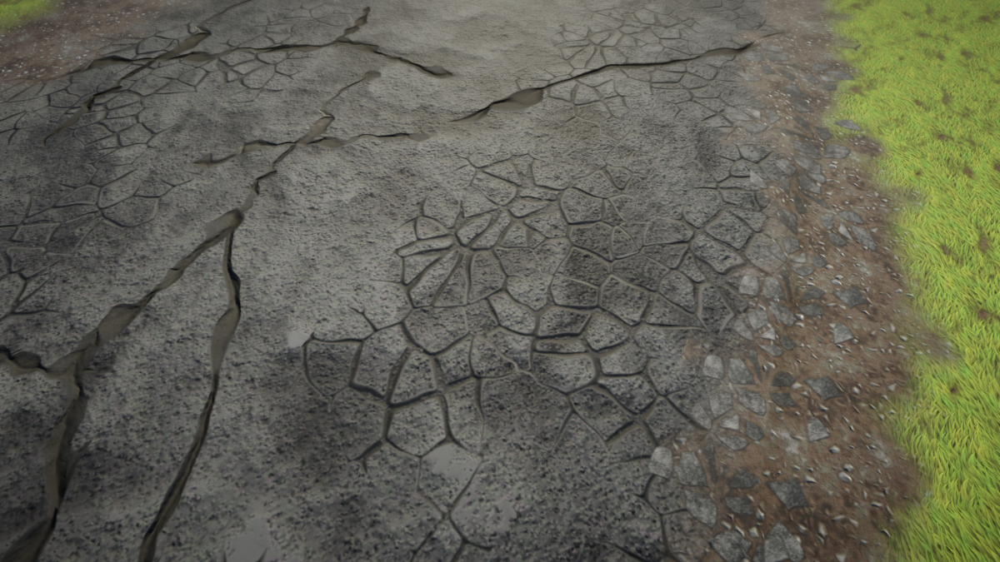
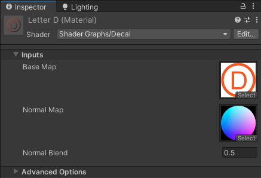
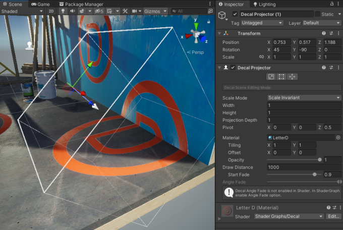
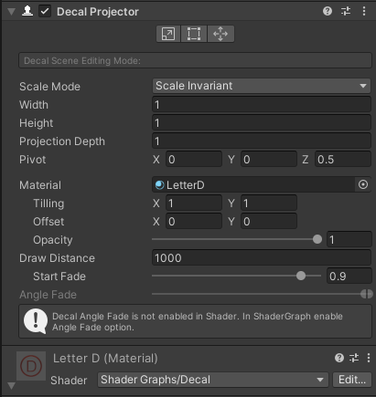
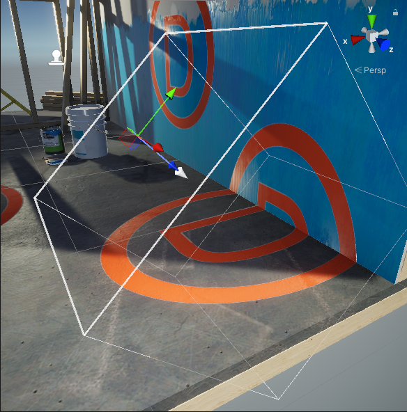
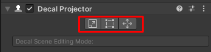
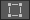
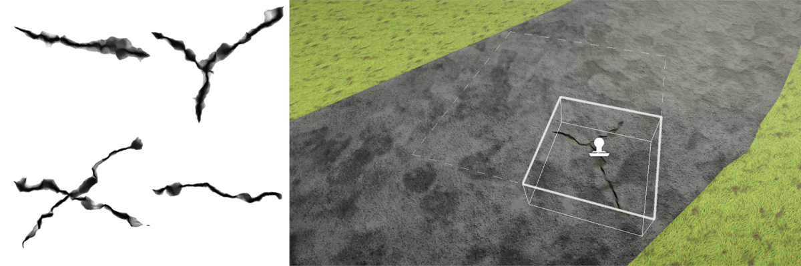

# Decal 渲染器功能

借助 Decal 渲染器功能，Unity 可以将特定材质（贴花）投射到场景中的其他对象上。贴花可以与场景的光照交互并包裹在网格上。

 *无贴花的示例场景*

 *有贴花的示例场景。贴花隐藏了材质之间的接缝，并增加了艺术细节。*

有关如何使用贴花的示例，请参阅[URP 包示例中的贴花样例](package-sample-urp-package-samples.md#decals)。

## 如何使用此功能

要将贴花添加到场景：

1. [将 Decal 渲染器功能](urp-renderer-feature-how-to-add.md)添加到 URP 渲染器。

2. 创建一个材质，并为其分配 `Shader Graphs/Decal` 着色器。在材质中，选择 Base Map 和 Normal Map。

    

3. 创建一个新的 Decal Projector 游戏对象，或将[Decal Projector 组件](#decal-projector-component)添加到现有游戏对象。

以下图示展示了场景中的 Decal Projector：

有关更多信息，请参阅[Decal Projector 组件](#decal-projector-component)。

将贴花添加到场景的另一种方法：

1. 创建一个 Quad 游戏对象。

2. 为游戏对象分配一个贴花材质。

3. 将 Quad 定位在希望放置贴花的表面上。如有必要，调整[网格偏移](decal-shader.md#mesh-bias-type)值以防止深度冲突。

## 限制

此功能具有以下限制：

* 贴花投影无法作用于透明表面。

## Decal 渲染器功能属性

本节介绍 Decal 渲染器功能的属性。

 *Decal 渲染器功能，Inspector 视图。*

### Technique

选择渲染器功能的渲染技术。

以下是此属性的选项说明：

#### Automatic

Unity 根据构建平台自动选择渲染技术。此时还会考虑 [Accurate G-buffer normals](rendering/deferred-rendering-path.md#accurate-g-buffer-normals) 选项，因为在没有 D-Buffer 技术的情况下，法线混合无法正常工作。

#### DBuffer

Unity 将贴花渲染到 Decal 缓冲区（DBuffer）中。在不透明渲染期间，Unity 将 DBuffer 的内容叠加在不透明对象的上方。

选择此技术后会显示 **Surface Data** 属性。Surface Data 属性可让您指定 Unity 将贴花与底层网格混合的表面属性。Surface Data 属性提供以下选项：

* **Albedo**: 贴花影响基本颜色和发光颜色。
* **Albedo Normal**: 贴花影响基本颜色、发光颜色和法线。
* **Albedo Normal MAOS**: 贴花影响基本颜色、发光颜色、法线、金属值、平滑值以及环境光遮蔽值。

**限制：**

* 此技术需要 DepthNormal 前向通道，这使得该技术在实现基于图块渲染的 GPU 上效率较低。

* 此技术不适用于粒子和地形细节。

#### Screen Space

Unity 在不透明对象之后使用从深度纹理或 G-Buffer（当使用延迟渲染路径时）重建的法线渲染贴花。Unity 将贴花作为网格渲染在不透明网格的上方。此技术仅支持法线混合。在使用延迟渲染路径并启用 [Accurate G-buffer normals](rendering/deferred-rendering-path.md#accurate-g-buffer-normals) 时，不支持法线混合，可能会导致不正确的结果。

建议在使用基于图块渲染的移动平台上选择屏幕空间贴花，因为除非启用 **Use Rendering Layers**，URP 不会创建 DepthNormal 前向通道。

选择此技术后会显示以下属性：

| __属性__       | __描述__ |
| --------------- |---------- |
| __Normal Blend__| 此属性中的选项（低、中、高）决定了 Unity 在重建法线时从深度纹理中取样的数量。质量越高，重建的法线越准确，性能影响也越高。 |
| &#160;&#160;&#160;&#160;**Low**    | Unity 在重建法线时取一个深度样本。 |
| &#160;&#160;&#160;&#160;**Medium** | Unity 在重建法线时取三个深度样本。 |
| &#160;&#160;&#160;&#160;**High**   | Unity 在重建法线时取五个深度样本。 |

### Max Draw Distance

Unity 渲染贴花的最大距离。

### Use Rendering Layers

选中此复选框以启用 [Rendering Layers](features/rendering-layers.md) 功能。

如果启用 **Use Rendering Layers**，URP 会创建一个 DepthNormal 前向通道。这会使得贴花在实现基于图块渲染的 GPU 上的效率降低。

## Decal 投影器组件

Decal 投影器组件允许 Unity 将贴花投影到场景中的其他对象上。Decal 投影器组件必须使用分配了 [Decal Shader Graph](decal-shader.md) 的材质（`Shader Graphs/Decal`）。

有关如何使用 Decal 投影器的更多信息，请参阅 [How to use the feature](#how-to-use-the-feature)。

Decal 投影器组件包括场景视图编辑工具和 Decal 投影器属性。

 *Inspector 中的 Decal 投影器组件。*

> **注意**: 如果您直接将 Decal 材质分配给某个 GameObject（而不是通过 Decal 投影器组件），则 Decal 投影器不会对该 GameObject 投影贴花。

### Decal 场景视图编辑工具

当选择一个 Decal 投影器时，Unity 会显示其边界框和投影方向。

Decal 投影器将在边界框内的每个网格上绘制贴花材质。

白色箭头表示投影方向。箭头的底部是其原点。

Decal 投影器组件提供以下场景视图编辑工具。

| __图标__                                      | __操作__          | __描述__                                                                                      |
|-----------------------------------------------|-------------------|-----------------------------------------------------------------------------------------------|
|    | __Scale__         | 选择以缩放投影器盒和贴花。此工具会更改材质的 UV 以匹配投影器盒的大小，但不会影响原点。             |
|     | __Crop__          | 选择以裁剪或平铺投影器盒内的贴花。此工具会更改投影器盒的大小，但不会更改材质的 UV，也不会影响原点。 |
|  | __Pivot / UV__    | 选择以移动贴花的原点而不移动投影盒。此工具会更改变换位置，同时也会影响投影纹理的 UV 坐标。       |

### Decal 投影器组件属性

本节介绍 Decal 投影器组件的属性。

| __属性__                 | __描述__                                                                                     |
|--------------------------|----------------------------------------------------------------------------------------------|
| __Scale Mode__           |选择此 Decal 投影器是否继承根 GameObject 的 Transform 组件的 Scale 值。 选项：  &#8226; __Scale Invariant__: Unity 仅使用此组件中的缩放值（如宽度、高度等），忽略根 GameObject 中的值。 &#8226;__Inherit from Hierarchy__: Unity 通过将根 GameObject 的 [lossy Scale](https://docs.unity.cn/cn/tuanjiemanual/ScriptReference/Transform-lossyScale.html) 值与 Decal 投影器的缩放值相乘，计算贴花的缩放值。 **注意**: 由于 Decal 投影器使用正交投影，如果根 GameObject [倾斜](https://docs.unity.cn/cn/tuanjiemanual/Manual/class-Transform.html)，贴花的缩放可能不正确。    |
| __Width__                | 投影器边界框的宽度。投影器沿局部 X 轴缩放贴花以匹配该值。                                     |
| __Height__               | 投影器边界框的高度。投影器沿局部 Y 轴缩放贴花以匹配该值。                                     |
| __Projection Depth__     | 投影器边界框的深度。投影器沿局部 Z 轴投影贴花。                                              |
| __Pivot__                | 投影器边界框中心相对于根 GameObject 原点的偏移位置。                                         |
| __Material__             | 要投影的材质。材质必须使用具有 Decal 材质类型的 Shader Graph。有关更多信息，请参阅 [Decal Shader Graph](decal-shader.md)。 |
| __Tiling__               | 贴花材质在其 UV 轴上的平铺值。                                                              |
| __Offset__               | 贴花材质在其 UV 轴上的偏移值。                                                              |
| __Opacity__              | 此属性允许指定不透明度值。值为 0 时，贴花完全透明；值为 1 时，贴花完全不透明（由 __Material__ 定义）。 |
| __Draw Distance__        | 摄像机到贴花的距离，在该距离下投影器停止投影贴花，URP 不再渲染贴花。                         |
| __Start Fade__           | 使用滑块设置从摄像机开始淡出的距离。值范围为 0 到 1，表示 __Draw Distance__ 的分数。值为 0.9 表示 Unity 从 __Draw Distance__ 的 90% 开始淡出贴花，在 __Draw Distance__ 完成淡出。 |
| __Angle Fade__           | 使用滑块设置贴花淡出的范围，基于贴花的后向方向与接收表面顶点法线之间的角度。                |

## 性能

由于设计原因，贴花不支持 **SRP Batcher**，因为它们使用了材质属性块。为了减少绘制调用的次数，可以使用 GPU 实例化将贴花批处理在一起。如果场景中的贴花使用相同的材质，并且材质启用了 **Enable GPU Instancing** 属性，Unity 会实例化这些材质并减少绘制调用的次数。

为了减少贴花所需的材质数量，可以将多个贴花纹理合并到一个纹理（图集）中。使用贴花投影器上的 UV 偏移属性来确定显示图集的哪一部分。

下图显示了一个贴花图集的示例。

   *左侧：包含四个贴花的贴花图集。右侧：贴花投影器正在投影其中之一。如果贴花材质启用了 GPU 实例化，四个贴花中的任何一个实例都会通过单次实例化绘制调用进行渲染。*

