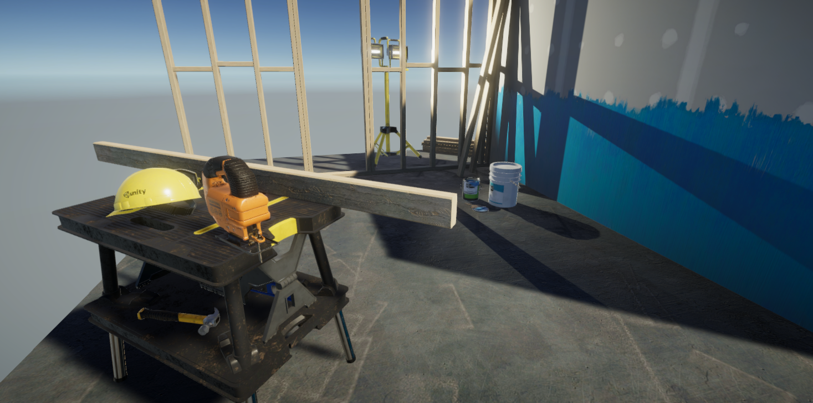
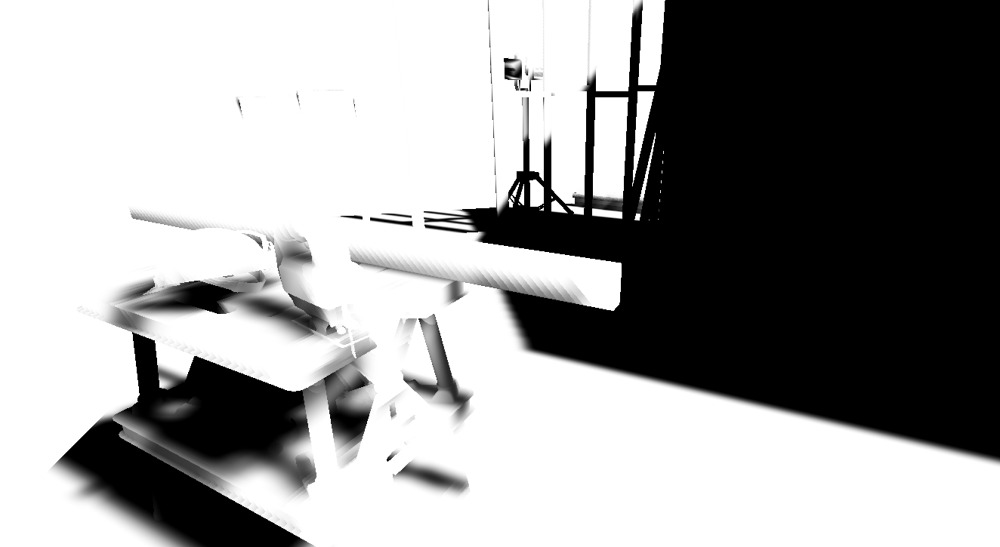
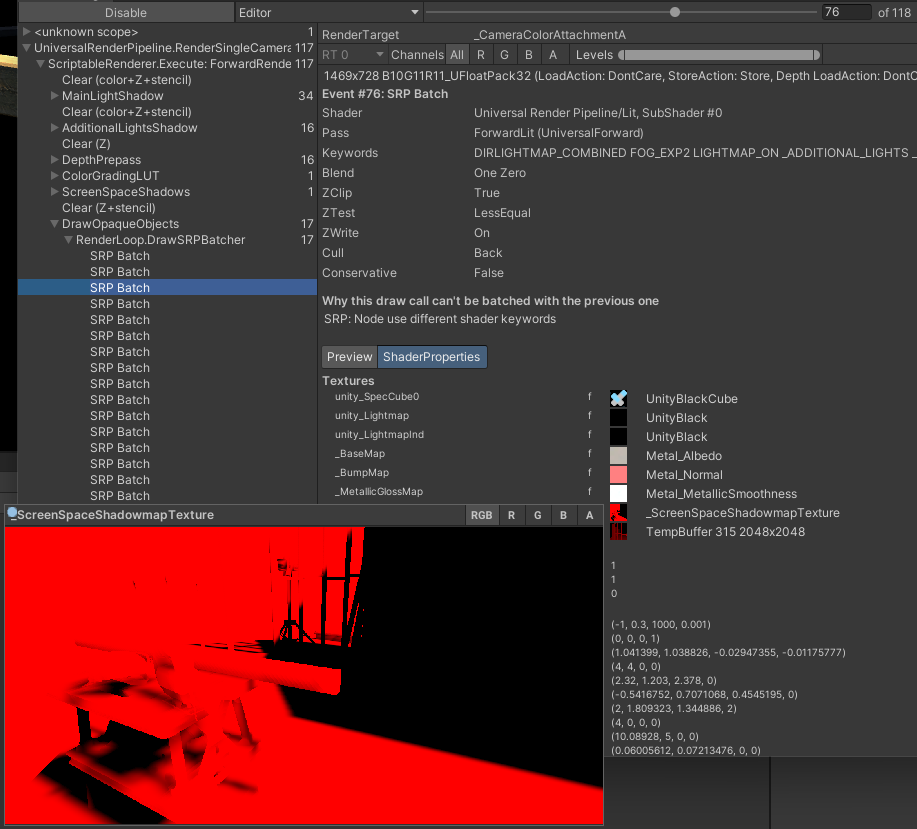
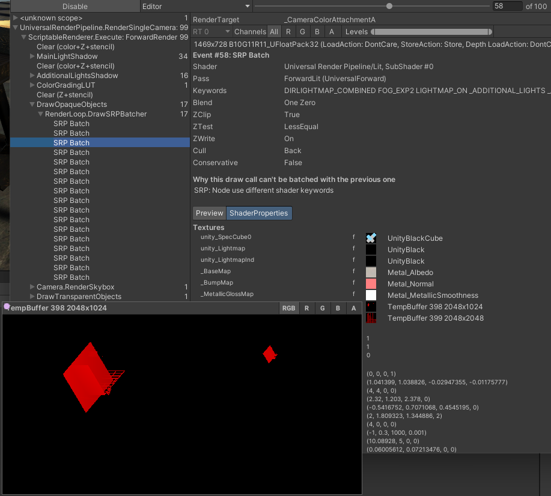

# 屏幕空间阴影渲染器特性

 *示例场景中的屏幕空间阴影。*

您可以将 [Screen Space Shadows 渲染器功能](renderer-feature-screen-space-shadows.md) 添加到 Universal Render Pipeline (URP) 渲染器中。通过这样做，URP 将使用单一渲染纹理来计算和绘制主方向光的阴影，而不再需要多个 [阴影级联](https://docs.unity.cn/cn/tuanjiemanual/Manual/shadow-cascades.html) 纹理。

Screen Space Shadows 渲染器功能不会影响阴影的外观。

如果您的项目使用的是 [前向渲染器](urp-universal-renderer.md)，屏幕空间阴影可能会提高渲染速度，因为 Universal Render Pipeline (URP) 无需访问多个阴影级联纹理。

屏幕空间阴影有以下限制：

- URP 会添加一个深度预处理步骤，以便能够对深度纹理进行采样。这可能会降低使用基于图块渲染的移动平台的性能。请参阅 [深度初始模式](urp-universal-renderer.md#rendering) 了解有关深度预处理的更多信息。
- URP 会创建一个屏幕空间阴影纹理，这会占用更多内存。

 *上述图像对应的屏幕空间阴影纹理。*

## 启用屏幕空间阴影

要在项目中添加屏幕空间阴影，请添加 Screen Space Shadows 渲染器功能。请参考 [添加渲染器功能](urp-renderer-feature-how-to-add.md)。

URP 不会为透明对象计算或绘制屏幕空间阴影。对于透明对象，URP 使用阴影贴图。

## 查看屏幕空间阴影

使用 [帧调试器](https://docs.unity.cn/cn/tuanjiemanual/Manual/FrameDebugger.html) 查看绘制阴影的渲染过程。请检查以下渲染过程：

- **ScreenSpaceShadows**，用于创建屏幕空间阴影纹理。
- **MainLightShadow**，用于创建阴影贴图纹理。

检查 **DrawOpaqueObjects** 渲染过程，确定 URP 为每个对象绘制阴影时使用的阴影纹理。

 *启用屏幕空间阴影时的帧调试器视图。**DrawOpaqueObjects** 渲染过程中的对象使用 **_ScreenSpaceShadowmapTexture**。*

 *禁用屏幕空间阴影时的帧调试器视图。**DrawOpaqueObjects** 渲染过程中的对象使用 **TempBuffer 398 2048x1024** 和 **TempBuffer 399 2048x2048**，它们是来自 **MainLightShadow** 渲染过程的阴影贴图纹理。*
