# 示例：如何使用 Render Objects Renderer Feature 创建自定义渲染效果

URP 在 **DrawOpaqueObjects** 和 **DrawTransparentObjects** Pass 中绘制对象。有时，您可能需要在帧渲染的不同阶段绘制对象，或以不同方式处理和写入渲染数据（如深度和模板缓冲）。[Render Objects Renderer Feature](renderer-feature-render-objects.md) 允许您通过特定的层、特定的时间点和特定的覆盖选项来自定义渲染。

本示例介绍如何使用 Render Objects Renderer Feature 创建自定义渲染效果。

## 示例概述

本示例实现以下效果：

* 场景中有一个角色。

    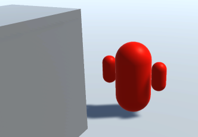

* 当角色被其他 GameObject 遮挡时，Unity 使用不同的材质绘制角色轮廓。

    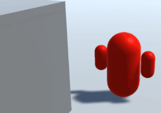

## 前提条件

本示例需要以下条件：

* 一个已安装 URP 包的 Unity 项目。

* **Project Settings** > **Graphics** > **Scriptable Render Pipeline Settings** 指向 URP 资源。

## 创建示例场景和 GameObject

按照以下步骤创建用于本示例的场景：

1. 创建一个 **Cube**，调整 **Scale** 使其看起来像一堵墙。

    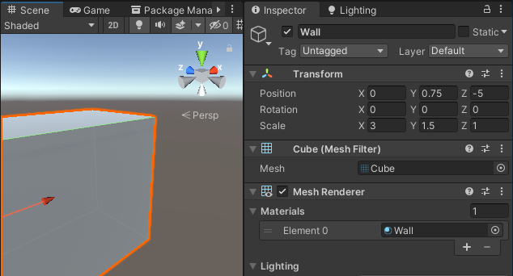

2. 创建一个材质，并使用 `Universal Render Pipeline/Lit` Shader。设置基础颜色（例如红色），命名为 `Character`。

3. 创建一个基本角色并赋予 `Character` 材质。在本示例中，角色由三个胶囊体组成：中间较大的胶囊体表示身体，两个较小的胶囊体表示手臂。

    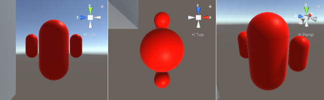

    为了便于操作，将三个胶囊体作为子 GameObject 归属到 **Character** GameObject 下。

    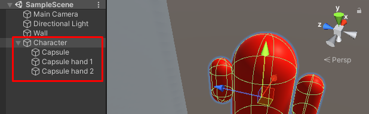

4. 创建一个新的材质，并使用 `Universal Render Pipeline/Unlit` Shader。设置基础颜色（例如蓝色），命名为 `CharacterBehindObjects`。该材质用于当角色被遮挡时的渲染。

现在，场景已准备就绪，可以按照本示例的步骤进行实现。

## 示例实现

本节假设您已经按照 [创建示例场景和 GameObject](#example-objects) 章节搭建了场景。

本示例使用两个 Render Objects Renderer Feature：一个用于绘制被遮挡的角色部分，另一个用于绘制未被遮挡的角色部分。

### 创建 Renderer Feature 以绘制被遮挡的角色

按照以下步骤创建 Renderer Feature 以绘制被其他 GameObject 遮挡的角色部分。

1. 选择一个 URP Renderer。

    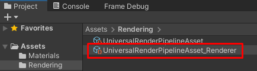

2. 在 **Inspector** 面板中，点击 **Add Renderer Feature**，选择 **Render Objects**。

    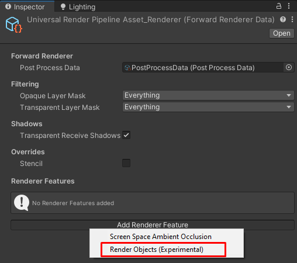

    在 **Name** 字段中输入 `DrawCharacterBehind` 作为新的 Renderer Feature 名称。

3. 本示例使用 **Layer** 来过滤需要渲染的 GameObject。创建一个新的 Layer 并命名为 `Character`。

    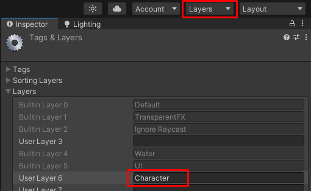

4. 选择 **Character** GameObject，将其分配到 `Character` Layer。在 **Inspector** 面板的 **Layer** 下拉列表中选择 `Character`。

    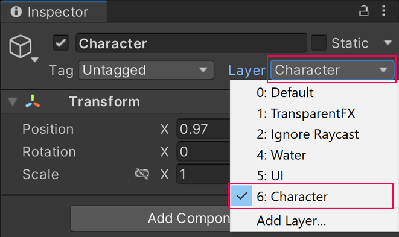

5. 在 `DrawCharacterBehind` Renderer Feature 的 **Filters** > **Layer Mask** 选项中选择 `Character`，确保此 Renderer Feature 仅渲染 `Character` 层的 GameObject。

6. 在 **Overrides** > **Material** 中选择 `CharacterBehindObjects` 材质，以在角色被遮挡时覆盖原材质。

    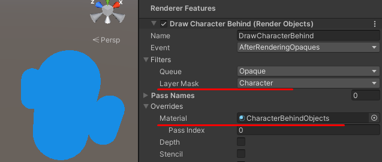

7. 设置 **Depth** 选项，使角色仅在被遮挡时才渲染。勾选 **Depth** 选项，并将 **Depth Test** 设置为 **Greater**。

    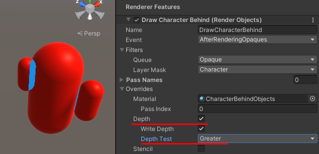

此时，Unity 仅在角色被遮挡时使用 `CharacterBehindObjects` 材质进行渲染。但由于角色本身的不同部分可能相互遮挡，部分区域可能错误地显示 `CharacterBehindObjects` 材质。

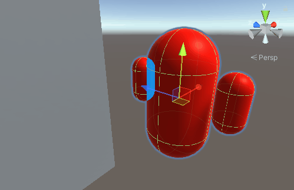

### 解决角色自遮挡问题

自遮挡问题的原因如下：

1. 在 URP 的 **Opaque** 渲染 Pass 中，Unity 使用 `Character` 材质绘制角色，并将深度值写入深度缓冲区。而 `DrawCharacterBehind` Renderer Feature 在 `AfterRenderingOpaques` 事件之后执行，因此会基于当前的深度缓冲进行测试。

2. 当 `DrawCharacterBehind` 执行时，Unity 根据 **Depth Test** 选项进行深度测试，导致角色自身某些部分被错误地替换为 `CharacterBehindObjects` 材质。

    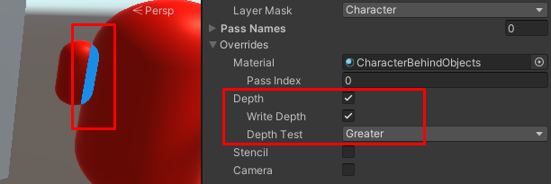

为了解决这个问题：

1. 在 **URP Asset** 的 **Filtering** > **Opaque Layer Mask** 选项中，取消 `Character` 层的勾选。

    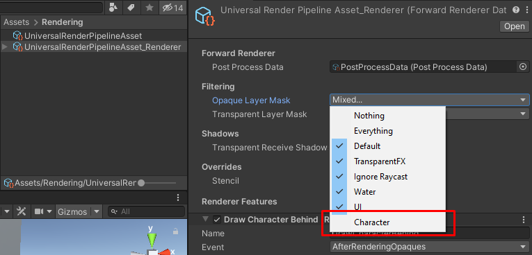

    这样，默认的 Opaque Pass 不会渲染角色，避免了错误的深度写入。

    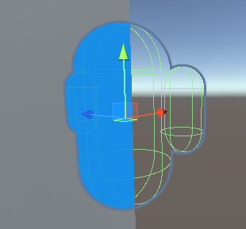

2. 添加一个新的 Render Objects Renderer Feature，命名为 `Character`。

3. 在 `Character` Renderer Feature 中，**Filters** > **Layer Mask** 选择 `Character` 层。

    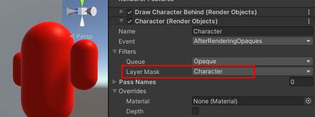

    这样 Unity 在 `AfterRenderingOpaques` 事件中渲染角色时，不会被 `DrawCharacterBehind` 影响。

4. 在 `DrawCharacterBehind` Renderer Feature 的 **Overrides** > **Depth** 选项中，取消勾选 **Write Depth**。这样 `DrawCharacterBehind` 不会更改深度缓冲区，避免影响后续 `Character` Renderer Feature 的渲染。

    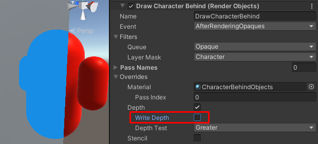

此时，最终效果如下：

* 当角色在前方时，使用 `Character` 材质渲染。
* 当角色被遮挡时，使用 `CharacterBehindObjects` 材质渲染轮廓。

完整的渲染顺序如下：

1. URP Renderer 在 `BeforeRenderingOpaques` 事件中跳过 `Character` 层对象的渲染。
2. `DrawCharacterBehind` Renderer Feature 在 `AfterRenderingOpaques` 事件中绘制被遮挡的角色部分。
3. `Character` Renderer Feature 在 `AfterRenderingOpaques` 事件中绘制未被遮挡的角色部分，修复自遮挡问题。