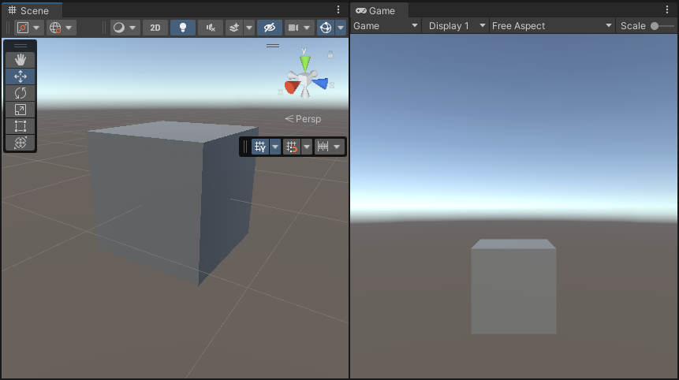
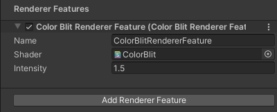
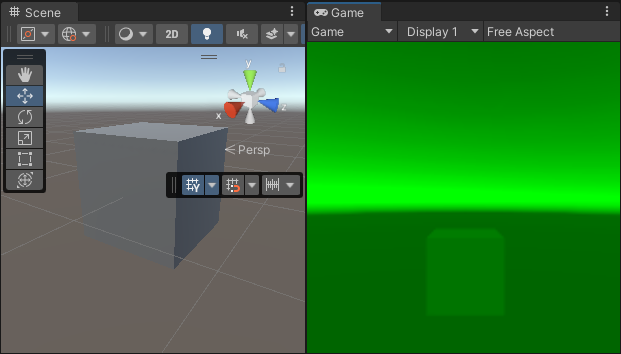

# 在 URP 中执行全屏 Blit 操作

本示例介绍如何创建一个自定义 Renderer Feature，在 URP 中执行全屏 Blit 操作。

## 示例概述

该示例实现以下功能：

* 一个 [自定义 Renderer Feature](https://docs.unity.cn/cn/Packages-cn/com.unity.render-pipelines.universal@latest/api/UnityEngine.Rendering.Universal.ScriptableRendererFeature.html) 调用一个 [自定义 Render Pass](https://docs.unity.cn/cn/Packages-cn/com.unity.render-pipelines.universal@latest/api/UnityEngine.Rendering.Universal.ScriptableRenderPass.html)。
* [Render Pass](https://docs.unity.cn/cn/Packages-cn/com.unity.render-pipelines.universal@latest/api/UnityEngine.Rendering.Universal.ScriptableRenderPass.html) 将 Opaque Texture Blit 到当前渲染器的 [相机颜色目标](https://docs.unity.cn/cn/Packages-cn/com.unity.render-pipelines.universal@latest/api/UnityEngine.Rendering.Universal.ScriptableRenderer.html#UnityEngine_Rendering_Universal_ScriptableRenderer_cameraColorTarget)。Render Pass 使用命令缓冲区绘制全屏网格，以适配 XR 设备的双眼渲染。

该示例包括 [用于 Blit 操作的 Shader](#shader)，该 Shader 使用 XR 采样宏对颜色缓冲区进行采样。

## 前提条件

该示例需要以下条件：

* **Project Settings** > **Graphics** > **Scriptable Render Pipeline Settings** 需要指向 URP 资源。

## <a name="example-objects"></a>创建示例场景和 GameObject

按照以下步骤创建用于本示例的场景：

1. 创建一个 **Cube**，确保该 Cube 可从主相机清晰可见。

    

此时，场景已准备好，可以按照示例步骤继续操作。


## 示例实现

本节假设您已经按照 [创建示例场景和 GameObject](#example-objects) 章节搭建了场景。

按照以下步骤创建 [自定义 Renderer Feature](https://docs.unity.cn/cn/Packages-cn/com.unity.render-pipelines.universal@latest/api/UnityEngine.Rendering.Universal.ScriptableRendererFeature.html) 和 [自定义 Render Pass](https://docs.unity.cn/cn/Packages-cn/com.unity.render-pipelines.universal@latest/api/UnityEngine.Rendering.Universal.ScriptableRenderPass.html)。

1. 创建一个新的 C# 脚本 `ColorBlitRendererFeature.cs`，用于实现自定义 Renderer Feature。

    ```C#
    using UnityEngine;
    using UnityEngine.Rendering;
    using UnityEngine.Rendering.Universal;

    internal class ColorBlitRendererFeature : ScriptableRendererFeature
    {
        public Shader m_Shader;
        public float m_Intensity;

        Material m_Material;
        ColorBlitPass m_RenderPass = null;

        public override void AddRenderPasses(ScriptableRenderer renderer,
                                        ref RenderingData renderingData)
        {
            if (renderingData.cameraData.cameraType == CameraType.Game)
                renderer.EnqueuePass(m_RenderPass);
        }

        public override void SetupRenderPasses(ScriptableRenderer renderer,
                                            in RenderingData renderingData)
        {
            if (renderingData.cameraData.cameraType == CameraType.Game)
            {
                // 确保 Opaque 纹理可用
                m_RenderPass.ConfigureInput(ScriptableRenderPassInput.Color);
                m_RenderPass.SetTarget(renderer.cameraColorTargetHandle, m_Intensity);
            }
        }

        public override void Create()
        {
            m_Material = CoreUtils.CreateEngineMaterial(m_Shader);
            m_RenderPass = new ColorBlitPass(m_Material);
        }

        protected override void Dispose(bool disposing)
        {
            CoreUtils.Destroy(m_Material);
        }
    }
    ```

2. 创建一个新的 C# 脚本 `ColorBlitPass.cs`，用于实现 Render Pass 执行 Blit 操作。

    该 Render Pass 使用 `Blitter.BlitCameraTexture` 方法绘制全屏四边形并执行 Blit 操作。

    > **注意：** 在 URP XR 项目中请勿使用 `cmd.Blit` 方法，因为该方法与 URP XR 集成存在兼容性问题。使用 `cmd.Blit` 可能会导致 XR Shader 关键字的错误启用或禁用，影响 XR SPI 渲染。

    ```C#
    using UnityEngine;
    using UnityEngine.Rendering;
    using UnityEngine.Rendering.Universal;

    internal class ColorBlitPass : ScriptableRenderPass
    {
        ProfilingSampler m_ProfilingSampler = new ProfilingSampler("ColorBlit");
        Material m_Material;
        RTHandle m_CameraColorTarget;
        float m_Intensity;

        public ColorBlitPass(Material material)
        {
            m_Material = material;
            renderPassEvent = RenderPassEvent.BeforeRenderingPostProcessing;
        }

        public void SetTarget(RTHandle colorHandle, float intensity)
        {
            m_CameraColorTarget = colorHandle;
            m_Intensity = intensity;
        }

        public override void OnCameraSetup(CommandBuffer cmd, ref RenderingData renderingData)
        {
            ConfigureTarget(m_CameraColorTarget);
        }

        public override void Execute(ScriptableRenderContext context, ref RenderingData renderingData)
        {
            var cameraData = renderingData.cameraData;
            if (cameraData.camera.cameraType != CameraType.Game)
                return;

            if (m_Material == null)
                return;

            CommandBuffer cmd = CommandBufferPool.Get();
            using (new ProfilingScope(cmd, m_ProfilingSampler))
            {
                m_Material.SetFloat("_Intensity", m_Intensity);
                Blitter.BlitCameraTexture(cmd, m_CameraColorTarget, m_CameraColorTarget, m_Material, 0);
            }
            context.ExecuteCommandBuffer(cmd);
            cmd.Clear();

            CommandBufferPool.Release(cmd);
        }
    }
    ```

3. <a name="shader"></a>创建用于 Blit 操作的 Shader `ColorBlit.shader`。

    ```c++
    Shader "ColorBlit"
    {
        SubShader
        {
            Tags { "RenderType"="Opaque" "RenderPipeline" = "UniversalPipeline" }
            LOD 100
            ZWrite Off Cull Off
            Pass
            {
                Name "ColorBlitPass"

                HLSLPROGRAM
                #include "Packages/com.unity.render-pipelines.universal/ShaderLibrary/Core.hlsl"
                // Blit.hlsl 提供了顶点着色器 (Vert)、
                // 输入结构 (Attributes) 和输出结构 (Varyings)
                #include "Packages/com.unity.render-pipelines.core/Runtime/Utilities/Blit.hlsl"

                #pragma vertex Vert
                #pragma fragment frag

                TEXTURE2D_X(_CameraOpaqueTexture);
                SAMPLER(sampler_CameraOpaqueTexture);

                float _Intensity;

                half4 frag (Varyings input) : SV_Target
                {
                    UNITY_SETUP_STEREO_EYE_INDEX_POST_VERTEX(input);
                    float4 color = SAMPLE_TEXTURE2D_X(_CameraOpaqueTexture, sampler_CameraOpaqueTexture, input.texcoord);
                    return color * float4(0, _Intensity, 0, 1);
                }
                ENDHLSL
            }
        }
    }
    ```

4. 将 `ColorBlitRendererFeature` 添加到 Universal Renderer 资源中。

    

    有关如何添加 Renderer Feature，请参考 [如何向 Renderer 添加 Renderer Feature](../urp-renderer-feature-how-to-add.md)。

    在本示例中，将 `Intensity` 设置为 1.5。

5. Unity 最终呈现如下效果：

    

    > **注意：** 要在 XR 设备中可视化此示例，请将项目配置为使用 XR SDK。[添加 MockHMD XR 插件](https://docs.unity3d.com/Packages/com.unity.xr.mock-hmd@latest/index.html)。将 **Render Mode** 设置为 **Single Pass Instanced**。

此示例已完成。


## 其他资源

* [Blit 相机颜色纹理到 RTHandle](../customize/blit-to-rthandle.md)
* [Blit 多个 RTHandle 纹理并在屏幕上绘制](../customize/blit-multiple-rthandles.md)
