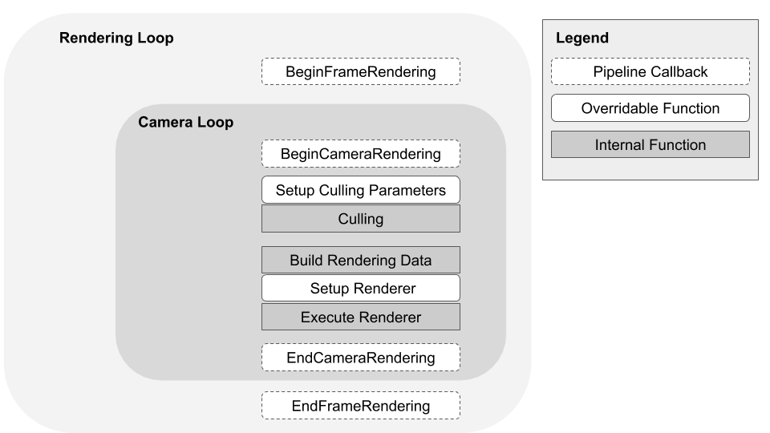

# 在通用渲染管线中的渲染

通用渲染管线（Universal Render Pipeline，URP）通过以下组件渲染场景：

- URP 渲染器。URP 包含以下渲染器：
  - [通用渲染器](urp-universal-renderer.md)。
  - [2D 渲染器](Setup.md#2d-renderer-setup)。
- [URP 自带着色器的着色模型](shading-model.md)
- 摄像机
- [URP 资源](universalrp-asset.md)

下图展示了 URP 通用渲染器的帧渲染循环。

当在[图形设置中激活渲染管线](InstallURPIntoAProject.md)时，Unity 使用 URP 渲染您项目中的所有摄像机，包括游戏视图和场景视图的摄像机、反射探针以及检查器中的预览窗口。

URP 渲染器对每个摄像机执行一个摄像机循环，该循环执行以下步骤：

1. 剔除场景中被渲染的对象
2. 构建渲染器的数据
3. 执行一个渲染器，将图像输出到帧缓冲区

有关每个步骤的更多信息，请参阅 [Camera loop](#camera-loop)。

在 [RenderPipelineManager](https://docs.unity.cn/cn/tuanjiemanual/ScriptReference/Rendering.RenderPipelineManager.html) 类中，URP 提供了可以用来在渲染一帧之前和之后、以及在渲染每个摄像机循环之前和之后执行代码的事件。这些事件包括：

- [beginCameraRendering](https://docs.unity.cn/cn/tuanjiemanual/ScriptReference/Rendering.RenderPipelineManager-beginCameraRendering.html)
- [beginFrameRendering](https://docs.unity.cn/cn/tuanjiemanual/ScriptReference/Rendering.RenderPipelineManager-beginFrameRendering.html)
- [endCameraRendering](https://docs.unity.cn/cn/tuanjiemanual/ScriptReference/Rendering.RenderPipelineManager-endCameraRendering.html)
- [endFrameRendering](https://docs.unity.cn/cn/tuanjiemanual/ScriptReference/Rendering.RenderPipelineManager-endFrameRendering.html)

有关如何使用 beginCameraRendering 事件的示例，请参阅 [通过脚本插入渲染通道](./customize/inject-render-pass-via-script.md)。

## Camera 循环

Camera 循环执行以下步骤：

| 步骤                          | 描述                                                         |
| ----------------------------- | ------------------------------------------------------------ |
| __Setup Culling Parameters__ | 配置决定剔除系统如何剔除光源（Lights）和阴影的参数。您可以使用自定义渲染器来覆盖渲染管线的这部分操作。 |
| __Culling__                  | 使用上一步中的剔除参数来计算当前摄像机可见的渲染器、阴影投射体以及光源列表。剔除参数和摄像机[图层距离](https://docs.unity.cn/cn/tuanjiemanual/ScriptReference/Camera-layerCullDistances.html)会影响剔除与渲染的性能。 |
| __Build Rendering Data__     | 根据剔除结果、[URP 资源](universalrp-asset.md)中的质量设置、[Camera](cameras.md)以及当前运行平台信息来生成 `RenderingData`。该数据告诉渲染器针对此摄像机与所选平台所需的渲染工作量与质量设置。 |
| __Setup Renderer__           | 构建渲染通道列表，并根据渲染数据安排执行顺序。您可以使用自定义渲染器来覆盖渲染管线的这部分操作。 |
| __Execute Renderer__         | 按照队列顺序执行每个渲染通道。渲染器将摄像机图像输出到帧缓冲区。 |

