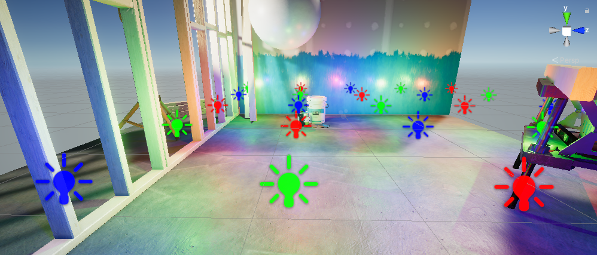
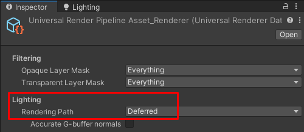
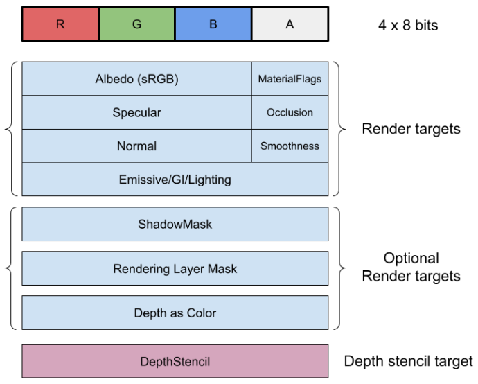
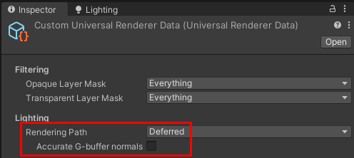
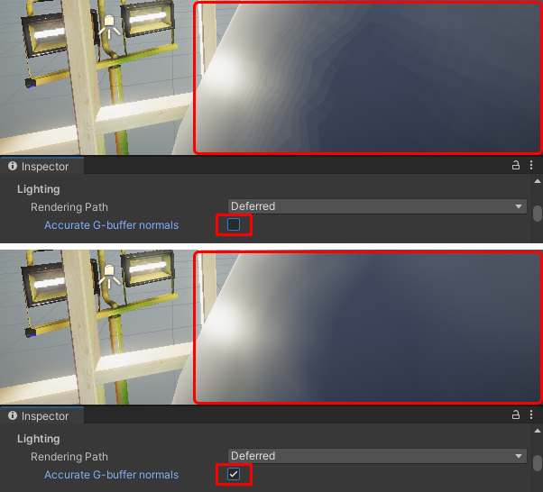
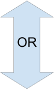
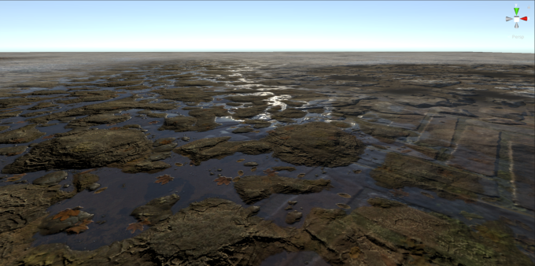
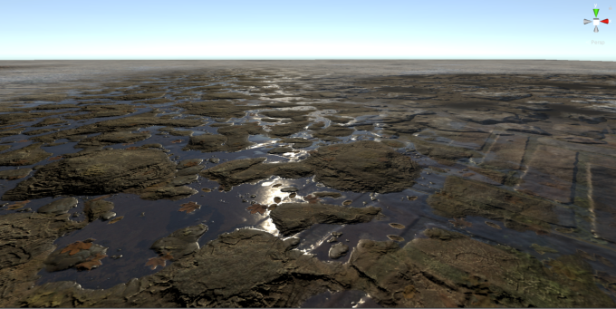

# URP 中的延迟渲染路径

URP通用渲染器支持以下渲染路径：

* 前向（Forward）
* 前向+（Forward+）
* 延迟（Deferred）

关于不同渲染路径的差异，请参考[渲染路径对比](../urp-universal-renderer.md#rendering-path-comparison)。

本节介绍延迟渲染路径。

<br/>*使用延迟渲染路径渲染的示例场景。*

本节包含以下内容：

* [如何选择延迟渲染路径](#how-to-enable)

* [Unity Player系统要求](#requirements)

* [实现细节](#implementation-details)

* [相关代码文件](#relevant-code-files)

* [ShaderLab Pass标签](#shaderlab-pass-tags)

* [限制与性能](#limitations-and-performance)

## <a name="how-to-enable"></a>如何选择延迟渲染路径

要选择渲染路径，请在URP通用渲染器资源的**Lighting** > **Rendering Path**属性中进行设置。



当选择延迟渲染路径时，Unity会显示[精确G-buffer法线](#accurate-g-buffer-normals)属性。

**精确G-buffer法线**属性可配置Unity在几何缓冲区（G-buffer）存储法线时的编码方式。

* **关闭精确G-buffer法线**：此选项提高性能，尤其是在移动GPU上，但可能会在光滑表面上产生颜色分 banding 伪影。

* **开启精确G-buffer法线**：Unity使用八面体编码法（octahedron encoding）将法线向量存储在法线纹理的RGB通道中。这种编码方式可提供更精确的法线值，但编码和解码操作会增加GPU负载。在使用[屏幕空间贴花技术](../renderer-feature-decal.md#screen-space-technique)时，该选项不支持贴花法线混合。

关于该设置的更多信息，请参考[在G-buffer中的法线编码](#accurate-g-buffer-normals)。

## <a name="requirements"></a>Unity Player系统要求

延迟渲染路径在Unity Player的一般系统要求基础上具有以下额外要求和限制。

* 最低着色器模型要求：Shader Model 4.5。

* 延迟渲染路径不支持OpenGL和OpenGL ES API。<br/>如果项目使用延迟渲染路径并构建到使用这些API的平台，应用程序将回退到前向渲染路径。

## 实现细节

本节介绍此功能的实现细节，以及其工作方式的技术细节。

### G-buffer布局

本节介绍Unity在延迟渲染路径中如何在G-buffer中存储材质属性。

下图展示了Unity在延迟渲染路径中用于渲染目标（Render Target）的数据结构。



该数据结构包含以下组件：

**Albedo（sRGB）**

该字段以sRGB格式存储Albedo颜色，24位。

**MaterialFlags（材质标志）**

该字段是一个位字段，包含材质标志：

* 位0，**ReceiveShadowsOff**：若设置，则该像素不接收动态阴影。

* 位1，**SpecularHighlightsOff**：若设置，则该像素不接收高光反射。

* 位2，**SubtractiveMixedLighting**：若设置，则该像素使用减法混合光照模式。

* 位3，**SpecularSetup**：若设置，则材质使用高光工作流（Specular Workflow）。

位4-7保留供将来使用。

关于更多技术细节，请参考文件 `/ShaderLibrary/UnityGBuffer.hlsl`。

**Specular（镜面反射）**

该字段包含以下值：

* **SimpleLit材质**：存储RGB镜面反射颜色（24位）。

* **使用金属度工作流的Lit材质**：存储反射率（8位），剩余16位未使用。

* **使用高光工作流的Lit材质**：存储RGB镜面反射颜色（24位）。

**Occlusion（遮蔽）**

该字段存储来自烘焙光照的遮蔽值。对于实时光照，Unity通过将烘焙遮蔽值与SSAO值结合来计算环境遮蔽值。

**Normal（法线）**

该字段以24位存储世界空间法线。关于法线编码的详细信息，请参考[在G-buffer中的法线编码](#accurate-g-buffer-normals)。

**Smoothness（光滑度）**

该字段存储SimpleLit和Lit材质的光滑度值。

**Emissive/GI/Lighting（自发光/GI/光照）**

该渲染目标包含材质的自发光输出以及烘焙光照。在G-buffer Pass期间，Unity填充该字段。在延迟光照Pass期间，Unity将光照计算结果存储在该渲染目标中。

渲染目标格式：

* 默认使用 **B10G11R11_UFloatPack32**，除非满足以下条件之一：

    * 在URP资源中，**Quality** > **HDR** 设置开启，且目标Player平台不支持HDR。

    * 在Player Settings中，**PreserveFramebufferAlpha** 设置为true。

* 如果无法使用 **B10G11R11_UFloatPack32**，则使用 **R16G16B16A16_SFloat**。

* 如果无法使用上述格式，Unity将使用 `SystemInfo.GetGraphicsFormat(DefaultFormat.HDR)` 方法返回的格式。

**ShadowMask（阴影遮罩）**

当光照模式设置为 Subtractive 或 Shadow mask 时，Unity会向G-buffer布局添加此渲染目标。

Subtractive 和 Shadow mask 模式针对前向渲染路径进行了优化，在延迟渲染路径中效率较低。为了提高GPU性能，建议在延迟渲染路径中避免使用这些模式，而改用 Baked Indirect 模式。

**Rendering Layer Mask（渲染层遮罩）**

当启用“使用渲染层”选项（URP资源中的**Lighting** > **Use Rendering Layers**）时，Unity会向G-buffer布局添加此渲染目标。

使用渲染层可能会影响GPU性能。更多信息，请参考[渲染层](../features/rendering-layers.md#performance)。

**Depth as Color（深度作为颜色）**

当目标平台支持Native Render Pass并启用此功能时，Unity会向G-buffer布局添加该渲染目标。Unity在此渲染目标中以颜色形式渲染深度数据。该渲染目标的作用如下：

* 提高Vulkan设备的性能。

* 允许Unity在Metal API上获取深度缓冲区，因为Metal不允许在同一渲染通道内从DepthStencil缓冲区中获取深度。

深度作为颜色的渲染目标格式为 `GraphicsFormat.R32_SFloat`。

**DepthStencil（深度模板缓冲）**

Unity在该渲染目标的最高4位中保留了材质类型的标记。更多信息，请参考[URP Pass标签：UniversalMaterialType](../urp-shaders/urp-shaderlab-pass-tags.md#universalmaterialtype)。

对于此渲染目标，Unity根据平台选择 `D32F_S8` 或 `D24S8` 格式。


### <a name="accurate-g-buffer-normals"></a>G-buffer中的法线编码

在延迟渲染路径中，Unity 在 G-buffer 中存储法线，并将每个法线向量编码为 24 位值。

当在 URP 通用渲染器资源的 **Rendering Path** 属性中选择 **Deferred** 选项时，Unity 会显示 **Accurate G-buffer normals** 属性。



**Accurate G-buffer normals** 属性允许配置 Unity 编码法线的方式。

* **关闭 Accurate G-buffer normals**：Unity 在 G-buffer 中以法线纹理的 RGB 通道存储法线向量值，每个通道 8 位（x, y, z）。该方法进行量化，会导致精度损失。此选项可提高性能，尤其是在移动 GPU 上，但可能会在光滑表面上出现颜色分 banding 伪影。

* **开启 Accurate G-buffer normals**：Unity 使用八面体编码法（octahedron encoding）将法线向量存储在法线纹理的 RGB 通道中。该编码方法可提供更精确的法线值，但编码和解码操作会增加 GPU 负载。在使用[屏幕空间贴花技术](../renderer-feature-decal.md#screen-space-technique)时，该选项不支持贴花法线混合。<br/>编码法线向量的精度与前向渲染路径中采样的值精度相似。

下图展示了当相机非常靠近 GameObject 时，两种选项的视觉差异：



**性能考量**

启用 **Accurate G-buffer normals** 选项后，由于额外的编码和解码操作，会增加 GPU 负载。在桌面平台和主机上，这个负载影响较小，但在移动 GPU 上可能会显著影响性能。

启用此选项不会增加内存占用。无论采用哪种编码方式，Unity 都会使用相同的法线纹理 RGB 通道来存储法线。

### <a name="render-passes"></a>延迟渲染路径的渲染 Pass

下表展示了延迟渲染路径中的渲染 Pass 事件顺序。

<table>
    <thead>
    <tr>
        <th>渲染 Pass 事件</th>
        <th>延迟渲染路径 Pass</th>
        <th>SSAO 渲染器特性 Pass</th>
    </tr>
    </thead>
    <tbody>
    <tr>
        <td>BeforeRendering</td>
        <td>&#160;</td>
        <td>&#160;</td>
    </tr>
    <tr>
        <td>BeforeRenderingShadows</td>
        <td>&#160;</td>
        <td>&#160;</td>
    </tr>
    <tr>
        <td>AfterRenderingShadows</td>
        <td>&#160;</td>
        <td>&#160;</td>
    </tr>
    <tr>
        <td>BeforeRenderingPrePasses</td>
        <td>深度或深度+法线预处理 Pass（仅前向材质）</td>
        <td>&#160;</td>
    </tr>
    <tr>
        <td>BeforeRenderingGbuffer</td>
        <td>G-buffer Pass（GBufferPass）</td>
        <td>&#160;</td>
    </tr>
    <tr>
        <td>&#160;</td>
        <td>复制 G-buffer 深度纹理</td>
        <td>&#160;</td>
    </tr>
    <tr>
        <td>AfterRenderingGbuffer</td>
        <td>&#160;</td>
        <td>SSAO（可选）</td>
    </tr>
    <tr>
        <td>BeforeRenderingDeferredLights</td>
        <td>&#160;</td>
        <td rowspan="4"></td>
    </tr>
    <tr>
        <td></td>
        <td>延迟渲染（Stencil）</td>
    </tr>
    <tr>
        <td>AfterRenderingDeferredLights</td>
        <td>&#160;</td>
    </tr>
    <tr>
        <td>BeforeRenderingOpaques</td>
        <td>仅前向渲染的不透明材质</td>
    </tr>
    <tr>
        <td>AfterRenderingOpaques</td>
        <td>&#160;</td>
        <td>SSAO 和混合（可选）</td>
    </tr>
    </tbody>
</table>

以下部分描述延迟渲染路径的各个渲染 Pass。

#### 深度或深度+法线预处理 Pass

在延迟渲染路径中，深度预处理 Pass 或深度+法线预处理 Pass 仅渲染不支持延迟渲染模型的材质，例如使用 Complex Lit Shader 的材质。

与前向渲染路径不同，在延迟渲染路径中，Unity 不会使用深度预处理 Pass 生成深度缓冲区的副本。

如果通用渲染器启用了 SSAO 渲染器特性，Unity 会执行深度+法线预处理 Pass。SSAO 使用屏幕空间深度和法线缓冲区计算环境遮蔽。

#### 可选 Pass：SSAO、SSAO + 混合

如果启用了 SSAO 渲染器特性，并且 **After Opaque** 选项被禁用（默认禁用），Unity 会在 AfterRenderingGbuffer 事件时执行 SSAO Pass，计算 SSAO 纹理。Unity 在延迟渲染 Pass 和前向材质渲染 Pass 中采样该 SSAO 纹理。

启用 **After Opaque** 选项后，Unity 会在 AfterRenderingOpaques 事件时执行 SSAO + 混合 Pass，并额外执行一个全屏 Pass，将 SSAO 纹理叠加到 Emissive/GI/Lighting 缓冲区上。这会导致烘焙遮蔽和实时遮蔽的双重加深。

**性能考量**

在具有 TBDR 架构的移动平台上，如果 **After Opaque** 选项被禁用，Unity 需要额外的渲染目标进行加载和存储操作，这会显著影响性能。

在移动平台上启用 **After Opaque** 选项可提高 GPU 性能，并避免额外的渲染目标加载和存储操作。

#### 前向渲染 Pass

某些 Unity Shader 使用的光照模型无法在延迟渲染路径中渲染，例如：

* **Complex Lit**：该 Shader 的光照模型（如 Clear Coat 效果）过于复杂，额外的材质属性无法容纳在 G-buffer 中。
* **Baked Lit** 和 **Unlit**：这些 Shader 不计算实时光照，因此 Unity 直接在前向 Pass 中将它们渲染到 Emissive/GI/Lighting 缓冲区中。这比在延迟渲染（Stencil）Pass 中处理更快。
* **自定义 Shader**：不声明延迟渲染路径所需 Pass 标签（`LightMode` 和 `UniversalMaterialType`）的 Shader，会被 Unity 作为前向渲染处理。有关更多信息，请参考 [URP Pass 标签](../urp-shaders/urp-shaderlab-pass-tags.md)。

Unity 在前向渲染路径中渲染这些材质。若 SSAO 渲染器特性需要计算 Complex Lit 材质的环境遮蔽，则必须在深度+法线预处理 Pass 先渲染这些材质，因为它们不会出现在 G-buffer Pass（GBufferPass）中。

#### 实现注意事项

为了最大化平台兼容性，URP 延迟渲染路径使用光照模板体积技术（Light Stencil Volume）来渲染光照体积并应用延迟着色。

## 相关代码文件

本节列出了与延迟渲染路径相关的代码文件。

* 处理延迟渲染路径的主类：

    ```
    com.unity.render-pipelines.universal\Runtime\DeferredLights.cs
    ```

* G-buffer Pass 的 ScriptableRenderPass：

    ```
    com.unity.render-pipelines.universal\Runtime\Passes\GBufferPass.cs
    ```

* 延迟着色 Pass 的 ScriptableRenderPass：

    ```
    com.unity.render-pipelines.universal\Runtime\Passes\DeferredPass.cs
    ```

* 延迟着色的 Shader 资源：

    ```
    com.unity.render-pipelines.universal\Shaders\Utils\StencilDeferred.shader
    ```

* 延迟着色的工具函数：

    ```
    com.unity.render-pipelines.universal\Shaders\Utils\Deferred.hlsl
    ```

* 处理 G-buffer 材质属性存储与加载的工具函数：

    ```
    com.unity.render-pipelines.universal\Shaders\Utils\UnityGBuffer.hlsl
    ```

## ShaderLab Pass 标签

为了使 Unity 能够在延迟渲染路径中渲染 Shader，该 Shader 必须包含一个带有以下标签定义的 Pass：

`"LightMode" = "UniversalGBuffer"`

Unity 在 G-buffer Pass 期间执行带有此 `LightMode` 标签的 Shader。

如果希望 Unity 在延迟渲染路径中的前向 Pass 中渲染某些材质，应在 Shader 的 Pass 中添加以下标签：

`"LightMode" = "UniversalForwardOnly"`

`"LightMode" = "DepthNormalsOnly"`

要指定 Shader 的光照模型（Lit、SimpleLit），请使用 `UniversalMaterialType` 标签。

有关更多信息，请参考 [URP Pass 标签：LightMode](../urp-shaders/urp-shaderlab-pass-tags.md#lightmode)。

## 限制与性能

本节描述延迟渲染路径的限制。

### 地形混合

当混合超过四层地形（Terrain）时，延迟渲染路径可能会生成与前向渲染路径略有不同的结果。这是因为在前向渲染路径中，Unity 使用多 Pass 渲染方式分别处理前四层和接下来的四层。

在前向渲染路径中，Unity 合并材质属性，并计算四层地形的光照效果。然后，Unity 以相同方式处理接下来的四层，并使用 Alpha 混合合并光照结果。

在延迟渲染路径中，Unity 在 G-buffer Pass 中以四层为单位合并地形层，并仅在延迟光照 Pass 中计算光照。与前向渲染路径的处理方式不同，这可能导致[视觉上的差异](#terrain-visual-diff)。

Unity 在 G-buffer 中使用硬件混合（每次四层），这可能影响材质属性的正确性。例如，像素法线无法仅通过 Alpha 混合正确合成，因为某些地形层可能包含较粗糙的地形细节，而另一些地形层可能包含精细细节。对法线进行平均或求和会导致精度损失。

> **注意：** 开启 [Accurate G-buffer normals](#accurate-g-buffer-normals) 选项会破坏地形混合。此选项使用八面体编码存储法线，而该编码方法无法对不同层的法线进行正确混合。如果应用程序需要使用超过四层的地形，应关闭 **Accurate G-buffer normals** 选项。

<a name="terrain-visual-diff"></a>下图展示了不同渲染路径下地形层的视觉差异：

<br/>*使用前向渲染路径渲染的地形层*

<br/>*使用延迟渲染路径渲染的地形层*

### 预烘焙全局光照（Baked Global Illumination）与光照模式

当启用预烘焙全局光照时，在延迟渲染路径中，Subtractive 和 Shadowmask 光照模式会给 GPU 带来额外负载。

延迟渲染路径支持 Subtractive 和 Shadowmask 光照模式，以保持兼容性。但与前向渲染路径不同，这些模式在延迟渲染路径中不会带来性能优化。在延迟渲染路径中，Unity 使用相同的光照算法处理所有网格，并将 Subtractive 和 Shadowmask 模式所需的额外光照属性存储在 [ShadowMask 渲染目标](#g-buffer-layout) 中。

在延迟渲染路径中，Baked Indirect 光照模式提供更好的性能，因为它不需要额外的 ShadowMask 渲染目标。

### 渲染层（Rendering Layers）

URP 提供 **Rendering Layers** 功能，允许配置场景中哪些光源影响特定网格。被分配到特定渲染层的光源仅会影响同一渲染层中的网格。

有关渲染层的更多信息，请参考 [Rendering Layers](../features/rendering-layers.md)。

**性能影响**

Rendering Layers 需要额外的 G-buffer 渲染目标来存储渲染层遮罩（32 位）。这个额外的渲染目标可能会对 GPU 性能产生负面影响。

**实现说明**

在前向渲染路径中，Unity 允许使用 [Layers](https://docs.unity.cn/cn/tuanjiemanual/Manual/Layers.html) 功能，通过剔除遮罩（Culling Mask）系统让特定光源影响特定网格。

由于延迟渲染路径的光照计算是在渲染循环的后期阶段进行的（请参阅 [延迟渲染路径渲染 Pass](#render-passes) 中的 **Deferred rendering (stencil)** 步骤），因此无法使用层系统进行光照剔除。
