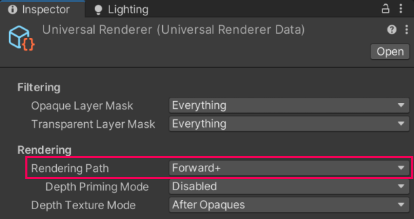

# Forward+ 渲染路径

Forward+ 渲染路径可避免 Forward 渲染路径中的每对象光照限制。

与 Forward 渲染路径相比，Forward+ 渲染路径具有以下优势：

* 没有每对象光照数量限制，[但仍受每相机光照上限限制](../urp-universal-renderer.md#real-time-lights-limitations)。<br/>该实现方式避免了当影响对象的光源超过 8 个时，需要拆分大型网格的情况。

* 支持超过 2 个反射探针的混合。

* 在使用 Unity 实体组件系统（ECS）时支持多个光源。

* 对程序化绘制（procedural draws）提供更高的灵活性。

更多信息，请参考：[渲染路径对比](../urp-universal-renderer.md#rendering-path-comparison)。

## <a name="how-to-enable"></a>如何选择 Forward+ 渲染路径

要选择 Forward+ 渲染路径，请在 URP 通用渲染器资源的 **Rendering** > **Rendering Path** 属性中进行设置。



当将渲染路径设置为 Forward+ 时，Unity 会忽略 URP 资源 **Lighting** 部分中的以下属性：

* **Main Light**：在 Forward+ 模式下，该属性值始终为 **Per Pixel**，无论用户选择何种值。

* **Additional Lights**：在 Forward+ 模式下，该属性值始终为 **Per Pixel**，无论用户选择何种值。

* **Additional Lights** > **Per Object Limit**：Unity 忽略该属性。

* **Reflection Probes** > **Probe Blending**：反射探针混合始终开启。

## 限制

与 Forward 渲染路径相比，Forward+ 渲染路径没有额外的限制。

## 降低构建时间

由于项目可能使用多种渲染器、目标平台和功能，某些 URP 配置可能会导致大量 Shader 变体生成，从而增加编译时间。

较长的 Shader 编译时间不仅影响玩家构建时间，还会影响编辑器中场景的渲染时间。

在 Forward+ 渲染路径中，每个 **Lit** 和 **Complex Lit** Shader 变体的编译时间受到每相机可见光源上限的影响。在桌面平台上，该上限默认为 256。

本节介绍如何通过更改默认的最大可见光源数量来减少 Shader 编译时间。

### 更改最大可见光源数量

> [!NOTE]
> 此操作步骤是一种临时解决方案，适用于 URP 设计中的限制。未来的 Unity 版本可能会对此进行优化。

[通用渲染管线配置包（Universal Render Pipeline Config package）](../URP-Config-Package.md) 包含定义最大可见光源数量的设置。以下步骤介绍如何修改这些设置。

> [!NOTE]
> 如果升级 Unity 版本，需要重新执行此操作。

1. 在项目文件夹中，从 `/Library/PackageCache/com.unity.render-pipelines.universal-config@[versionnumber]` 复制 **URP Config Package** 文件夹到 `/Packages/com.unity.render-pipelines.universal-config@[versionnumber]`。

2. 打开文件 `/com.unity.render-pipelines.universal-config@[versionnumber]/Runtime/ShaderConfig.cs.hlsl`。

    该文件包含多个 `MAX_VISIBLE_LIGHT_COUNT` 定义，并以目标平台名称结尾。修改括号内的数值，以适合项目的每相机最大视锥光源数量，例如：
    
    ```
    #define MAX_VISIBLE_LIGHT_COUNT_DESKTOP (32)
    ```

    对于 **Forward+** 渲染路径，该值包括主光源（Main Light）。对于 **Forward** 渲染路径，该值不包括主光源。

3. 打开文件 `/com.unity.render-pipelines.universal-config@[versionnumber]/Runtime/ShaderConfig.cs`。

    该文件包含多个 `k_MaxVisibleLightCount` 定义，并以平台名称结尾。修改该值，使其与 `ShaderConfig.cs.hlsl` 文件中的值保持一致，例如：

    ```
    const int k_MaxVisibleLightCountDesktop = 32;
    ```

4. 保存已编辑的文件并重新启动 Unity 编辑器。Unity 将自动配置项目和 Shader 以使用新的设置。

现在，由于每个 Shader 变体的编译时间减少，Player 构建时间应当缩短。
