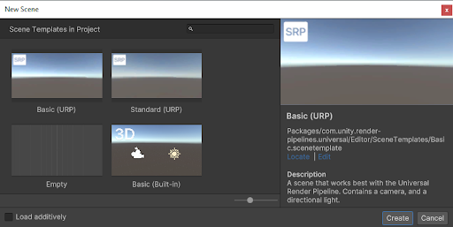

# URP 场景模板

你可以使用 [场景模板](https://docs.unity.cn/cn/tuanjiemanual/Manual/scene-templates.html) 快速创建包含预配置 URP 特定设置和后处理效果的场景。有关如何从场景模板创建新场景的信息，请参阅 [从“新建场景”对话框创建新场景](https://docs.unity.cn/cn/tuanjiemanual/Manual/scenes-working-with.html#creating-a-new-scene-from-the-new-scene-dialog)。

> *“新建场景”对话框显示的场景模板。*

以下是 URP 可用的场景模板：

* **Basic (URP)**：包含 [Camera](camera-component-reference.md) 和 [Light](light-component.md) 的场景。这是 Unity 默认场景的 URP 版本。
* **Standard (URP)**：包含 Camera、Light 和带有各种后处理效果的全局 [Volume](Volumes.md) 的场景。  
  **注意**：如果使用 Standard (URP) 场景模板创建场景，Unity 会创建一个新的 [Volume Profile](VolumeProfile.md) 来存储后处理效果。
