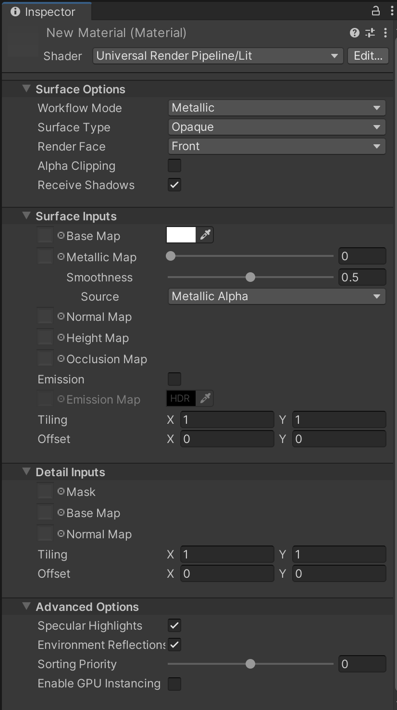
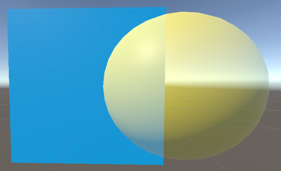
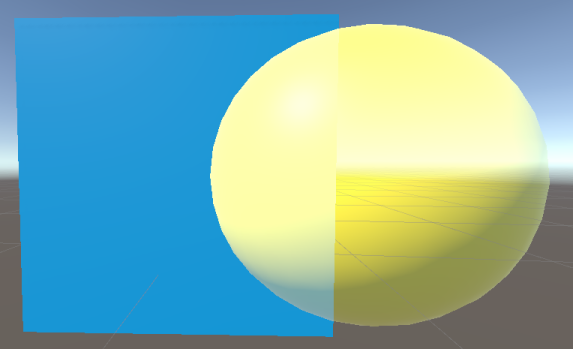
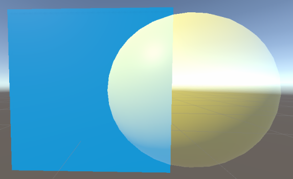
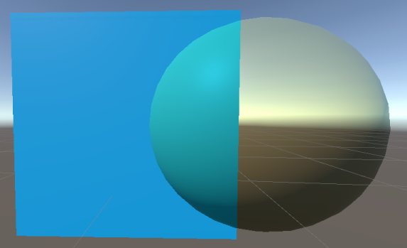
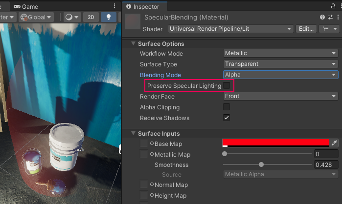
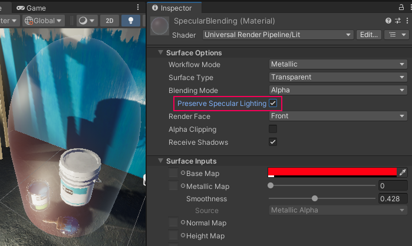

# Complex Lit Shader

Complex Lit Shader 包含了 Lit Shader 的所有功能，并增加了一些更高级的材质功能。其中某些功能可能会大幅提高资源消耗，并需要[Unity Shader Model 4.5](https://docs.unity.cn/cn/tuanjiemanual/Manual/SL-ShaderCompileTargets.html) 的硬件支持。

在延迟渲染路径（Deferred Rendering Path）下，URP 会使用前向渲染路径（Forward Rendering Path）来渲染使用 Complex Lit Shader 的对象。如果目标平台的硬件不支持 Complex Lit Shader 中的某些功能，URP 会改用 Lit Shader。

如果需要在 GPU 上减少处理时间（例如在低端平台上），应避免使用 Complex Lit Shader；可使用 [Baked Lit Shader](baked-lit-shader.md) 渲染静态物体，并使用 [Simple Lit Shader](simple-lit-shader.md) 渲染动态物体。若必须使用 Complex Lit Shader，建议禁用 **Clear Coat** 功能。

## 在编辑器中使用 Complex Lit Shader

要选择并使用此 Shader，请执行以下步骤：

1. 在项目中创建或找到要使用此 Shader 的材质（Material）。选择该 __Material__，Material Inspector 窗口会打开。
2. 点击 __Shader__ 并选择 **Universal Render Pipeline** > **Complex Lit**。

## 界面概览

此 Shader 的 Inspector 窗口包含以下部分：

- __[Surface Options](#surface-options)__
- __[Surface Inputs](#surface-inputs)__
- __[Advanced](#advanced)__

### Surface Options

__Surface Options__ 控制 URP 如何在屏幕上渲染材质。

| 属性               | 描述                                                         |
| ---------------- | ------------------------------------------------------------ |
| __Workflow Mode__ | 使用此下拉菜单选择适用于材质贴图的工作流：[__Metallic__](https://docs.unity.cn/cn/tuanjiemanual/Manual/StandardShaderMaterialParameterMetallic.html) 或 [__Specular__](https://docs.unity.cn/cn/tuanjiemanual/Manual/StandardShaderMaterialParameterSpecular.html)。 选择后，Inspector 其余部分的主要贴图选项将遵循所选的工作流。有关金属度（Metallic）或高光（Specular）工作流的详细信息，请参阅 [Unity 内置 Standard Shader 文档](https://docs.unity.cn/cn/tuanjiemanual/Manual/StandardShaderMetallicVsSpecular.html)。 |
| __Surface Type__  | 选择材质的表面类型：__Opaque__ 或 __Transparent__。这决定了 URP 使用哪个渲染通道。 __Opaque__ 材质始终完全可见，无论其后是否有其他对象，并且 URP 会优先渲染不透明材质。 __Transparent__ 材质受背景影响，并根据所选的透明表面类型变化。URP 在不透明对象之后的独立通道中渲染透明材质。选择 __Transparent__ 后，将出现 __Blending Mode__ 选项。 |
| __Blending Mode__ | 选择 Unity 在混合材质和背景时如何计算每个像素的颜色。  在混合模式的上下文中，Source 指的是设置了混合模式的透明材质，而 Destination 指的是该材质所覆盖的任何背景对象。 |
|&#160;&#160;&#160;&#160;Alpha |  *Alpha 混合模式。*  __Alpha__ 使用材质的 Alpha 值来调整对象的透明度。0 表示完全透明，255（或 1.0）表示完全不透明。 无论 Alpha 值如何，该材质始终在透明渲染通道中进行渲染。 此模式允许使用 [Preserve Specular Lighting](#preserve-specular) 选项。  Alpha 计算公式： *OutputRGBA* = (*SourceRGB* &#215; *SourceAlpha*) + (*DestinationRGB* &#215; (1 &#8722; *SourceAlpha*)) |
|&#160;&#160;&#160;&#160;Premultiply |  *Premultiply 混合模式。*  __Premultiply__ 先将透明材质的 RGB 值与 Alpha 值相乘，然后应用类似于 Alpha 模式的效果。 此模式的公式允许在透明材质中 Alpha 值为 0 的区域产生加法混合效果，可减少在不透明与透明像素交叠处出现的伪影。  Premultiply 计算公式： *OutputRGBA* = *SourceRGB* + (*DestinationRGB* &#215; (1 &#8722; *SourceAlpha*)) |
|&#160;&#160;&#160;&#160;Additive |  *Additive 混合模式。*  __Additive__ 将材质颜色与背景颜色相加，以创建混合效果。Alpha 值决定源材质颜色的强度，然后再进行混合计算。 此模式允许使用 [Preserve Specular Lighting](#preserve-specular) 选项。  Additive 计算公式： *OutputRGBA* = (*SourceRGB* &#215; *SourceAlpha*) + *DestinationRGB* |
|&#160;&#160;&#160;&#160;Multiply |  *Multiply 混合模式。*  __Multiply__ 通过将材质颜色与其后方的颜色相乘来创建混合效果。这类似于透过彩色玻璃观察时颜色变暗的效果。 此模式使用材质的 Alpha 值来调整颜色混合程度。Alpha 值为 1 时，颜色直接相乘；较低的 Alpha 值则使颜色向白色过渡。  Multiply 计算公式： *OutputRGBA* = *SourceRGB* &#215; *DestinationRGB*  |
| __Preserve Specular Lighting__ | 指定 Unity 是否在透明材质上保留高光反射。即使材质为透明，也可使反射光可见。  仅当 __Surface Type__ 为 Transparent 且 __Blending Mode__ 为 Alpha 或 Additive 时可用。   *关闭时的材质效果。*   *开启时的材质效果。* |
| __Render Face__     | 选择几何体要渲染的面。 __Front Face__：渲染几何体正面并[剔除](https://docs.unity.cn/cn/tuanjiemanual/Manual/SL-CullAndDepth.html)背面（默认）。 __Back Face__：渲染几何体背面并剔除正面。 __Both__：让 URP 同时渲染几何体的正反两面，适用于叶子等扁平物体。 |
| __Alpha Clipping__  | 使材质表现类似[Cutout](https://docs.unity.cn/cn/tuanjiemanual/Manual/StandardShaderMaterialParameterRenderingMode.html)（剪切）Shader，以创建硬边界的透明效果（如草叶）。 启用后，URP 不会渲染低于指定 __Threshold__ 的 Alpha 值。阈值可以通过滑块在 0 到 1 的范围内调节。例如，阈值为 0.1 意味着 URP 不会渲染 Alpha 值低于 0.1 的部分。默认阈值为 0.5。 |
| __Receive Shadows__ | 勾选此选项后，GameObject 会接收其他对象投射的阴影。若取消勾选，GameObject 将无法接收阴影。 |

### Surface Inputs

__Surface Inputs__ 描述材质表面的特性。例如，可使用这些属性使表面呈现湿润、干燥、粗糙或光滑的效果。

**注意：** 如果你熟悉内置 Unity 渲染管线中的 [Standard Shader](https://docs.unity.cn/cn/tuanjiemanual/Manual/Shader-StandardShader.html)，以下选项与 [Material Editor](https://docs.unity.cn/cn/tuanjiemanual/Manual/StandardShaderContextAndContent.html) 中的主贴图设置相似。

| 属性                      | 描述                                                         |
| ------------------------- | ------------------------------------------------------------ |
| __Base Map__             | 为表面添加颜色，也称为漫反射贴图（diffuse map）。 要为 __Base Map__ 设置分配贴图，请点击其旁边的对象选择器。这会打开资源浏览器，可从项目中的贴图中进行选择。或者，你也可以使用[颜色拾取器](https://docs.unity.cn/cn/tuanjiemanual/Manual/EditingValueProperties.html)。贴图设置旁边的颜色显示叠加在贴图之上的色调。如果在 __Surface Options__ 中选择了 __Transparent__ 或 __Alpha Clipping__，则材质将使用此贴图的 alpha 通道或颜色。 |
| __Metallic / Specular Map__ | 显示与你在 __Surface Options__ 中所选 __Workflow Mode__ 对应的贴图输入。 - 对于 [__Metallic Map__](https://docs.unity.cn/cn/tuanjiemanual/Manual/StandardShaderMaterialParameterMetallic.html) 工作流，贴图的颜色源自上方指定的 __Base Map__。通过滑块调整表面金属度的外观。1 表示完全金属（如银或铜），0 表示完全介电（如塑料或木材）。也可在 0 和 1 之间选择数值，模拟脏污或锈蚀的金属。 - 对于 [__Specular Map__](https://docs.unity.cn/cn/tuanjiemanual/Manual/StandardShaderMaterialParameterSpecular.html) 设置，可点击对象选择器为其分配贴图，也可使用[颜色拾取器](https://docs.unity.cn/cn/tuanjiemanual/Manual/EditingValueProperties.html)。 - 在两种工作流中，都可以使用 __Smoothness__ 滑块来调整表面高光的扩散程度。值为 0 时高光较宽、粗糙，值为 1 时高光较小、锐利，如玻璃。中间值会产生半光泽效果，例如 0.5 会产生类似塑料的光泽。 使用 __Source__ 下拉菜单选择 Shader 从何处采样平滑度贴图，可选项：__Metallic Alpha__（来自 Metallic Map 的 alpha 通道）或 __Albedo Alpha__（来自 Base Map 的 alpha 通道）。默认值是 __Metallic Alpha__。 如果所选来源包含 alpha 通道，则 Shader 会对通道进行采样，并将每个样本与 __Smoothness__ 值相乘。 |
| __Normal Map__           | 为表面添加法线贴图（normal map）。通过[法线贴图](https://docs.unity.cn/cn/tuanjiemanual/Manual/StandardShaderMaterialParameterNormalMap.html?)，可在表面模拟凸凹、划痕和槽纹等细节。 点击对象选择器可为其分配法线贴图。法线贴图会捕捉到环境中的光照信息。 设置旁边的浮点值用于调整法线贴图效果的强度。较小的数值会减弱法线贴图效果，较大的数值会增强法线贴图效果。 |
| __Height Map__           | URP 通过视差映射（parallax mapping）技术使用 [height map](https://docs.unity.cn/cn/tuanjiemanual/Manual/StandardShaderMaterialParameterHeightMap.html) 来在可见表面纹理上进行局部遮挡。 点击对象选择器可为其分配高度贴图。 该设置旁边的浮点值用于调整高度贴图效果的强度。较小的值会降低效果，较大的值会增强遮挡效果。 |
| __Occlusion Map__        | 选择一个[环境光遮蔽贴图（occlusion map）](https://docs.unity.cn/cn/tuanjiemanual/Manual/StandardShaderMaterialParameterOcclusionMap.html)，以模拟来自环境光和反射的阴影，使光照更具真实感。点击对象选择器即可为其分配遮蔽贴图。 |
| __Clear Coat__           | 勾选此复选框可启用 Clear Coat 功能。该功能为材质增加一层额外的涂层，用于模拟覆盖在底层材质之上的一层透明且薄的涂层。该功能会对底层材质的颜色和平滑度产生些许影响。涂层的折射率（IOR）为 1.5。 **性能影响**：渲染 Clear Coat 大约需要双倍于渲染基础材质的开销，因为光照需要对每个图层分别进行计算。 **Mask**：该属性定义此效果的强度：0 - 无效果，1 - 最大效果。将 Mask 值设为 0 并不会禁用此功能。 **Smoothness**：该属性用于调整表面的高光扩散程度。0 表示高光较宽且粗糙，1 表示锐利如玻璃的高光。 Mask 属性左侧有一个 Clear Coat map 属性。其通道映射如下： Red：对应 Mask 属性。 Green：对应 Smoothness 属性。 如果存在 Clear Coat map，URP 会将该贴图的像素值与 Mask 属性相乘。 |
| __Emission__             | 使表面看起来可自行发光。启用后，会显示 __Emission Map__ 和 __Emission Color__ 设置。 点击对象选择器可为其分配 __Emission Map__，并可使用[颜色拾取器](https://docs.unity.cn/cn/tuanjiemanual/Manual/EditingValueProperties.html)来为 __Emission Color__ 指定叠加色。该叠加色可超过 100% 白色，用于模拟熔岩等亮度高于纯白色的特殊效果。 如果未分配 __Emission Map__，则仅使用在 __Emission Color__ 中指定的颜色作为发光颜色。 如果未启用此选项，URP 将发光颜色设为黑色并不进行发光计算。 |
| __Tiling__               | 一个 2D 缩放值，用于根据 U 和 V 轴在网格上扩展或重复贴图。适用于地板、墙等表面。默认值为 1（不缩放）。选择大于 1 的值可在网格上重复贴图，选择小于 1 的值可拉伸贴图。可以尝试不同的数值以获得期望效果。 |
| __Offset__               | 一个 2D 偏移量，用于在网格上沿 U 和 V 轴移动贴图，以调节贴图在网格上的位置。 |

### Detail Inputs

通过 __Detail Inputs__ 设置可为表面增加额外的细节。

__要求：__ 需要支持 Shader Model 2.5 或更高版本的 GPU。

| 属性            | 描述                                                         |
| ---------------- | ------------------------------------------------------------ |
| __Mask__        | 选择一张纹理，用于指定在基础表面贴图上叠加细节贴图的区域。遮罩使用所选纹理的 Alpha 通道。 __Tiling__ 和 __Offset__ 设置对该遮罩无效。 |
| __Base Map__    | 选择包含表面细节的纹理。Unity 会使用 overlay 模式将此贴图与表面的 Base Map 进行混合。 |
| __Normal Map__  | 选择包含法线向量数据的纹理。通过[法线贴图](https://docs.unity.cn/cn/tuanjiemanual/Manual/StandardShaderMaterialParameterNormalMap.html?)可增加表面凸凹、划痕或沟槽等细节。 滑块可调节该贴图效果的强度，默认值为 1。 |
| __Tiling__      | 用于缩放 __Base Map__ 和 __Normal Map__ 在网格上的 U 和 V 轴，使贴图更适配网格表面。默认值为 1。大于 1 时，贴图在网格上重复；小于 1 时，贴图被拉伸。 |
| __Offset__      | 设置将 __Base Map__ 和 __Normal Map__ 沿 U、V 轴偏移的位置。 |

### Advanced

__Advanced__ 设置影响渲染底层的计算方式，不直接影响表面外观。

| 属性                     | 描述                                                         |
| ---------------------- | ------------------------------------------------------------ |
| __Specular Highlights__ | 启用后，材质可从直接光源（如[平行光、点光和聚光灯](https://docs.unity.cn/cn/tuanjiemanual/Manual/Lighting.html)）获得高光反射，即材质能反射这些光源的高光。禁用后则不进行这些高光计算，从而提高 Shader 的渲染速度。默认启用。 |
| __Environment Reflections__ | 通过最近的 [Reflection Probe](https://docs.unity.cn/cn/tuanjiemanual/Manual/class-ReflectionProbe.html) 或在 [Lighting](https://docs.unity.cn/cn/tuanjiemanual/Manual/GlobalIllumination.html) 窗口中设置的 [Lighting Probe](https://docs.unity.cn/cn/tuanjiemanual/Manual/LightProbes.html) 采样反射。如果禁用此选项，可减少 Shader 计算量，但表面将失去环境反射。 |
| __Enable GPU Instancing__ | 在可能情况下将具有相同几何体和材质的网格进行 GPU 实例化合批渲染，以提升渲染效率。如果网格使用了不同材质或硬件不支持 GPU 实例化，则无法进行合批。 |
| __Priority__           | 使用滑块调整材质的渲染顺序。URP 会优先渲染数值较低的材质。可以利用该功能减少 Overdraw，使渲染管线先渲染前景材质，从而避免重叠区域被重复渲染。此功能类似内置渲染管线中的 [Render Queue](https://docs.unity.cn/cn/tuanjiemanual/ScriptReference/Material-renderQueue.html)。 |

## 通道打包（Channel Packing）

此 Shader 支持[通道打包](http://wiki.polycount.com/wiki/ChannelPacking)，可将金属度（Metallic）、平滑度（Smoothness）和环境光遮蔽（Occlusion）等属性合并到单个 RGBA 纹理中。这样只需加载一张纹理，而非三张单独的纹理。若在 Substance 或 Photoshop 等软件中编写贴图，可按以下方式打包：

**Base Map**

| 通道   | 属性         |
| :---- | ----------- |
| **Red**   | Metallic   |
| **Green** | Occlusion  |
| **Blue**  | None       |
| **Alpha** | Smoothness |

**Clear Coat Map**

| 通道   | 属性         |
| :---- | ----------- |
| **Red**   | Mask       |
| **Green** | Smoothness |
| **Blue**  | None       |
| **Alpha** | None       |
