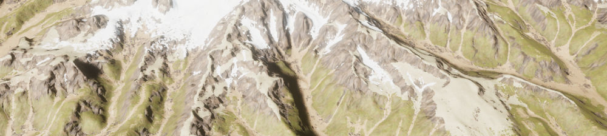
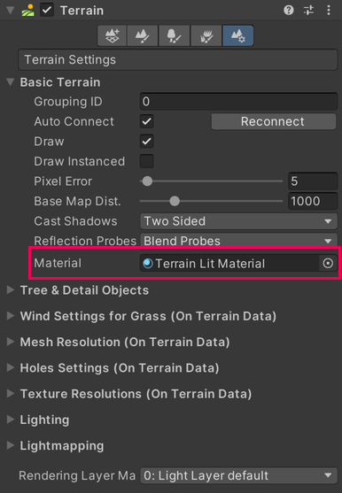
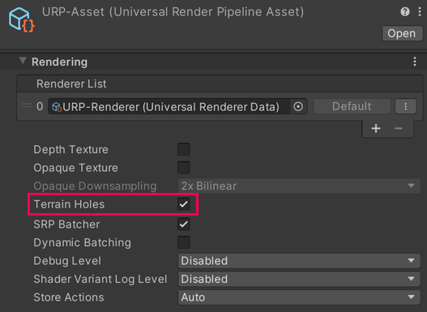

# Terrain Lit Shader

URP 使用 Terrain Lit Shader 来渲染 Unity 的地形（Terrain）。此着色器是 [Lit Shader](lit-shader.md) 的简化版本。一个地形最多可以使用八个 [Terrain Layers](https://docs.unity.cn/cn/tuanjiemanual/Manual/class-TerrainLayer.html) 来进行贴图。

 *使用 Terrain Lit Shader 渲染的地形 GameObject。*

## Terrain Lit Material properties

Terrain Lit Shader 具有以下属性：

| **Property**                     | **Description**                                                                                                                                                                                                                                                                                                                                                                |
| -------------------------------- | -------------------------------------------------------------------------------------------------------------------------------------------------------------------------------------------------------------------------------------------------------------------------------------------------------------------------------------------------------------------------- |
| **Enable Height-based Blend**    | 启用后，Unity 会从 **Mask Map** 纹理的蓝色通道中获取高度值。  如果不启用此属性，Unity 将根据在 splatmap 纹理中绘制的权重混合 Terrain Layers。当你禁用此属性并且将 Terrain Lit Shader Material 分配给 Terrain 时，URP 会在 Paint Texture Tool Inspector 中为添加到该 Terrain 的每个 Terrain Layer 显示一个额外选项 **Opacity as Density Blend**。  **Note**: 当地形上超过四个 Terrain Layers 时，Unity 会忽略此选项。 |
| &#160;&#160;&#160;&#160;*Height Transition* | 选择 Terrain Layers 之间平滑过渡区域的世界单位大小。                                                                                                                                                                                                                                                                                                                     |
| **Enable Per-pixel Normal**      | 启用后，Unity 会在像素级采样法线贴图，以便为远处地形保留更多的几何细节。Unity 在运行时根据高度图生成几何法线贴图，而不是使用网格的几何体法线。这意味着即使网格分辨率较低，也能获得高分辨率的法线效果。  **Note**: 仅当 Terrain 启用了 **Draw Instanced** 时，此选项才有效。                                                                                   |

## Create a Terrain Lit Material

要创建可与 Terrain GameObject 兼容的材质：

1. 创建一个新的材质（**Assets** > **Create** > **Material**）。
2. 选择新建的材质。
3. 在 Inspector 中点击 **Shader** 下拉菜单，选择 **Universal Render Pipeline** > **Terrain** > **Lit**。

## Assign a Terrain Lit Material to a Terrain GameObject

将 Terrain Lit 材质分配给地形 GameObject：

1. 选中地形 GameObject。
2. 在 Inspector 中，点击 Terrain Inspector 工具栏右侧的齿轮图标以打开 **Terrain Settings**。
3. 在 **Material** 属性中，选择一个 Terrain Lit 材质。可以通过对象选择器（圆圈图标）或拖拽材质至该属性进行分配。

## Using the Paint Holes Tool

要在地形上使用 **Paint Holes** 工具，需确保在项目的 URP Asset 中勾选了 **Terrain Holes** 选项。否则，在构建应用时地形洞将不会显示。

