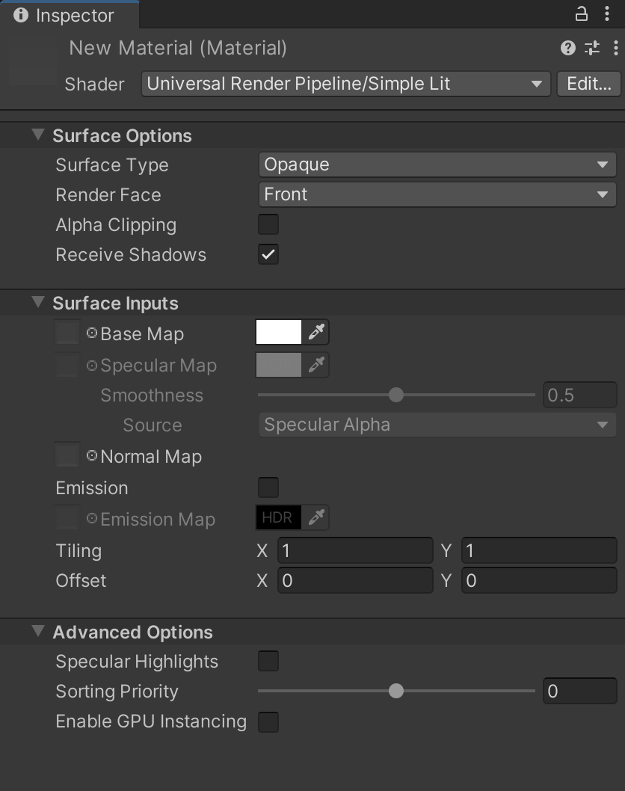

# Simple Lit Shader

使用此着色器在性能比光照真实度更重要的情况下。该着色器采用简单的光照近似。由于此着色器 [不进行物理准确性和能量守恒的计算](shading-model.md#simple-shading)，它渲染速度较快。

## 在编辑器中使用 Simple Lit Shader

要选择并使用此着色器：

1. 在项目中创建或查找你想要应用此着色器的材质。选择该 **材质**，会打开材质检查器窗口。
2. 点击 **Shader**，并选择 **Universal Render Pipeline** > **Simple Lit**。

## UI 概览

此着色器的检查器窗口包含以下元素：

- __[Surface Options](#surface-options)__
- __[Surface Inputs](#surface-inputs)__
- __[Advanced](#advanced)__

### Surface Options

__Surface Options__ 控制材质在屏幕上的渲染方式。

| 属性               | 描述                                                         |
| ------------------ | ------------------------------------------------------------ |
| __Surface Type__   | 使用此下拉菜单将材质的表面类型设置为 __Opaque__ 或 __Transparent__。此设置决定 URP 渲染材质的渲染通道。__Opaque__ 表面类型始终完全可见，无论背景是什么，URP 会首先渲染不透明材质。__Transparent__ 表面类型会受到背景的影响，并且可以根据选择的透明表面类型有所不同。URP 会在渲染不透明对象之后，在单独的通道中渲染透明材质。如果选择 __Transparent__，会显示 __Blending Mode__ 下拉菜单。 |
| __Blending Mode__  | 选择 Unity 如何在透明材质与背景混合时计算每个像素的颜色。  在混合模式的上下文中，Source 指的是透明材质，Destination 指的是该材质与之重叠的其他内容。 |
| &#160;&#160;&#160;&#160;Alpha  |  *Alpha 混合模式示例。*  __Alpha__ 使用材质的 alpha 值来调整物体的透明度。0 完全透明，255 完全不透明，转换为混合公式中的值 1。此模式下，材质始终在透明渲染通道中渲染，不受 alpha 值的影响。 该模式让你使用 [Preserve Specular Lighting](#preserve-specular) 属性。  Alpha 方程式： *OutputRGBA* = (*SourceRGB* &#215; *SourceAlpha*) + *DestinationRGB* &#215; (1 &#8722; *SourceAlpha*) |
| &#160;&#160;&#160;&#160;Premultiply  |  *Premultiply 混合模式示例。*  __Premultiply__ 首先将透明材质的 RGB 值与其 alpha 值相乘，然后以类似于 __Alpha__ 的方式应用效果。 Premultiply 方程式还允许透明材质的 alpha 值为 0 的区域具有加法混合效果。这样可以减少不透明像素和透明像素重叠边缘可能出现的伪影。  Premultiply 方程式： *OutputRGBA* = *SourceRGB* + *DestinationRGB* &#215; (1 &#8722; *SourceAlpha*) |
| &#160;&#160;&#160;&#160;Additive  |  *Additive 混合模式示例。*  __Additive__ 将材质的颜色值加在一起，从而产生混合效果。alpha 值决定了源材质的颜色在混合计算前的强度。 该模式下，你可以使用 [Preserve Specular Lighting](#preserve-specular) 属性。  Additive 方程式： *OutputRGBA* = (*SourceRGB* &#215; *SourceAlpha*) + *DestinationRGB* |
| &#160;&#160;&#160;&#160;Multiply  |  *Multiply 混合模式示例。*  __Multiply__ 将材质的颜色与表面下方的颜色相乘，产生较暗的效果，就像透过有色玻璃看东西一样。 此模式使用材质的 alpha 值来调整颜色混合的程度。alpha 值为 1 时表示颜色的乘法没有调整，而较小的 alpha 值会将颜色混合向白色靠拢。  Multiply 方程式： *OutputRGBA* = *SourceRGB* &#215; *DestinationRGB*  |
| __Preserve Specular Lighting__ | 指示 Unity 是否保留 GameObject 上的高光。即使材质是透明的，只有反射光可见，此属性也适用。  当 __Surface Type__ 设置为 Transparent 且 __Blending Mode__ 设置为 Alpha 或 Additive 时，才会显示此属性。   *Preserve Specular Lighting 禁用的材质。*   *Preserve Specular Lighting 启用的材质。* |
| __Render Face__    | 使用此下拉菜单确定渲染几何体的哪些面。 __Front Face__ 渲染几何体的正面并 [剔除](https://docs.unity.cn/cn/tuanjiemanual/Manual/SL-CullAndDepth.html)背面，这是默认设置。 __Back Face__ 渲染几何体的背面并剔除正面。 __Both__ 使 URP 渲染几何体的两个面，适用于小的平面物体，如叶子，在这种情况下你可能希望显示两面。 |
| __Alpha Clipping__ | 使材质表现得像一个 [切割 (Cutout)](https://docs.unity.cn/cn/tuanjiemanual/Manual/StandardShaderMaterialParameterRenderingMode.html) 着色器。使用此功能可以在不透明和透明区域之间创建硬边缘的透明效果。例如，用来制作草叶的效果。启用 __Alpha Clipping__ 后，URP 不渲染低于指定 __Threshold__ 的 alpha 值，你可以通过滑块设置 __Threshold__，该滑块接受 0 到 1 之间的值。所有大于阈值的值是完全不透明的，低于阈值的值是不可见的。例如，阈值为 0.1 时，URP 不会渲染 alpha 值低于 0.1 的部分。默认值为 0.5。 |

### Surface Inputs

__Surface Inputs__ 描述了材质的表面本身。例如，你可以使用这些属性来让表面看起来湿润、干燥、粗糙或光滑。

| 属性              | 描述                                                         |
| ----------------- | ------------------------------------------------------------ |
| __Base Map__      | 为表面添加颜色，也称为漫反射贴图。要为 __Base Map__ 设置分配贴图，请点击旁边的对象选择器，这将打开资产浏览器，你可以从项目中的贴图中选择。你也可以使用 [颜色选择器](https://docs.unity.cn/cn/tuanjiemanual/Manual/EditingValueProperties.html)。设置旁边的颜色显示了应用于分配贴图的色调。要分配另一个色调，你可以点击此颜色样本。如果你在 __Surface Options__ 中选择了 __Transparent__ 或 __Alpha Clipping__，材质将使用贴图的 alpha 通道或颜色。 |
| __Specular Map__  | 控制来自直接光照的高光颜色，例如 [方向光、点光源和聚光灯](https://docs.unity.cn/cn/tuanjiemanual/Manual/Lighting.html)。要为 __Specular Map__ 设置分配贴图，请点击旁边的对象选择器，这将打开资产浏览器，你可以从项目中的贴图中选择。你也可以使用 [颜色选择器](https://docs.unity.cn/cn/tuanjiemanual/Manual/EditingValueProperties.html)。 在 __Source__ 中，你可以选择项目中的贴图作为光滑度的来源。默认情况下，光滑度来源于该贴图的 Alpha 通道。 你可以使用 __Smoothness__ 滑块来控制高光在表面上的扩散。0 表示广泛且粗糙的高光，1 表示像玻璃一样的小而锐利的高光。介于两者之间的值会产生半光泽效果。例如，0.5 会产生类似塑料的光泽感。 |
| __Normal Map__    | 为表面添加法线贴图。使用 [法线贴图](https://docs.unity.cn/cn/tuanjiemanual/Manual/StandardShaderMaterialParameterNormalMap.html?)，你可以为表面添加细节，比如凸起、划痕和凹槽。要添加贴图，请点击旁边的对象选择器。法线贴图会捕捉环境中的光照。 |
| __Emission__      | 使表面看起来像是发光的。启用后，会显示 __Emission Map__ 和 __Emission Color__ 设置。 要为 __Emission Map__ 设置分配贴图，请点击旁边的对象选择器，这将打开资产浏览器，你可以从项目中的贴图中选择。 对于 __Emission Color__，你可以使用 [颜色选择器](https://docs.unity.cn/cn/tuanjiemanual/Manual/EditingValueProperties.html) 来为颜色添加色调。颜色可以超过 100% 的白色，这对于像熔岩这样比白色更亮的效果特别有用，同时保持其它颜色。 如果没有分配 __Emission Map__，则 __Emission__ 设置仅使用你在 __Emission Color__ 中分配的色调。 如果不启用 __Emission__，URP 会将发光设置为黑色，并且不会计算发光。 |
| __Tiling__        | 一个 2D 倍增值，它根据 U 和 V 轴来缩放贴图以适应网格。这适用于地板和墙壁等表面。默认值为 1，表示没有缩放。设置更高的值可以使贴图在网格上重复。设置较低的值可以拉伸贴图。尝试不同的值，直到达到你想要的效果。 |
| __Offset__        | 2D 偏移量，用于在网格上定位贴图。要调整网格上的位置，可以沿 U 或 V 轴移动贴图。 |

### Advanced

__Advanced__ 设置会影响底层的渲染计算。它们不会对表面产生直接的可视效果。

| 属性                       | 描述                                                         |
| -------------------------- | ------------------------------------------------------------ |
| __Specular Highlights__    | 启用此功能允许你的材质从直接光源中反射高光，例如 [方向光、点光源和聚光灯](https://docs.unity.cn/cn/tuanjiemanual/Manual/Lighting.html)。这意味着你的材质会反射这些光源的光泽。如果禁用此项，则不会计算高光，从而使着色器的渲染更快。默认情况下，此功能是启用的。 |
| __Enable GPU Instancing__  | 使 URP 在可能的情况下将具有相同几何形状和材质的网格渲染为一个批次，从而加快渲染速度。如果网格具有不同的材质，或者硬件不支持 GPU 实例化，URP 将无法将网格渲染为一个批次。 |
| __Sorting Priority__       | 使用此滑块确定材质的渲染顺序。URP 会首先渲染具有较低值的材质。你可以使用此功能通过让管线首先渲染某些材质，从而减少设备上的过度绘制，这样它就不需要重复渲染重叠区域。这类似于 [渲染队列](https://docs.unity.cn/cn/tuanjiemanual/ScriptReference/Material-renderQueue.html) 在内置 Unity 渲染管线中的作用。 |
