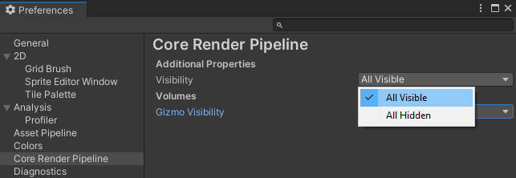
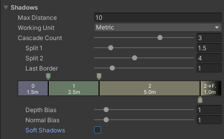

# 通用渲染管线资源

任何使用 Universal Render Pipeline (URP) 的 Unity 项目都必须具有一个 URP Asset 来配置设置。当你使用 URP 模板创建项目时，Unity 会在 **Settings** 项目文件夹中创建 URP Assets 并将它们分配到 Project Settings 中。如果你正在将现有项目迁移到 URP，你需要 [创建一个 URP Asset 并在 Graphics 设置中分配该资产](InstallURPIntoAProject.md)。

URP Asset 控制多个图形功能和质量设置。它是一个继承自 ‘RenderPipelineAsset’ 的可脚本化对象。当你在 Graphics 设置中分配该资产时，Unity 会从内置渲染管线切换到 URP。然后你可以直接在 URP 中调整相应的设置，而无需在其他地方查找它们。

你可以拥有多个 URP 资产并在它们之间切换。例如，你可以有一个启用了阴影的设置和一个禁用了阴影的设置。如果你在资产之间切换来查看效果，你就不需要每次手动切换阴影相关的设置。不过，你不能在 HDRP/SRP 和 URP 资产之间切换，因为这些渲染管线是不可兼容的。

## UI 概览

在 URP 中，你可以配置以下设置：

- [通用渲染管线资源](#通用渲染管线资源)
  - [UI 概览](#ui-概览)
    - [如何显示附加属性](#如何显示附加属性)
    - [Rendering](#rendering)
    - [Quality](#quality)
    - [Lighting](#lighting)
    - [Shadows](#shadows)
    - [Post-processing](#post-processing)
    - [Adaptive Performance](#adaptive-performance)

> [!NOTE]
> 如果你启用了实验性的 2D Renderer（菜单: **Graphics Settings** > 在 **Scriptable Render Pipeline Settings** 下添加 2D Renderer Asset），则 URP Asset 中与 3D 渲染相关的某些选项不会影响最终的应用或游戏。

### 如何显示附加属性

Unity 默认情况下不会在 URP Asset 中显示某些高级属性。要查看所有可用属性：

* 在 URP Asset 中的任何部分，点击垂直省略号图标 (&vellip;) 并选择 **Show Additional Properties**

    

    Unity 会显示当前部分中所有可用的属性。

要在所有部分中显示所有附加属性：

1. 点击垂直省略号图标 (&vellip;) 并选择 **Show All Additional Properties**。Unity 会在 **Preferences** 窗口中打开 **Core Render Pipeline** 部分。

2. 在 **Additional Properties > Visibility** 属性中选择 **All Visible**。

    

### Rendering

**Rendering** 设置控制渲染管线的核心部分，即渲染帧。

| 属性               | 描述                                                           |
| ------------------ | -------------------------------------------------------------- |
| **Depth Texture**   | 启用此选项，URP 会创建 `_CameraDepthTexture`。URP 默认情况下会为场景中的所有相机使用此 [深度纹理](https://docs.unity.cn/cn/tuanjiemanual/Manual/SL-DepthTextures.html)。你可以在 [Camera Inspector](camera-component-reference.md) 中为单个相机覆盖此设置。 |
| **Opaque Texture**  | 启用此选项，为场景中所有相机创建一个 `_CameraOpaqueTexture`。这类似于内置渲染管线中的 [GrabPass](https://docs.unity.cn/cn/tuanjiemanual/Manual/SL-GrabPass.html)。  **Opaque Texture** 提供了在 URP 渲染任何透明网格之前场景的快照。你可以在透明着色器中使用它来创建效果，比如磨砂玻璃、水面折射或热浪。你可以在 [Camera Inspector](camera-component-reference.md) 中为单个相机覆盖此设置。 |
| **Opaque Downsampling** | 设置透明纹理的采样模式，选项包括：<ul><li>**None**: 生成与相机分辨率相同的颜色纹理。</li><li>**2x Bilinear**: 生成一个半分辨率的图像，采用双线性过滤。</li><li>**4x Box**: 生成一个四分之一分辨率的图像，采用箱形过滤，产生一个模糊的副本。</li><li>**4x Bilinear**: 生成一个四分之一分辨率的图像，采用双线性过滤。</li></ul> |
| **Terrain Holes**   | 如果禁用此选项，URP 会在为 Unity Player 构建时移除所有 Terrain 孔的 Shader 变体，从而减少构建时间。 |
| **SRP Batcher**     | 启用 SRP Batcher。如果你有许多使用相同着色器的不同材质，SRP Batcher 可以加速 CPU 渲染，而不会影响 GPU 性能。当启用 SRP Batcher 时，它会替换 SRP 渲染代码的内循环。  如果同时启用了 **SRP Batcher** 和 **Dynamic Batching**，SRP Batcher 会优先于动态批处理，只要着色器与 SRP Batcher 兼容。  **注意**: 如果项目中的资产或着色器没有针对 SRP Batcher 进行优化，低性能设备可能在禁用 SRP Batcher 时表现更好。 |
| **Dynamic Batching**| 启用 [Dynamic Batching](https://docs.unity.cn/cn/tuanjiemanual/Manual/DrawCallBatching.html)，使渲染管线自动批处理共享相同材质的小型动态对象。这对于不支持 GPU 实例化的平台和图形 API 很有用。  如果你的目标硬件支持 GPU 实例化，请禁用 **Dynamic Batching**。你可以在运行时更改此设置。 |
| **Debug Level**     | 设置渲染管线生成的调试信息级别。  可选项：<ul><li>**Disabled**: 禁用调试信息，这是默认选项。</li><li>**Profiling**: 使渲染管线提供详细信息标签，你可以在 FrameDebugger 中查看。</li></ul> |
| **Shader Variant Log Level** | 设置 Unity 完成构建时关于 Shader 剪裁和 Shader 变体的日志信息级别。  可选项：<ul><li>**Disabled**: Unity 不记录任何信息。</li><li>**Only Universal**: Unity 仅记录与 [URP Shader](shaders-in-universalrp.md) 相关的信息。</li><li>**All**: Unity 记录构建中所有着色器的信息。</li></ul> 你可以在构建完成后查看控制台面板中的信息。 |
| **Store Actions**   | 定义 Unity 是否丢弃或存储 DrawObjects Passes 的渲染目标。  可选项：<ul><li>**Auto**: Unity 默认使用 **Discard** 选项，并在检测到任何注入的 Pass 时回退为 **Store** 选项。</li><li>**Discard**: Unity 丢弃不会在后续 Pass 中重用的渲染目标（降低内存带宽）。</li><li>**Store**: Unity 存储每个 Pass 的所有渲染目标。**Store** 会显著增加移动设备和基于 Tile 的 GPU 的内存带宽。</li></ul> |

### Quality

这些设置控制 URP 的质量级别。你可以在低端硬件上优化性能，或在高端硬件上提升图形质量。

**提示**：如果你想为不同硬件设置不同的选项，可以通过多个 Universal Render Pipeline 资产来配置这些设置，并根据需要切换它们。

| 属性                    | 描述                                                           |
| ----------------------- | -------------------------------------------------------------- |
| **HDR**                 | 启用此选项，允许默认情况下为场景中的每个相机进行高动态范围 (HDR) 渲染。通过 HDR，图像的最亮部分可以大于 1。  这为你提供了更广泛的光照强度范围，使光照看起来更自然，比如即使在明亮的光源下也能看到更多的细节，且饱和度较低。如果你想要更广泛的光照范围或使用 [bloom](https://docs.unity.cn/cn/tuanjiemanual/Manual/PostProcessing-Bloom.html) 效果，这个功能非常有用。  如果你面向的是低端硬件，可以禁用此选项，以跳过 HDR 计算并提升性能。你可以在 Camera Inspector 中为单个相机覆盖此设置。 |
| &#160;&#160;&#160;&#160;**HDR Precision** | HDR 渲染中相机颜色缓冲区的精度。64 位精度可以避免带状伪影，但需要更高的带宽并且可能导致采样变慢。默认值：32 位。 |
| **Anti Aliasing (MSAA)** | 默认情况下，在场景中的每个相机上使用 [多重采样抗锯齿](anti-aliasing.md#msaa) 渲染。这可以平滑几何体的边缘，避免锯齿或闪烁。在下拉菜单中，选择每个像素使用多少采样：**2x**、**4x** 或 **8x**。你选择的采样数量越多，物体的边缘越平滑。  如果你想跳过 MSAA 计算，或者在 2D 游戏中不需要它，可以选择 **Disabled**。你可以在 Camera Inspector 中为单个相机覆盖此设置。  **注意**：在不支持 [StoreAndResolve](https://docs.unity.cn/cn/tuanjiemanual/ScriptReference/Rendering.RenderBufferStoreAction.StoreAndResolve.html) 存储操作的移动平台上，如果 URP 资产中选择了 **Opaque Texture**，Unity 会在运行时忽略 **Anti Aliasing (MSAA)** 属性（就像 Anti Aliasing (MSAA) 设置为 Disabled 一样）。 |
| **Render Scale**        | 此滑块调整渲染目标的分辨率（不影响当前设备的分辨率）。当你希望为了性能或为了提升质量进行渲染时，可以使用此设置来降低渲染分辨率或进行上采样。  **注意**：这只影响游戏渲染，UI 渲染仍然使用设备的原生分辨率。 |
| **Upscaling Filter**    | 选择 Unity 在执行上采样时使用的图像滤镜。当 Render Scale 值小于 1.0 时，Unity 会执行上采样。 |
| &#160;&#160;&#160;&#160;**Automatic** | Unity 根据 Render Scale 值和当前屏幕分辨率选择一种过滤选项。如果可能进行整数缩放，Unity 会选择 Nearest-Neighbor 选项，否则选择 Bilinear 选项。 |
| &#160;&#160;&#160;&#160;**Bilinear** | Unity 使用图形 API 提供的双线性或线性过滤。 |
| &#160;&#160;&#160;&#160;**Nearest-Neighbor** | Unity 使用图形 API 提供的最近邻或点采样过滤。 |
| &#160;&#160;&#160;&#160;**FidelityFX Super Resolution 1.0** | Unity 使用 AMD FidelityFX Super Resolution 1.0 (FSR) 技术进行上采样。  与其他上采样滤镜选项不同，即使在 Render Scale 值为 1.0 时，该滤镜仍然有效。这种滤镜即使在不进行缩放时，也可以提高图像质量。它还使得在动态分辨率缩放处于活动状态时，Render Scale 值从 0.99 到 1.0 的过渡不那么明显。  **注意**：此滤镜仅支持支持 Unity Shader Model 4.5 或更高版本的设备。在不支持 Unity Shader Model 4.5 的设备上，Unity 会改为使用 **Automatic** 选项。 |
| &#160;&#160;&#160;&#160;**Override FSR Sharpness** | 选择此复选框后，Unity 允许你指定 FSR 锐化处理的强度。 |
| &#160;&#160;&#160;&#160;**FSR Sharpness** | 指定 FSR 锐化处理的强度。0.0 表示没有锐化，1.0 表示最大锐化。  **注意**：当 FSR 不是活动的上采样滤镜时，此选项无效。 |
| **LOD Cross Fade**     | 启用或禁用 LOD 交叉淡化。如果禁用此选项，URP 在为 Unity Player 构建时会移除所有 LOD 交叉淡化的 Shader 变体，从而减少构建时间。 |
| **LOD Cross Fade Dithering Type** | 当 [LOD group](https://docs.unity.cn/cn/tuanjiemanual/Manual/class-LODGroup.html) 的 **Fade Mode** 设置为 **Cross Fade** 时，Unity 使用交叉淡化混合在渲染的 LOD 网格之间进行过渡，并使用 Alpha 测试。此属性定义 LOD 交叉淡化的类型。  可选项：<ul><li>**Bayer Matrix**: 性能优于 Blue Noise 选项，但有重复的图案。</li><li>**Blue Noise**: 使用预计算的蓝噪声纹理，提供比 Bayer Matrix 更好的效果，但性能开销稍高。</li></ul> |
### Lighting

这些设置影响场景中光源的行为。

如果禁用某些设置，相应的 [keywords](https://docs.unity.cn/cn/tuanjiemanual/Manual/shader-keywords) 会从 Shader 变量中 [剥离](shader-stripping.md)。如果你确定在游戏或应用中不会使用某些设置，可以禁用它们以提升性能并减少构建时间。

| 属性                       | 描述                                                           |
| -------------------------- | -------------------------------------------------------------- |
| **Main Light**              | 这些设置影响场景中的主 [Directional Light](https://docs.unity.cn/cn/tuanjiemanual/Manual/Lighting.html)。你可以通过在 Lighting Inspector 中将其指定为 [Sun Source](https://docs.unity.cn/cn/tuanjiemanual/Manual/GlobalIllumination.html) 来选择它。如果没有指定 sun source，URP 会将场景中最亮的定向光视为主光源。  你可以选择 [Pixel Lighting](https://docs.unity.cn/cn/tuanjiemanual/Manual/LightPerformance.html) 或 **None**。如果选择 None，URP 不会渲染主光源，即使你已设置了 sun source。 |
| &#160;&#160;&#160;&#160;**Cast Shadows**  | 勾选此框可以让主光源在场景中投射阴影。 |
| &#160;&#160;&#160;&#160;**Shadow Resolution** | 控制主光源的阴影贴图纹理大小。较高的分辨率会使阴影更加锐利和细致。如果内存或渲染时间成为问题，可以尝试较低的分辨率。 |
| **Additional Lights**       | 在这里，你可以选择是否添加附加光源来补充主光源。选择 [Per Vertex](https://docs.unity.cn/cn/tuanjiemanual/Manual/LightPerformance.html)、[Per Pixel](https://docs.unity.cn/cn/tuanjiemanual/Manual/LightPerformance.html) 或 **Disabled**。 |
| &#160;&#160;&#160;&#160;**Per Object Limit** | 此滑块设置每个 GameObject 可以受影响的附加光源数量的上限。 |
| &#160;&#160;&#160;&#160;**Cast Shadows**  | 勾选此框可以让附加光源在场景中投射阴影。 |
| &#160;&#160;&#160;&#160;**Shadow Atlas Resolution** | 控制附加光源投射定向阴影的贴图大小。  这是一个精灵图集，最多可容纳 16 个阴影贴图。较高的分辨率会使阴影更加锐利和细致。如果内存或渲染时间成为问题，可以尝试较低的分辨率。 |
| &#160;&#160;&#160;&#160;**Shadow Resolution Tiers** | 设置附加光源投射阴影的分辨率级别。  分辨率必须大于等于 128，并会四舍五入到下一个 2 的幂值。  **注意**：此属性仅在为附加光源启用 **Cast Shadows** 时可见。 |
| &#160;&#160;&#160;&#160;**Cookie Atlas Resolution** | 附加光源使用的 Cookie 图集的大小。所有附加光源都会被打包到一个单独的 Cookie 图集中。  此属性仅在启用 **Light Cookies** 时可见。 |
| &#160;&#160;&#160;&#160;**Cookie Atlas Format** | 附加光源的 Cookie 图集格式。所有附加光源都会被打包到一个单独的 Cookie 图集中。  可选项：<ul><li>**Grayscale Low**</li><li>**Grayscale High**</li><li>**Color Low**</li><li>**Color High**</li><li>**Color HDR**</li></ul>此属性仅在启用 **Light Cookies** 时可见。 |
| **Reflection Probes**       | 使用这些属性来控制反射探针的设置。 |
| &#160;&#160;&#160;&#160;**Probe Blending** | 平滑反射探针之间的过渡。有关更多信息，请参阅 [Reflection Probe Blending](lighting/reflection-probes.md#reflection-probe-blending)。 |
| &#160;&#160;&#160;&#160;**Box Projection**  | 基于物体在探针箱中的位置创建反射，同时仍使用一个探针作为反射源。有关更多信息，请参阅 [Advanced Reflection Probe features](xref:AdvancedRefProbe)。 |
| **Mixed Lighting**          | 启用 [Mixed Lighting](https://docs.unity.cn/cn/tuanjiemanual/Manual/LightMode-Mixed.html)，以在构建中包含混合光照的 Shader 变体。 |
| **Use Rendering Layers**    | 选择此选项后，你可以配置某些光源仅影响特定的 GameObject。有关 Rendering Layers 以及如何使用它们的更多信息，请参阅 [Rendering Layers](features/rendering-layers.md)。 |
| **Light Cookies**           | 启用 [light cookies](https://docs.unity.cn/cn/tuanjiemanual/Manual/Cookies.html)。此属性启用 **Cookie Atlas Resolution** 和 **Cookie Atlas Format** 用于附加光源。 |
| **SH Evaluation Mode**      | 定义球面谐波 (SH) 光照评估类型。  可选项：<ul><li>**Auto**: Unity 自动选择模式。</li><li>**Per Vertex**: 每个顶点评估光照。</li><li>**Mixed**: 部分顶点评估光照，部分像素评估光照。</li><li>**Per Pixel**: 每个像素评估光照。</li></ul> |

### Shadows

这些设置让你配置阴影的外观和行为，帮助在视觉质量和性能之间找到平衡。

**Shadows** 部分具有以下属性：

| 属性                       | 描述                                                           |
| -------------------------- | -------------------------------------------------------------- |
| **Max Distance**            | 从相机开始渲染阴影的最大距离。Unity 不会渲染超出此距离的阴影。  **注意**：此属性以公制单位为准，不受 **Working Unit** 属性中值的影响。 |
| **Working Unit**            | Unity 测量阴影级联距离的单位。 |
| **Cascade Count**           | 阴影 [级联](https://docs.unity.cn/cn/tuanjiemanual/Manual/shadow-cascades.html) 数量。使用阴影级联可以避免相机附近的粗糙阴影，同时保持合理的阴影分辨率。  有关更多信息，请参阅 [Shadow Cascades](https://docs.unity.cn/cn/tuanjiemanual/Manual/shadow-cascades.html)。增加级联数量会降低性能。级联设置只影响主光源。 |
| &#160;&#160;&#160;&#160;**Split**&#160;**1**   | 第一个级联结束和第二个级联开始的距离。 |
| &#160;&#160;&#160;&#160;**Split**&#160;**2**   | 第二个级联结束和第三个级联开始的距离。 |
| &#160;&#160;&#160;&#160;**Split**&#160;**3**   | 第三个级联结束和第四个级联开始的距离。 |
| &#160;&#160;&#160;&#160;**Last**&#160;**Border** | Unity 渐变阴影的区域大小。Unity 从 **Max Distance** - **Last Border** 的距离开始渐变，直到 **Max Distance** 时阴影完全消失。 |
| **Depth Bias**              | 使用此设置减少 [阴影斑点](https://docs.unity.cn/cn/tuanjiemanual/Manual/ShadowPerformance.html)。 |
| **Normal Bias**             | 使用此设置减少 [阴影斑点](https://docs.unity.cn/cn/tuanjiemanual/Manual/ShadowPerformance.html)。 |
| **Soft Shadows**      | 选择此框启用阴影贴图的额外处理，使阴影看起来更加柔和。 **性能影响**：高。 当此选项禁用时，Unity 仅使用默认硬件过滤进行一次阴影贴图采样。 |
| &#160;&#160;&#160;&#160;**Quality**               | 选择软阴影处理的质量级别。  可选项：<ul><li>**Low**: 移动平台上的良好质量与性能平衡。过滤方法：4 个 PCF 采样。</li><li>**Medium**: 桌面平台上的良好质量与性能平衡。过滤方法：5x5 Tent 滤波器。默认值。</li><li>**High**: 最佳质量，较高的性能影响。过滤方法：7x7 Tent 滤波器。</li></ul> |
| **Conservative Enclosing Sphere** | 启用此选项可改善阴影体积剔除，防止 Unity 在阴影级联的角落过度剔除阴影。  仅在旧版 Unity 项目兼容性需求时禁用此选项。  启用此选项后，可能需要调整阴影级联的距离，因为阴影剔除包围球的大小和位置会发生变化。  **性能影响**：启用此选项可能提高性能，因为它最小化了阴影级联的重叠，减少了冗余静态阴影投射体的数量。 |

### Post-processing

此部分允许你微调全局后处理设置。

| 属性                       | 描述                                                           |
| -------------------------- | -------------------------------------------------------------- |
| **Grading Mode**            | 选择用于项目的 [颜色分级](https://docs.unity.cn/cn/tuanjiemanual/Manual/PostProcessing-ColorGrading.html) 模式。<ul><li>**High Dynamic Range**: 此模式适用于类似电影制作工作流程的高精度分级。Unity 在色调映射之前应用颜色分级。</li><li>**Low Dynamic Range**: 此模式遵循更经典的工作流程。Unity 在色调映射之后应用有限范围的颜色分级。</li></ul> |
| **LUT Size**                | 设置 Universal Render Pipeline 用于颜色分级的内部和外部 [查找表（LUTs）](https://docs.unity.cn/cn/tuanjiemanual/Manual/PostProcessing-ColorGrading.html) 的大小。较大的尺寸提供更多的精度，但可能会带来性能和内存使用的成本。你不能混用 LUT 尺寸，因此请在开始颜色分级之前决定尺寸。  默认值 **32** 提供了良好的速度和质量平衡。 |
| **Post-Processing Preserve Alpha** | 启用此设置后，URP 后处理效果会输出经过正确处理的 Alpha 值。禁用此设置后，URP 会丢弃 Alpha 通道并用 1 来替换 Alpha 值。 如果使用 HDR 渲染，请将 **HDR Precision** 属性设置为 64 位，因为 32 位格式没有 Alpha 通道。   **渲染到渲染纹理**  如果您要将带有 Alpha 通道的输出渲染到渲染纹理中，请确保渲染纹理的 **Color Format** 属性具有 Alpha 通道。  在使用 Alpha 值渲染输出的摄像机上，将 **Environment** 部分中的 **Background Type** 属性设置为 **Solid Color**。这使您可以识别和处理着色器中的 Alpha 值。   **限制**   <ul><li>在一个具有摄像机堆叠的装配中，在叠加摄像机上的后处理效果仍会影响其下的所有摄像机。此设置允许您为单独的摄像机（不在同一摄像机堆栈中）配置不同的后期处理效果，并使用渲染纹理和合成过程来组合它们。</li><li>当应用后处理效果时，此功能会保留应用效果之前的 Alpha 值。因此，绘制对象原始边界之外像素的预构建后处理效果（例如，泛光或景深效果）可能会在它们所影响的对象周围呈现锐利的边缘。这不适用于扭曲几何图形的效果如帕尼尼投影或镜头扭曲效果。这些效果也会扭曲 Alpha 通道。</li></ul>  |

| **Fast sRGB/Linear Conversions** | 选择此选项可在 sRGB 和线性颜色空间之间转换时使用更快速但不太精确的近似函数。 |
| **Data Driven Lens Flare**  | 分配 URP 所需的 shader 变体和内存，用于 镜头光晕 效果。 |
| **Volume Update Mode**      | 选择 Unity 更新体积的方法：每帧更新或通过脚本触发更新。如果选择 **Every Frame**，URP 会消耗更多的 CPU 处理时间。在编辑器中，Unity 在非播放模式下每帧更新体积。 |

### Adaptive Performance

此部分在项目中安装了 Adaptive Performance 包时可用。**Use Adaptive Performance** 属性允许你启用自适应性能功能。

| 属性                       | 描述                                                           |
| -------------------------- | -------------------------------------------------------------- |
| **Use Adaptive Performance** | 选择此框启用自适应性能功能，在运行时调整渲染质量。 |
