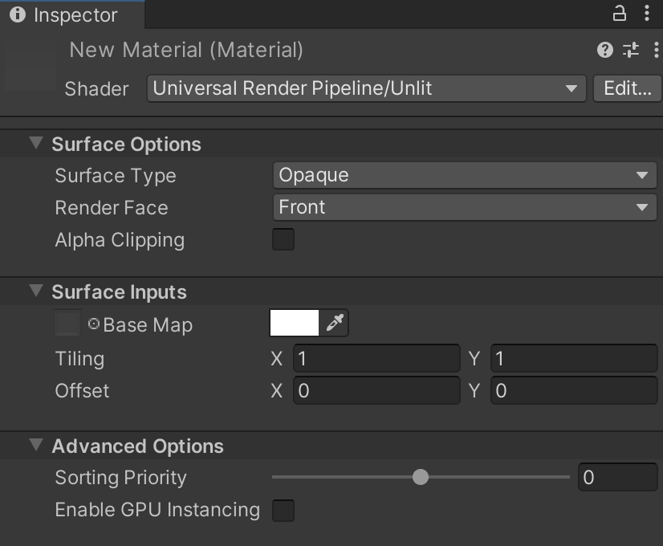

# Unlit Shader

使用此着色器处理您的视觉效果或独特物体，这些物体不需要光照。由于没有耗时的光照计算或查找，此着色器非常适合低端硬件。Unlit着色器使用URP中最简单的[着色模型](shading-model.md)。

## 在编辑器中使用Unlit着色器

选择并使用此着色器：

1. 在您的项目中，创建或查找您想要应用此着色器的材质。选择__材质__，这将打开一个材质检查器窗口。
2. 点击__Shader__，选择__Universal Render Pipeline__ > __Unlit__。

## UI概述

此着色器的检查器窗口包含以下元素：

- __[Surface Options](#surface-options)__
- __[Surface Inputs](#surface-inputs)__
- __[Advanced](#advanced)__

### Surface Options

__Surface Options__ 控制材质在屏幕上的渲染方式。

| 属性               | 描述                                                          |
| ------------------ | ------------------------------------------------------------ |
| __Surface Type__   | 使用此下拉菜单为材质应用__Opaque__或__Transparent__表面类型。它决定了URP渲染材质的渲染通道。__Opaque__表面类型始终完全可见，无论其背后是什么。URP首先渲染不透明材质。__Transparent__表面类型受背景影响，可以根据选择的透明表面类型有所变化。URP在渲染不透明物体后，单独渲染透明物体。如果选择了__Transparent__，__Blending Mode__下拉框将会出现。 |
| __Blending Mode__  | 使用此下拉框来确定URP如何通过与背景像素混合来计算透明材质每个像素的颜色。 __Alpha__使用材质的alpha值来改变物体的透明度。0表示完全透明。1表示完全不透明，但材质仍会在透明渲染通道中渲染。这对于您希望完全可见但随着时间推移逐渐消失的效果非常有用，如云。 __Premultiply__对材质应用类似于__Alpha__的效果，但即使表面透明，也会保留反射和高光。这意味着只有反射光是可见的。例如，透明玻璃。 __Additive__在另一个表面之上添加一层材质。这适用于全息图。 __Multiply__将材质的颜色与表面后面的颜色相乘。这会产生更暗的效果，就像通过有色玻璃观看一样。 |
| __Render Face__    | 使用此下拉框来确定渲染几何体的哪些面。 __Front Face__渲染几何体的前面并[culls](https://docs.unity.cn/cn/tuanjiemanual/Manual/SL-CullAndDepth.html)背面。这是默认设置。 __Back Face__渲染几何体的前面并culls前面。 __Both__使URP渲染几何体的两面。这适用于小型平面物体，如叶子，您可能希望两面都可见。 |
| __Alpha Clipping__ | 使材质表现得像[Cutout](https://docs.unity.cn/cn/tuanjiemanual/Manual/StandardShaderMaterialParameterRenderingMode.html)着色器。使用此选项可以在不透明和透明区域之间创建硬边缘的透明效果。例如，可以用于创建草叶。为了实现这一效果，URP不会渲染小于指定__Threshold__的alpha值，启用__Alpha Clipping__时将显示该值。您可以通过调整滑块来设置__Threshold__，该值范围从0到1。所有大于阈值的值为完全不透明，所有低于阈值的值为不可见。例如，阈值为0.1时，URP不会渲染小于0.1的alpha值。默认值为0.5。 |

### Surface Inputs

__Surface Inputs__描述表面本身。例如，您可以使用这些属性来使表面看起来湿滑、干燥、粗糙或光滑。

| 属性           | 描述                                                          |
| -------------- | ------------------------------------------------------------ |
| __Base Map__   | 为表面添加颜色，也称为漫反射贴图。要将纹理分配给__Base Map__设置，请点击它旁边的对象选择器。这将打开资产浏览器，您可以从项目中的纹理中选择。或者，您可以使用[颜色选择器](https://docs.unity.cn/cn/tuanjiemanual/Manual/EditingValueProperties.html)。设置旁边的颜色显示了分配给纹理的色调。如果选择了__Transparent__或__Alpha Clipping__，则材质使用纹理的alpha通道或颜色。 |
| __Tiling__     | 2D乘法值，用于根据U和V轴将纹理缩放以适应网格。这适用于地板和墙壁等表面。默认值为1，表示没有缩放。设置较高的值可以使纹理在网格上重复。设置较低的值可以拉伸纹理。尝试不同的值，直到达到您想要的效果。 |
| __Offset__     | 2D偏移，用于在网格上定位纹理。要调整纹理在网格上的位置，请在U或V轴上移动纹理。 |

### Advanced

__Advanced__设置影响渲染的底层计算。它们对表面没有可见的影响。

| 属性                    | 描述                                                          |
| ----------------------- | ------------------------------------------------------------ |
| __Enable GPU Instancing__ | 使URP在可能的情况下以一个批次渲染具有相同几何体和材质的网格。这可以加快渲染速度。如果网格具有不同的材质，或者硬件不支持GPU实例化，URP将无法以一个批次渲染网格。 |
| __Priority__             | 使用此滑块确定材质的渲染顺序。URP先渲染较低值的材质。您可以使用此功能通过使管线先渲染前面的材质来减少设备上的过度绘制，从而避免渲染重叠区域两次。这类似于内置Unity渲染管线中的[render queue](https://docs.unity.cn/cn/tuanjiemanual/ScriptReference/Material-renderQueue.html)。 |