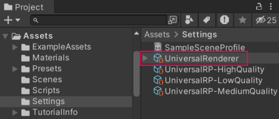
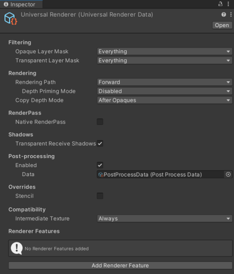
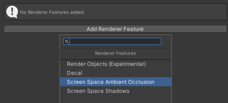
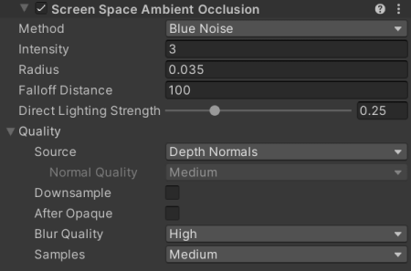
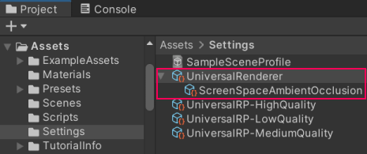

# 如何向渲染器添加渲染器特性

要向渲染器添加渲染器特性：

1. 在 __Project__ 窗口中，选择一个渲染器。

    

    Inspector 窗口显示渲染器属性。

    

2. 在 Inspector 窗口中，选择 __Add Renderer Feature__。在列表中，选择一个渲染器特性。

    

    Unity 将选中的渲染器特性添加到渲染器。

    

Unity 将渲染器特性显示为渲染器在项目窗口中的子项：

