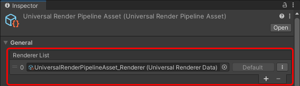
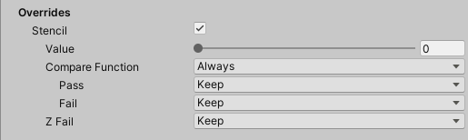

# 通用渲染器

本页面描述了 URP Universal Renderer 设置。

有关 URP 渲染的更多信息，请参考 [Universal Render Pipeline 中的渲染](rendering-in-universalrp.md)。

## 渲染路径

URP Universal Renderer 实现了三种渲染路径：

* 正向渲染路径（Forward Rendering Path）。

* [Forward+ 渲染路径](rendering/forward-plus-rendering-path.md)。

* [延迟渲染路径](rendering/deferred-rendering-path.md)。

### 渲染路径比较

每种渲染路径使用不同的步骤来计算光照并绘制物体。选择哪种渲染路径会影响游戏的性能和光照选项。

- 正向渲染路径：URP 一次绘制一个物体。对于每个物体，URP 检查所有影响它的光源，以计算物体的外观。
- Forward+ 渲染路径：与正向渲染路径相似，但允许使用更多的光源，而不会影响性能。
- 延迟渲染路径：URP 首先将每个物体的信息渲染到多个缓冲区中。然后，在后续的（“延迟”）步骤中，URP 按照缓冲区中的信息逐个绘制每个屏幕像素。

以下表格显示了 URP 中正向渲染路径与延迟渲染路径之间的差异。

| 特性 | 正向渲染 | Forward+ 渲染 | 延迟渲染 |
|------|----------|---------------|----------|
| 每个物体的实时光源最大数量 | 9 | 无限。[适用于每个摄像机的限制](rendering/forward-plus-rendering-path.md)。 | 无限 |
| 每像素法线编码 | 无编码（准确的法线值）。 | 无编码（准确的法线值）。 | 两种选项：<ul><li>在 G-buffer 中对法线进行量化（精度损失，性能更好）。</li><li>八面体编码（准确的法线，可能对移动 GPU 性能有显著影响）。</li></ul>有关更多信息，请参阅 [G-buffer 中法线编码](rendering/deferred-rendering-path.md#accurate-g-buffer-normals) 部分。 |
| MSAA | 是 | 是 | 否 |
| 顶点光照 | 是 | 否 | 否 |
| 摄像机堆叠 | 是 | 是 | 有限制支持：Unity 仅渲染使用延迟渲染路径的基础摄像机。Unity 会使用正向渲染路径渲染所有叠加摄像机。 |

## 如何查找 Universal Renderer 资产

要查找 URP 资产使用的 Universal Renderer 资产：

1. 选择一个 URP 资产。

2. 在渲染器列表部分，点击渲染器项或渲染器旁边的垂直省略号图标 (&vellip;)。

    

## Universal Renderer 资产引用

本节描述了 Universal Renderer 资产的属性。

### 过滤

本节包含定义渲染器绘制哪些层的属性。

| 属性 | 描述 |
|------|------|
| **Opaque Layer Mask** | 选择该渲染器绘制的哪些不透明层 |
| **Transparent Layer Mask** | 选择该渲染器绘制的哪些透明层 |

### 渲染

本节包含与渲染相关的属性。

| 属性 | 描述 |
|------|------|
| **Rendering&#160;Path** | 选择渲染路径。 选项：<ul><li>**Forward**：正向渲染路径。</li><li>**Forward+**：[Forward+ 渲染路径](rendering/forward-plus-rendering-path.md)。</li><li>**Deferred**：[延迟渲染路径](rendering/deferred-rendering-path.md)。</li></ul> |
| &#160;&#160;**Depth&#160;Priming&#160;Mode** | 该属性决定 Unity 何时执行深度预处理。 深度预处理可以通过减少像素着色器的执行次数来提高 GPU 帧时间。性能提升取决于不透明通道中像素的重叠程度，以及通过使用深度预处理可以跳过的像素着色器的复杂性。 该特性有一定的内存和性能成本。此特性使用深度预通道来确定 Unity 可以跳过哪些像素着色器调用，如果深度预通道尚不可用，Unity 会添加此预通道。 选项有：<ul><li>**Disabled**：Unity 不执行深度预处理。</li><li>**Auto**：如果有需要深度预通道的渲染通道，Unity 执行深度预通道和深度预处理。</li><li>**Forced**：Unity 始终执行深度预处理。为此，Unity 还会对每个渲染通道执行深度预通道。 **注意**：某些硬件（如基于 Tile 的延迟渲染）在运行时会禁用深度预处理，不管此设置如何。</li></ul>在 Android、iOS 和 Apple TV 上，Unity 仅在强制模式下执行深度预处理。在这些平台的分块 GPU 上，结合 MSAA 使用时，深度预处理可能会降低性能。  该属性仅在 **Rendering Path** 设置为 **Forward** 时可用。 |
| &#160;&#160;**Accurate G-buffer normals** | 指示是否使用更耗费资源的法线编码/解码方法以提高视觉质量。  该属性仅在 **Rendering Path** 设置为 **Deferred** 时可用。 |
| **Depth&#160;Texture&#160;Mode** | 指定 URP 应在渲染管线的哪个阶段将场景深度复制到深度纹理。选项有：<ul><li>**After Opaques**：URP 在不透明物体渲染通道后复制场景深度。</li><li>**After Transparents**：URP 在透明物体渲染通道后复制场景深度。</li><li>**Force Prepass**：URP 执行深度预通道以生成场景深度纹理。</li></ul>**注意**：在移动设备上，**After Transparents** 选项可能会显著提高内存带宽。这是因为 Copy Depth 通道导致不透明通道和透明通道之间的渲染目标切换。当发生这种情况时，Unity 会将颜色缓冲区的内容存储到主内存中，然后在 Copy Depth 通道完成后再将其加载回来。启用 MSAA 时，这种影响会显著增加，因为 Unity 还需要存储和加载与颜色缓冲区一起的 MSAA 数据。 |

### 原生 RenderPass

本节包含与 URP 的原生 RenderPass API 相关的属性。

| 属性 | 描述 |
|------|------|
| **Native RenderPass** | 指示是否使用 URP 的原生 RenderPass API。启用时，URP 使用此 API 组织渲染通道。因此，您可以在自定义 URP 着色器中使用 [可编程混合](https://docs.unity.cn/cn/tuanjiemanual/Manual/SL-PlatformDifferences.html#using-shader-framebuffer-fetch)。如果您使用 Vulkan 或 Metal 图形 API，请启用 Native RenderPass，这样 URP 会自动减少将渲染纹理复制到内存中的频率。有关 RenderPass API 的更多信息，请参阅 [ScriptableRenderContext.BeginRenderPass](https://docs.unity.cn/cn/tuanjiemanual/ScriptReference/Rendering.ScriptableRenderContext.BeginRenderPass.html)。  **注意**：启用此属性对 OpenGL ES 没有影响。 |

### Shadows

本节包含与渲染阴影相关的属性。

| 属性 | 描述 |
|------|------|
| **Transparent Receive Shadows** | 启用此选项时，Unity 会在透明物体上绘制阴影。 |

### Overrides

本节包含此渲染器覆盖的渲染管线属性。

#### Stencil

选中此复选框时，渲染器将处理模板缓冲区值。

有关 Unity 如何使用模板缓冲区的更多信息，请参阅 [ShaderLab: Stencil](https://docs.unity.cn/cn/tuanjiemanual/Manual/SL-Stencil.html)。

在 URP 中，您可以使用模板缓冲区的第 0 到第 3 位进行自定义渲染效果。这意味着您可以使用模板索引 0 到 15。

### Compatibility

本节包含与向后兼容性相关的设置。

| 属性 | 描述 |
|------|------|
| **Intermediate Texture** | 此属性允许您强制 URP 通过中间纹理进行渲染。 选项：<ul><li>**Auto**：URP 使用 `ScriptableRenderPass.ConfigureInput` 方法提供的信息，自动判断是否需要通过中间纹理进行渲染。</li><li>**Always**：强制通过中间纹理进行渲染。仅在与未使用 `ScriptableRenderPass.ConfigureInput` 声明输入的渲染器特性兼容时使用此选项。使用此选项可能会对某些平台的性能产生显著影响。</li></ul> |

### Renderer Features

本节包含分配给所选渲染器的渲染器特性列表。

有关如何向渲染器添加渲染器特性的详细信息，请参阅 [如何向渲染器添加渲染器特性](urp-renderer-feature-how-to-add.md)。

URP 包含一个预构建的渲染器特性，名为 [Render Objects](renderer-features/renderer-feature-render-objects.md)。
