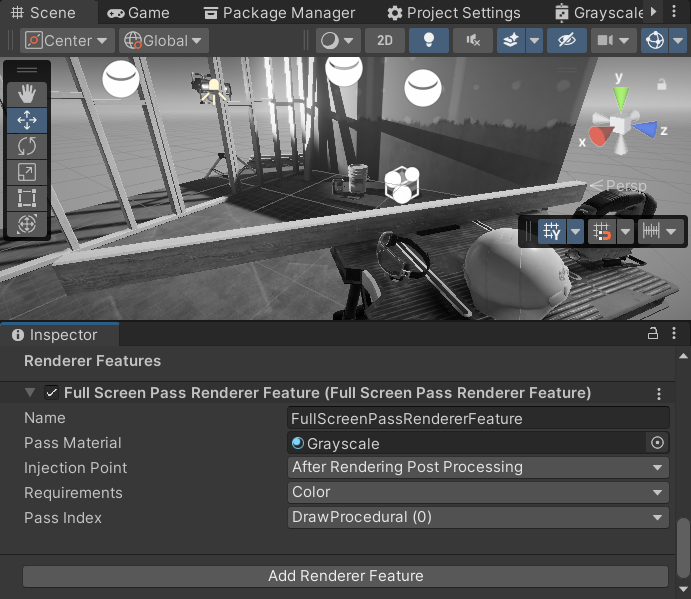
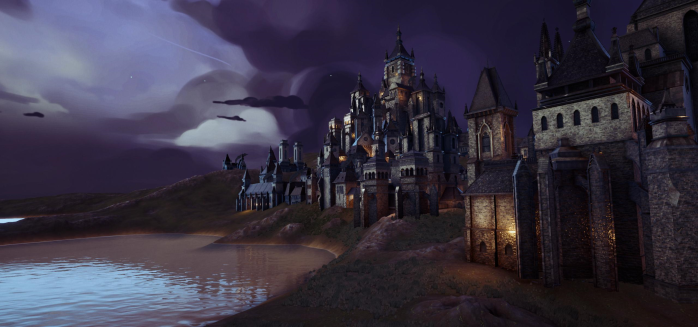
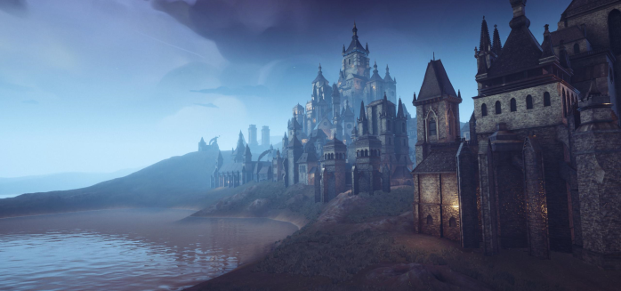
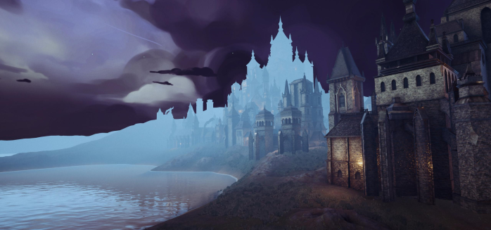
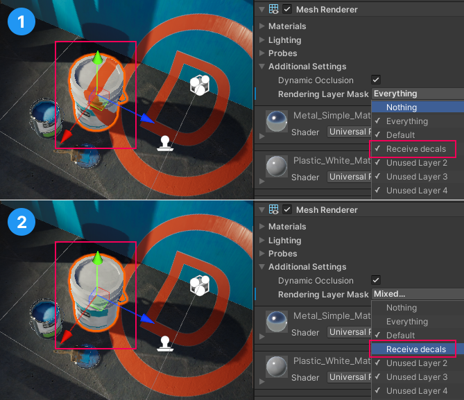
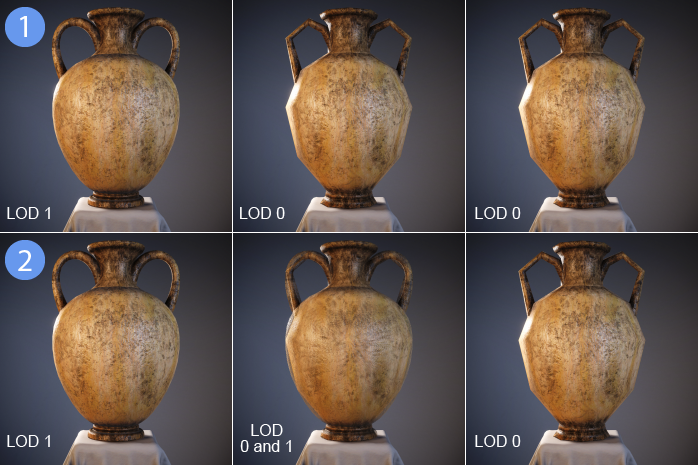
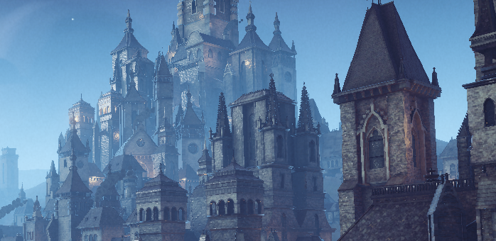
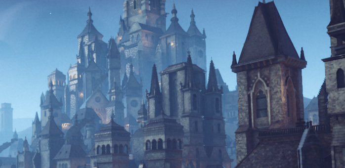

# URP 14 的新特性  

本节包含 URP 14 版本中的新功能、改进和已修复问题的信息。  

如需查看 URP 14 版本的完整变更列表，请参阅 [更新日志](xref:changelog)。  

## 功能  

本节概述了本次发布的新增功能。  

### 全屏 Pass 渲染器功能  

该渲染器功能允许您在预定义的注入点插入全屏渲染 Pass 以创建全屏效果。要了解更多关于该功能的信息，请参阅 [全屏 Pass 渲染器功能](../renderer-features/renderer-feature-full-screen-pass.md)。  

  
*使用自定义灰度材质的全屏 Pass。*  

### 自定义后处理效果  

全屏 Pass 渲染器功能允许您以最小的编码工作量创建自定义后处理效果。要了解如何创建简单的后处理效果，请参阅 [如何创建自定义后处理效果](../post-processing/post-processing-custom-effect-low-code.md)。  

以下图片展示了使用全屏 Pass 渲染器功能实现的雾效：  

场景未启用雾效：  
  

场景启用了自定义雾效（使用全屏 Pass 渲染器功能实现）：  
  

实现自定义效果可以克服默认雾效的限制，例如默认雾效不会影响天空盒：  
  

### 渲染层  

渲染层功能允许您配置特定光源仅影响指定的 GameObject。使用 [自定义阴影层](../features/rendering-layers.md#shadow-layers) 属性，您可以配置特定 GameObject 仅从特定光源投射阴影（即使这些光源并不直接影响这些 GameObject）。  

在 URP 14 版本中，渲染层不仅适用于光源，还适用于贴花（Decals）。  

  

要了解更多信息，请参阅以下页面：  

* [渲染层](../features/rendering-layers.md)  
* [如何在贴花中使用渲染层](../features/rendering-layers.md#how-to-rendering-layers-decals)  

### Forward+ 渲染路径  

Forward+ 渲染路径可以避免 Forward 渲染路径的每对象光源数量限制。  

与 Forward 渲染路径相比，Forward+ 渲染路径具有以下优势：  

* 取消了影响 GameObject 的光源数量限制（但仍受每相机光源上限的约束）。  
  * 各平台的每相机光源上限：  
    * 桌面和主机平台：256 个光源  
    * 移动平台：32 个光源（OpenGL ES 3.0 及以下版本：16 个光源）  
  * 该实现可避免当超过 8 盏光源影响大网格时需要拆分网格的问题。  

* 支持混合超过 2 个反射探针。  

* 在实体组件系统（ECS）中支持多个光源。  

* 在程序化绘制（Procedural Draws）时提供更大灵活性。  

有关详细信息，请参阅 [Forward+ 渲染路径](../rendering/forward-plus-rendering-path.md)。  

### LOD 过渡淡入淡出  

LOD 过渡淡入淡出功能可在当前 LOD 和下一级 LOD 之间实现平滑的过渡混合，基于物体与相机的距离进行调整。  

当相机移动时，显示不同的 LOD，以在画质和性能之间取得良好平衡。通过交叉渐变（Cross-fading），可以避免 LOD 切换时出现突兀的闪烁或跳变现象。  

  
*1：关闭 LOD 过渡淡入淡出。2：开启 LOD 过渡淡入淡出。*  

有关详细信息，请参阅 [LOD 过渡淡入淡出](../universalrp-asset.md#lod-cross-fade) 属性。  

### 时间抗锯齿（TAA）  

时间抗锯齿（TAA）是一种基于空间多帧的抗锯齿技术，它利用当前帧和之前渲染的帧来消除当前帧的锯齿，并减少帧间的抖动（Temporal Judder）。  

TAA 使用运动矢量（Motion Vectors）来减少或避免由于移动物体在不同帧中位于不同像素位置而导致的闪烁和拖影（Ghosting）伪影。  

要为相机启用 TAA：  

1. 选中相机。  
2. 在 Inspector 面板的 **Rendering** 部分，找到 **Anti-aliasing** 属性，并选择 **Temporal Anti-aliasing (TAA)**。  

以下图片展示了 TAA 关闭时的画面：  

  

以下图片展示了 TAA 开启时的画面：  

  