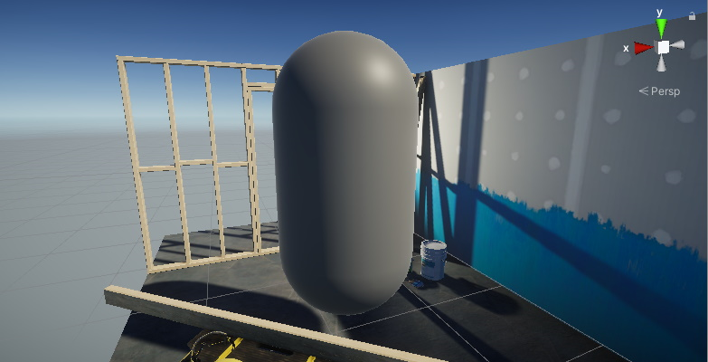

# 创建示例场景

要跟随本节示例操作：

1. 在现有 **Unity 项目** 中安装 **URP**，  
   或使用 [**通用项目模板（Universal Project Template）**](creating-a-new-project-with-urp.md) 创建新项目。

2. 在示例场景中，创建一个 **GameObject** 以测试 Shader，例如 **胶囊体（Capsule）**。

   

3. 创建一个 **新材质（Material）**，并将其分配给 **Capsule**。

4. 创建一个 **新 Shader 资源**，并将其分配给 **Capsule 的材质**。  
   在跟随示例时，打开 **Shader 资源** 以编辑 **Unity Shader 源文件**，  
   将示例代码替换源文件中的代码。

要开始编写 **URP Shader**，请继续阅读 [**URP Unlit 基础 Shader**](writing-shaders-urp-basic-unlit-structure.md) 章节。
