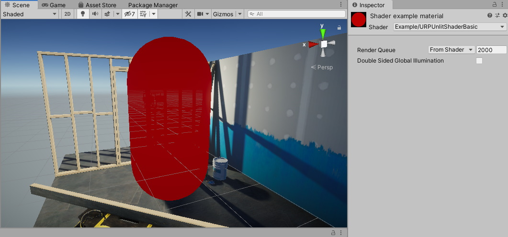
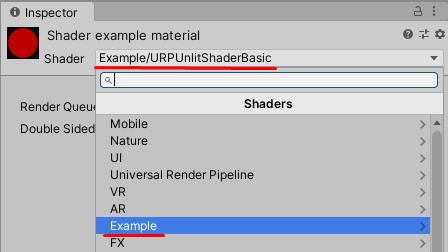

# URP Unlit 基础 Shader

本示例展示了一个基础的 URP 兼容 Shader，  
该 Shader 使用代码中预定义的颜色 填充网格形状。

要查看 Shader 的实际效果，请将以下 ShaderLab 代码复制并粘贴到 Shader 资源 中。

```c++
// 该 Shader 使用代码中预定义的颜色填充网格形状。
Shader "Example/URPUnlitShaderBasic"
{
    // Unity Shader 的 Properties 块。在本示例中，该块为空，
    // 因为输出颜色已在 fragment shader 代码中预定义。
    Properties
    { }

    // 包含 Shader 代码的 SubShader 块。
    SubShader
    {
        // SubShader Tags 定义何时以及在何种条件下执行 SubShader 块或 Pass。
        Tags { "RenderType" = "Opaque" "RenderPipeline" = "UniversalPipeline" }

        Pass
        {
            // HLSL 代码块。Unity SRP 使用 HLSL 语言。
            HLSLPROGRAM
            // 这行代码定义了顶点着色器（vertex shader）的名称。
            #pragma vertex vert
            // 这行代码定义了片元着色器（fragment shader）的名称。
            #pragma fragment frag

            // Core.hlsl 文件包含常用 HLSL 宏和函数的定义，
            // 并且还包含对其他 HLSL 文件的 #include 引用（例如 Common.hlsl、SpaceTransforms.hlsl 等）。
            #include "Packages/com.unity.render-pipelines.universal/ShaderLibrary/Core.hlsl"

            // 结构体定义，指定 Shader 变量。
            // 本示例使用 Attributes 结构体作为顶点着色器的输入结构体。
            struct Attributes
            {
                // positionOS 变量包含物体空间（Object Space）中的顶点位置。
                float4 positionOS   : POSITION;
            };

            struct Varyings
            {
                // 该结构体中的 positionHCS 变量必须使用 SV_POSITION 语义。
                float4 positionHCS  : SV_POSITION;
            };

            // 顶点着色器（Vertex Shader）定义，返回 Varyings 结构体。
            Varyings vert(Attributes IN)
            {
                // 声明 Varyings 结构体类型的输出对象（OUT）。
                Varyings OUT;
                // TransformObjectToHClip 函数将物体空间的顶点位置转换为齐次裁剪空间（HCS）。
                OUT.positionHCS = TransformObjectToHClip(IN.positionOS.xyz);
                // 返回输出对象。
                return OUT;
            }

            // 片元着色器（Fragment Shader）定义。
            half4 frag() : SV_Target
            {
                // 定义颜色变量，并返回它。
                half4 customColor = half4(0.5, 0, 0, 1);
                return customColor;
            }
            ENDHLSL
        }
    }
}
```

该 片元着色器（fragment shader） 会将 GameObject 着色为 深红色（RGB 值 (0.5, 0, 0)）。



接下来的章节将介绍该基础 Unity Shader 的结构。


## 基础 ShaderLab 结构

Unity Shader 采用 ShaderLab 语言编写，  
详细信息请参考 [ShaderLab 文档](https://docs.unity.cn/cn/tuanjiemanual/Manual/SL-Shader.html)。

本示例中的 Unity Shader 由以下部分组成：

* [Shader](#shader)
* [Properties](#properties)
* [SubShader](#subshader)
* [Pass](#pass)
* [HLSLPROGRAM](#hlsl)


### <a name="shader"></a>Shader 块

ShaderLab 代码 以 `Shader` 声明开头：

```c++
Shader "Example/URPUnlitShaderBasic"
```

该 Shader 声明的路径 决定了其在材质（Material）菜单中的显示名称和位置。  
[Shader.Find](https://docs.unity.cn/cn/tuanjiemanual/ScriptReference/Shader.Find.html) 方法也使用该路径。




### <a name="properties"></a>Properties 块

[Properties](https://docs.unity.cn/cn/tuanjiemanual/Manual/SL-Properties.html) 块  
用于声明 Shader 可在 Inspector 窗口中编辑的属性。

在本示例中，Properties 块为空，  
因为该 Shader 不对外暴露任何材质属性，颜色值已在代码中预定义。


### <a name="subshader"></a>SubShader 块

Unity Shader 代码 可包含一个或多个 [SubShader](https://docs.unity.cn/cn/tuanjiemanual/Manual/SL-SubShader.html) 块。  
当渲染一个网格时，Unity 会选择第一个 与目标设备 GPU 兼容的 SubShader。

#### SubShader Tags
SubShader 块 可选 包含 SubShader Tags，使用 `Tags` 关键字声明：

```c++
Tags { "RenderType" = "Opaque" "RenderPipeline" = "UniversalPipeline" }
```

`RenderPipeline` 标签 指定 SubShader 适用于哪个渲染管线：
- `UniversalPipeline`：适用于 URP
- `HDRenderPipeline`：适用于 HDRP
- `""（空值）`：适用于 Built-in 渲染管线

> 要在多个渲染管线中运行相同的 Shader，  
> 需要为不同的 `RenderPipeline` 创建多个 SubShader 块。

更多信息请参考 [ShaderLab: SubShader Tags](https://docs.unity.cn/cn/tuanjiemanual/Manual/SL-SubShaderTags.html)。


### <a name="pass"></a>Pass 块

在本示例中，Pass 块包含 HLSL 代码。  
更多 Pass 相关内容请参考 [ShaderLab: Pass](https://docs.unity.cn/cn/tuanjiemanual/Manual/SL-Pass.html)。

#### Pass Tags
Pass 块 可选 包含 Pass Tags，  
详细信息请参考 [URP ShaderLab Pass Tags](urp-shaders/urp-shaderlab-pass-tags.md)。


### <a name="hlsl"></a>HLSLPROGRAM 块

该块包含 HLSL 代码。

> 注意：
> HLSL 语言 是 URP Shader 的首选语言。

> 注意：
> URP 仍支持 CG 语言，  
> 但如果使用 `CGPROGRAM/ENDCGPROGRAM` 块：
> - Unity 会自动包含 Built-in 渲染管线的 Shader 代码库。
> - 可能导致 SRP 相关宏和函数与 Built-in Shader 产生冲突。
> - 使用 CGPROGRAM 的 Shader 不兼容 SRP Batcher。


#### 引用 `Core.hlsl`

该 Shader 包含 `Core.hlsl` 头文件：

```c++
#include "Packages/com.unity.render-pipelines.universal/ShaderLibrary/Core.hlsl"
```

`Core.hlsl` 文件包含：
- 常用 HLSL 宏和函数 的定义
- 对其他 HLSL 文件的 #include 引用（如 `Common.hlsl`、`SpaceTransforms.hlsl` 等）


### HLSL 代码示例

顶点着色器（Vertex Shader） 使用 `SpaceTransforms.hlsl` 中的 `TransformObjectToHClip` 函数：
```c++
Varyings vert(Attributes IN)
{
    Varyings OUT;
    OUT.positionHCS = TransformObjectToHClip(IN.positionOS.xyz);
    return OUT;
}
```
该函数将 物体空间（Object Space） 转换为 齐次裁剪空间（HCS）。


片元着色器（Fragment Shader） 返回代码中预定义的颜色：
```c++
half4 frag() : SV_Target
{
    half4 customColor;
    customColor = half4(0.5, 0, 0, 1);
    return customColor;
}
```

如果希望在 Inspector 窗口中编辑颜色，  
请参考 [URP Unlit Shader（支持颜色输入）](writing-shaders-urp-unlit-color.md) 章节。

