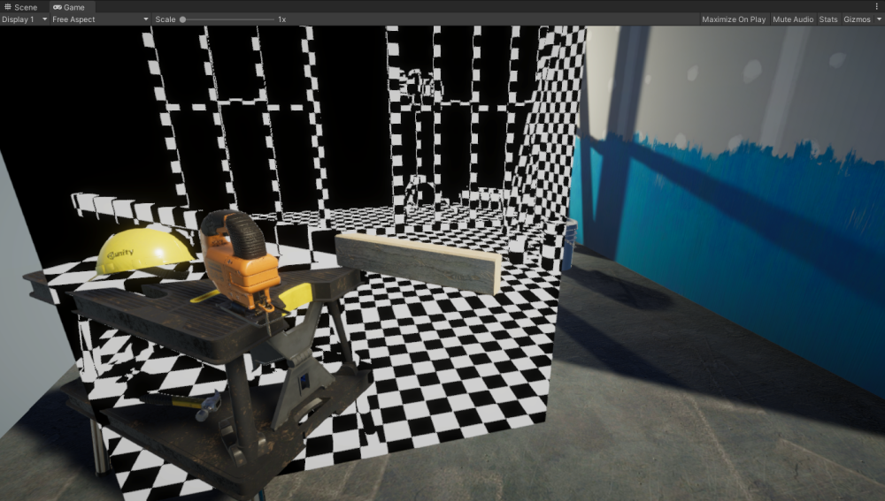
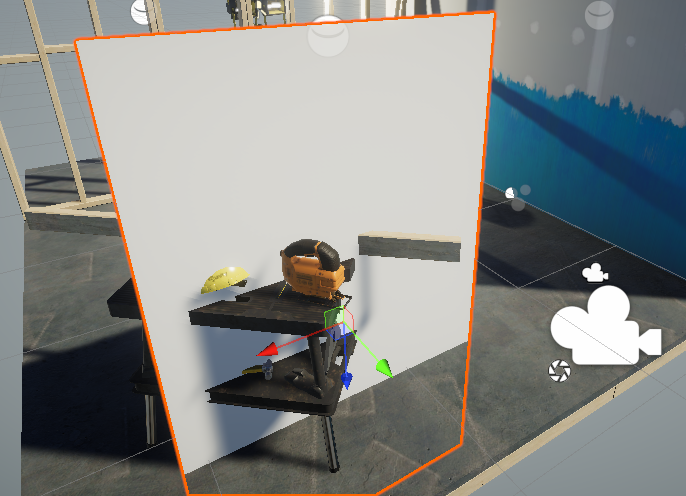
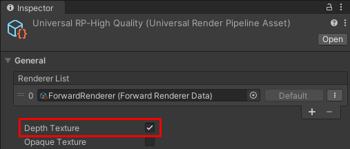

# 从深度纹理重建像素的世界空间位置

本示例中的 Unity Shader 使用深度纹理和屏幕空间 UV 坐标  
重建像素的世界空间位置，并在网格上绘制棋盘格图案以可视化重建的坐标。

最终效果如下：



本页面包含以下部分：

- [从深度纹理重建像素的世界空间位置](#从深度纹理重建像素的世界空间位置)
  - [创建示例场景](#创建示例场景)
  - [编辑 ShaderLab 代码](#编辑-shaderlab-代码)
  - [完整的 ShaderLab 代码](#完整的-shaderlab-代码)


## 创建示例场景

按以下步骤创建示例场景：

1. 在现有 Unity 项目中安装 URP，或使用  
   [通用渲染管线模板（Universal Project Template）](creating-a-new-project-with-urp.md) 创建新项目。

2. 在示例场景中创建一个 Plane GameObject，  
   并放置在场景中使其遮挡部分物体。

    

3. 创建一个新材质（Material），并分配给 Plane。

4. 创建一个新 Shader 并分配给该材质。  
   复制并粘贴 [URP Unlit 基础 Shader](writing-shaders-urp-basic-unlit-structure.md) 的代码。

5. 选择 URP 资源（URP Asset）。  
   - 如果项目是使用 URP 模板创建的，URP 资源路径为：
     ```
     Assets/Settings/UniversalRP-HighQuality
     ```

6. 在 URP 资源的 General 部分，启用 `Depth Texture`。

    

7. 打开在步骤 4 创建的 Shader，准备进行修改。

## 编辑 ShaderLab 代码

本部分假设你已从 [URP Unlit 基础 Shader](writing-shaders-urp-basic-unlit-structure.md) 复制了源码。

对 ShaderLab 代码进行以下修改：

1. 在 `HLSLPROGRAM` 块中，添加 **深度纹理 Shader 头文件** 的 `#include` 语句，  
   可放置在 `Core.hlsl` 之后：

    ```c++
    #include "Packages/com.unity.render-pipelines.universal/ShaderLibrary/Core.hlsl"

    // DeclareDepthTexture.hlsl 提供了采样相机深度纹理的工具函数
    #include "Packages/com.unity.render-pipelines.universal/ShaderLibrary/DeclareDepthTexture.hlsl"
    ```
    `DeclareDepthTexture.hlsl` 文件提供了用于采样相机深度纹理的函数，  
    本示例使用 `SampleSceneDepth` 函数获取像素的 Z 坐标。

2. 在 **片元着色器**（fragment shader）定义中，添加 `Varyings IN` 作为输入参数：

    ```c++
    half4 frag(Varyings IN) : SV_Target
    ```

    本示例的片元着色器使用 `Varyings` 结构体中的 `positionHCS` 变量来获取像素位置。

3. 在片元着色器中，计算**用于采样深度缓冲区的 UV 坐标**，  
   需要使用 `positionHCS` 位置除以 `_ScaledScreenParams`（渲染目标分辨率）：

    ```c++
    float2 UV = IN.positionHCS.xy / _ScaledScreenParams.xy;
    ```

    `_ScaledScreenParams.xy` 考虑了渲染目标的缩放，如 动态分辨率（Dynamic Resolution）。

4. 使用 `SampleSceneDepth` **采样深度缓冲区**：

    ```c++
    #if UNITY_REVERSED_Z
        real depth = SampleSceneDepth(UV);
    #else
        // 调整 Z 值以匹配 OpenGL 的 NDC 空间
        real depth = lerp(UNITY_NEAR_CLIP_VALUE, 1, SampleSceneDepth(UV));
    #endif
    ```

   `SampleSceneDepth` 由 `DeclareDepthTexture.hlsl` 提供，返回 `[0, 1]` 之间的 Z 值。

   **注意**：
   - `ComputeWorldSpacePosition` 计算世界空间位置时，深度值必须在 NDC（归一化设备坐标）空间。
   - 在 D3D 中，Z 取值范围为 `[0,1]`，  
     在 OpenGL 中，Z 取值范围为 `[-1, 1]`。
   - `UNITY_REVERSED_Z` 用于区分平台并调整 Z 值范围。
   - `UNITY_NEAR_CLIP_VALUE` 是平台无关的近平面裁剪值。

   详细信息请参考 [平台特定渲染差异](https://docs.unity.cn/cn/tuanjiemanual/Manual/SL-PlatformDifferences.html)。

5. **重建像素的世界空间坐标**：

    ```c++
    float3 worldPos = ComputeWorldSpacePosition(UV, depth, UNITY_MATRIX_I_VP);
    ```

    - `ComputeWorldSpacePosition` 从 UV 和深度（Z）计算世界空间位置，  
      该函数定义于 SRP Core 包的 `Common.hlsl` 文件中。
    - `UNITY_MATRIX_I_VP` 是逆视图投影矩阵，用于将裁剪空间坐标转换为世界空间。

6. **可视化世界空间位置（棋盘格效果）**：

    ```c++
    uint scale = 10;
    uint3 worldIntPos = uint3(abs(worldPos.xyz * scale));
    bool white = (worldIntPos.x & 1) ^ (worldIntPos.y & 1) ^ (worldIntPos.z & 1);
    half4 color = white ? half4(1,1,1,1) : half4(0,0,0,1);
    ```

    - `scale` 控制棋盘格的大小（值越大，格子越小）。
    - `abs(worldPos.xyz * scale)` 确保棋盘格在负坐标方向上对称。
    - `uint3` 将坐标转换为整数，以对齐棋盘格。
    - `& 1` 检查坐标是否为奇数或偶数：
      - 偶数返回 0，奇数返回 1。
      - 这使得代码可以将表面划分为正方形区域。
    - `^`（XOR）翻转颜色，形成棋盘格效果。

    处理深度缓冲区无效区域（无几何体渲染）：

    ```c++
    #if UNITY_REVERSED_Z
        if(depth < 0.0001)
            return half4(0,0,0,1);
    #else
        if(depth > 0.9999)
            return half4(0,0,0,1);
    #endif
    ```

    不同平台的远裁剪平面 Z 值不同：
    - D3D：远平面 Z = 1（UNITY_REVERSED_Z 开启）
    - OpenGL：远平面 Z = 0（UNITY_REVERSED_Z 关闭）

    `UNITY_REVERSED_Z` 变量确保不同平台正确处理深度值。

    保存 Shader 代码，示例已准备就绪。

最终效果：


## 完整的 ShaderLab 代码

以下是本示例的完整 ShaderLab 代码：

```c++
// This Unity shader reconstructs the world space positions for pixels using a depth
// texture and screen space UV coordinates. The shader draws a checkerboard pattern
// on a mesh to visualize the positions.
Shader "Example/URPReconstructWorldPos"
{
    Properties
    { }

    // The SubShader block containing the Shader code.
    SubShader
    {
        // SubShader Tags define when and under which conditions a SubShader block or
        // a pass is executed.
        Tags { "RenderType" = "Opaque" "RenderPipeline" = "UniversalPipeline" }

        Pass
        {
            HLSLPROGRAM
            // This line defines the name of the vertex shader.
            #pragma vertex vert
            // This line defines the name of the fragment shader.
            #pragma fragment frag

            // The Core.hlsl file contains definitions of frequently used HLSL
            // macros and functions, and also contains #include references to other
            // HLSL files (for example, Common.hlsl, SpaceTransforms.hlsl, etc.).
            #include "Packages/com.unity.render-pipelines.universal/ShaderLibrary/Core.hlsl"

            // The DeclareDepthTexture.hlsl file contains utilities for sampling the
            // Camera depth texture.
            #include "Packages/com.unity.render-pipelines.universal/ShaderLibrary/DeclareDepthTexture.hlsl"

            // This example uses the Attributes structure as an input structure in
            // the vertex shader.
            struct Attributes
            {
                // The positionOS variable contains the vertex positions in object
                // space.
                float4 positionOS   : POSITION;
            };

            struct Varyings
            {
                // The positions in this struct must have the SV_POSITION semantic.
                float4 positionHCS  : SV_POSITION;
            };

            // The vertex shader definition with properties defined in the Varyings
            // structure. The type of the vert function must match the type (struct)
            // that it returns.
            Varyings vert(Attributes IN)
            {
                // Declaring the output object (OUT) with the Varyings struct.
                Varyings OUT;
                // The TransformObjectToHClip function transforms vertex positions
                // from object space to homogenous clip space.
                OUT.positionHCS = TransformObjectToHClip(IN.positionOS.xyz);
                // Returning the output.
                return OUT;
            }

            // The fragment shader definition.
            // The Varyings input structure contains interpolated values from the
            // vertex shader. The fragment shader uses the `positionHCS` property
            // from the `Varyings` struct to get locations of pixels.
            half4 frag(Varyings IN) : SV_Target
            {
                // To calculate the UV coordinates for sampling the depth buffer,
                // divide the pixel location by the render target resolution
                // _ScaledScreenParams.
                float2 UV = IN.positionHCS.xy / _ScaledScreenParams.xy;

                // Sample the depth from the Camera depth texture.
                #if UNITY_REVERSED_Z
                    real depth = SampleSceneDepth(UV);
                #else
                    // Adjust Z to match NDC for OpenGL ([-1, 1])
                    real depth = lerp(UNITY_NEAR_CLIP_VALUE, 1, SampleSceneDepth(UV));
                #endif

                // Reconstruct the world space positions.
                float3 worldPos = ComputeWorldSpacePosition(UV, depth, UNITY_MATRIX_I_VP);

                // The following part creates the checkerboard effect.
                // Scale is the inverse size of the squares.
                uint scale = 10;
                // Scale, mirror and snap the coordinates.
                uint3 worldIntPos = uint3(abs(worldPos.xyz * scale));
                // Divide the surface into squares. Calculate the color ID value.
                bool white = ((worldIntPos.x) & 1) ^ (worldIntPos.y & 1) ^ (worldIntPos.z & 1);
                // Color the square based on the ID value (black or white).
                half4 color = white ? half4(1,1,1,1) : half4(0,0,0,1);

                // Set the color to black in the proximity to the far clipping
                // plane.
                #if UNITY_REVERSED_Z
                    // Case for platforms with REVERSED_Z, such as D3D.
                    if(depth < 0.0001)
                        return half4(0,0,0,1);
                #else
                    // Case for platforms without REVERSED_Z, such as OpenGL.
                    if(depth > 0.9999)
                        return half4(0,0,0,1);
                #endif

                return color;
            }
            ENDHLSL
        }
    }
}
```
