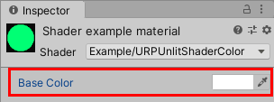
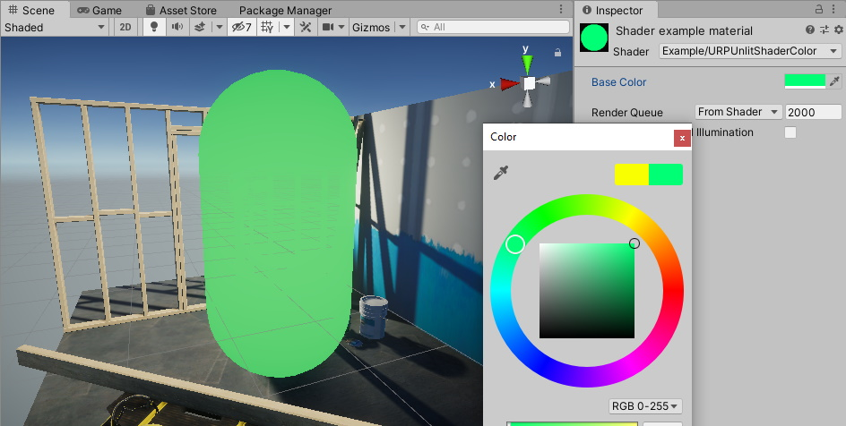

# URP 无光照着色器与颜色输入

这个 Unity 着色器示例向材质中添加了 __Base Color__ 属性。您可以使用该属性选择颜色，然后着色器会将该颜色填充到网格形状中。

使用 [URP 无光照基本着色器](writing-shaders-urp-basic-unlit-structure.md) 中的 Unity 着色器源文件，并对 ShaderLab 代码做以下修改：

1. 在 `Properties` 块中添加 `_BaseColor` 属性定义：

    ```c++
    Properties
    {
        [MainColor] _BaseColor("Base Color", Color) = (1, 1, 1, 1)
    }
    ```

    这行声明将 `_BaseColor` 属性以及标签 __Base Color__ 添加到材质中：

    

    当您使用 `[MainColor]` 属性时，Unity 会将此属性用作材质的 [主颜色](https://docs.unity.cn/cn/tuanjiemanual/ScriptReference/Material-color.html)。

    > **注意**：为了兼容性原因，`_Color` 属性名称是保留名称。即使没有 `[MainColor]` 属性，Unity 也会将名称为 `_Color` 的属性作为 [主颜色](https://docs.unity.cn/cn/tuanjiemanual/ScriptReference/Material-color.html) 使用。

2. 当在 `Properties` 块中声明属性时，还需要在 HLSL 代码中声明它。

    > __注意__：为了确保 Unity 着色器与 SRP Batcher 兼容，请将所有材质属性声明在一个名为 `UnityPerMaterial` 的 `CBUFFER` 块中。有关 SRP Batcher 的更多信息，请参考 [Scriptable Render Pipeline (SRP) Batcher](https://docs.unity.cn/cn/tuanjiemanual/Manual/SRPBatcher.html) 页面。

    在顶点着色器之前添加以下代码：

    ```c++
    CBUFFER_START(UnityPerMaterial)
        half4 _BaseColor;
    CBUFFER_END
    ```

3. 更改片段着色器中的代码，使其返回 `_BaseColor` 属性：

    ```c++
    half4 frag() : SV_Target
    {
        return _BaseColor;
    }
    ```

现在，您可以在 Inspector 窗口中的 **Base Color** 字段选择颜色。片段着色器将使用您选择的颜色填充网格。



以下是该示例的完整 ShaderLab 代码：

```c++
// This shader fills the mesh shape with a color that a user can change using the
// Inspector window on a Material.
Shader "Example/URPUnlitShaderColor"
{
    // The _BaseColor variable is visible in the Material's Inspector, as a field
    // called Base Color. You can use it to select a custom color. This variable
    // has the default value (1, 1, 1, 1).
    Properties
    {
        [MainColor] _BaseColor("Base Color", Color) = (1, 1, 1, 1)
    }

    SubShader
    {
        Tags { "RenderType" = "Opaque" "RenderPipeline" = "UniversalPipeline" }

        Pass
        {
            HLSLPROGRAM
            #pragma vertex vert
            #pragma fragment frag

            #include "Packages/com.unity.render-pipelines.universal/ShaderLibrary/Core.hlsl"

            struct Attributes
            {
                float4 positionOS   : POSITION;
            };

            struct Varyings
            {
                float4 positionHCS  : SV_POSITION;
            };

            // To make the Unity shader SRP Batcher compatible, declare all
            // properties related to a Material in a a single CBUFFER block with
            // the name UnityPerMaterial.
            CBUFFER_START(UnityPerMaterial)
                // The following line declares the _BaseColor variable, so that you
                // can use it in the fragment shader.
                half4 _BaseColor;
            CBUFFER_END

            Varyings vert(Attributes IN)
            {
                Varyings OUT;
                OUT.positionHCS = TransformObjectToHClip(IN.positionOS.xyz);
                return OUT;
            }

            half4 frag() : SV_Target
            {
                // Returning the _BaseColor value.
                return _BaseColor;
            }
            ENDHLSL
        }
    }
}
```

[纹理绘制](writing-shaders-urp-unlit-texture.md) 章节展示了如何在网格上绘制纹理。
