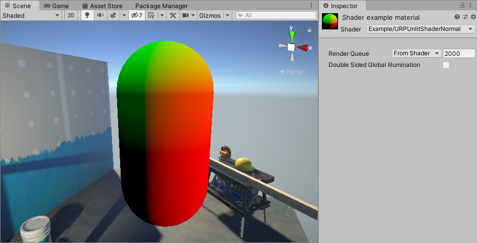
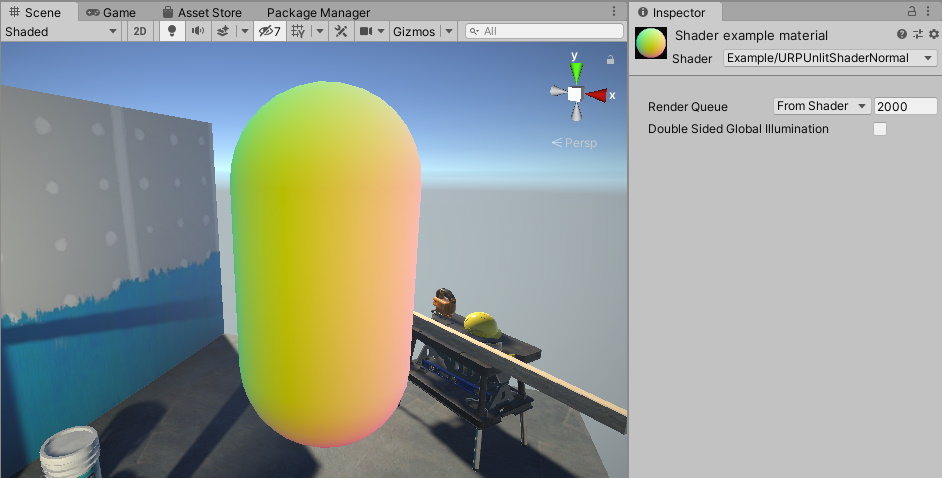

# 可视化法线向量

这个 Unity 着色器示例在网格上可视化法线向量的值。

使用 [URP 基本无光照着色器](writing-shaders-urp-basic-unlit-structure.md) 中的 Unity 着色器源文件，并对 ShaderLab 代码做以下修改：

1. 在 `struct Attributes` 中，这是该示例中的顶点着色器输入结构，声明包含每个顶点法线向量的变量。

    ```c++
    struct Attributes
    {
        float4 positionOS   : POSITION;
        // 声明包含每个顶点法线向量的变量。
        half3 normal        : NORMAL;
    };
    ```

2. 在 `struct Varyings` 中，这是该示例中的片段着色器输入结构，声明用于存储每个片段法线向量值的变量：

    ```c++
    struct Varyings
    {
        float4 positionHCS  : SV_POSITION;
        // 用于存储法线向量值的变量。
        half3 normal        : TEXCOORD0;
    };
    ```

    这个示例使用法线向量的三个分量作为每个片段的 RGB 颜色值。

3. 为了在网格上渲染法线向量值，使用以下代码作为片段着色器：

    ```c++
    half4 frag(Varyings IN) : SV_Target
    {
        half4 color = 0;
        color.rgb = IN.normal;
        return color;
    }
    ```

4. Unity 渲染法线向量值到网格上：

    

    圆柱的一部分显示为黑色，这是因为在这些点上法线向量的三个分量都是负值。接下来的步骤将展示如何渲染这些区域的值。

5. 为了渲染负的法线向量分量，使用压缩技术。为了将法线分量值的范围 `(-1..1)` 压缩到颜色值范围 `(0..1)`，请将以下代码：

    ```c++
    color.rgb = IN.normal;
    ```

    改为：

    ```c++
    color.rgb = IN.normal * 0.5 + 0.5;
    ```

现在，Unity 将法线向量值作为颜色渲染到网格上。



以下是该示例的完整 ShaderLab 代码：

```c++
// This shader visuzlizes the normal vector values on the mesh.
Shader "Example/URPUnlitShaderNormal"
{
    Properties
    { }

    SubShader
    {
        Tags { "RenderType" = "Opaque" "RenderPipeline" = "UniversalPipeline" }

        Pass
        {
            HLSLPROGRAM
            #pragma vertex vert
            #pragma fragment frag

            #include "Packages/com.unity.render-pipelines.universal/ShaderLibrary/Core.hlsl"

            struct Attributes
            {
                float4 positionOS   : POSITION;
                // Declaring the variable containing the normal vector for each
                // vertex.
                half3 normal        : NORMAL;
            };

            struct Varyings
            {
                float4 positionHCS  : SV_POSITION;
                half3 normal        : TEXCOORD0;
            };

            Varyings vert(Attributes IN)
            {
                Varyings OUT;
                OUT.positionHCS = TransformObjectToHClip(IN.positionOS.xyz);
                // Use the TransformObjectToWorldNormal function to transform the
                // normals from object to world space. This function is from the
                // SpaceTransforms.hlsl file, which is referenced in Core.hlsl.
                OUT.normal = TransformObjectToWorldNormal(IN.normal);
                return OUT;
            }

            half4 frag(Varyings IN) : SV_Target
            {
                half4 color = 0;
                // IN.normal is a 3D vector. Each vector component has the range
                // -1..1. To show all vector elements as color, including the
                // negative values, compress each value into the range 0..1.
                color.rgb = IN.normal * 0.5 + 0.5;
                return color;
            }
            ENDHLSL
        }
    }
}
```
