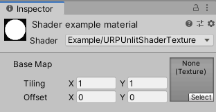
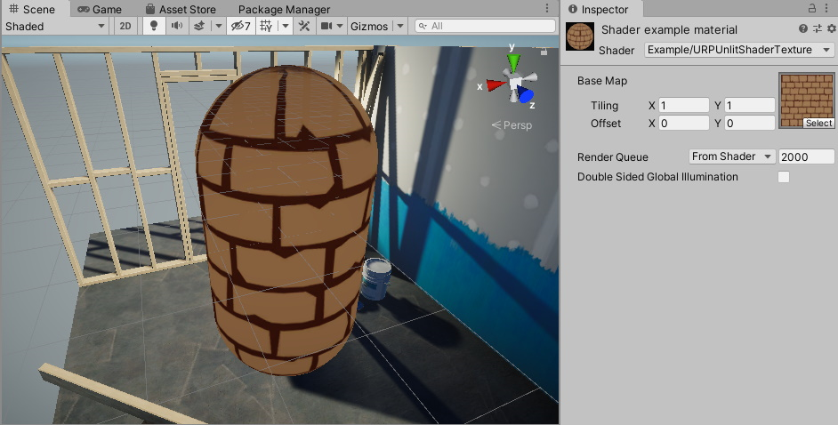

# 绘制纹理

这个 Unity 着色器示例在网格上绘制一个纹理。

使用 [URP 无光照着色器与颜色输入](writing-shaders-urp-unlit-color.md) 中的 Unity 着色器源文件，并对 ShaderLab 代码做以下修改：

1. 在 `Properties` 块中，将现有代码替换为 `_BaseMap` 属性定义：

    ```c++
    Properties
    {
        [MainTexture] _BaseMap("Base Map", 2D) = "white" {}
    }
    ```

    当您在 `Properties` 块中声明纹理属性时，Unity 会将 `_BaseMap` 属性以及标签 __Base Map__ 添加到材质中，并添加 Tiling 和 Offset 控制。

    

    当您使用 `[MainTexture]` 属性时，Unity 会将此属性用作材质的 [主纹理](https://docs.unity.cn/cn/tuanjiemanual/ScriptReference/Material-mainTexture.html)。

    > **注意**：为了兼容性原因，`_MainTex` 属性名称是保留名称。即使没有 `[MainTexture]` 属性，Unity 也会将名称为 `_MainTex` 的属性作为 [主纹理](https://docs.unity.cn/cn/tuanjiemanual/ScriptReference/Material-mainTexture.html) 使用。

2. 在 `struct Attributes` 和 `struct Varyings` 中，添加 `uv` 变量，用于存储纹理上的 UV 坐标：

    ```c++
    float2 uv           : TEXCOORD0;
    ```

3. 将纹理定义为 2D 纹理，并指定一个采样器。在 `CBUFFER` 块之前添加以下代码：

    ```c++
    TEXTURE2D(_BaseMap);
    SAMPLER(sampler_BaseMap);
    ```

    `TEXTURE2D` 和 `SAMPLER` 宏定义在 `Core.hlsl` 中引用的文件之一中。

4. 为了让 Tiling 和 Offset 生效，需要在 `CBUFFER` 块中声明纹理属性时添加 `_ST` 后缀。因为某些宏（例如 `TRANSFORM_TEX`）需要使用该后缀。

    > __注意__：为了确保 Unity 着色器与 SRP Batcher 兼容，请将所有材质属性声明在一个名为 `UnityPerMaterial` 的 `CBUFFER` 块中。有关 SRP Batcher 的更多信息，请参考 [Scriptable Render Pipeline (SRP) Batcher](https://docs.unity.cn/cn/tuanjiemanual/Manual/SRPBatcher.html) 页面。

    ```c++
    CBUFFER_START(UnityPerMaterial)
        float4 _BaseMap_ST;
    CBUFFER_END
    ```

5. 为了应用 Tiling 和 Offset 变换，在顶点着色器中添加以下行：

    ```c++
    OUT.uv = TRANSFORM_TEX(IN.uv, _BaseMap);
    ```

    `TRANSFORM_TEX` 宏定义在 `Macros.hlsl` 文件中，`#include` 声明包含了对该文件的引用。

6. 在片段着色器中，使用 `SAMPLE_TEXTURE2D` 宏来采样纹理：

    ```c++
    half4 frag(Varyings IN) : SV_Target
    {
        half4 color = SAMPLE_TEXTURE2D(_BaseMap, sampler_BaseMap, IN.uv);
        return color;
    }
    ```

现在，您可以在 Inspector 窗口中的 __Base Map__ 字段中选择纹理。着色器将在网格上绘制该纹理。



以下是该示例的完整 ShaderLab 代码：

```c++
// This shader draws a texture on the mesh.
Shader "Example/URPUnlitShaderTexture"
{
    // The _BaseMap variable is visible in the Material's Inspector, as a field
    // called Base Map.
    Properties
    {
        [MainTexture] _BaseMap("Base Map", 2D) = "white" {}
    }

    SubShader
    {
        Tags { "RenderType" = "Opaque" "RenderPipeline" = "UniversalPipeline" }

        Pass
        {
            HLSLPROGRAM
            #pragma vertex vert
            #pragma fragment frag

            #include "Packages/com.unity.render-pipelines.universal/ShaderLibrary/Core.hlsl"

            struct Attributes
            {
                float4 positionOS   : POSITION;
                // The uv variable contains the UV coordinate on the texture for the
                // given vertex.
                float2 uv           : TEXCOORD0;
            };

            struct Varyings
            {
                float4 positionHCS  : SV_POSITION;
                // The uv variable contains the UV coordinate on the texture for the
                // given vertex.
                float2 uv           : TEXCOORD0;
            };

            // This macro declares _BaseMap as a Texture2D object.
            TEXTURE2D(_BaseMap);
            // This macro declares the sampler for the _BaseMap texture.
            SAMPLER(sampler_BaseMap);

            CBUFFER_START(UnityPerMaterial)
                // The following line declares the _BaseMap_ST variable, so that you
                // can use the _BaseMap variable in the fragment shader. The _ST
                // suffix is necessary for the tiling and offset function to work.
                float4 _BaseMap_ST;
            CBUFFER_END

            Varyings vert(Attributes IN)
            {
                Varyings OUT;
                OUT.positionHCS = TransformObjectToHClip(IN.positionOS.xyz);
                // The TRANSFORM_TEX macro performs the tiling and offset
                // transformation.
                OUT.uv = TRANSFORM_TEX(IN.uv, _BaseMap);
                return OUT;
            }

            half4 frag(Varyings IN) : SV_Target
            {
                // The SAMPLE_TEXTURE2D marco samples the texture with the given
                // sampler.
                half4 color = SAMPLE_TEXTURE2D(_BaseMap, sampler_BaseMap, IN.uv);
                return color;
            }
            ENDHLSL
        }
    }
}
```

[可视化法线向量](writing-shaders-urp-unlit-normals.md) 展示了如何在网格上对法线向量进行可视化。
