美术节点
====

Adjustment
-------------------------

| [Channel Mixer](Channel-Mixer-Node.md) | [Contrast](Contrast-Node.md) |
| --- | --- |
| 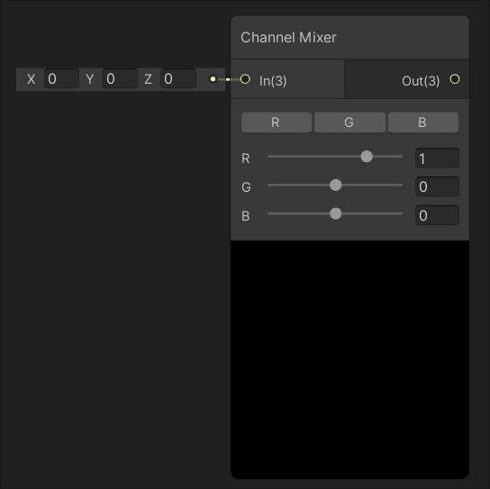 | 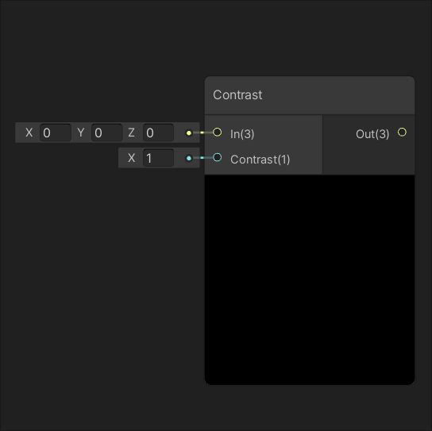 |
| 控制输入 In 的每个通道对每个输出通道的贡献量。 | 根据输入 Contrast 的大小调整输入 In 的对比度。 |
| [**Hue**](Hue-Node.md) | [**Invert Colors**](Invert-Colors-Node.md) |
| 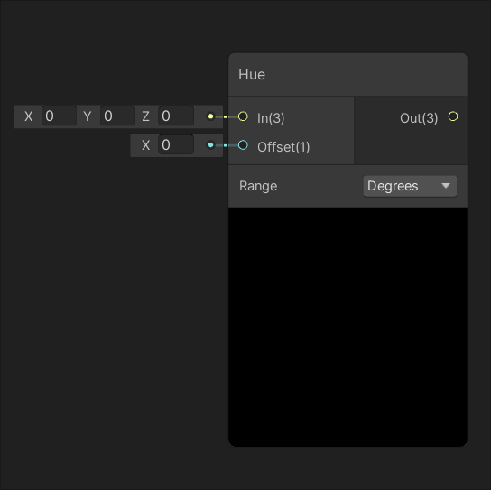 | 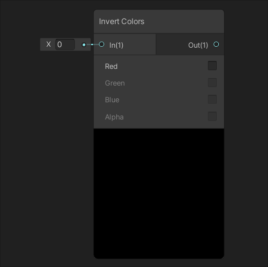 |
| 使输入 In 的色调偏移输入 Offset 的大小。 | 基于每个通道反转输入 In 的颜色。 |
| [**Replace Color**](Replace-Color-Node.md) | [**Saturation**](Saturation-Node.md) |
| 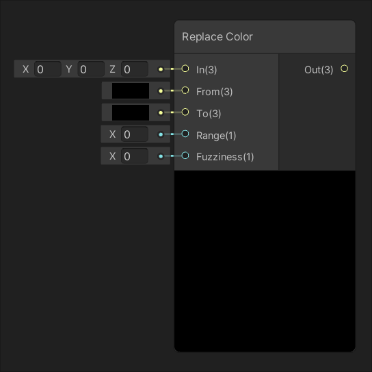 | 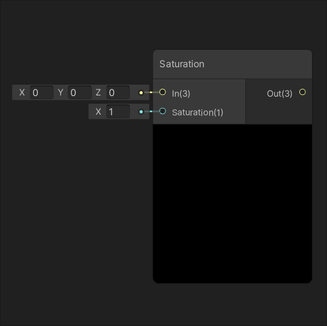 |
| 将输入 In 中等于输入 From 的值替换为输入 To 的值。 | 根据输入 Saturation 的大小调整输入 In 的饱和度。 |
| [**White Balance**](White-Balance-Node.md) |  |
| 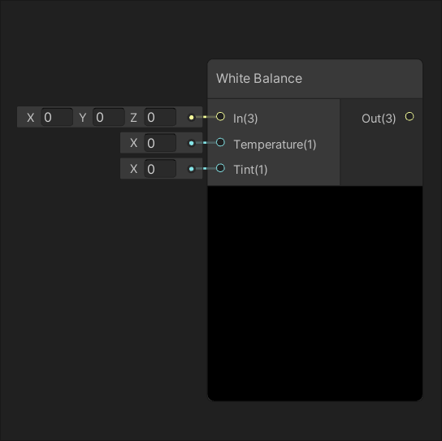 |  |
| 分别根据输入 Temperature 和 Tint 的大小调整输入 In 的色温和色调。 |  |

Blend
---------------

| [Blend](Blend-Node.md) |
| --- |
| 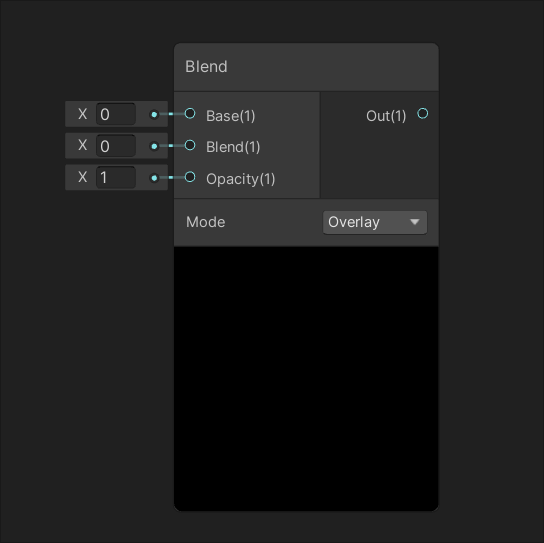 |
| 使用参数 Mode 定义的混合模式将输入 Blend 的值混合到输入 Base 上。 |

Filter
-----------------

| [Dither](Dither-Node.md) |
| --- |
| 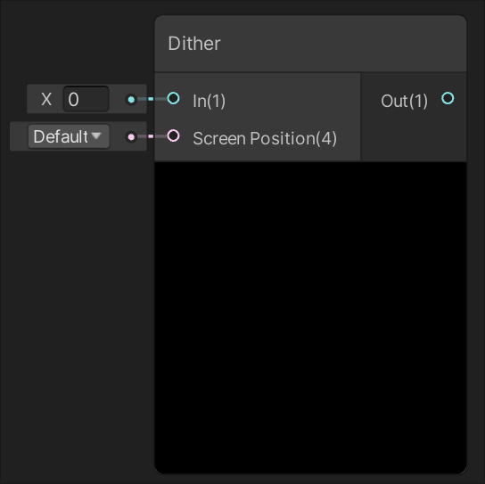 |
| 抖动 (Dither) 是特意用于将量化误差随机化的噪声形式。用于防止大尺寸图案，例如图像中的色带。 |

Mask
-------------

| [Channel Mask](Channel-Mask-Node.md) | [Color Mask](Color-Mask-Node.md) |
| --- | --- |
| 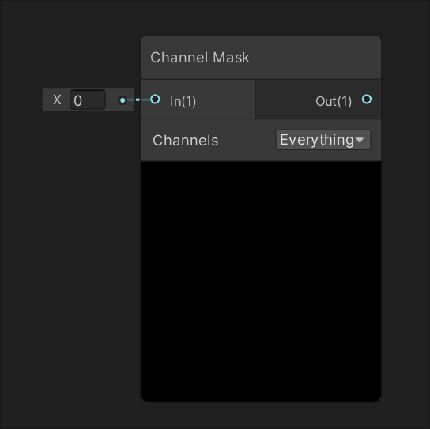 | 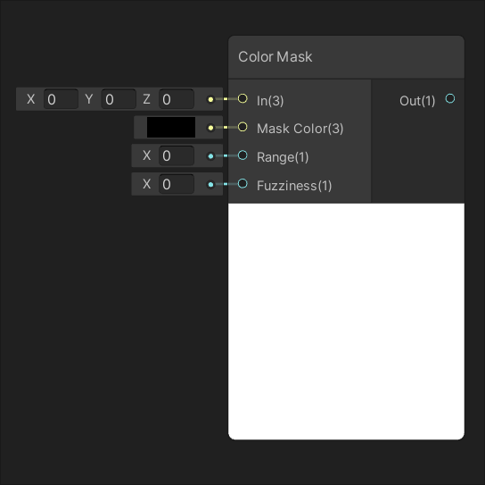 |
| 在下拉选单 Channels 中选择的通道上屏蔽输入 In 的值。 | 根据输入 In 中的等于输入 Mask Color 的值创建遮罩。 |

Normal
-----------------

| [Normal Blend](Normal-Blend-Node.md) | [Normal From Height](Normal-From-Height-Node.md) |
| --- | --- |
| 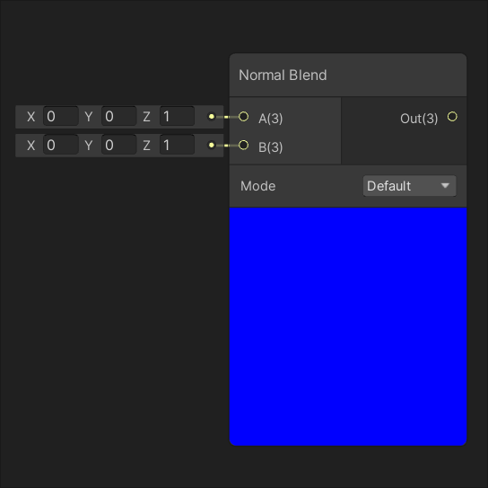 | 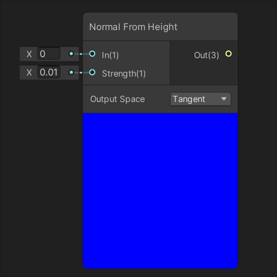 |
| 将输入 A 和 B 定义的两个法线贴图混合在一起。 | 根据输入 Texture 定义的高度贴图创建法线贴图。 |
| [**Normal Strength**](Normal-Strength-Node.md) | [**Normal Unpack**](Normal-Unpack-Node.md) |
| 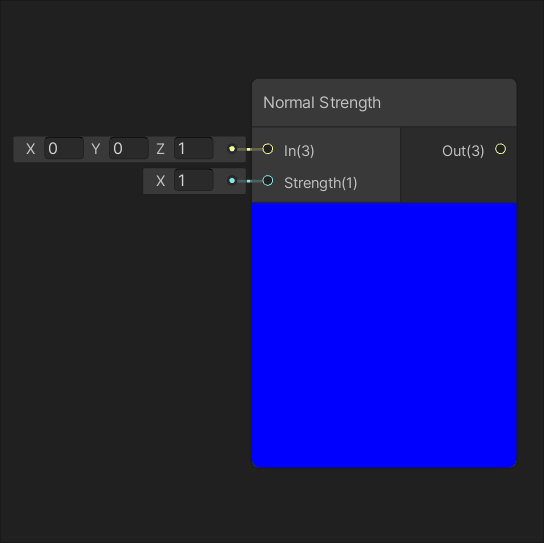 | 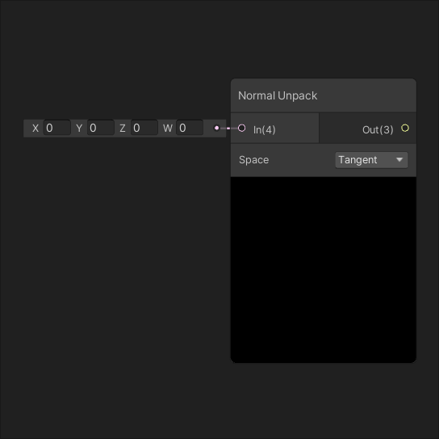 |
| 根据输入 Strength 的大小调整输入 In 定义的法线贴图的强度。 | 解压缩由输入 In 定义的法线贴图。 |

Utility
-------------------

| [Colorspace Conversion](Colorspace-Conversion-Node.md) | [GammaToLinearSpaceExact](GammaToLinearSpaceExact-Node.md) |
| --- | --- | 
| 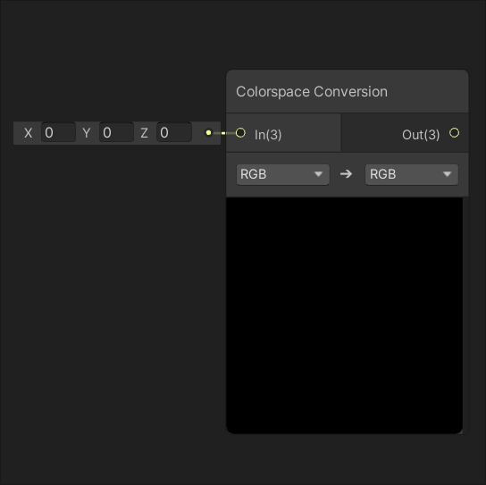 | 
| 返回将输入 In 的值从一个颜色空间转换为另一个颜色空间的结果。 | 将经过伽马校正的数值，转换为线性空间中的数值。 |
| [LinearToGammaSpaceExact](LinearToGammaSpaceExact-Node.md) | [RGB to Grayscale](RGB-to-Grayscale-Node.md) |
|  |  |
| 将线性颜色空间中的数值转换为伽马颜色空间中的数值。 | 输入RGB信息并且转换成灰度信息输出。 |
|  [RGB to Luminance](RGB-to-Luminance-Node.md) |  |
|  |  |
| 输入RGB信息并且转换成流明度信息输出。 |  |
