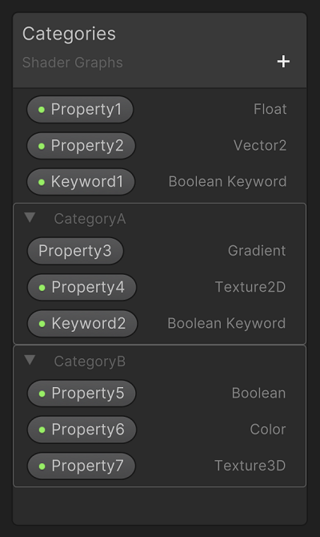
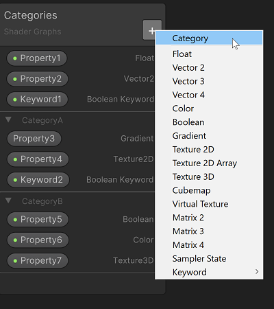
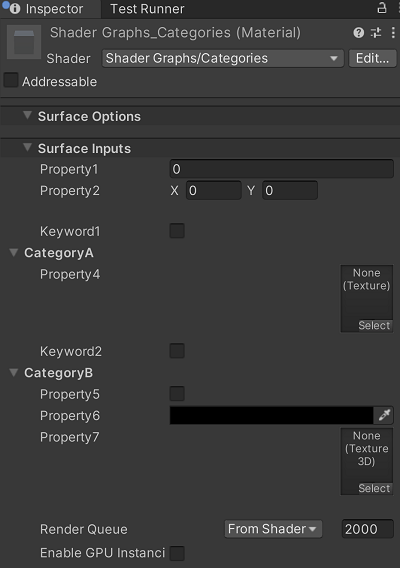

Blackboard
==========

描述
--

您可以使用 Blackboard 对图形中的属性（[Properties](Property-Types.md)）和关键字（[Keywords](Keywords.md)）进行定义、排序和分类。通过 BlackBoard ，还可以编辑所选 Shader Graph 资产或子图形的路径。

访问 Blackboard
-----------------------------------------------------

默认情况下，Blackboard 是可见的，您不能将其拖出图表并丢失它。但是，您可以将其放置在 [Shader Graph 窗口](Shader-Graph-Window.md)。 它始终保持与最近角落相同距离，即使您调整窗口大小。

向 Blackboard 添加属性和关键字
-----------------------------------------------------------------------------------------------------

要创建新属性或关键字，请单击 Blackboard 标题栏上的**添加 （+）** 按钮，然后选择一种类型。有关属性类型的完整列表，请参阅 [属性类型](Property-Types.md)。

编辑属性和关键字
-------------------------------------------------------------------

在 Blackboard 或图形中选择一个属性或关键字，以在 Node Settings 菜单中修改其设置。

| 设置 | 描述 |
| --- | --- |
| Name | 属性的显示名称。编辑器会删除显示名称中的引号，并替换为下划线。在 Blackboard 上双击项目名称，即可重新命名该项目。 |
| Reference | Shader Graph 为该属性在内部使用的名称。虽然编辑器会默认填入此值，但您可以对其进行修改。要恢复原始引用名称，请右键单击 **Reference** （而不是输入字段），然后在右键菜单中选择 **Reset Reference**。如果参考名称中包含 HLSL 不支持的字符，编辑器会用下划线替换这些字符。 |
| Default | 基于此 Shader Graph 的任何材质中该属性的默认值。例如，如果您有一个用于草地的 Shader Graph，并将草地颜色作为一个属性显示，那么您可以将默认值设置为绿色。|
| Precision | 设置属性的精度模式。 请查阅 [Precision Modes](Precision-Modes.md)。 |
| Exposed | 启用此设置后，您可以通过 C# API 编辑该属性。默认启用。 |

修改和选择关键字和属性
---------------------------------------------------------------------------------------------------

* 对 Blackboard 上列出的项目重新排序，请拖放它们。
* 删除项目，请使用 Delete 键（Windows）或 Command + Backspace 键（macOS）。
* 选择多个项目，请在进行选择时按住 Ctrl 键。
* 取消选择一个或多个项目，请在按住 Ctrl 键的同时单击要从选择中删除的项目。

使用 Blackboard 类别
-----------------------------------------------------------

要使着色器中的属性更易于发现，请将它们组织到类别中。展开和折叠类别以使 Blackboard 更易于导航。

### 创建、重命名、移动和删除类别

* 添加类别，请使用 Blackboard 上的 **+**。
* 重命名类别，请双击类别名称，或右键单击并选择 **Rename**。
* 在 Blackboard 中移动类别，请选择并拖动该类别。
* 删除某个类别，请选择该类别并按 **Delete**，或右键单击并选择 **Delete**。删除类别也会删除其中的属性，因此请移动要保留的属性。

### 添加、删除和重新排序属性和关键字

* 将属性或关键字添加到类别中，请使用折叠 （⌄） 符号展开类别，然后将属性或关键字拖放到展开的类别上。

* 删除属性或关键字，请选择它并按 **Delete**，或右键单击并选择 **Delete**。
* 对属性或关键字重新排序，请在类别中拖放它们，或将它们移动到其他类别中。

### 为特定属性和关键字创建类别

选择多个属性或关键字，然后使用 **Blackboard** 上的** +** 创建一个包含您已选择的所有项目的类别。

### 复制和粘贴类别

您可以将空类别、具有所有属性的类别以及具有某些属性的类别粘贴到一个或多个图表中。要复制类别及其所有属性：

1. 选择属性。
2. 使用 **Ctrl+C** 复制它。
3. 使用 **Ctrl+V** 将其粘贴到目标图中。

要复制一组特定的属性：

1. 选择类别。
2. 按住 Ctrl 键。
3. 单击不想包含的属性，以将其从选择中删除。
4. 使用 **Ctrl+C** 复制属性。
5. 使用 **Ctrl+V** 将其粘贴到目标图中。

### 在 Material Inspector 中使用类别

要修改使用 Shader Graph 创建的材质，您可以在 Material Inspector 中调整特定属性或关键字值，或者编辑图表本身。

#### 使用流式虚拟纹理

[流式虚拟纹理属性](https://docs.unity.cn/cn/tuanjiemanual/Manual/svt-use-in-shader-graph.html)（Steaming Virtual Texuture Properties）采样纹理层。要在 Material Inspector 中访问这些图层，请展开相关的 **Virtual Texture** 部分，并在其名称旁边显示 ⌄ 符号。您可以通过 Inspector 添加和删除图层。

显示属性和关键字
---------------------------------------------------------------------

团结引擎默认显示（expose）属性和关键字。这使得可以通过脚本进行写访问，因此您可以通过 C# API 或图形编辑器来编辑它们。已公开的项在其标签上带有一个绿色圆点。在 **Node Settings** 菜单中启用或禁用此功能。

创建节点
---------------------------------

将属性或关键字从 Blackboard 拖动到图表中，以创建该类型的节点。图表中节点的设置与 Blackboard 中相关属性或关键字的设置相同。展开这些节点以使用 property value 的子成员。 如果属性已显示（expose），则属性节点名称将包含一个绿点。
