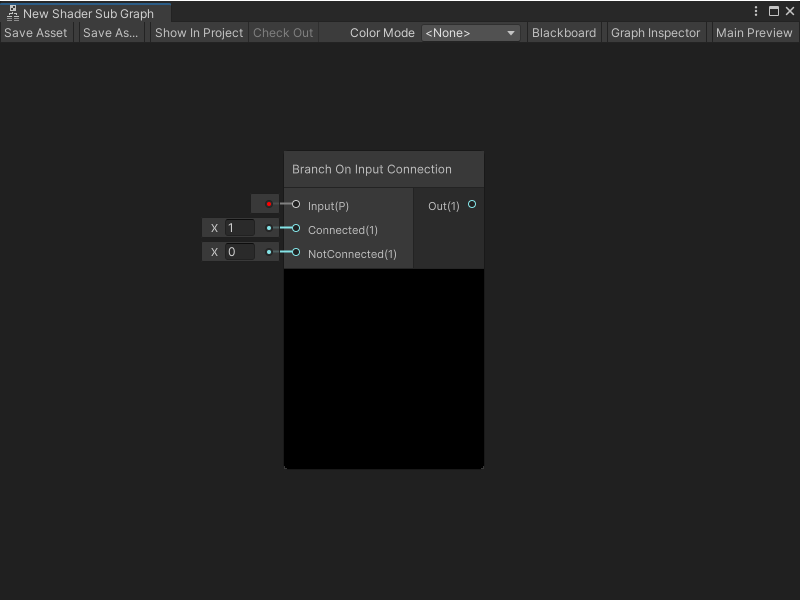
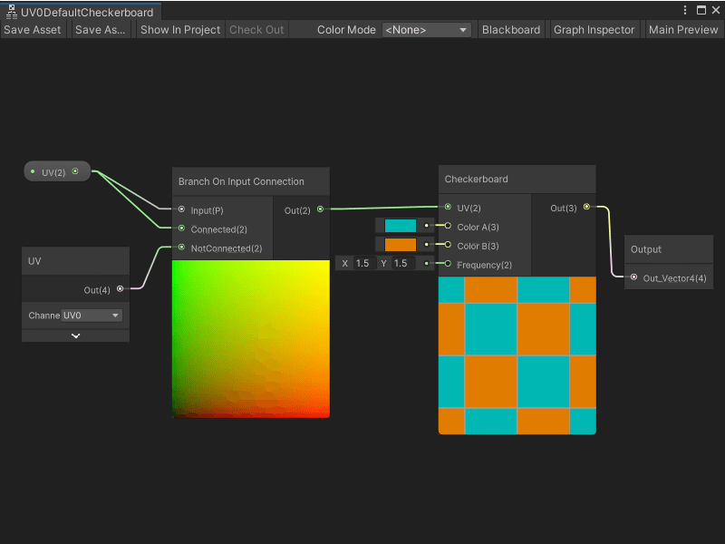

Branch On Input Connection 节点
=====

描述
---
Branch On Input Connection 节点允许您根据父 Shader Graph 中输入属性的连接状态更改子图（Subgraph）的行为。当需要为端口创建默认输入时，可以使用此节点。

Shader Graph 会判断父 Shader Graph 中的属性是否已连接，并根据连接状态选择一个值作为输出。

Shader Graph 在确定节点的连接状态时使用两个端口：

* Branch On Input Connection 节点的 **Input** 端口。
* 父 Shader Graph 中子图节点的相应属性端口。有关子图节点的更多信息，请参见 [Subgraph node](Sub-graph-Node.md)。

Branch On Input Connection 节点的功能基于 [Branch node](Branch-Node.md)。

>注意：Branch On Input Connection 节点无法与 Streaming Virtual Texture 属性一起使用。有关 Streaming Virtual Texturing 的更多信息，请参见 [在 Shader Graph 中使用 Streaming Virtual Texturing](https://docs.unity.cn/cn/tuanjiemanual/Manual/svt-use-in-shader-graph.html)。

Branch On Input Connection 节点会生成分支 HLSL 源代码，但在编译期间，分支会被优化并从着色器中去除。

创建节点菜单类别
-----
Branch On Input Connection 节点位于创建节点菜单（Create Node menu）的 **Utility -> Logic** 类别中，仅可在 Shader 子图中使用。

要在子图中使用 Branch On Input Connection 节点：

1. 打开要添加 Branch On Input Connection 节点的子图。
2. 在 Blackboard 中执行以下操作之一：
    * 要添加新属性，请选择 **Add**（+），然后从菜单中选择一种属性类型。输入新属性的名称并按 Enter。然后，在 Blackboard 中选择您的属性并将其拖到图表上以创建属性节点。
    * 在 Blackboard 中选择现有属性，并将其拖到图表上以创建属性节点。
3. 选择属性节点，在 Graph Inspector 中启用 **Use Custom Binding**。

    >注意：如果禁用 **Use Custom Binding**，则无法将属性节点连接到 Branch On Input Connection 节点。如果已建立连接，编辑器会断开连接并在节点上显示警告。

4. 在 **Label** 字段中输入默认值的标签，该标签显示在父 Shader Graph 中的子图节点端口绑定上。有关端口绑定的更多信息，请参见 [Port Bindings](Port-Bindings.md)。
   
5. 按下空格键或右键单击并选择 **Create Node**。在创建节点菜单中找到 **Branch On Input Connection** 节点，然后双击或按 Enter 将节点添加到子图中。
   
6. 在属性节点上，选择输出端口并将其连接到 Branch On Connection 节点的 **Input** 端口。
   
7. 要指定 Shader Graph 在父 Shader Graph 的**子图**节点上连接 **Input** 端口时使用的值，请连接一个节点到 **Connected** 端口；要指定当 **Input** 端口未连接时使用的值，请连接另一个节点到 **NotConnected** 端口。
   
8. 要指定 Shader Graph 在着色器中如何使用 **Connected** 或 **NotConnected** 值，请将任何有效节点连接到 Branch On Input Connection 节点的 **Output** 端口。

兼容性
---
Branch On Input Connection 节点支持以下渲染管线：

| **内置渲染管线** | **通用渲染管线（URP）** | **高清渲染管线（HDRP）** |
| --- | --- | --- |
| 是 | 是 | 是 |

输入
----
Branch On Input Connection 节点具有以下输入端口：

| **名称** | **类型** | **描述** |
| --- | --- | --- |
| **Input** | 属性 | 根据父 Shader Graph 中的连接状态决定节点的分支逻辑。 |
| **Connected** | 动态向量 | 在父 Shader Graph 中 **Input** 连接时传送到 **Out** 端口的值。 |
| **NotConnected** | 动态向量 | 在父 Shader Graph 中 **Input** 未连接时传送到 **Out** 端口的值。 |

输出
-----
Branch On Input Connection 节点具有一个输出端口：

| **名称** | **类型** | **描述** |
| --- | --- | --- |
| **Out** | 动态向量 | 根据父 Shader Graph 中 **Input** 属性的连接状态，输出 **Connected** 或 **NotConnected** 的值。 |

### 子图使用示例
在以下示例中，Branch On Input Connection 节点为 UV 子图输入属性指定默认行为。当 **UV** 属性在父图中连接时，该属性的值将传递到  Checkerboard 节点，以确定棋盘格图案的 UV 坐标。当 **UV** 属性未连接时，Branch On Input Connection 节点使用 UV 节点的 **UV0** 通道作为  Checkerboard 节点的 UV 坐标。

>注意：当您预览子图时，Branch On Input Connection 节点总是使用其 NotConnected 值。

### 相关节点
以下节点与 Branch On Input Connection 节点相关或相似：

* [Branch node](Branch-Node.md)
* [Subgraph node](Sub-graph-Node.md)