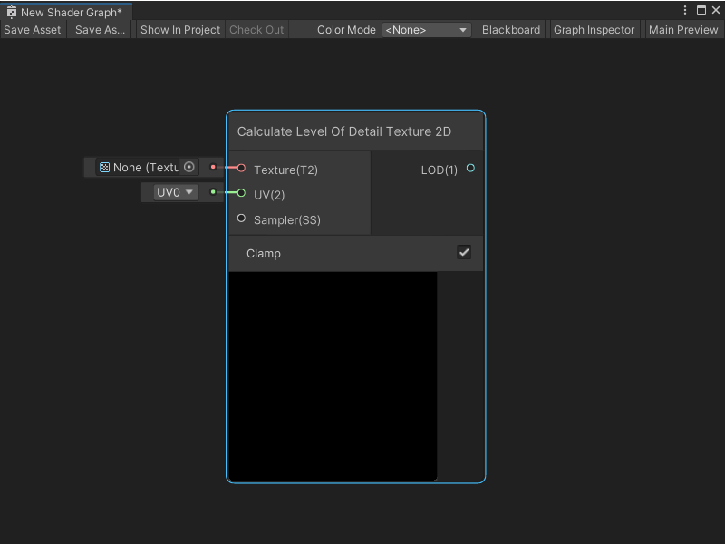
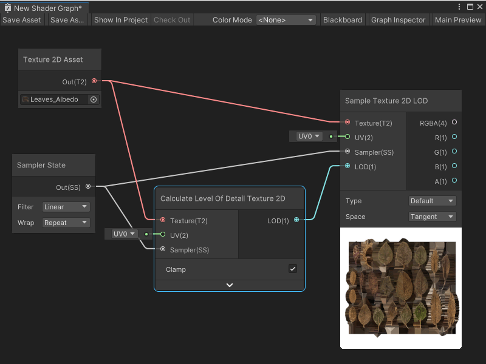

计算 2D 细节层级纹理节点
=====

计算细节层级纹理 2D 节点接受一个输入的 **Texture 2D**，并输出纹理采样的 mip 级别。这个节点在你需要了解纹理的 mip 级别的情况下非常有用，比如在着色器中需要在采样前修改 mip 级别时。

计算细节层级纹理 2D 节点有两种模式：限制模式和非限制模式：

* **限制模式**：节点将返回的 mip 级别限制为纹理上实际存在的 mip。节点使用 [CalculateLevelOfDetail](https://docs.microsoft.com/en-us/windows/win32/direct3dhlsl/dx-graphics-hlsl-to-calculate-lod) HLSL 内置函数。当你想知道从哪个 mip 采样纹理并将结果限制为现有 mip 时，请使用此模式。
  
* **非限制模式**：节点返回理想的 mip 级别，基于一个理想化的纹理，该纹理上存在所有的 mip。节点使用 [CalculateLevelOfDetailUnclamped](https://docs.microsoft.com/en-us/windows/win32/direct3dhlsl/dx-graphics-hlsl-to-calculate-lod-unclamped) HLSL 内置函数。当你需要更通用的 mip 级别值时，请使用此模式。

例如，一个纹理可能只有 3 个 mip：64×64、32×32 和 16×16。当你在 **限制模式** 中使用计算细节层级纹理 2D 节点时，节点将 **LOD** 输出限制为纹理上的 3 个 mip 之一，即使理想的 mip 级别可能是更小的分辨率，如 8×8。在 **非限制模式** 中，节点输出理想的 8×8 mip 级别，尽管它在纹理上并不存在。

> 注意：在这些 HLSL 函数不存在的平台上，Shader Graph 会确定使用合适的近似值。

创建节点菜单类别
-------------------------------------------------------

计算细节层级纹理 2D 节点位于创建节点菜单的 **Input > Texture** 类别下。

兼容性
-------------------------------

计算细节层级纹理 2D 节点在以下渲染管线中受支持：

| **内置渲染管线** | **通用渲染管线 (URP)** | **高定义渲染管线 (HDRP)** |
| --- | --- | --- |
| 是 | 是 | 是 |

计算细节层级纹理 2D 节点只能连接到 **片段** 上下文中的块节点。有关块节点和上下文的更多信息，请参阅 [主栈](Master-Stack.md)。

输入
-----------------

计算细节层级纹理 2D 节点有以下输入端口：

| **名称** | **类型** | **绑定** | **描述** |
| --- | --- | --- | --- |
| **Texture** | Texture 2D | 无 | 用于 mip 级别计算的纹理。 |
| **UV** | Vector 2 | UV | 用于计算纹理 mip 级别的 UV 坐标。 |
| **Sampler** | SamplerState | 无 | 用于计算纹理 mip 级别的采样器状态及其对应设置。 |

控件
---------------------

计算细节层级纹理 2D 节点有一个控件：

| **名称** | **类型** | **选项** | **描述** |
| --- | --- | --- | --- |
| **Clamp** | 切换 | True, False | 启用时，Shader Graph 将输出的 mip 级别限制为提供的 **纹理** 输入上实际存在的 mip。当禁用时，Shader Graph 返回基于理想纹理（该纹理上存在所有 mip）的理想 mip 级别。 |

输出
-------------------

计算细节层级纹理 2D 节点有一个输出端口：

| **名称** | **类型** | **描述** |
| --- | --- | --- |
| **LOD** | Float | 纹理的最终计算 mip 级别。 |

示例图形用法
-------------------------------------------

在以下示例中，计算细节层级纹理 2D 节点计算 **Leaves\_Albedo** 纹理的 mip 级别，用于一组 UV 坐标和特定的采样器状态。它将计算得到的纹理 mip 级别发送到 Sample Texture 2D LOD 节点的 **LOD** 输入端口，该节点对相同的纹理进行采样：

相关节点
-------------------------------

以下节点与计算细节层级纹理 2D 节点相关或相似：

* [Sample Texture 2D LOD 节点](Sample-Texture-2D-LOD-Node.md)
* [Sampler State 节点](Sampler-State-Node.md)
* [Gather Texture 2D 节点](Gather-Texture-2D-Node.md)
* [Texture 2D 资产节点](Texture-2D-Asset-Node.md)