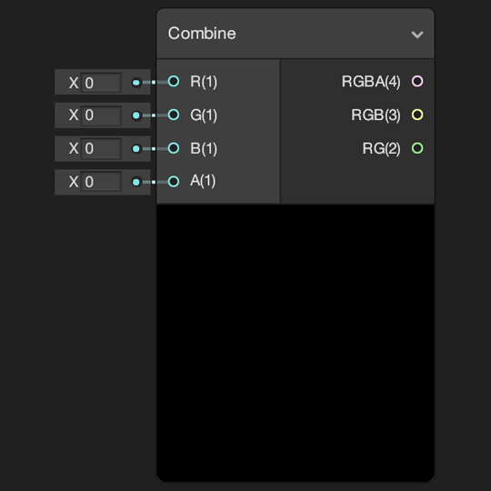
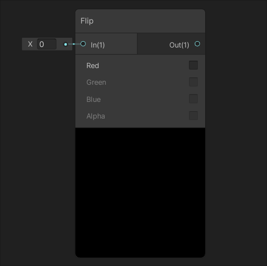
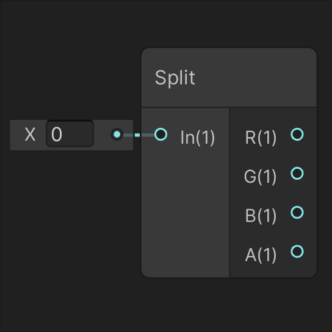
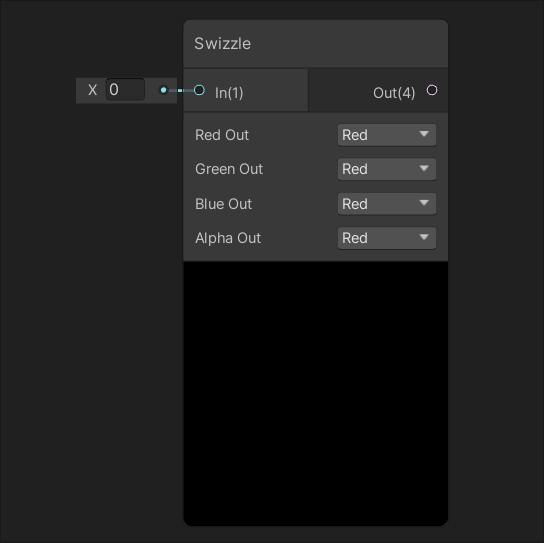

通道节点
====

| [Combine](Combine-Node.md) | [Flip](Flip-Node.md) |
| --- | --- |
|  |  |
| 从四个输入 **R、G、B** 和 **A** 创建新的矢量。 | 根据节点的参数翻转输入 **In** 的各个通道。 |
| [**Split**](Split-Node.md) | [**Swizzle**](Swizzle-Node.md) |
|  |  |
| 将输入矢量 In 拆分为四个 **Float** 输出 **R、G、B** 和 **A**。 | 从输入矢量的重新排列元素中创建新的[矢量](https://docs.unity.cn/cn/tuanjiemanual/Manual/VectorCookbook.html)（Vector）。 |