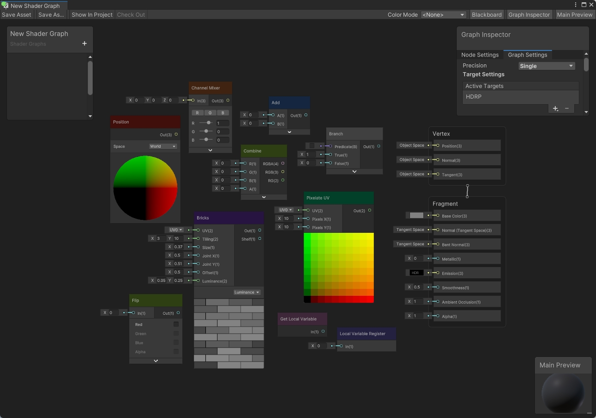
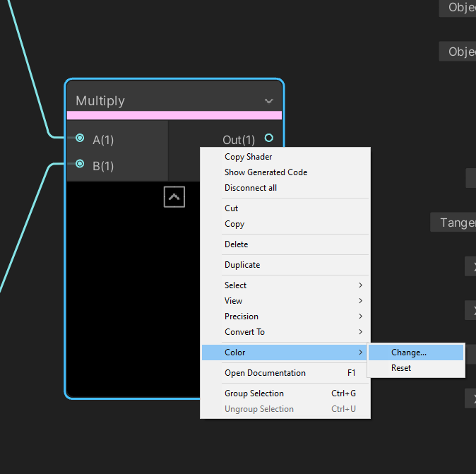

颜色模式
====

描述
--

Shader Graph 可在图形中的节点上显示颜色，从而提高可读性。此功能显示使用 **颜色模式（Color Mode）** 来更改图形内显示的颜色。使用 [Shader Graph 窗口](Shader-Graph-Window.md)右上角的 **Color Mode:** 下拉菜单可以更改**颜色模式**。

模式
--

| 名称 | 描述 |
| --- | --- |
| None | 根据对应的类别在节点上显示颜色。请参阅下文的**默认颜色**。 |
| Heatmap | 根据节点的性能成本显示颜色。请参阅下文的 **Heatmap 颜色**。 |
| Precision | 根据当前使用的[精度模式](Precision-Modes.md)在节点上显示颜色。 |
| User Defined | 允许您对每个节点分别设置显示颜色。这些是图形的自定义颜色。请参阅下文[用户定义的颜色](#用户定义的颜色)。 |

### 默认颜色

默认颜色即使用原分类颜色模式，根据当前节点的类别在节点上显示颜色。新版本的 Shader Graph 为不同类型的节点赋予了独特的颜色标识，帮助您快速而清晰地辨别各个节点的类型，从而提升工作效率。请参见[节点库](Node-Library.md)了解各种可用的类别。

下表列出了当前的类别及其相应的颜色。

| 名称 | 颜色 | 十六进制 |
| -- | -- | -- |
| Artistic |  | #402311 |
| Channel |  | #2E4013 |
| Input |  | #400F0B |
| Math |  | #142640|
| Procedural |  | #271440 |
| Utility |  | #404040 |
| UV |  | #024029 |
| Local Variable Register |  | #8d7dfa |
| Get Local Variable |  | #ef99dc |

**注意**：在主 Shader Graph 中使用的[子图](Sub-graph.md)节点属于 Utility 类别。如果您选择该模式，所有子图形都使用 Utility 颜色。

### Heatmap 颜色

在此模式下，每个节点的颜色表示节点的相对性能成本，其中深色节点对着色器的整体 GPU 性能成本的影响很小，而颜色较亮的节点需要更多的 GPU 计算才能运行。如果着色器性能较慢，则可以使用此颜色模式来识别着色器中最昂贵的部分。颜色较亮的节点是删除以降低着色器成本的最佳目标。开启 Heatmap 颜色模式后，您可以一目了然地看出着色器中速度变慢的主要来源。

> [!NOTE]
> 各种平台和硬件配置文件可能会带来特定节点和操作的成本变化。这些结果应被视为从何处开始着色器优化过程的指示，而不是对最终结果的精确测量。与往常一样，测量着色器性能的最佳方法是在特定项目的上下文中的目标平台上运行它。

为了给每个节点分配一种颜色，对节点的编译代码进行了测量，以确定运行该代码所需的 GPU 周期数。然后根据循环数为节点分配颜色类别，如下所示：

### 精度颜色

此模式根据当前精度在节点上显示颜色。如果您将节点设置为 **Inherit Precision**，显示颜色反映当前采用的精度。有关继承的更多信息，请参阅[精度模式](Precision-Modes.md)。

### 用户定义的颜色

此模式根据用户偏好设置在节点上显示颜色。在这种模式下，用户为每个节点定义颜色。如果未设置自定义颜色，则节点将显示默认灰色。

要为节点设置自定义颜色，请右键单击目标节点以调出上下文菜单，然后选择 **Color**。

| 选项 | 描述 |
| --- | --- |
| Change... | 打开拾色器菜单，可让您在节点上设置自己的自定义颜色。 |
| Reset | 删除当前选定的颜色并将颜色设置为默认灰色。 |

覆盖默认颜色
------

对于每个项目，您可以覆盖团结引擎为您预设的颜色。团结引擎使用 `.uss` 样式表和十六进制颜色代码来设置颜色。项目的默认样式表位于 `Packages/com.unity.shadergraph/Editor/Resources/Styles/ColorMode.uss`。

最佳做法是创建此文件的副本以覆盖预设。在您的项目下 **Assets** 文件夹下，创建一个新的 `Editor/Resources/Styles` 文件夹结构，并在 `Styles` 文件夹中放置一个 `ColorMode.uss` 的副本。在该 `.uss` 文件中更改十六进制颜色值以覆盖预设，并为 **None**，**Heatmap** 和 **Precision** 模式使用您自己的自定义颜色。