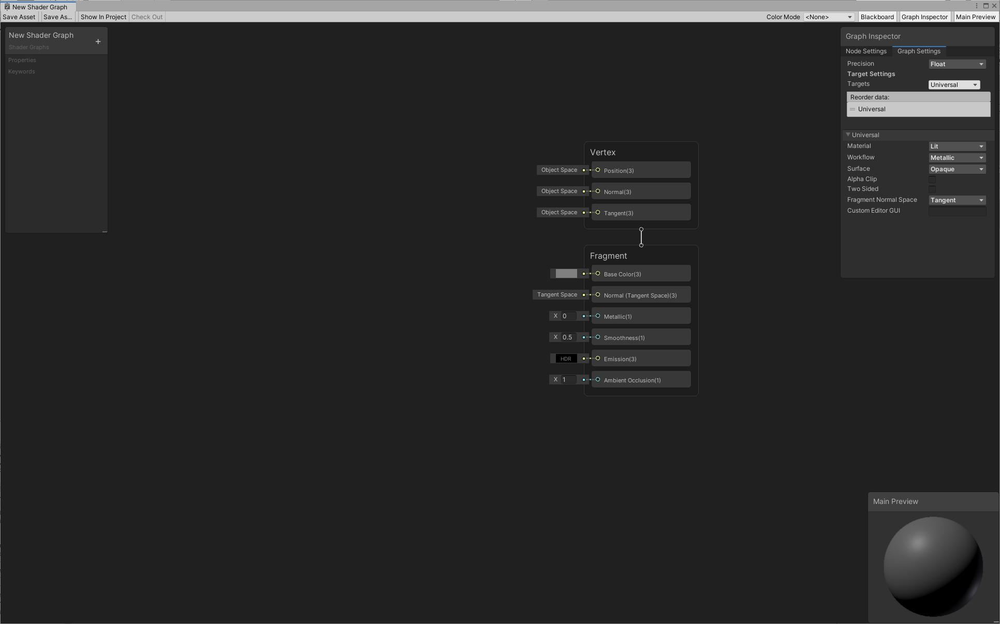
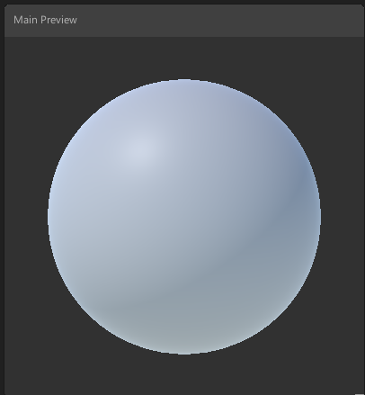
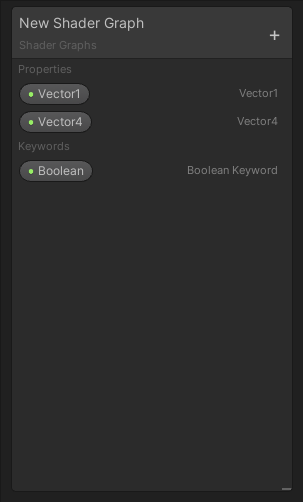
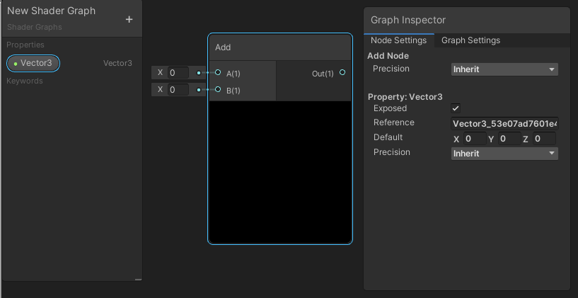

创建新的 Shader Graph 资源
=================================

配置 SRP 后，您可以创建新的 Shader Graph 资源。右键单击 Project 窗口，在上下文菜单中找到 **Create -> Shader**，然后选择所需的 Shader Graph 类型。

可用的 Shader Graph 类型取决于项目中存在的渲染管线。根据渲染管线，某些选项可能存在也可能不存在。

以下选项始终可用：

|  |  |
| --- | --- |
| Blank Shader Graph | 一个完全空白的 Shader Graph。没有选择目标，也没有向主栈添加块。 |
| Sub Graph | 一个空白的子图形资源。 |

每个已安装渲染管线可能会出现子菜单，其中包含标准着色模型（光照、无光照等）的模板栈。

有关提供的选项的完整列表，请参阅[通用渲染管线（URP）](https://docs.unity.cn/cn/Packages-cn/com.unity.render-pipelines.universal@latest) 和 [High Definition Render Pipeline](https://docs.unity.cn/cn/Packages-cn/com.unity.render-pipelines.high-definition@latest) 文档。

对于此示例，URP 已安装，因此创建了 Unversal Lit Shader Graph。

双击新创建的 Shader Graph 资源，在 Shader Graph 窗口中将其打开。

Shader Graph 窗口
-------------------------------------------

Shader Graph 窗口包含 Master Stack（主栈）、Preview 窗口、Blackboard 和 Graph Inspector。

### 主栈

决定着色器输出的最终连接。有关更多信息，请参阅[主栈](Master-Stack.md)。

### Preview 窗口

预览当前着色器输出的区域。在这里，您可以旋转对象，并放大和缩小。您还可以更改预览着色器的基本网格。有关更多信息，请参阅 [Main Preview](Main-Preview.md)。

### Blackboard

该区域在单个视图中汇总所有着色器属性。使用 Blackboard 可对属性进行添加、删除、重命名和重新排序。有关更多信息，请参阅 [Blackboard](Blackboard.md)。

设置项目并熟悉 Shader Graph 窗口后，请参阅[我的第一个 Shader Graph](First-Shader-Graph.md) 了解如何开始的更多信息。

### Internal Inspector

包含与用户当前单击的任何内容关联的信息的区域。这是一个默认情况下自动隐藏的窗口，仅在用户选择可以编辑的内容时才会出现。使用 Internal Inspector 来显示和修改属性、节点选项和图形设置。请参阅 [Internal Inspector](Internal-Inspector.md) 以了解更多信息。

