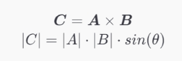

Cross Product 节点
================


描述
--

返回输入 **A** 和输入 **B** 的值的叉积。两个矢量的叉积将得出垂直于两个输入矢量的第三个矢量。
结果的大小等于两个输入的大小相乘，然后再乘以两个输入之间角度的正弦。可以使用"左手规则"确定结果矢量的方向。



端口
--

| 名称 | 方向 | 类型 | 描述 |
| --- | --- | --- | --- |
| A | 输入 | Vector 3 | 第一个输入值 |
| B | 输入 | Vector 3 | 第二个输入值 |
| Out | 输出 | Vector 3 | 输出值 |


生成的代码示例
-------


以下示例代码表示此节点的一种可能结果。


```
void Unity_CrossProduct_float(float3 A, float3 B, out float3 Out)
{
    Out = cross(A, B);
}

```

