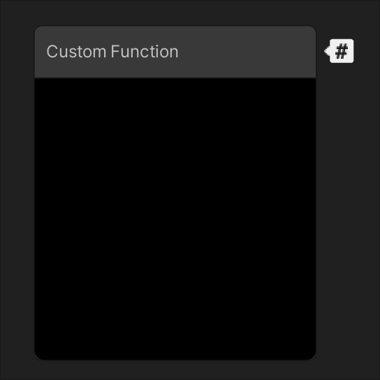
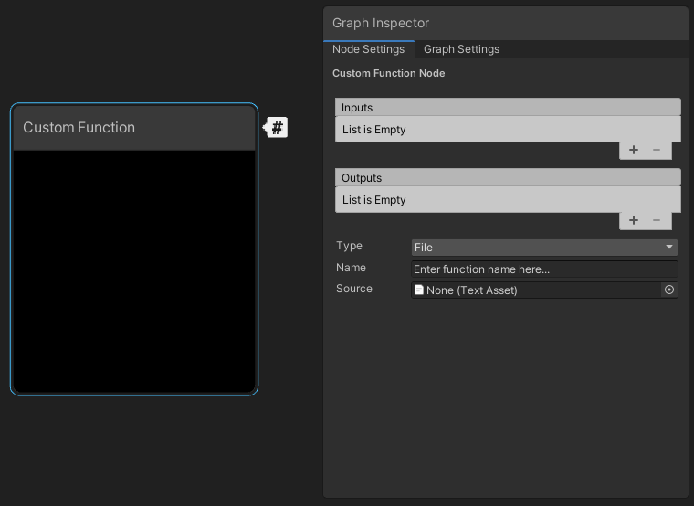
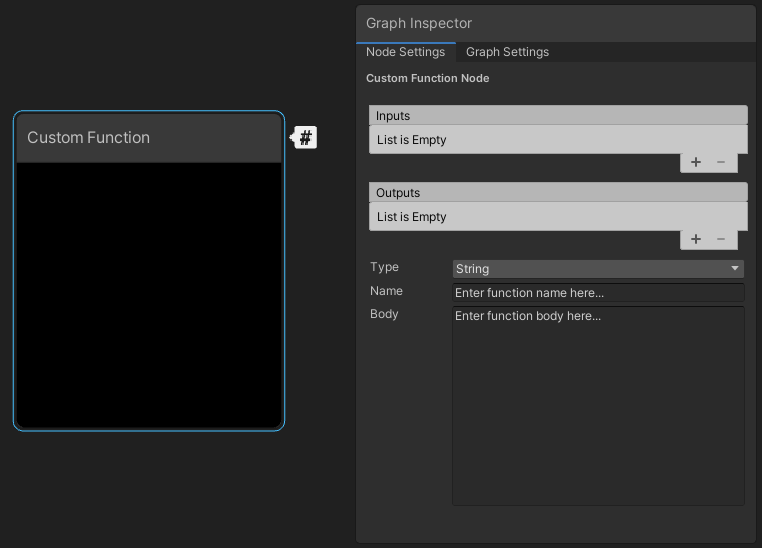
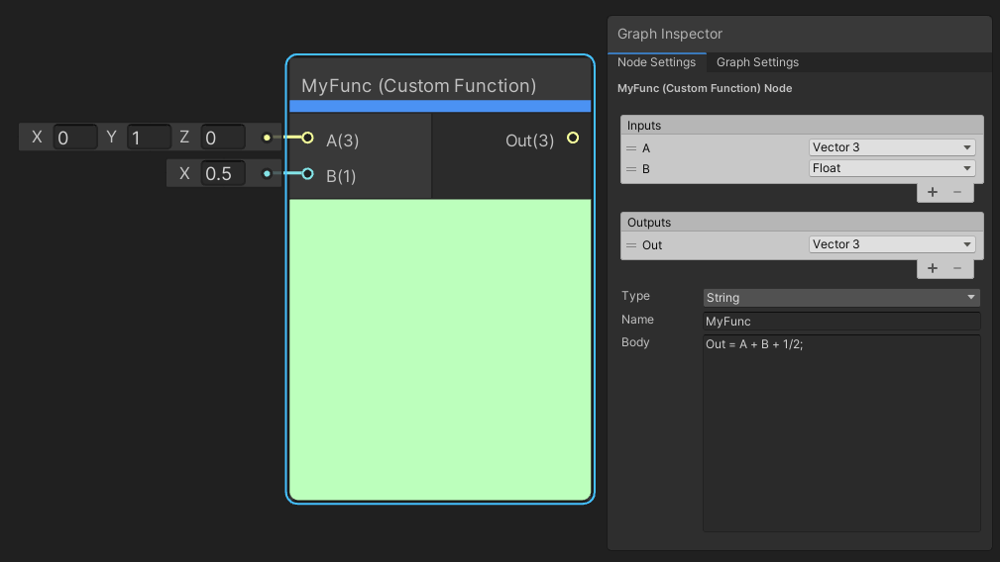
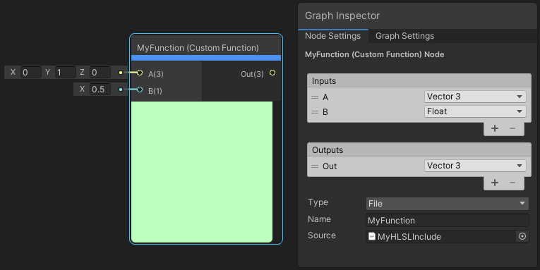
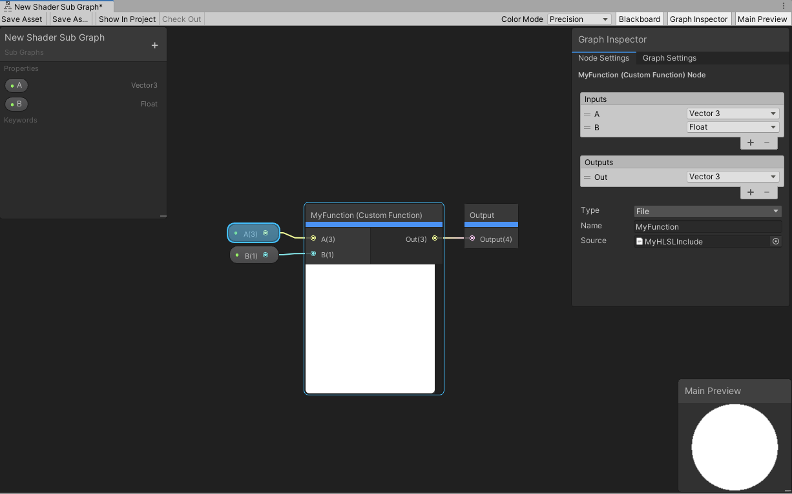

自定义函数节点
=======





描述
--

自定义函数节点用于在 Shader Graph 中注入自定义 HLSL 代码。这样，您可在需要时提供额外的控制级别（例如，进行一些细粒度的优化）。可以使用 string 模式直接将较小的函数写入图形，或者引用外部的 HLSL include 文件。还可以使用 [Custom Port Menu](Custom-Port-Menu.md) 在节点本身上定义自己的输入和输出端口。


如何使用
----

使用 [Create Node Menu](Create-Node-Menu.md) 创建 Custom Function 节点。默认情况下，新的自定义函数节点没有任何输入或输出端口。
在 [Graph Inspector](Internal-Inspector.md) 中，打开 **Node Settings** 访问 Custom Function 和 Custom Port Menu 菜单。


 


### Custom Function Menu

| 菜单项 | 描述 |
| --- | --- |
| Inputs | 用于定义节点输入端口的 [Custom Port Menu](Custom-Port-Menu.md)。 |
| Outputs | 用于定义节点输出端口的 [Custom Port Menu](Custom-Port-Menu.md)。 |
| Type | 函数类型选择器。选择 Choose File 引用外部文件，或选择 string 将函数直接输入节点。 |
| Name | 最终生成的代码中的自定义函数部分名称。后缀为函数类型 `_half` 或 `_float`。 |
| Source | 用于引用外部 HLSL include 文件的资源字段。**仅在 `File` mode** 模式下可用。 |
| Body | 输入 HLSL 代码的文本框。**仅在 `String` 模式下可用**。 |


### 通过字符串定义函数

如果选择 `String` 模式，图形将生成着色器函数。`Name` 字段定义生成的函数的名称，`Body` 字段定义生成的函数的内容。团结引擎将自动处理参数、大括号和缩进范围。在`String` 模式下，可以在 `Body` 字段中使用标记 `$precision` 而不是 `half` 或`float`。在处理节点时，团结引擎将根据该节点的精度将标记替换为正确的类型。





上图中的示例将生成以下函数：


```
void MyFunction_float(float3 A, float B, out float3 Out)
{
    Out  =  A + B + 1/2;
}

```
### 通过文件定义函数


如果选择 `File` 模式，图形将不会自动生成着色器函数。该模式在最终生成的着色器中注入 include 引用，并使用引用文件中的函数。`Name` 字段必须与所要调用的函数的名称匹配。`Source` 字段引用包含该函数的 HLSL 文件。





对自定义函数节点使用 `File` 模式时，必须手动设置函数的格式。为 Shader Graph 创建自定义函数时需要注意的一点是精度后缀。生成的代码会为函数名称附加精度后缀。您的 include 文件函数也必须附加所需的精度后缀（如下面的 `_float` 所示），或者包含多个带有 `_float` 和 `_half` 后缀的函数，但 `Name` 字段**不得包含精度后缀**。

```
//UNITY_SHADER_NO_UPGRADE
# ifndef MYHLSLINCLUDE_INCLUDED
# define MYHLSLINCLUDE_INCLUDED

void MyFunction_float(float3 A, float B, out float3 Out)
{
    Out = A + B;
}
# endif //MYHLSLINCLUDE_INCLUDED

```
`File` 模式在图形中使用自定义函数提供更大的灵活性。可以在函数范围之外定义 uniform 变量，如下面的矩阵所示。


```
//UNITY_SHADER_NO_UPGRADE
# ifndef MYHLSLINCLUDE_INCLUDED
# define MYHLSLINCLUDE_INCLUDED
float4x4 _MyMatrix;
void MyFunction_float(float3 A, float B, out float3 Out)
{
    A = mul(float4(A, 0.0), _MyMatrix).rgb;
Out = A + B;
}
# endif //MYHLSLINCLUDE_INCLUDED

```
可以在同一文件中定义多个函数，然后从引用的函数中调用这些函数。或者，也可以引用同一个文件，但使用不同自定义函数节点中的不同函数。


```
//UNITY_SHADER_NO_UPGRADE
# ifndef MYHLSLINCLUDE_INCLUDED
# define MYHLSLINCLUDE_INCLUDED
float3 MyOtherFunction_float(float3 In)
{
    return In * In;
}

void MyFunction_float(float3 A, float B, out float3 Out)
{
    A = MyOtherFunction_float(A);
    Out = A + B;
}
# endif //MYHLSLINCLUDE_INCLUDED

```
甚至可以包含其他一些包含其他函数的文件。


```
//UNITY_SHADER_NO_UPGRADE
# ifndef MYHLSLINCLUDE_INCLUDED
# define MYHLSLINCLUDE_INCLUDED
# include "Assets/MyOtherInclude.hlsl"
void MyFunction_float(float3 A, float B, out float3 Out)
{
    A = MyOtherFunction_float(A);
    Out = A + B;
}
# endif //MYHLSLINCLUDE_INCLUDED

```
### 重用自定义函数节点


自定义函数节点本身就是一个单节点实例。如果希望重用相同的自定义函数而不重新创建输入、输出和函数引用，请使用[子图形](Sub-graph.md)。子图形会显示在 [Create Node Menu](Create-Node-Menu.md) 菜单中，可以共享或重用自定义函数。





可以直接在子图形中创建自定义函数，也可以右键单击现有的自定义函数节点并选择 `Convert to Sub Graph`。请使用 [Graph Inspector](Internal-Inspector.md) 和 [Custom Port Menu](Custom-Port-Menu.md) 添加相应的输入和输出端口。此后，即可根据需要多次重用自定义函数，甚至在其他子图形中重用。


### 使用纹理线

从版本 10\.3 开始，Shader Graph 有五个新的数据结构，以确保自定义函数节点 (CFN) 和 SubGraph 以一致的方式从纹理线输入和输出数据。新结构还使 SamplerState 可以在 [GLES2](https://en.wikipedia.org/wiki/OpenGL_ES#OpenGL_ES_2.0) 平台进行编译，并通过 `myInputTex.samplerstate`和`myInputTex.texelSize` 访问与纹理关联的数据。


四种结构用于纹理类型，一种用于采样器状态：


* UnityTexture2D
* UnityTexture2DArray
* UnityTexture3D
* UnityTextureCube
* UnitySamplerState


在此更改后，您使用早期版本的 Shader Graph 创建的 CFN 可以继续使用。作为自动更新的一部分，团结引擎将它们转换为新的 **Bare** 节点类型。此类型复制了旧的输入和输出行为。所有其他类型则会传递新结构。


但是，您应该手动升级生成纹理或采样器状态输出类型的 CFN，以确保它们的行为一致，并获得新设计的好处。在 10\.3 或更高版本中打开 Shader Graph 时，团结引擎会用警告标记这类过时的自定义函数节点。


#### 如何升级


1. 将所有输入和输出类型从 **Bare** 改为 **non\-Bare**。
    * **String** 类型：确保您的 HLSL 字符串已经使用了团结引擎的纹理访问宏（例如`SAMPLE_TEXTURE 2D`）。
    * **File** 类型：在函数参数中用新的结构类型（如 UnityTexture2D）替换 Bare 类型（如 Texture2D）。

2. 如果您的 HLSL 代码使用特定于平台或非标准的纹理操作，则需要转换访问纹理的方式方可使用该结构。例如，`myInputTex.GetDimensions (...)` 会变成 `myInputTex.tex.GetDimensions (...)`


从版本 10\.3 开始，您可以通过 `myInputTex.samplerstate` 和 `myInputTex.texelSize` 访问与纹理关联的数据。