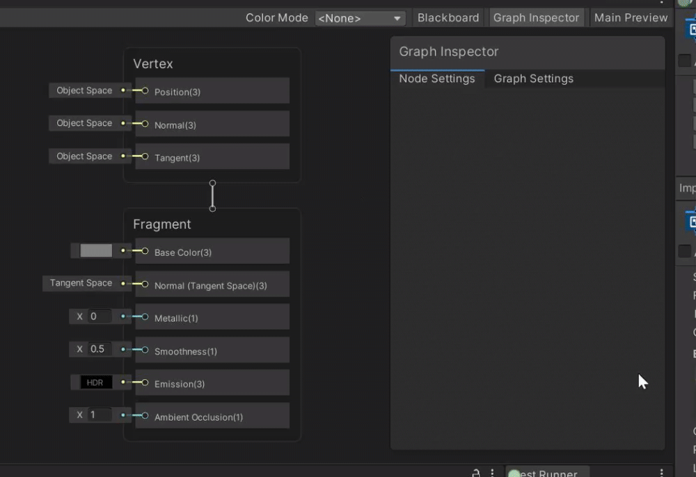
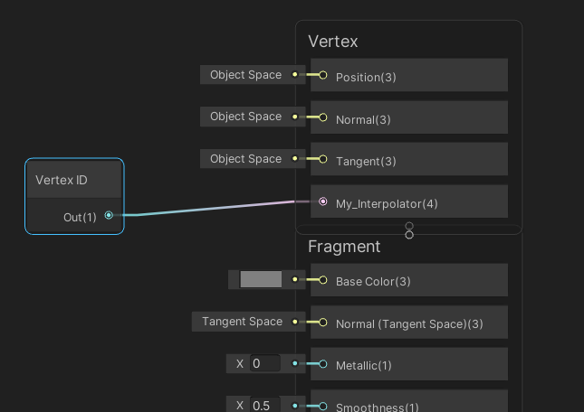
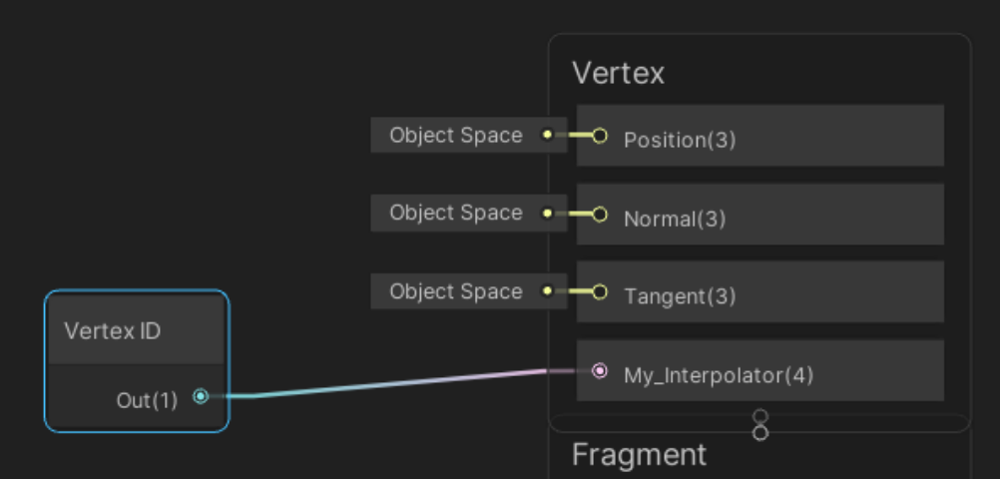
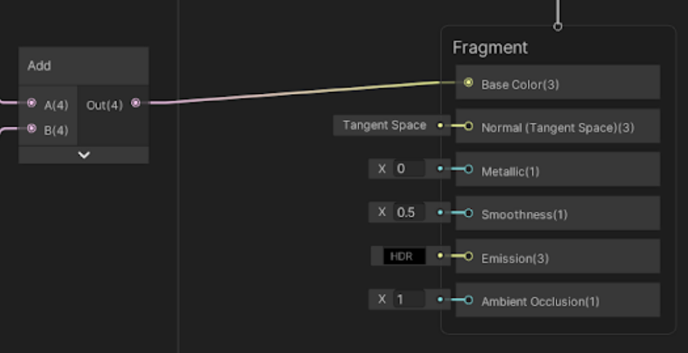

自定义插值器
====================

描述
---------------------------

自定义插值器功能（Custom Interpolator）为 Shader Graph 提供精细控制，使其能够在从顶点阶段传递数据到像素阶段的过程中执行特定的计算。

自定义插值器主要适用于以下两类用户：

*   设置环境的技术总监和首席技术美术。
*   帮助美术优化内容性能的图形程序员。

支持的数据类型
---------------------------------------------

自定义插值器支持 `float`、`vec2`、`vec3` 和 `vec4` 数据类型。

通道限制
---------------------------------

自定义插值器最多支持 32 个通道。每个通道等同于四个 float，每个 float 是一个插值变量。不同的平台和 GPU 的插值变量限制各不相同，超出目标平台的插值器限制会导致着色器编译失败。有关常见接口支持的插值器数量的详细信息，请参阅 [Shader 语义](https://docs.unity.cn/cn/tuanjiemanual/Manual/SL-ShaderSemantics.html)，并查看 **插值器数量限制**部分。在目标配置上测试您的自定义插值器，以确保内容正确编译。技术总监可以设置警告和错误，帮助团队成员避免创建超出目标管线、平台或 GPU 支持的通道数量的图形。请参阅下文中的 **创建通道警告和错误**部分。

使用方法
-------------------------

要使用此功能，请在 Master Stack 的顶点上下文中创建自定义插值器块，并设置名称和数据类型。创建顶点节点，将数据写入插值器。然后在图形中使用该插值器，并将图形连接到片段上下文中的相关块。这些说明包含了一个上下文示例，演示了如何使用自定义插值器从纹理获取每个顶点的数据。要了解如何在内置渲染管线中使用 HLSL 实现此行为，请参阅 [Shader 语义](https://docs.unity.cn/cn/tuanjiemanual/Manual/SL-ShaderSemantics.html) 并查看 **顶点 ID：SV\_VertexID** 部分。

### 创建通道警告和错误

在 Shader Graph 中无法限制用户创建通道的数量，但可以创建警报通知用户接近或超出特定通道数量。**警告阈值（Warning Threshold）** 会通知用户即将达到通道限制，而**错误阈值（Error Threshold）** 则在用户达到或超过限制时进行提醒。**警告阈值**的值必须在 8 到 32 通道之间。**错误阈值**的值必须高于**警告阈值**，且至少为 8 通道。要配置这些参数，请在编辑器的 [项目设置](https://docs.unity.cn/cn/tuanjiemanual/Manual/comp-ManagerGroup.html)菜单中打开**自定义插值器通道设置（Custom Interpolator Channel Settings）**。

### 在 Master Stack 中添加自定义插值器块

 

1.  在**顶点**上下文中右键单击以创建块节点。
2.  选择 **Custom Interpolator**（自定义插值器）。
3.  选择数据类型。
4.  为此插值器输入名称。

示例中使用了 Vector 4（vec4）数据类型。

### 向插值器写入数据

1.  在图形中右键单击以创建节点。
2.  选择 **Vertex ID** 类型。
3.  将此节点连接到自定义插值器块。

在示例中，将图形中的 Vertex ID 值写入自定义插值器。

### 从插值器读取数据

1.  在图形中右键单击以创建节点。
2.  选择 **Custom Interpolator**（自定义插值器）。
3.  将自定义插值器节点连接到片段上下文中的相关块。

在此示例中，将 Vertex ID 传递给**基础颜色**块，从顶点着色器传递到片段着色器并用作颜色输出。

### 从 Master Stack 中删除块

如果删除关联着图形中节点的自定义插值器，团结引擎会显示警告。如果想继续使用这些节点，可以创建一个新的自定义插值器并将其关联以防止出现警报。