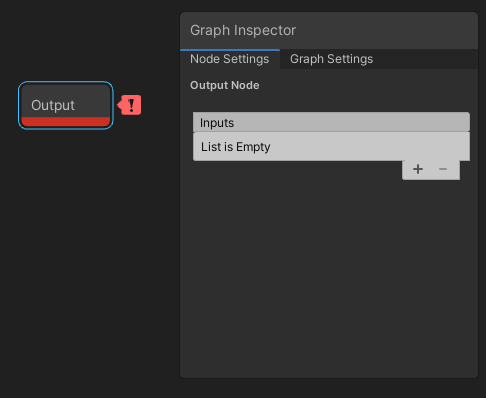
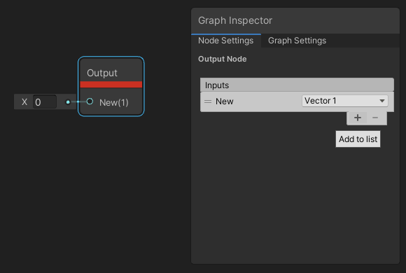
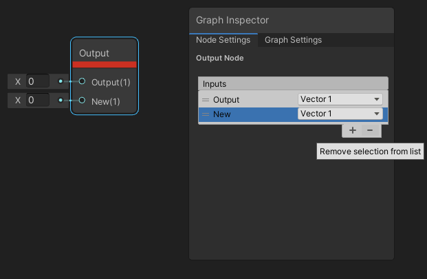
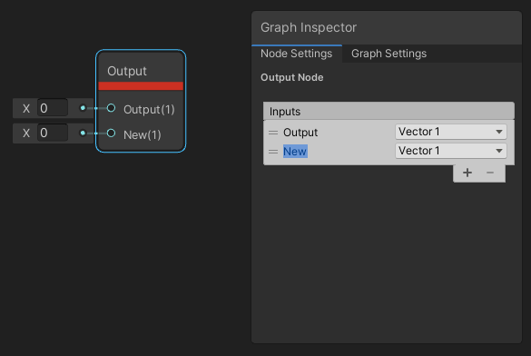
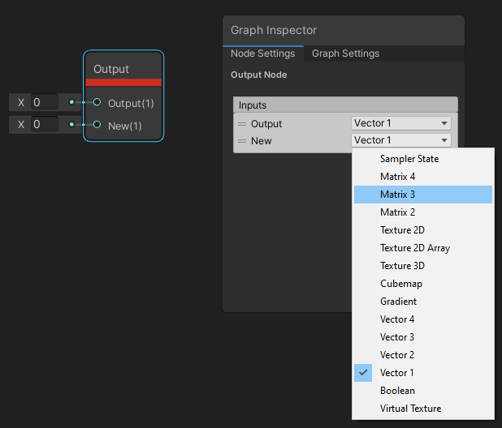

Custom Port 菜单
==============

描述
--

Custom [Port](Port.md) 菜单显示在 [Graph Inspector](Internal-Inspector.md) 的 **Node Settings** 选项卡中，可通过单击[自定义函数节点](Custom-Function-Node.md)和 [子图形](Sub-graph.md) 输出节点打开。此菜单可用于添加、删除、重命名、重新排序和定义自定义输入和输出端口的类型。

如何使用
----

选择[自定义函数节点](Custom-Function-Node.md)或者[子图形](Sub-graph.md)输出节点，在 Inspector 中查看 Custom Port 菜单。要关闭菜单，请单击图形中的任意位置或另一个图形元素。

### 添加和删除端口

要添加端口，请单击端口列表右下角的 `+` 图标。

要删除端口，请使用左侧的汉堡图标选择一个端口，然后单击端口列表右下角的 `-` 图标。

### 重命名端口

要重命名端口，请双击端口的文本字段并输入新名称。目前，只有以下字符对端口名称有效：A\-Z、a\-z、0\-9、 \_、( ) 和空格。如果名称包含无效字符，则会出现错误标示。

### 对端口重新排序

要对端口重新排序，请单击并按住左侧的汉堡图标，然后将端口拖动到列表中所需的位置。

### 更改端口类型

要更改端口类型，请使用右侧的 Type 下拉菜单。请参阅[数据类型页面](Data-Types.md)以查看当前有效端口类型的列表。

