我的第一个 Shader Graph
=====================

在开始之前，请确保您的项目设置正确，并且图形加载正确。有关更多信息，请参阅[开始使用 Shader Graph](Getting-Started.md)。

创建新的图形
-----------------------------------------

使用 Project Browser 在您的项目中创建一个新的 [Shader Graph 资源](Shader-Graph-Asset.md)。**Create -> Shaders** 将显示各种创建选项。

**Blank Shader Graph** 将创建一个未选择活动目标 或 [Block 节点](Block-Node.md) 的 Shader Graph。您需要通过 [Graph Settings 菜单](Graph-Settings-Tab.md)选择一个目标后继续操作。

某些集成（如渲染管线）也可以为 Shader Graph 提供预配置的选项。例如，**Universal -> Lit** 创建并打开一个 Shader Graph。

创建新的节点
---------------------------------------

使用 **Create Node** 菜单创建新的节点。打开菜单有两种方式：
1. 右键单击，然后从上下文菜单中选择 **Create Node**。
2. 按空格键。

在菜单中，您可以在搜索栏中键入内容查找特定节点，或浏览库中的所有节点。在本例中，我们将创建一个 Color 节点。首先，在 **Create Node** 菜单的搜索栏中输入 "color"。然后，单击 **Color** 或突出显示 **Color**，然后按 Enter 创建一个 Color 节点。

[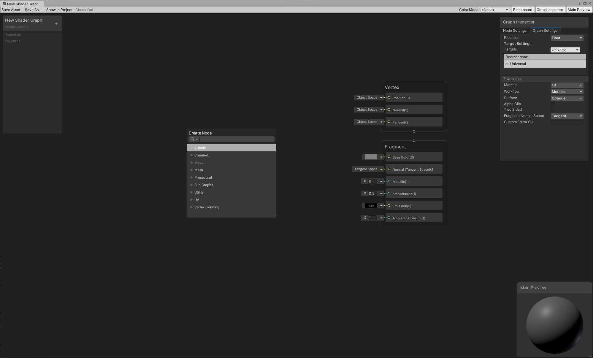](images/MyFirstShaderGraph_01.png)

连接节点
-------------------------------

要构建图形，需要将节点连接在一起。为此，请单击一个节点的 **Output Slot**，然后将该连接拖到另一个节点的 **Input Slot**。

首先，将 Color 节点连接到 Fragment Stack 的 **Base Color** 块。

[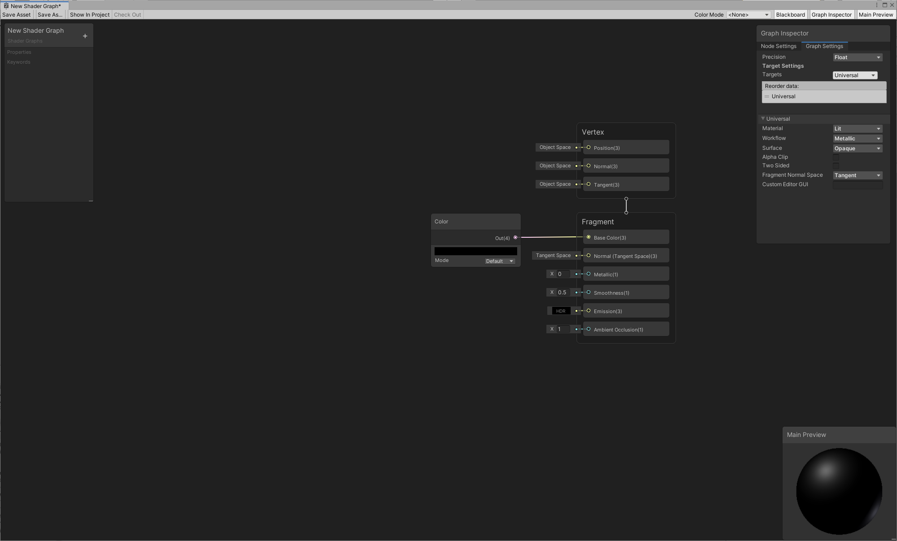](images/MyFirstShaderGraph_02.png)

修改节点输出
-----------------------------------------
节点的连接会更新主预览，**Main Preview** 中的三维对象现在是黑色的，这是在颜色节点中指定的颜色。您可以单击该节点中的颜色条，使用颜色选择器更改颜色。您在该节点上所做的任何更改都会实时更新 **Main Preview** 中的对象。

例如，如果您选择红色，三维对象就会立即反映出这一变化。

[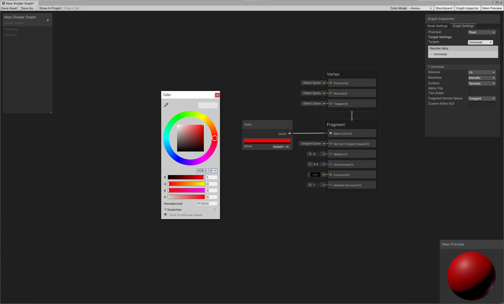](images/MyFirstShaderGraph_03.png)

保存图形
---------------------------------

目前，Shader Graphs 不会自动保存。有两种方法可以保存更改：

1. 单击窗口左上角的 **Save Asset** 按钮。
2. 关闭图形。如果团结引擎检测到任何未保存的更改，则会出现一个弹出窗口，询问您是否要保存这些更改。

[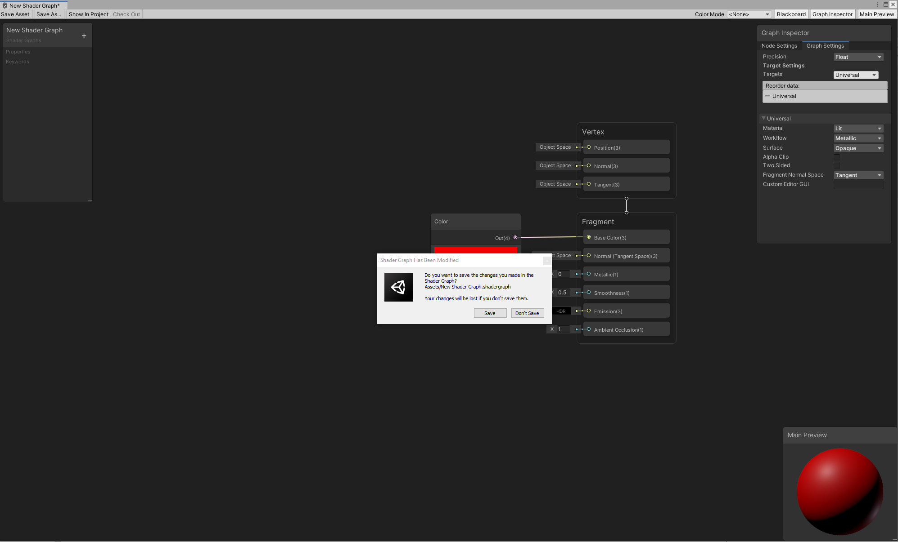](images/MyFirstShaderGraph_04.png)

创建材质
---------------------------------------
保存图形后，使用着色器创建新的材质。[创建新材质](https://docs.unity.cn/cn/tuanjiemanual/Manual/Materials.html)的过程以及为其分配一个 Shader Graph 着色器的操作与常规着色器相同。在主菜单或 Project View 上下文菜单中，选择 **Assets -> Create -> Material**。选择您刚刚创建的材质。在其 Inspector 窗口中，选择 **Shader** 下拉菜单，单击 Shader Graphs，然后选择要应用于该材质的 **Shader Graph** 着色器。

您也可以右键单击 Shader Graph 着色器，然后选择 **Create -> Material**。此方法会自动将该 Shader Graph 着色器分配给新创建的材质。

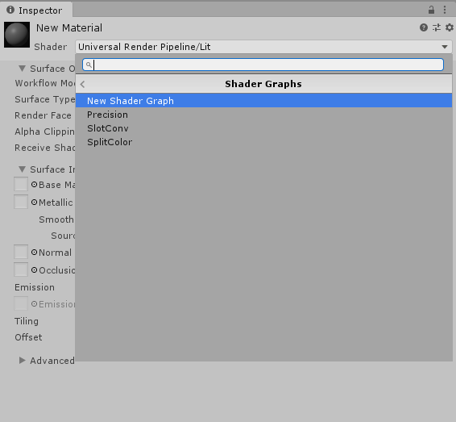

材质也会作为 Shader Graph 的子集自动生成。您可以将其直接分配给场景中的对象。从 Shader Graph 的 Blackboard 修改属性将实时更新该材质，以便在场景中快速实现可视化。

将材质放入场景中
---------------------------------------------------------------

现在您已将着色器分配给材质，可以将其应用于场景中的对象。将材质拖放到场景中的对象上。或者，在对象的 Inspector 窗口中，找到 **Mesh Renderer -> Materials**，并将材质应用到 **Element**。

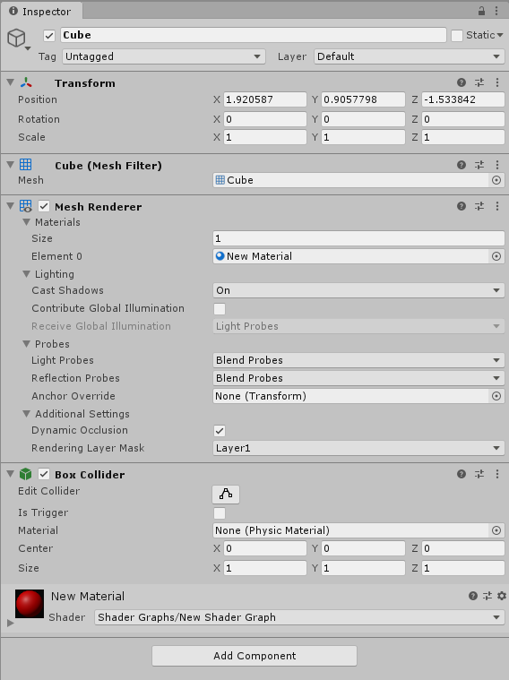

使用属性编辑图形
---------------------------------------------------------------------

您还可以使用属性来更改着色器的外观。属性是材质的 Inspector 中可见的选项，让其他人无需打开 Shader Graph 即可更改着色器中的设置。

要创建新属性，请使用 Blackboard 右上角的**添加 (+)** 按钮，然后选择要创建的属性类型。在本例中，我们将选择 **Color**。

[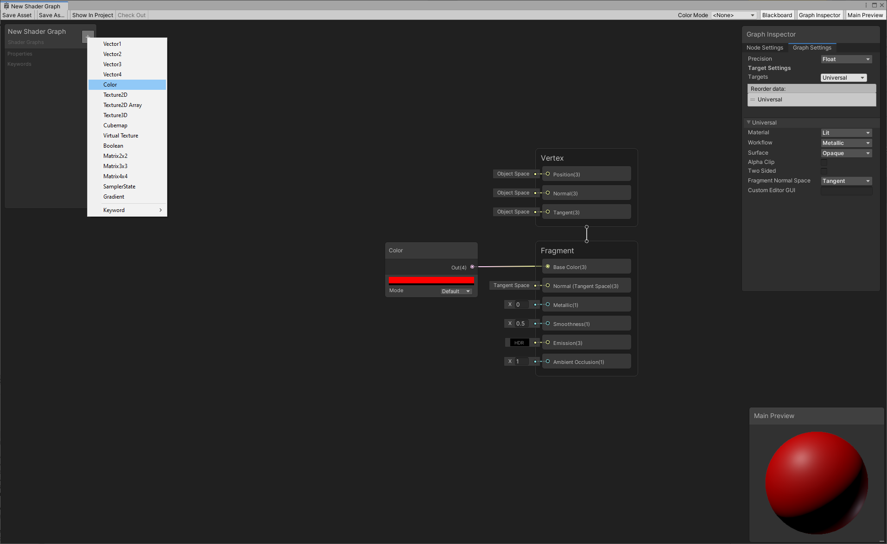](images/MyFirstShaderGraph_07.png)

这会在 Blackboard 中添加一个新属性，在选中该属性时，[Graph Inspector](Internal-Inspector.md)  的 **Node Settings** 选项卡列出以下选项。

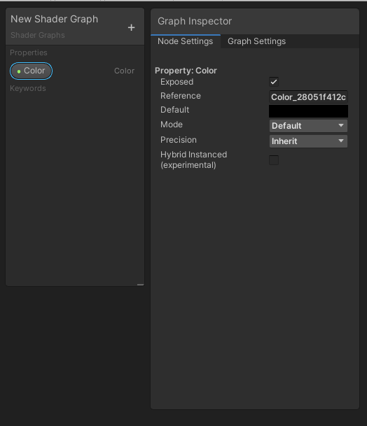

| **选项** | **描述** |
| --- | --- |
| **属性按钮** | 要更改属性的名称，右键单击 Blackboard 中的按钮，选择 **Rename**，然后输入新的属性名称。要删除该属性，右键单击该按钮，然后选择 **Delete**。 |
| **Exposed** | 启用此复选框可使该属性在材质的 Inspector 中可见。 |
| **Reference** | 出现在 C# 脚本中的属性的名称。要更改 **Reference** 名称，输入一个新字符串。 |
| **Default** | 属性的默认值。 |
| **Mode** | 属性的模式。每个属性都有不同的模式。对于 **Color**，您可以选择 **Default** 或者 **HDR**。 |
| **Precision** | 属性的默认[精度](Precision-Modes.md)。 |
| **Hybrid Instanced** | 一项实验性功能，可在使用 Hybrid DOTS 渲染器时实例化此属性。 |

有两种方法可以在图形中引用属性：
1. 将该属性从 Blackboard 拖到图形上。
2. 右键单击，然后选择 **Create Node**。该属性在 **Properties** 类别中列出。

[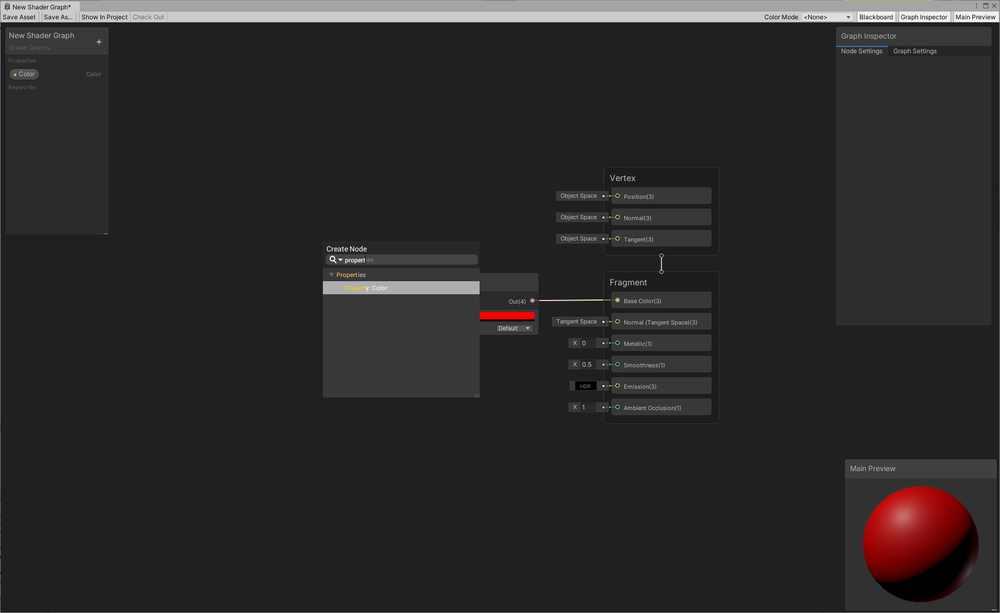](images/MyFirstShaderGraph_09.png)

尝试将属性连接到 **Base Color** 块。对象立即变为黑色。

[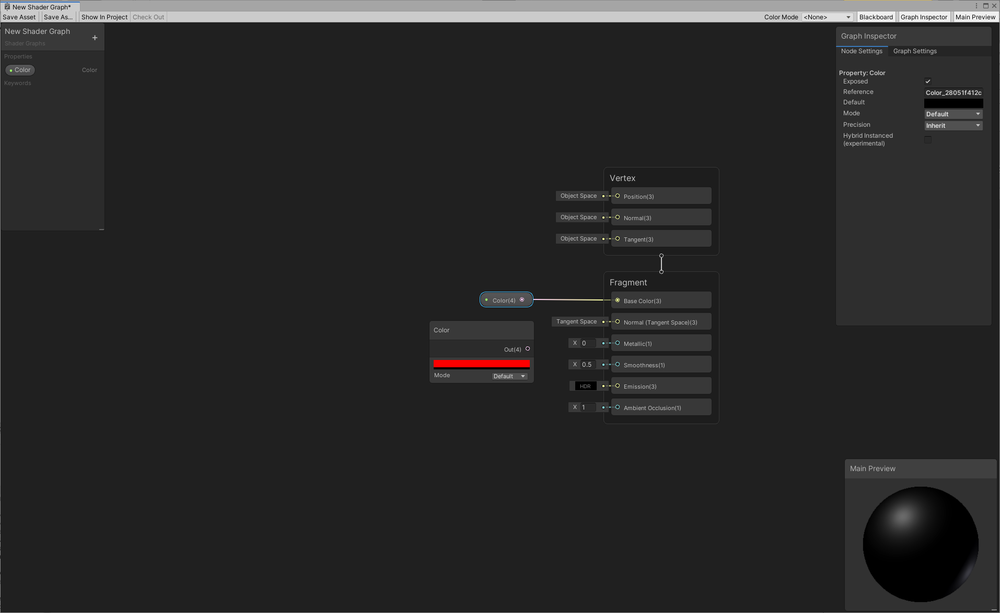](images/MyFirstShaderGraph_10.png)

保存您的图形，然后返回到材质的 Inspector。这些属性将显示在 Inspector 中。您对 Inspector 中的属性所做的任何更改都会影响使用此材质的所有对象。

[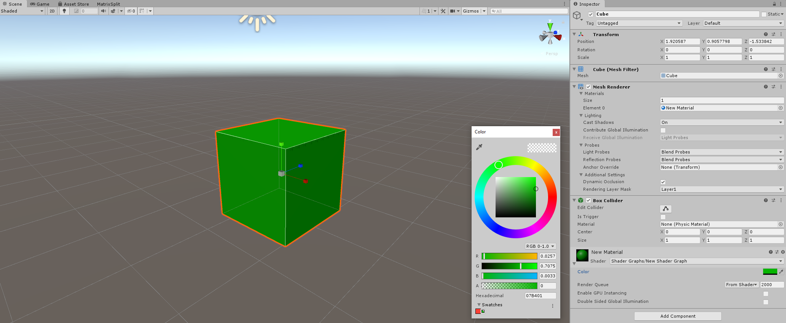](images/MyFirstShaderGraph_11.png)

## 实现模块化结构

**Local Variable** 用于优化 Shader Graph 的节点结构，增强可读性，提升用户体验。详情请参考[局部变量 Local Variable](./LocalVariable.md)。

您可以右击对应连线后，选择 **Add Portal Nodes**，团结引擎将自动生成对应的 [Local Variable Register](./Local-Variable-Register-Node.md) 和 [Get Local Variable](./Get-Local-Variable-Node.md) 节点。这一功能突破了 Shader Graph 原有的网格化编辑局限，大幅提高了可读性和模块化灵活性，使开发者能够更高效地构建复杂的 Shader 结构。

更多教程
---------------------------------

较旧的教程使用带有主节点的过时 Shader Graph 格式。使用较旧的教程时，请参考[升级指南](Upgrade-Guide-10-0-x.md)，了解如何将 master node 转换为 [Master Stack](Master-Stack.md)。

要继续探索如何使用 Shader Graph 创作着色器，请查看以下博客文章：

*   [移动艺术：使用 Shader Graph 创建动画材质](https://blogs.unity3d.com/2018/10/05/art-that-moves-creating-animated-materials-with-shader-graph/)
*   [Shader Graph 更新和一个示例项目](https://blogs.unity3d.com/2018/08/07/shader-graph-updates-and-sample-project/)
*   [Shader Graph 中的自定义光照：使用 Unity 2019 扩展图形](https://blogs.unity3d.com/2019/07/31/custom-lighting-in-shader-graph-expanding-your-graphs-in-2019/)
*   [Unity 2018.3 Shader Graph 更新：光照主节点](https://blogs.unity3d.com/2018/12/19/unity-2018-3-shader-graph-update-lit-master-node/)
*   [使用 Shader Graph 创建交互式顶点效果](https://blogs.unity3d.com/2019/02/12/creating-an-interactive-vertex-effect-using-shader-graph/)
*   [Shader Graph 简介：使用可视化编辑器构建着色器](https://blogs.unity3d.com/2018/02/27/introduction-to-shader-graph-build-your-shaders-with-a-visual-editor/)

您还可以访问 [Unity YouTube Channel](https://www.youtube.com/channel/UCG08EqOAXJk_YXPDsAvReSg) 并查找 [Shader Graph 视频教程](https://www.youtube.com/user/Unity3D/search?query=shader+graph)，或前往我们的[用户论坛](https://developer.unity.cn/ask?tab=hot&q=ShaderGraph)查找有关 Shader Graph 的最新信息和对话。