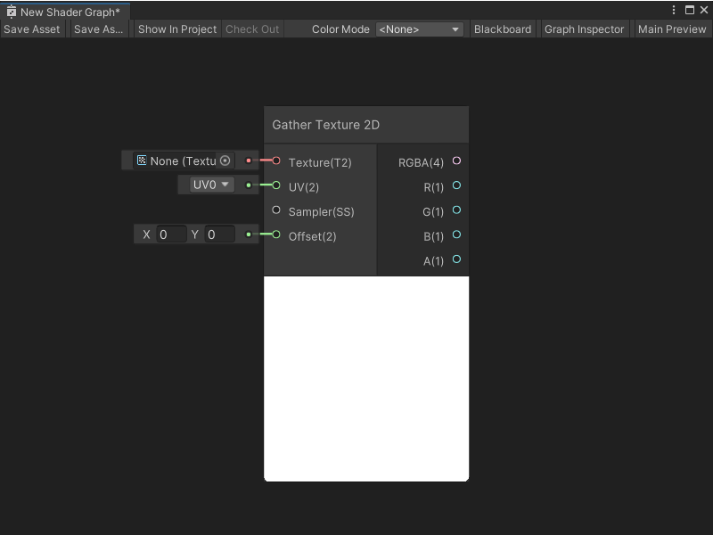
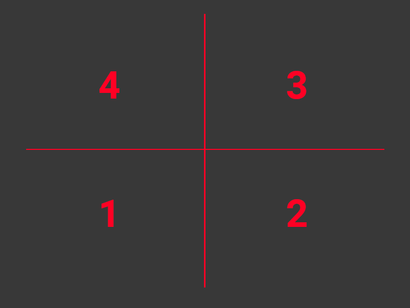
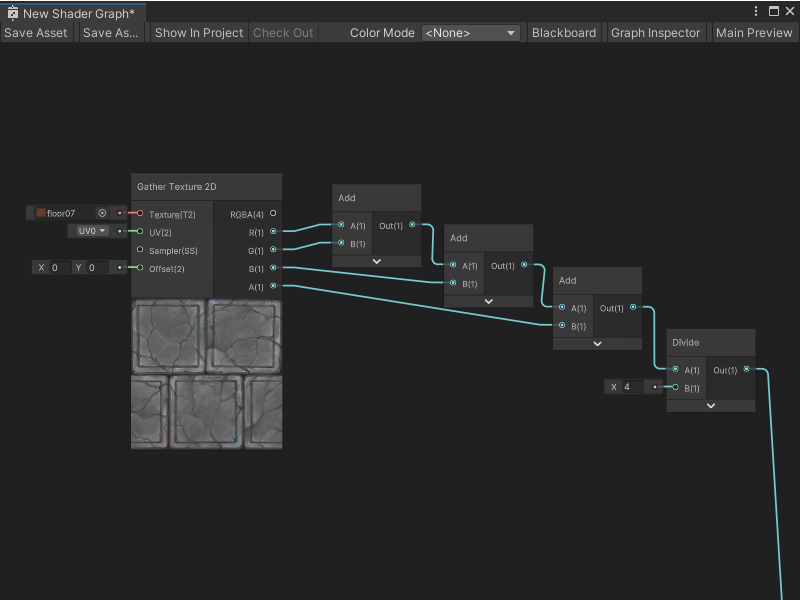
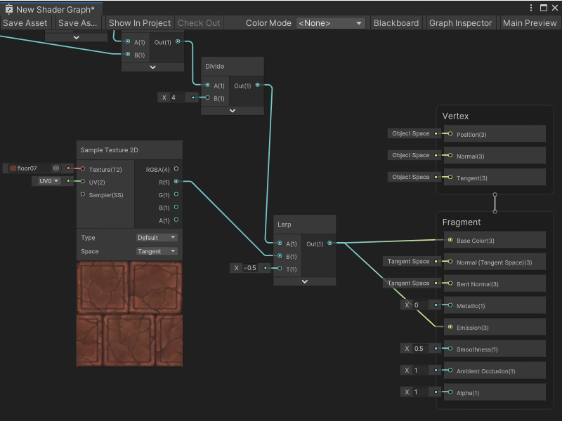
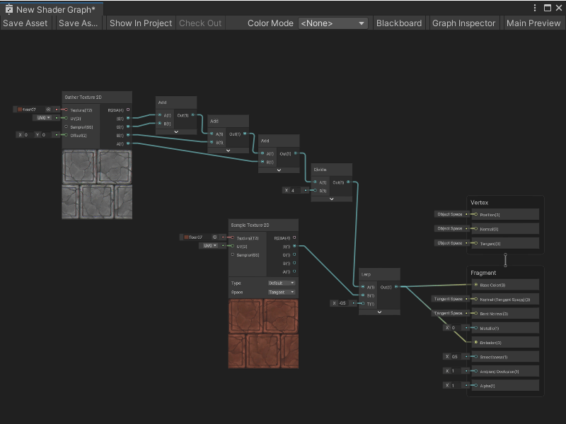

Gather Texture 2D 节点
======================

Gather Texture 2D 节点从采样点周围的四个相邻像素中采样红色通道，并返回 `RRRR` 值，每个 `R` 值来自不同的相邻像素。通常的纹理采样会读取纹理的所有四个通道 (RGBA)。

该节点适用于需要在像素之间修改双线性插值的情况，例如创建自定义混合效果。

此节点使用 [Gather](https://docs.microsoft.com/en-us/windows/win32/direct3dhlsl/dx-graphics-hlsl-to-gather) HLSL 内置函数。如果平台不支持此函数，Shader Graph 会使用适当的近似方法。

> [!NOTE]
> 在使用 Metal 图形 API 时，当从 2D 纹理中采样或采集时，`sample`、`sample_compare`、`gather` 和 `gather_compare` 内置函数需要使用整数 (int2) 类型的 `offset` 参数。该值在查找像素前应用于纹理坐标，`offset` 值必须在 `-8` 到 `+7` 范围内，否则 Metal API 会将 `offset` 值截断到此范围。

Gather Texture 2D 节点采样的像素始终来自纹理的顶级 mip 层，在采样点周围的 2×2 像素块中采集，不进行 2×2 区域的混合，而是按逆时针顺序返回采样像素，采样顺序从查询位置的左下方开始：

创建节点菜单类别
-------------------------------------------------------

在创建节点菜单中，Gather Texture 2D 节点位于 **Input > Texture** 类别下。

兼容性
-------------------------------

Gather Texture 2D 节点支持以下渲染管线：

| **内置渲染管线** | **通用渲染管线 (URP)** | **高清渲染管线 (HDRP)** |
| --- | --- | --- |
| 支持 | 支持 | 支持 |

Gather Texture 2D 节点只能连接到 **片元** 上下文中的 Block 节点。有关 Block 节点和上下文的更多信息，请参见 [主栈](Master-Stack.md)。

输入
-----------------

Gather Texture 2D 节点具有以下输入端口：

| **名称** | **类型** | **绑定** | **描述** |
| --- | --- | --- | --- |
| 纹理 | 2D 纹理 | 无 | 要采样的纹理。 |
| UV | Vector 2 | UV | 用于采样的 UV 坐标。 |
| 采样器 | SamplerState | 无 | 用于采样的采样器状态及其相应设置。 |
| 偏移 | Vector 2 | 无 | 应用于采样 UV 坐标的像素偏移量。**偏移**值以像素为单位，而非 UV 空间。 |

输出
-------------------

Gather Texture 2D 节点具有以下输出端口：

| **名称** | **类型** | **描述** |
| --- | --- | --- |
| RGBA | Vector 4 | 采样值，即给定采样位置的四个相邻像素的红色通道值。 |
| R | Float | 第一个相邻像素的红色通道。 |
| G | Float | 第二个相邻像素的红色通道。 |
| B | Float | 第三个相邻像素的红色通道。 |
| A | Float | 第四个相邻像素的红色通道。 |

示例图表用法
-------------------------------------------

在以下示例中，Gather Texture 2D 节点通过平均其四个采样值来创建纹理的模糊版本：

随后，Shader Graph 使用 Sample Texture 2D 节点再次采样纹理，并使用 Lerp 节点来决定何时使用模糊纹理，何时使用普通纹理：

通过更改 Lerp 节点的 T 端口提供的值，可以在 Shader Graph 中调整纹理的模糊或锐化效果：

相关节点
-------------------------------

以下节点与 Gather Texture 2D 节点相关或类似：

*   [Sample Texture 2D 节点](Sample-Texture-2D-Node.md)
*   [Sample Texture 2D LOD 节点](Sample-Texture-2D-LOD-Node.md)
*   [Sampler State 节点](Sampler-State-Node.md)
*   [Texture 2D Asset 节点](Texture-2D-Asset-Node.md)