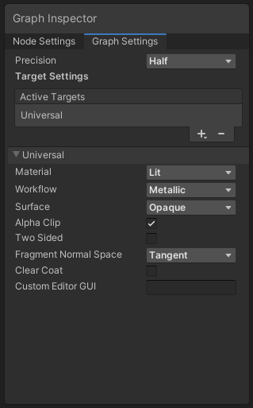

* [手册](https://docs.unity3d.com/cn/Packages/com.unity.shadergraph@10.5/manual/index)
* [开始使用 Shader Graph](https://docs.unity3d.com/cn/Packages/com.unity.shadergraph@10.5/manual/Getting-Started)
* [Graph Settings 菜单](https://docs.unity3d.com/cn/Packages/com.unity.shadergraph@10.5/manual/Graph-Settings-Menu)

Graph Settings 菜单
=================

描述
--

**Graph Inspector** 上的 **[Graph Settings](Internal-Inspector)** 选项卡用于更改影响整个 Shader Graph 的设置。单击 **Graph Inspector** 上的 **Graph Settings** 选项卡以显示设置。如果未看到 **Graph Inspector**，单击 [Shader Graph 标题栏](Shader-Graph-Window)上的 **Graph Inspector** 按钮使其出现。

### Graph Settings 菜单

| 菜单项 | 描述 |
| --- | --- |
| Precision | 一种[精度类型](Precision-Types)下拉菜单，用于设置整个图形的精度。 |
| Active Targets | 包含选择的 Target 的列表。可以使用添加 (\+) 和删除 (\-) 按钮添加或删除条目。 |

特定于 Target 的设置显示在标准设置选项下方。特定于 Target 的设置内容根据选择的 Target 而变化。

