输入节点
====

基本 Basic
--

| [Boolean](Boolean-Node.md) | [Color](Color-Node.md) |
| --- | --- |
| 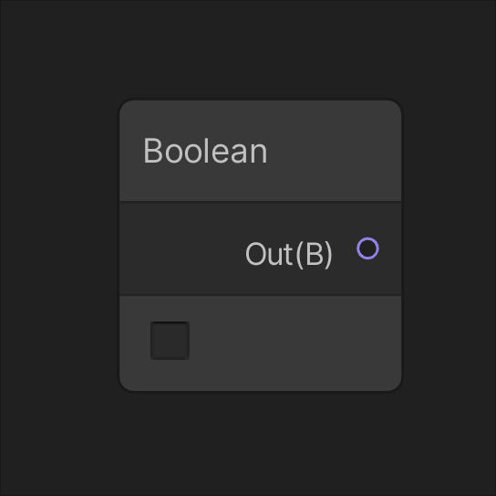 | 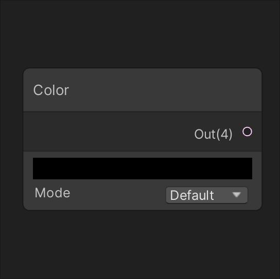 |
| 在着色器中定义一个常量布尔值。 | 使用 Color 字段在着色器中定义一个常量 Vector 4 值。 |
| [**Constant**](Constant-Node.md) | [**Integer**](Integer-Node.md) |
| 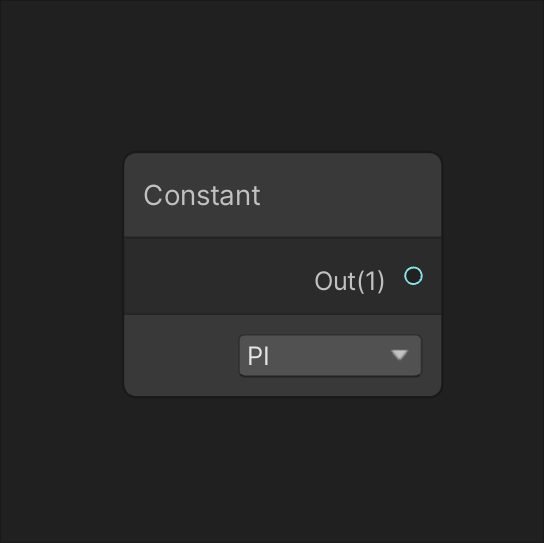 | 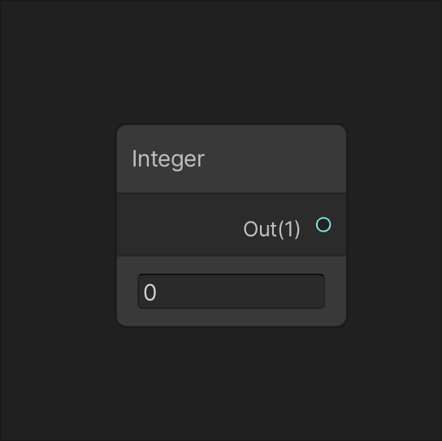 |
| 在着色器中定义一个 Float 数学常量值。 | 使用 Integer 字段在着色器中定义一个常量 Float 值。 |
| [**Slider**](Slider-Node.md) | [**Time**](Time-Node.md) |
| 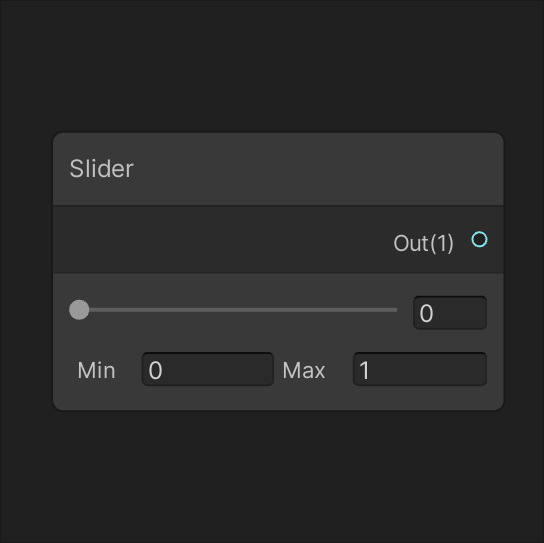 | 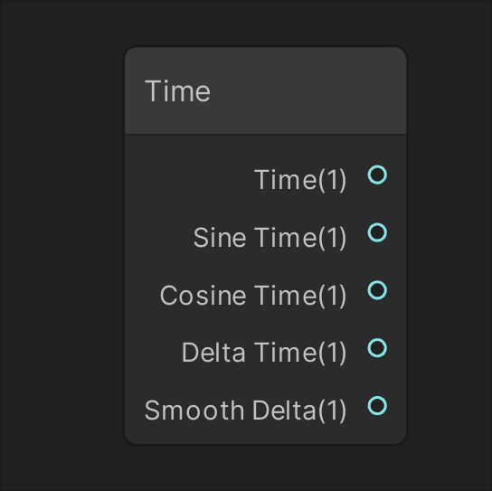 |
| 使用 Slider 字段在着色器中定义一个常量 Float 值。 | 允许访问着色器中的各种 Time 参数。 |
| [**Float**](Float.md) | [**Vector 2**](Vector-2-Node.md) |
| 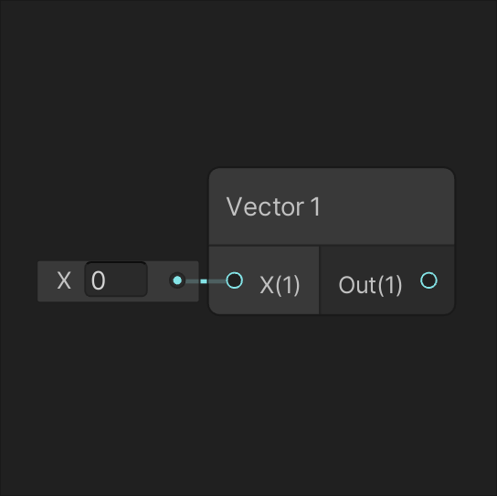 | 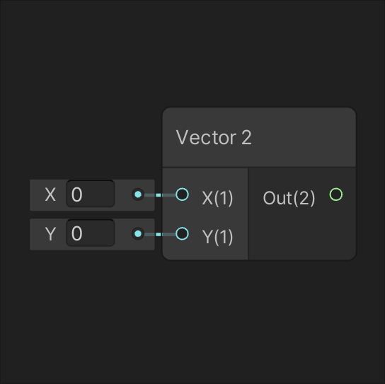 |
| 在着色器中定义一个 Float 值。 | 在着色器中定义一个 Vector 2 值。 |
| [**Vector 3**](Vector-3-Node.md) | [**Vector 4**](Vector-4-Node.md) |
| 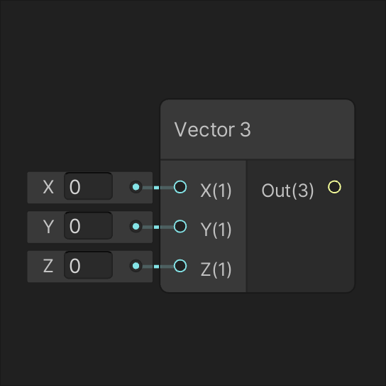 | 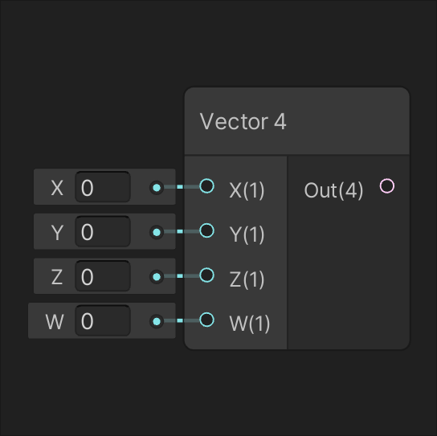 |
| 在着色器中定义一个 Vector 3 值。 | 在着色器中定义一个 Vector 4 值。 |

几何 Geometry
--

| [Bitangent Vector](Bitangent-Vector-Node.md) | [Normal Vector](Normal-Vector-Node.md) |
| --- | --- |
| 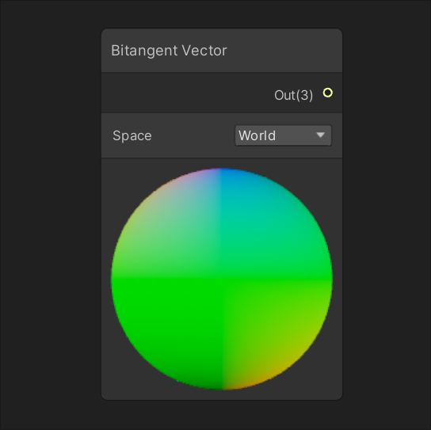 | 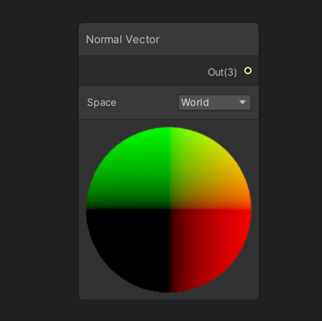 |
| 允许访问网格顶点或片元的副切线矢量。 | 允许访问网格顶点或片元的法线矢量。 |
| [**Position**](Position-Node.md) | [**Screen Position**](Screen-Position-Node.md) |
| 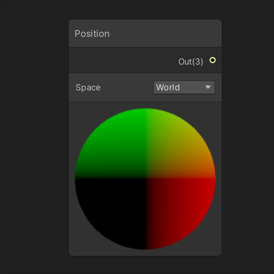 | 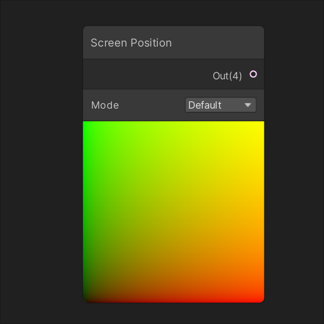 |
| 允许访问网格顶点或片元的位置。 | 允许访问网格顶点或片元的屏幕位置。 |
| [**Tangent Vector**](Tangent-Vector-Node.md) | [**UV**](UV-Node.md) |
| 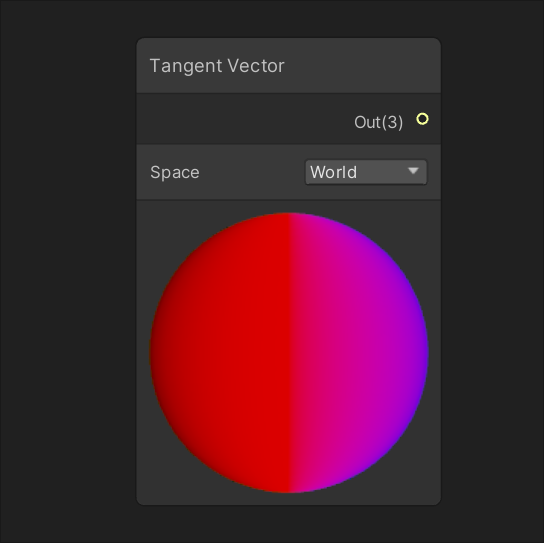 | 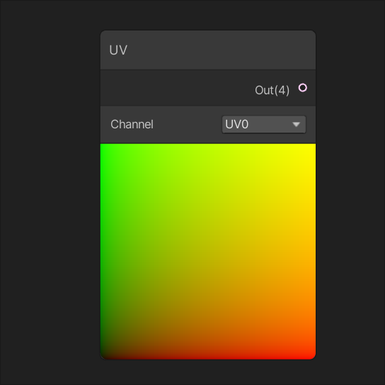 |
| 允许访问网格顶点或片元的切线矢量。 | 允许访问网格顶点或片元的 UV 坐标。 |
| [**Vertex Color**](Vertex-Color-Node.md) | [**View Direction**](View-Direction-Node.md) |
| 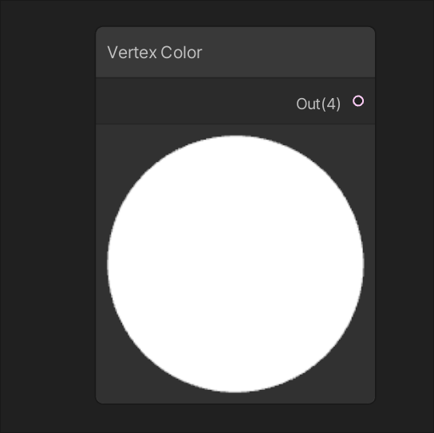 | 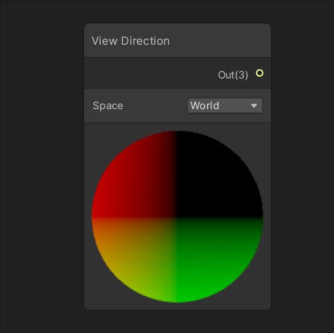 |
| 允许访问网格顶点或片元的顶点颜色值。 | 允许访问网格顶点或片元的视图方向矢量。 |
| [**Vertex ID**](Vertex-ID-Node.md) | [**Billboard**](Billboard-Node.md) |
| 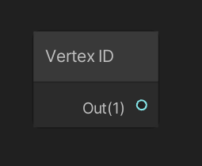 |  |
| 允许访问网格顶点或片段的 Vertex ID 值。 | 对齐物体坐标轴到相机，实现面向相机的效果。 |

渐变 Gradient
--

| [Blackbody](Blackbody-Node.md) | [Gradient](Gradient-Node.md) |
| --- | --- |
| 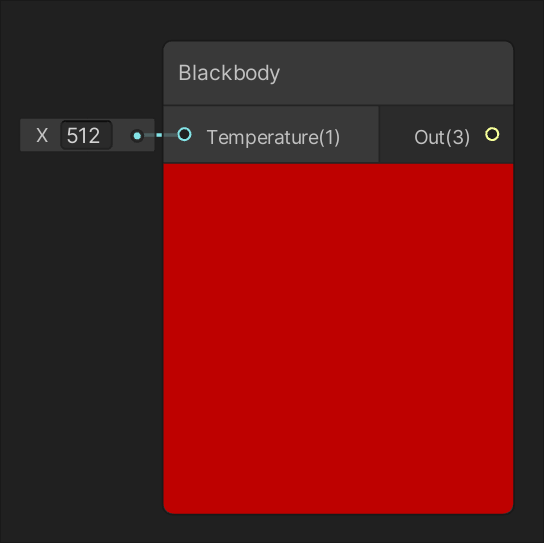 | 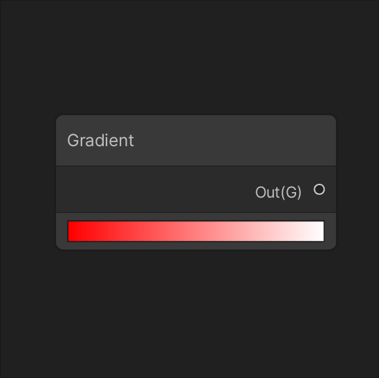 |
| 从温度输入（以开尔文为单位）对基于辐射的渐变进行采样。 | 在着色器中定义一个常量渐变。 |
| [Sample Gradient](Sample-Gradient-Node.md) |  |
| 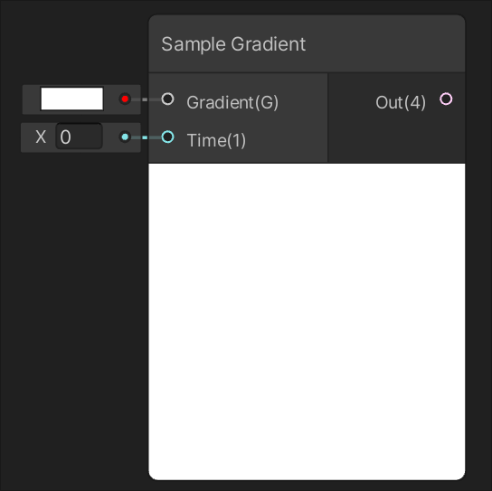 |  |
| 根据给定的 Time 输入对渐变进行采样。 |  |

光照 Lighting
---
|[Additional Lights Loop](Additional-Lights-Loop-Node.md) | [Baked GI](Baked-GI-Node.md) |
|--| -- |
| 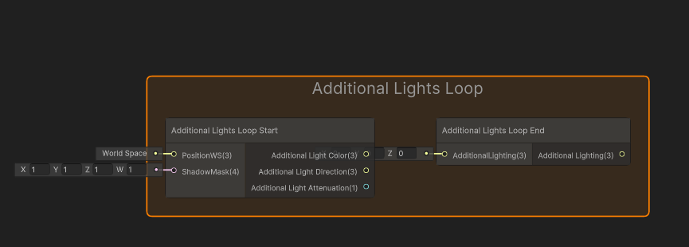|  |
| 进行自定义的额外光源计算。 | 允许访问顶点或片元位置的 Baked GI 值。 |
|[Ambient](Ambient-Node.md) | [Ambient Occlusion](Ambient-Occlusion-Node.md) |
|  | 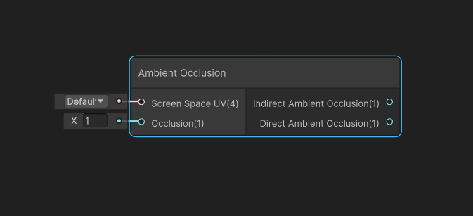 |
| 允许访问场景的环境颜色值。| 获取环境光遮蔽信息。|
| [Custom Diffuse Term](Custom-Diffuse-Term-Node.md) | [Custom Specular Term](Custom-Specular-Term-Node.md) |
| 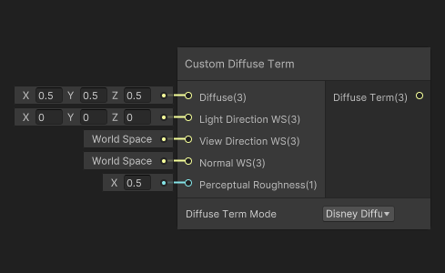 | 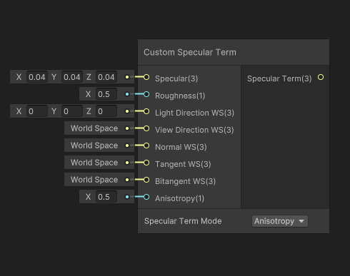 |
| 自定义计算漫反射项。| 自定义计算镜面反射项。|
| [CustomLighting](CustomLighting-Node.md) | [Main Light Color](Main-Light-Color-Node.md) |
|  |  |
| 复合节点，提供简单的 PBR 光照计算，适用于基础材质渲染。| 获取主光源颜色信息。 |
| [Main Light Direction](Main-Light-Direction-Node.md) | [Main Light Realtime Shadow](Main-Light-Realtime-Shadow-Node.md) |
|  |  |
| 获取主光源的方向。 | 获取主光源的实时阴影信息。 |
| [Main Light Shadow](Main-Light-Shadow-Node.md) | [Reflection Probe](Reflection-Probe-Node.md) |
|  |  |
| 获取主光源的阴影信息。 | 允许访问对象最近的反射探针。 |
| [ShadowMask](ShadowMask-Node.md) |  |
|  |  |
| 获取烘焙后的ShadowMask信息。 |  |

矩阵 Matrix
--

| [Matrix 2x2](Matrix-2x2-Node.md) | [Matrix 3x3](Matrix-3x3-Node.md) |
| --- | --- |
| 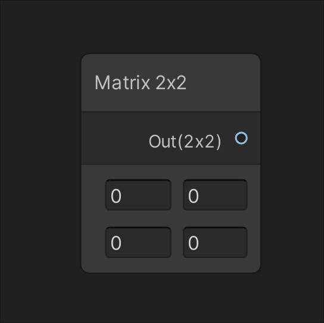 | 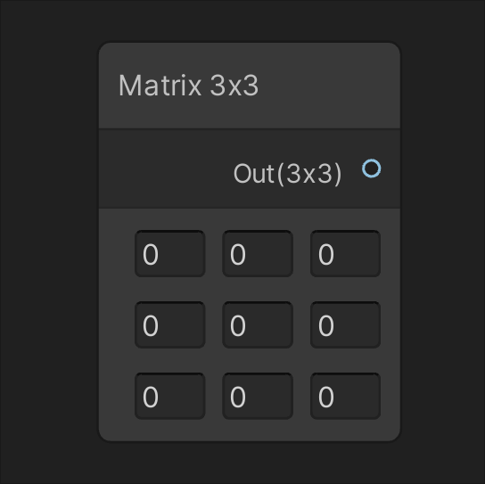 |
| 在着色器中定义一个常量矩阵 2x2 值。 | 在着色器中定义一个常量矩阵 3x3 值。 |
| [**Matrix 4x4**](Matrix-4x4-Node.md) | [**Transformation Matrix**](Transformation-Matrix-Node.md) |
| 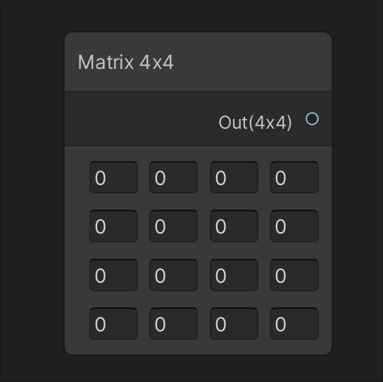 | 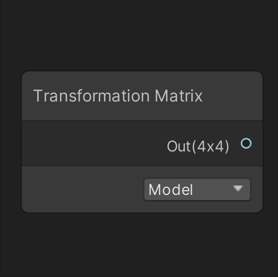 |
| 在着色器中定义一个常量矩阵 4x4 值。 | 在着色器中定义一个默认变换矩阵的常量矩阵 4x4 值。 |

Mesh Deformation
----------------

| [Compute Deformation Node](Compute-Deformation-Node.md) | [Linear Blend Skinning Node](Linear-Blend-Skinning-Node.md) |
| --- | --- |
| 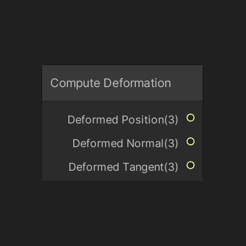 | 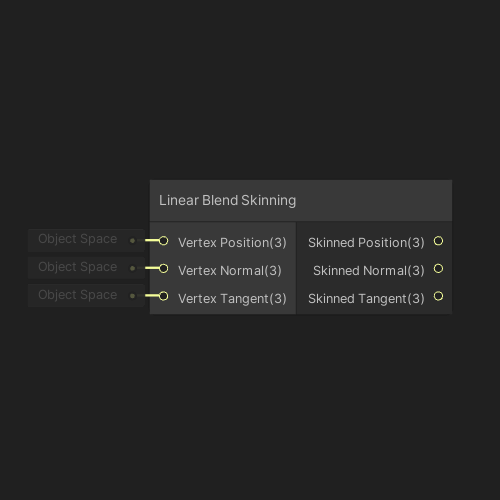 |
| 将计算变形的顶点数据传递给顶点着色器。仅适用于 [Entities Graphics package](https://docs.unity3d.com/Packages/com.unity.entities.graphics@latest/)。 | 应用线性混合顶点蒙皮。仅适用于 [Entities Graphics package](https://docs.unity3d.com/Packages/com.unity.entities.graphics@latest/)。 |

PBR
---

| [**Dielectric Specular**](Dielectric-Specular-Node.md) | [**Metal Reflectance**](Metal-Reflectance-Node.md) |
| --- | --- |
| 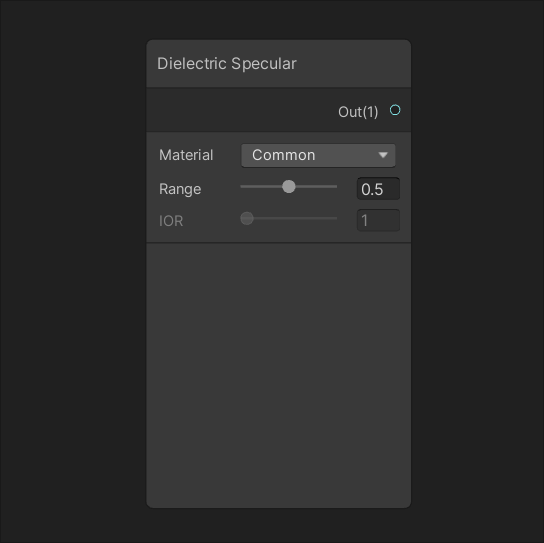 | 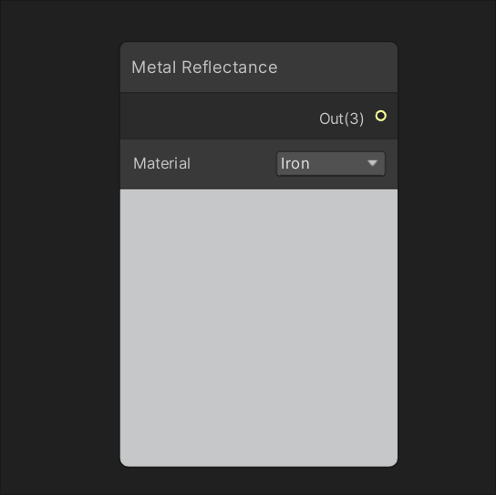 |
| 返回物理材质的介电镜面反射 (Dielectric Specular) F0 值。 | 返回物理材质的金属反射 (Metal Reflectance) 值。 |

场景 Scene
--

| [Camera](Camera-Node.md) | [Depth Fade](Depth-Fade-Node.md) |
| --- | --- |
| 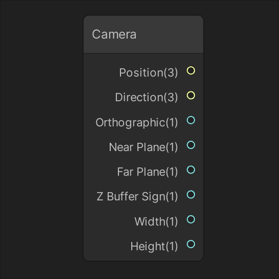 |  |
| 允许访问当前摄像机的各种参数。 | 根据深度信息生成渐变效果。 |
| [**Eye Index**](Eye-Index-Node.md) | [**Fog**](Fog-Node.md) |
| 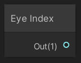 | 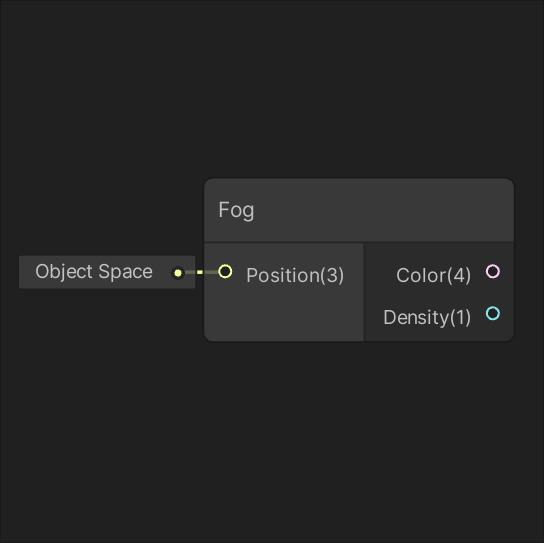 |
| 在立体渲染时允许访问 Eye Index。 | 允许访问场景的 Fog 参数。 |
| [**Object**](Object-Node.md) | [**Scene Color**](Scene-Color-Node.md) |
| 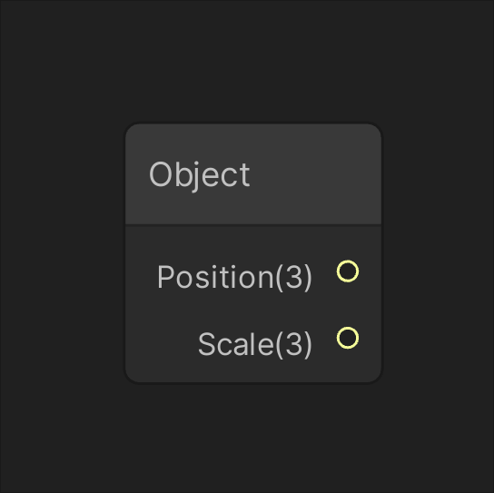 | 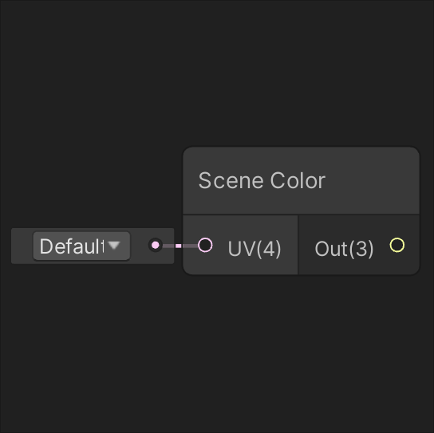 |
| 允许访问对象的各种参数。 | 允许访问当前摄像机的颜色缓冲区。 |
| [**Scene Depth**](Scene-Depth-Node.md) | [**Screen**](Screen-Node.md) |
| 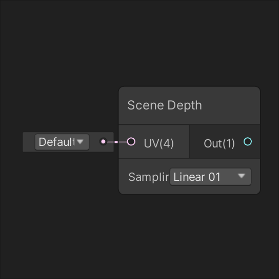  | 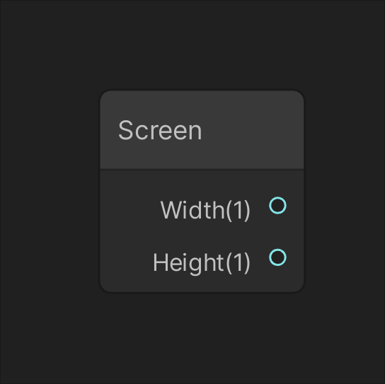 |
| 允许访问当前摄像机的深度缓冲区。 | 允许访问屏幕的参数。 |

纹理 Texture
--

| [**Cubemap Asset**](Cubemap-Asset-Node.md) | [**Sample Cubemap**](Sample-Cubemap-Node.md) |
| --- | --- |
| 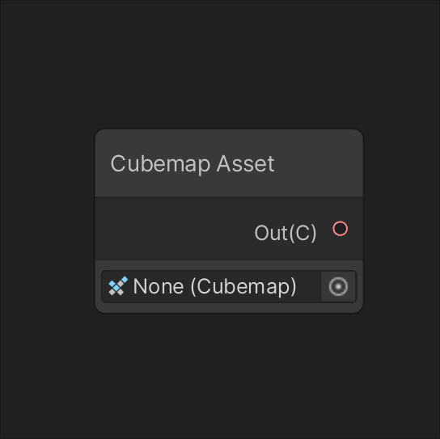| 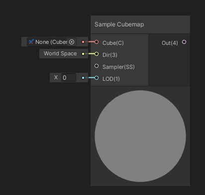 |
| 定义一个要在着色器中使用的常量立方体贴图资源。 | 对立方体贴图进行采样并返回 Vector 4 颜色值以在着色器中使用。 |
| [**Sample Reflected Cubemap Node**](Sample-Reflected-Cubemap-Node.md) | [**Sample Texture 2D**](Sample-Texture-2D-Node.md) |
| 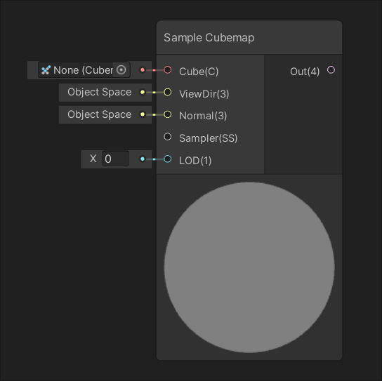 | 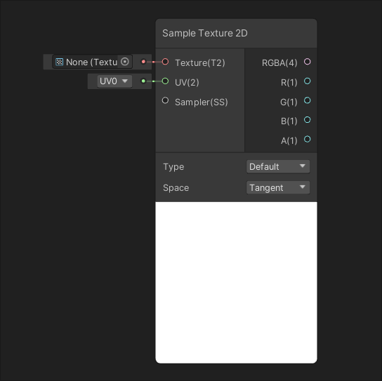 |
| 使用反射矢量对立方体贴图进行采样，并返回一个 Vector 4 颜色值以在着色器中使用。 | 对 2D 纹理进行采样，并返回一个颜色值以在着色器中使用。 |
| [**Sample Texture 2D Array**](Sample-Texture-2D-Array-Node.md) | [**Sample Texture 2D LOD**](Sample-Texture-2D-LOD-Node.md) |
| 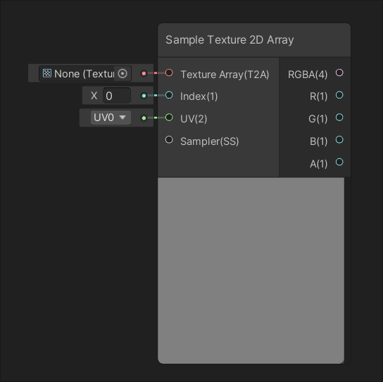 | 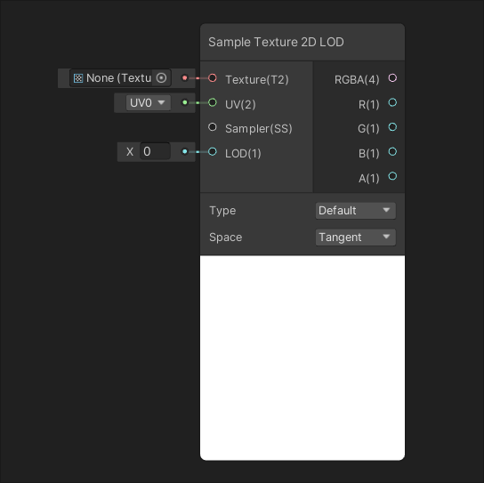 |
| 在 Index 位置对 2D 纹理数组进行采样，并返回一个颜色值以在着色器中使用。 | 以指定的 LOD 对 2D 纹理进行采样，并返回一个颜色值以在着色器中使用。 |
| [**Sample Texture 3D**](Sample-Texture-3D-Node.md) | [**Sample Virtual Texture**](Sample-Virtual-Texture-Node.md) |
| 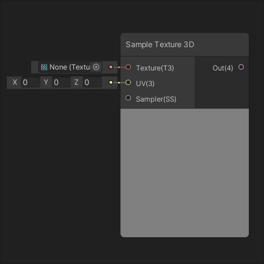 | 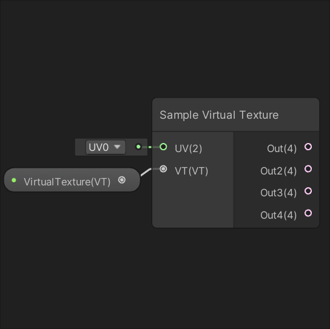 |
| 对 3D 纹理进行采样，并返回一个颜色值以在着色器中使用。 | 对虚拟纹理进行采样，并返回颜色值以在着色器中使用。 |
| [**Sampler State**](Sampler-State-Node.md) | [**Texel Size**](Texel-Size-Node.md) |
| 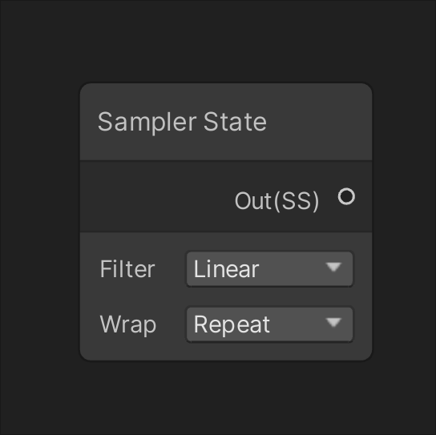 | 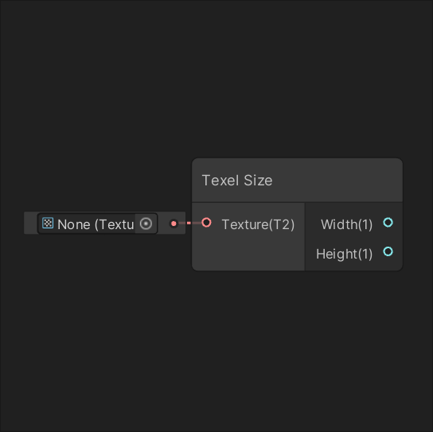 |
| 定义一个采样纹理的采样器状态。 | 返回 2D 纹理输入的纹素大小的宽度 (Width) 和高度 (Height)。 |
| [**Texture 2D Array Asset**](Texture-2D-Array-Asset-Node.md) | [**Texture 2D Asset**](Texture-2D-Asset-Node.md) |
| 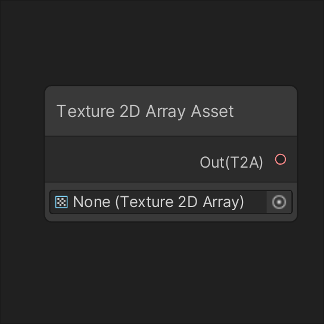 | 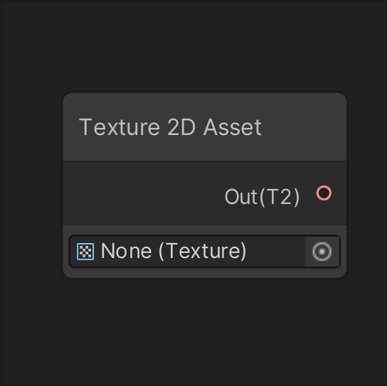 |
| 定义一个要在着色器中使用的常量 2D 纹理数组资源。 | 定义一个要在着色器中使用的常量 2D 纹理资源。 |
| [**Texture 3D Asset**](Texture-3D-Asset-Node.md) |  |
| 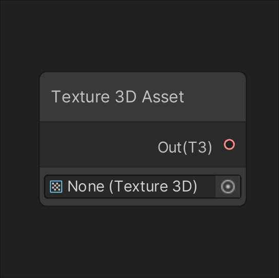 |  |
| 定义一个要在着色器中使用的常量 3D 纹理资源。 |  |
