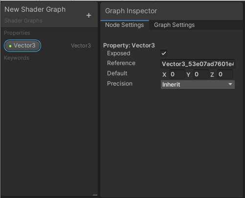
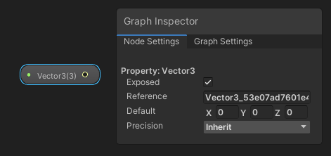
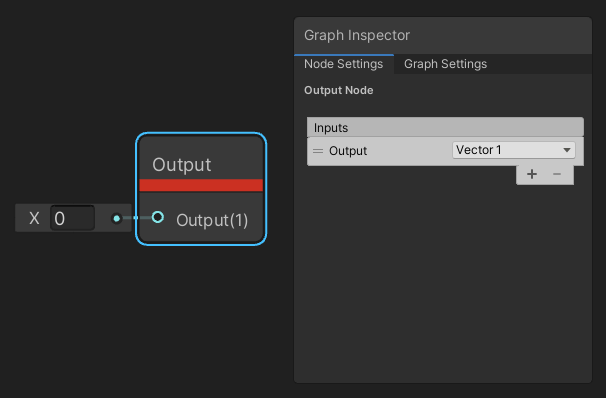
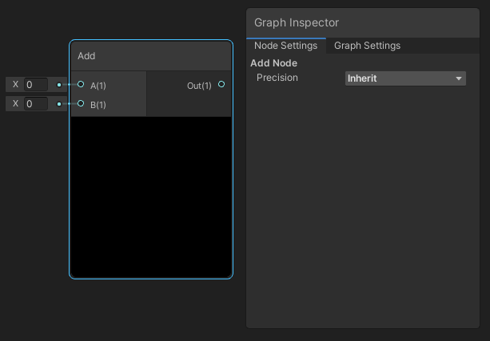
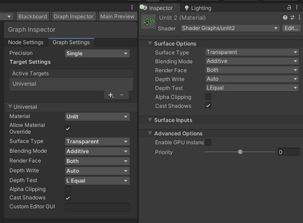
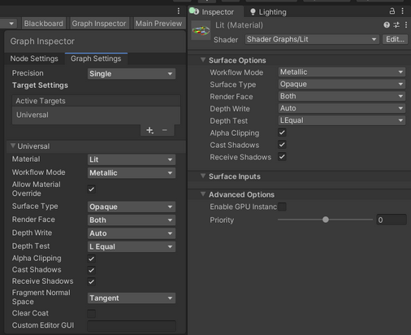

Graph Inspector
===============

描述
--

**Graph Inspector** 用于与 [Shader Graph 资源](Shader-Graph-Asset.md) 的任何可选图形元素和图形范围的设置进行交互。您可以使用 **Graph Inspector** 编辑属性和默认值。

当您打开一个 Shader Graph 时，**Graph Inspector** 默认显示 [Graph Settings](Graph-Settings-Tab.md) 选项卡。该特定 Shader Graph 的图形范围设置显示在此选项卡中。

如何使用
----

在图形中选择一个节点，**Graph Inspector** 会显示该节点可用的设置。该节点可用的设置出现在 Graph Inspector 的 **Node Settings** 选项卡中。例如，如果您在图形或 [Blackboard](Blackboard.md) 中选择一个 Property 节点，**Node Settings** 选项卡中显示 Property 的可编辑属性。

当前与 Graph Inspector 一起使用的图形元素：

* [Properties](https://docs.unity.cn/cn/tuanjiemanual/Manual/SL-Properties.html)

* [Keywords](Keywords.md)

* [自定义函数节点](Custom-Function-Node.md)

* [Subgraph Output 节点](Sub-graph.md)

* [每个节点的精度](Precision-Modes.md)

当前不能与 Graph Inspector 一起使用的图形元素：

* 边
* [即时贴](Sticky-Notes.md)
* 群组

材质覆盖
---------------------------------------

启用 Graph Settings 中的 [Allow Material Override](surface-options.md)  选项，您可以通过 Material Inspector 覆盖某些图表属性。

