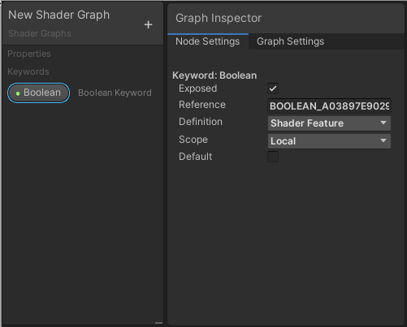
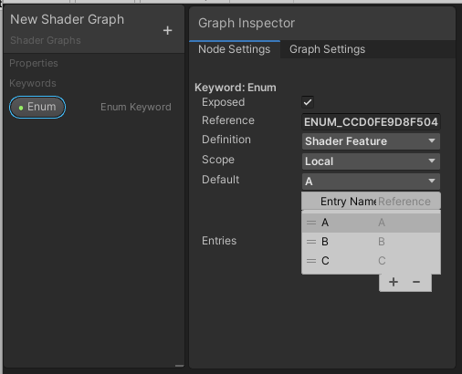
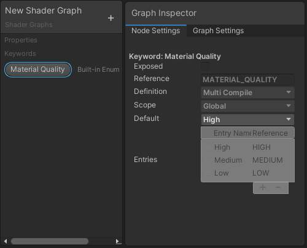

关键字
===

描述
--

您可以使用**关键字（Keywords）** 为 Shader Graph 创建不同的变体（variants）。根据关键字的设置和编辑器中的设置，构建管线可能会剥离这些变体。

关键字的用途很多，例如：

* 创建具有可为每个材质实例打开或关闭的功能的着色器。
* 创建具有在某些平台上表现不同的功能的着色器。
* 创建可根据各种条件扩展复杂度的着色器。

关键字分为三种类型：布尔（Boolean）、枚举（Enum）和内置（Built-in）。根据其类型，团结引擎在图形、着色器以及材质检视面板（可选）中定义了一个关键字。有关关键字类型的更多信息，请参阅[布尔关键字](#BooleanKeywords)、[枚举关键字](#EnumKeywords)和[内置关键字](#BuiltinKeywords)。有关这些关键字如何影响最终着色器的更多信息，请参阅有关[编写多个着色器程序变体](https://docs.unity.cn/cn/tuanjiemanual/Manual/SL-MultipleProgramVariants.html)文档。

在 Shader Graph 中，首先在 [Blackboard](Blackboard.md) 上定义一个关键字，然后使用一个 [Keyword 节点](Keyword-Node.md)在图形中创建一个分支。

编辑器能够在需要时按需编译变体，以便渲染内容。如果声明了许多不同的变体，可能会出现数百万甚至数万亿种可能性。然而，Player 在构建时需要确定哪些变体会被使用，并在预编译着色器时包含这些变体。为了有效管理内存，Player 会根据关键词和编辑器设置剥离未使用的变体。请参阅下一节 [通用参数](#CommonParameters)，了解如何提示 Player 哪些内容需要编译，哪些可以忽略。如果在构建过程中 Player 剥离了某个变体，则会显示粉色的错误着色器。

## 通用参数 

尽管特定类型的关键字有其特定的字段，但所有关键字都具有以下参数。

| **名称** | **类型** | **描述** |
| --- | --- | --- |
| **Display Name** | 字符串 | 关键字的显示名称。团结引擎会在引用相应关键字的节点的标题栏中显示此名称，如果显示（expose）该关键字，也会在材质检视面板中显示此名称。 |
| **Exposed** | 布尔值（Boolean） | 如果将其设置为 **true**，团结引擎在材质检视面板（Material Inspector）中显示相应的关键字。如果将其设置为 **false**，关键字不会出现在材质检视面板中。   如果您打算访问全局（GLOBAL）着色器变量，请像添加输入变量一样将其添加，但取消勾选 **Exposed** 选项。 |
| **Reference Name** | 字符串 | 关键字在着色器中的内部名称。   如果您覆盖了 Reference Name 参数，请注意以下几点：  • 关键字 Reference Name 始终为全大写，因此团结引擎将所有小写字母转换为大写字母。 • 如果 Reference Name 包含任何 HLSL 不支持的字符，团结引擎将用下划线替换这些字符。 • 右键单击 Reference Name，然后选择 **Reset Reference** 可恢复为默认的 Reference Name。 |
| **Definition** | 枚举 | 设置如何在着色器中定义关键字。  有三个可用选项。 • **Shader Feature**：团结引擎在构建时剥离未使用的着色器变体。 • **Multi Compile**：团结引擎从不剥离任何着色器变体。 • **Predefined**：表示活动的渲染管线已经定义了这个关键字，所以 Shader Graph 在它生成的代码中不再对其进行定义。 |
| **Scope** | 枚举 | 设置定义关键字的范围。  有以下几个可选项 • **Global Keywords**：为整个项目定义关键字，并计入全局关键字限制。 • **Local Keywords**：只为一个着色器定义关键字，它有自己的本地关键字限制。 当您使用预定义关键字时，团结引擎会禁用此字段。 |
| **Stages** |  | 设置关键词应用的阶段。  可用的选项如下： • **All**：将该关键词应用于所有着色器阶段。 • **Vertex**：将该关键词应用于顶点阶段。 • **Fragment**：将该关键词应用于片段阶段。 |

## 布尔关键字 

**布尔关键字（Boolean Keywords）** 有开启或关闭两种状态。这会产生两种着色器变体。如果 Exposed 参数设置为 true，团结引擎会在材质检视器中显示布尔关键字。要从脚本中启用该关键字，可以使用关键字的引用名称调用 EnableKeyword。DisableKeyword 方法用于禁用该关键字。要了解更多关于布尔关键字的信息，请参阅[着色器变体和关键字](https://docs.unity.cn/cn/tuanjiemanual/Manual/SL-MultipleProgramVariants.html)。

### 特定于类型的参数

除了上面列出的常用参数，布尔关键字还有以下附加参数。

| **名称** | **类型** | **描述** |
| --- | --- | --- |
| **Default** | 布尔值 (Boolean) | 启用复选框将关键字的默认状态设置为打开，禁用复选框将其默认状态设置为关闭。  此复选框确定 Shader Graph 生成预览时要用于关键字的值。当您使用此着色器创建新材质时，它还定义了关键字的默认值。 |

## 枚举关键字 

**枚举关键字（Enum Keywords）** 可以有两个或多个状态，这些状态可在 **Entries** 列表中定义。如果暴露枚举关键字，其 **Entries** 列表中的 **Display Names** 将出现在材质检视面板中的下拉菜单中。

特殊字符，如 `( )` 或 `!@` 在枚举关键字的 **Entry Name** 中是无效字符。Shader Graph 将无效字符转换为下划线 ( `_` )。

定义枚举关键字时，Shader Graph 会将一个经过清理的 **Entry Name** 版本附加到主 **Reference** 名称来定义每个状态。通过脚本控制关键字时，使用 `Material.EnableKeyword` 或 `Shader.EnableKeyword` 函数，可以按照格式 `{REFERENCE}_{REFERENCESUFFIX}` 输入状态标签。例如，如果你的引用名称是 MYENUM，所需的条目是 OPTION1，那么你应该调用 `Material.EnableKeyword("MYENUM_OPTION1")`。当选择一个选项时，这会禁用其他选项。

### 特定于类型的参数

除了上面列出的常用参数，枚举关键字还有以下附加参数。

| **名称** | **类型** | **描述** |
| --- | --- | --- |
| **Default** | 枚举 | 从下拉菜单中选择一个条目，以确定在 Shader Graph 生成预览时要为关键字使用的值。当您使用此着色器创建新材质时，它还定义了关键字的默认值。当您编辑 Entries 列表时，Shader Graph 会自动更新此下拉菜单中的选项。 |
| **Entries** | 可重新排序的列表 | 此列表定义了关键字的所有状态。每个状态都有独立的 **Display Name** 和 **Reference Suffix**。 • **Display Name**：在[Graph Inspector](Internal-Inspector.md) 和材质检视面板中，显示在关键字的下拉菜单中。Shader Graph 也将此名称用于引用关键字的节点上的端口标签。 • **Reference Suffix**：Shader Graph 使用此后缀在着色器中生成关键字状态。 |

## 内置关键字 

**内置关键字（Built-in Keywords）** 始终是布尔关键字或枚举关键字，但它们的行为略有不同。内置关键字的值由 Editor 或活动的渲染管线设置，无法编辑。

在 [Graph Inspector](Internal-Inspector.md) 的 **Node Settings** 选项卡中，所有内置关键字字段均显示为灰色，但 **Default** 字段除外，您可以启用或禁用该字段，使其在 Shader Graph 预览中的显示有所差异）。内置关键字也无法在材质检视面板中暴露。

