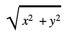
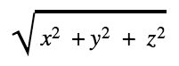

Length 节点
=========


描述
--


返回输入 **In** 的长度。这也称为大小 (magnitude)。矢量的长度是使用[毕达哥拉斯定理 (Pythagorean Theorum)](https://en.wikipedia.org/wiki/Pythagorean_theorem) 计算的。


**Vector 2** 的长度的计算方法如下：





其中，*x* 和 *y* 是输入矢量的分量。可以通过添加或删除分量来计算其他维度矢量的长度。





依此类推。


端口
--


| 名称 | 方向 | 类型 | 描述 |
| --- | --- | --- | --- |
| In | 输入 | 动态矢量 | 输入值 |
| Out | 输出 | Float | 输出值 |


生成的代码示例
-------


以下示例代码表示此节点的一种可能结果。


```
void Unity_Length_float4(float4 In, out float Out)
{
    Out = length(In);
}

```

