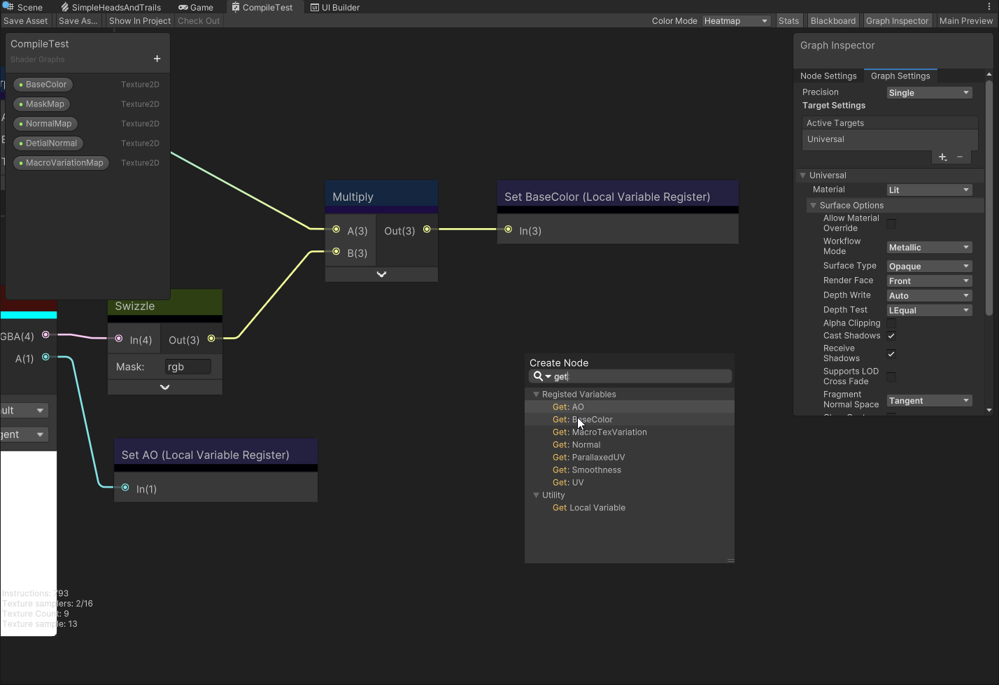

# 局部变量 Local Variable

## 描述

**Local Variable** 局部变量功能，旨在通过模块化设计优化 Shader Graph 的节点布局，显著提升可读性与结构化程度，为用户提供更加高效、直观的开发体验。

通过 [Add Portal Nodes](#add-portal-nodes) 操作，您可以轻松生成 [Local Variable Register 节点](./Local-Variable-Register-Node.md) 和 [Get Local Variable 节点](./Get-Local-Variable-Node.md)，助力 Shader Graph 模块化开发。

## Add Portal Nodes

右击连线并选择 **Add Portal Nodes**，团结引擎将自动生成对应的 [Local Variable Register](./Local-Variable-Register-Node.md) 和 [Get Local Variable](./Get-Local-Variable-Node.md) 节点。这一功能突破了 Shader Graph 原有的网格化编辑局限，大幅提高了可读性和模块化灵活性，使开发者能够更高效地构建复杂的 Shader 结构。

## 操作特性

[Local Variable Register](./Local-Variable-Register-Node.md) 和 [Get Local Variable](./Get-Local-Variable-Node.md) 节点在操作上同样具有关联性。

光标悬浮在 **Get** Local Variable 节点上，对应的 Local Variable **Register** 节点会高亮显示，您也可以**双击**该节点快速跳转到目标 Register 节点。悬浮在 Local Variable **Register** 节点上，对应的 **Get** Local Variable 节点也会高亮显示。

## 搜索节点

注册 Local Variable 节点后，您可直接在 [Create Node 菜单](Create-Node-Menu.md)中搜索并快速添加相应的变量节点。

只需右键点击，选择上下文菜单中的 **Create Node**；或按空格键调出 Create Node Menu，在搜索栏输入 “Get” 或已注册的变量名，点击即可添加对应的 Get 节点。

