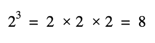

Log 节点
======


描述
--


返回输入 **In** 的对数。**Log** 是 [Exponential 节点](Exponential-Node.md)的逆运算。


例如，输入值为 3 时，base\-2 **Exponential** 的结果是 8。





因此，输入值为 8 时，base\-2 **Log** 的结果是 3。


可以使用节点上的 **Base** 下拉选单在 base\-e、base\-2 和 base\-10 之间切换底数。


端口
--


| 名称 | 方向 | 类型 | 描述 |
| --- | --- | --- | --- |
| In | 输入 | 动态矢量 | 输入值 |
| Out | 输出 | 动态矢量 | 输出值 |


控件
--


| 名称 | 类型 | 选项 | 描述 |
| --- | --- | --- | --- |
| Base | 下拉选单 | BaseE、Base2、Base10 | 选择对数的底数 |


生成的代码示例
-------


以下示例代码表示此节点在每个 **Base** 模式下的一种可能结果。


**Base E**


```
void Unity_Log_float4(float4 In, out float4 Out)
{
    Out = log(In);
}

```
**Base 2**


```
void Unity_Log2_float4(float4 In, out float4 Out)
{
    Out = log2(In);
}

```
**Base 10**


```
void Unity_Log10_float4(float4 In, out float4 Out)
{
    Out = log10(In);
}

```

