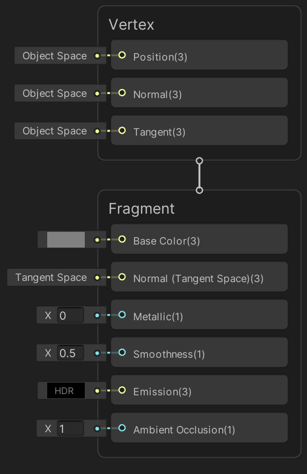
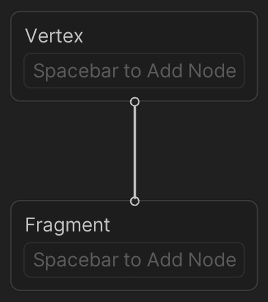

主栈
==

描述
--

**主栈（Master Stack）** 是 Shader Graph 的最终节点，定义了着色器的最终表面外观。您的 Shader Graph 应始终只包含一个 Master Stack。

主栈的内容可能会根据选择的 [Graph Settings](Graph-Settings-Tab.md) 而变化。主栈由上下文组成，其中包含 [Block 节点](Block-Node.md)。

上下文
---

Master Stack 包含两个上下文：顶点（Vertex）和片段（Fragment）。它们代表着色器的两个阶段。连接到顶点上下文中块（Block）的节点将成为最终着色器顶点函数的一部分；连接到片段上下文中块的节点则成为最终着色器片段（或像素）函数的一部分。如果将节点连接到两个上下文中，则它们会执行两次，一次在顶点函数中，另一次在片段函数中。无法剪切、复制或粘贴上下文。

