数学节点
====

高级 Advanced
--

| [Absolute](Absolute-Node.md) | [Exponential](Exponential-Node.md) |
| --- | --- |
| 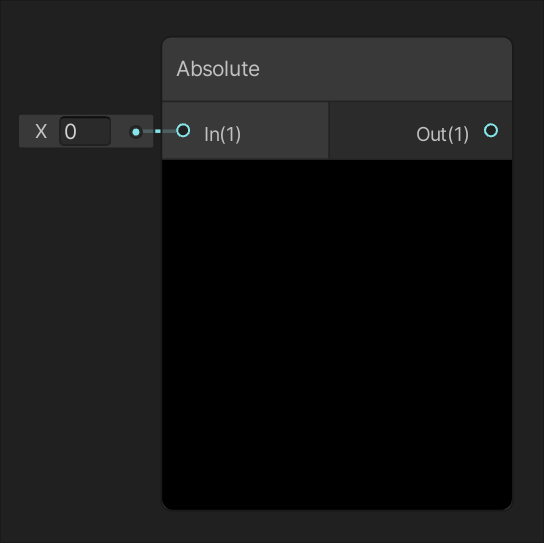 | 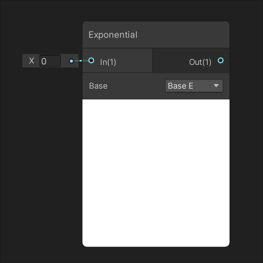 |
| 返回输入 In 的绝对值。 | 返回输入 In 的幂值。 |
| [**Length**](Length-Node.md) | [**Log**](Log-Node.md) |
| 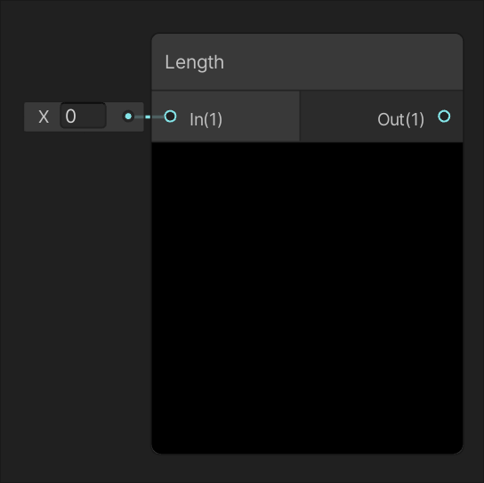 | 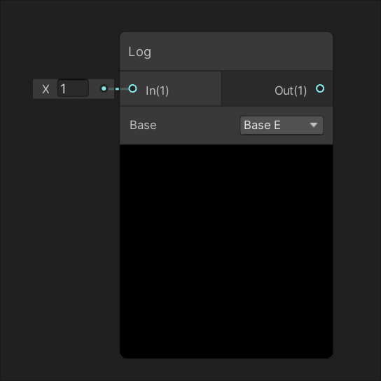 |
| 返回输入 In 的长度。 | 返回输入 In 的对数。 |
| [**Modulo**](Modulo-Node.md) | [**Negate**](Negate-Node.md) |
| 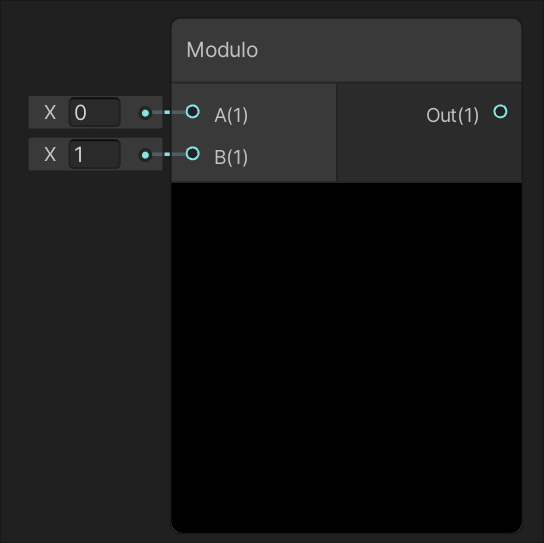 | 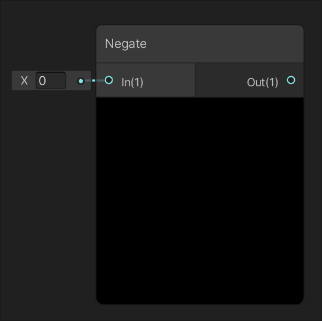 |
| 返回输入 A 除以输入 B 的余数。 | 返回输入 In 的相反数。 |
| [**Normalize**](Normalize-Node.md) | [**Posterize**](Posterize-Node.md) |
|  | 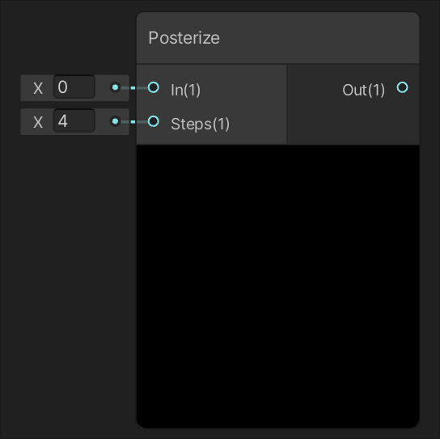 |
| 返回输入 In 的标准化矢量。 | 返回输入 In 转换为输入 Steps 定义的多个值。 |
| [**Reciprocal**](Reciprocal-Node.md) | [**Reciprocal Square Root**](Reciprocal-Square-Root-Node.md) |
| 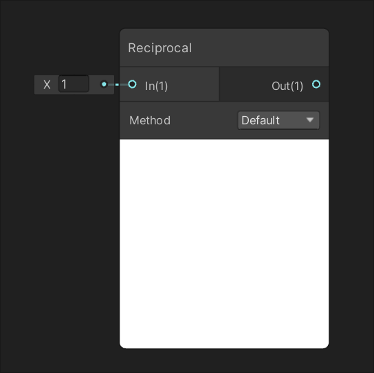 | 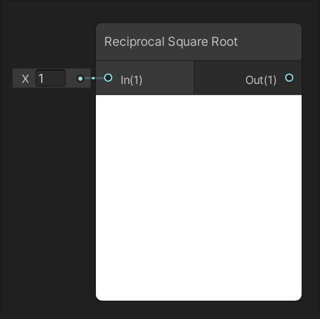 |
| 返回 1 除以输入 In 的结果。 | 返回 1 除以输入 In 的平方根的结果。 |

基本 Basic
--

| [Add](Add-Node.md) | [Divide](Divide-Node.md) |
| --- | --- |
| 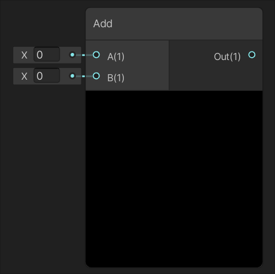 | 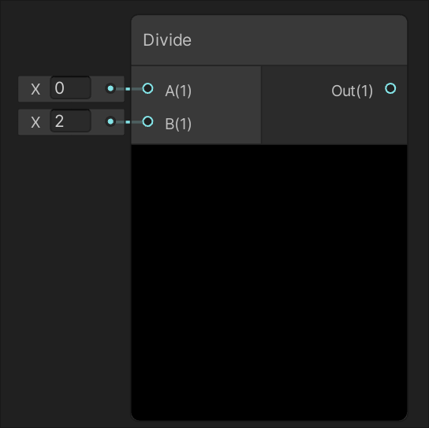 |
| 返回两个输入值之和。 | 返回输入 A 除以输入 B 的结果。 |
| [**Multiply**](Multiply-Node.md) | [**Power**](Power-Node.md) |
|  | 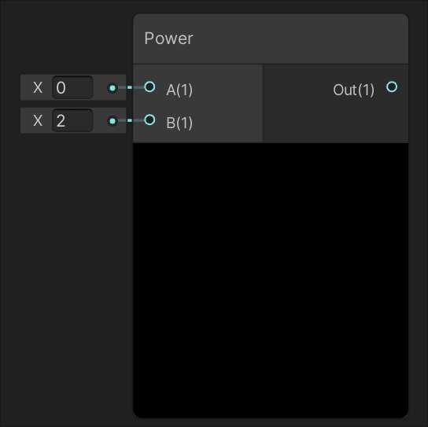 |
| 返回输入 A 乘以输入 B 的结果。 | 返回以输入 A 为底数并以输入 B 为指数的幂运算结果。 |
| [**Square Root**](Square-Root-Node.md) | [**Subtract**](Subtract-Node.md) |
| 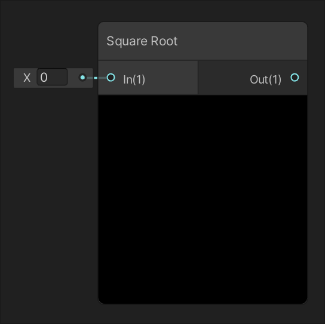 |  |
| 返回输入 In 的平方根。 | 返回输入 A 减去输入 B 的结果。 |

Derivative
----------

| [DDX](DDX-Node.md) | [DDXY](DDXY-Node.md) |
| --- | --- |
| 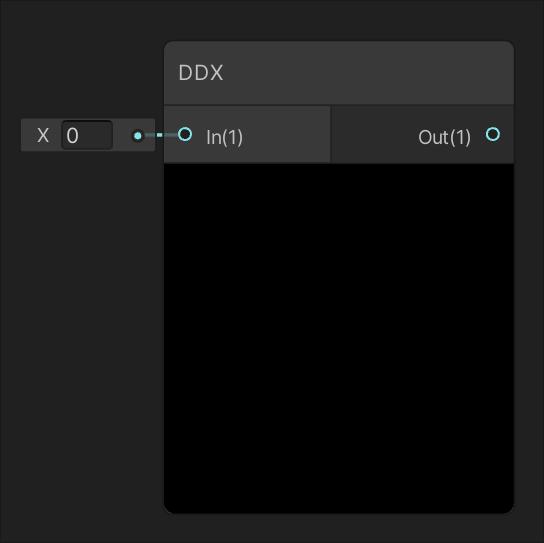 | 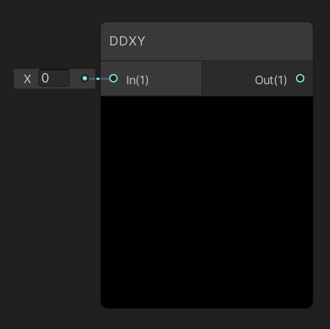 |
| 返回相对于屏幕空间 X 坐标的偏导数。 | 返回两个偏导数之和。 |
| [**DDY**](DDY-Node.md) |  |
| 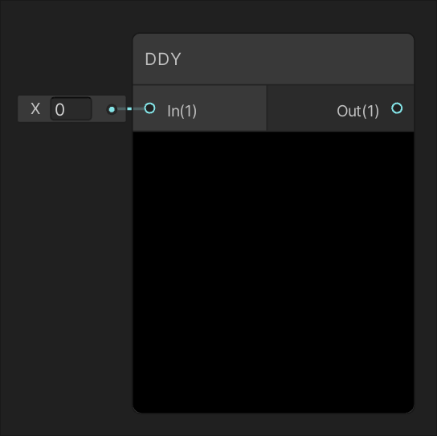 |  |
| 返回相对于屏幕空间 Y 坐标的偏导数。 |  |

Interpolation
-------------

| [Inverse Lerp](Inverse-Lerp-Node.md) | [Lerp](Lerp-Node.md) |
| --- | --- |
| 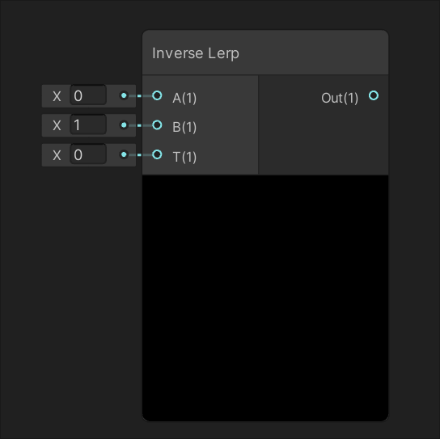 | 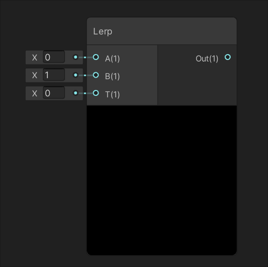 |
| 返回在输入 A 到输入 B 范围内生成由输入 T 指定的插值的参数。 | 返回按照输入 T 在输入 A 和输入 B 之间线性插值的结果。 |
| [**Smoothstep**](Smoothstep-Node.md) |  |
| 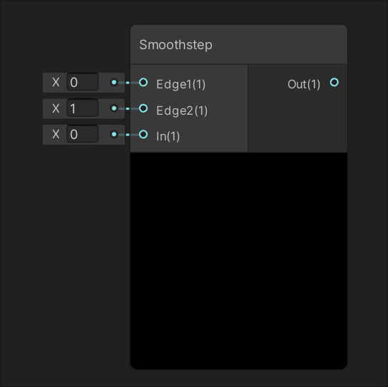 |  |
| 如果输入 In 位于输入 Edge1 和 Edge2 之间，返回 0 和 1 之间的平滑埃尔米特插值结果。 |  |

矩阵 Matrix
--
| [Matrix Construction](Matrix-Construction-Node.md) | [Matrix Determinant](Matrix-Determinant-Node.md) |
| --- | --- |
| 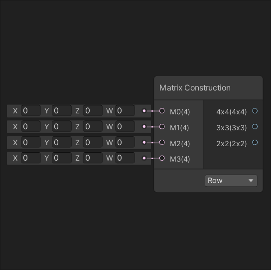 | 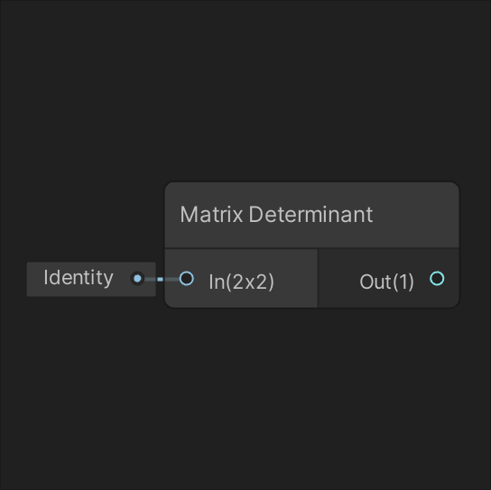 |
| 从四个输入矢量 M0、M1、M2 和 M3 构造方阵。 | 返回由输入 In 定义的矩阵的行列式。 |
| [**Matrix Split**](Matrix-Split-Node.md) | [**Matrix Transpose**](Matrix-Transpose-Node.md) |
| 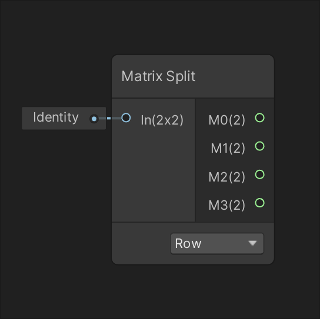 | 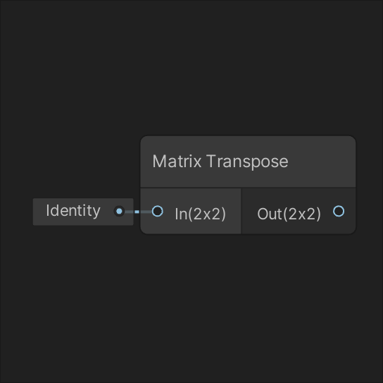 |
| 将由输入 In 定义的方阵拆分为矢量。 | 返回由输入 In 定义的矩阵的转置值。 |

范围 Range
--

| [Clamp](Clamp-Node.md) | [Fraction](Fraction-Node.md) |
| --- | --- |
| 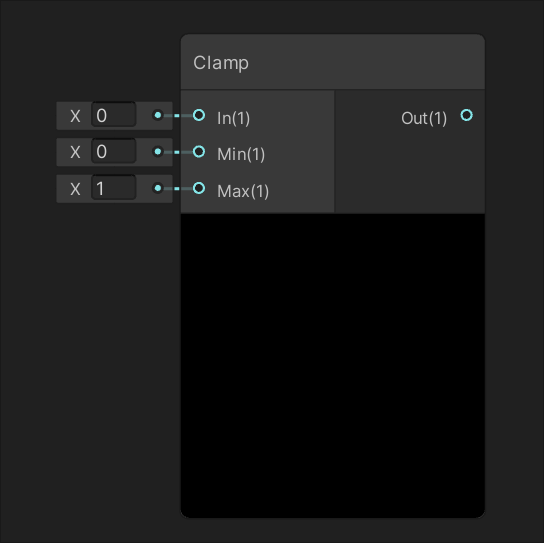 | 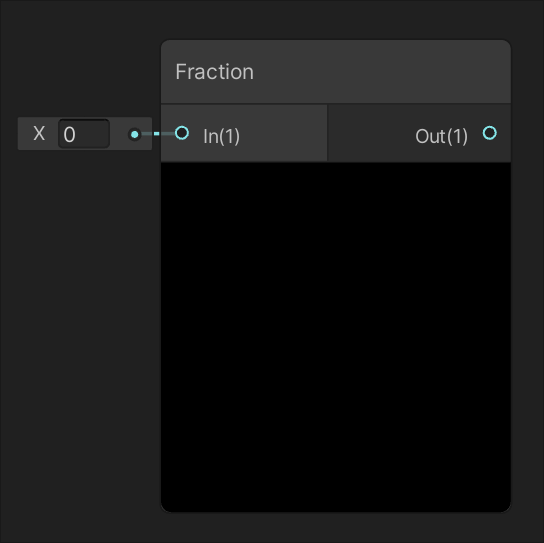 |
| 返回输入 In 在最小值和最大值（分别由输入 Min 和 Max 定义）之间钳制的结果。 | 返回输入 In 的小数部分；大于等于 0 且小于 1。 |
| [**Maximum**](Maximum-Node.md) | [**Minimum**](Minimum-Node.md) |
| 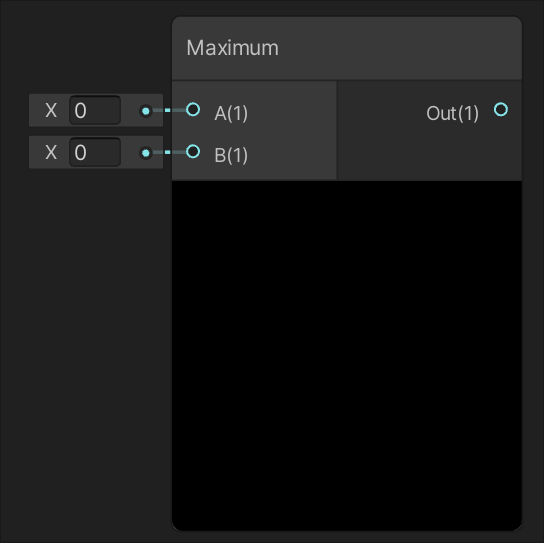 |  |
| 返回两个输入值 A 和 B 中的最大值。 | 返回两个输入值 A 和 B 中的最小值。 |
| [**One Minus**](One-Minus-Node.md) | [**Random Range**](Random-Range-Node.md) |
| 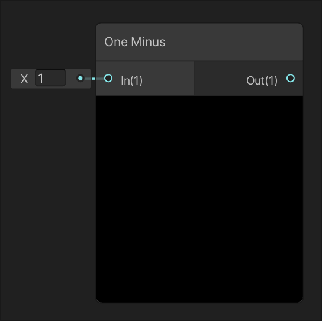 | 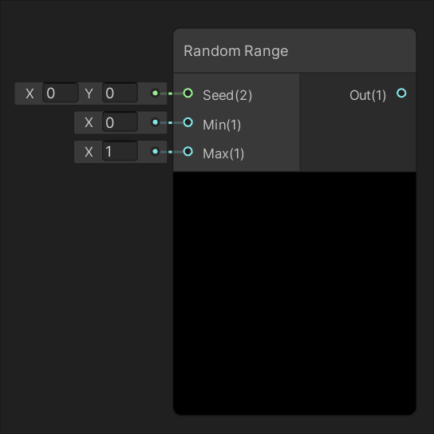 |
| 返回从 1 减去输入 In 的结果。 | 返回介于最小值和最大值（分别由输入 Min 和 Max 定义）之间伪随机数。 |
| [**Remap**](Remap-Node.md) | [**Saturate**](Saturate-Node.md) |
| 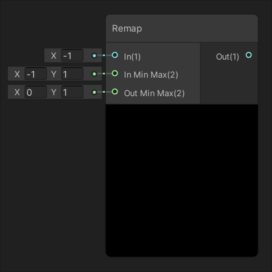 |  |
| 将输入 In 的值从输入 Out Min Max 的值之间重新映射到输入 In Min Max 的值之间。 | 返回输入 In 在 0 和 1 之间钳制的值。 |

取整 Round
--

| [Ceiling](Ceiling-Node.md) | [Floor](Floor-Node.md) |
| --- | --- |
| 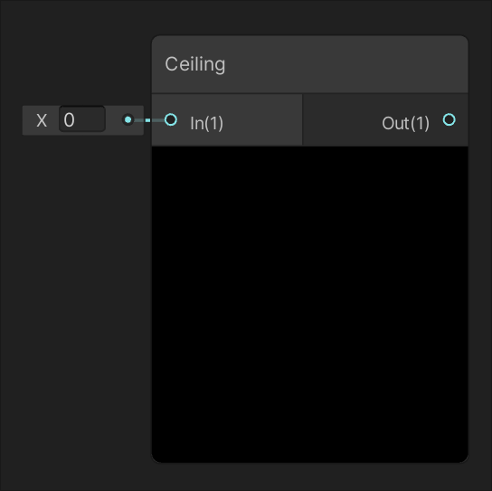 | 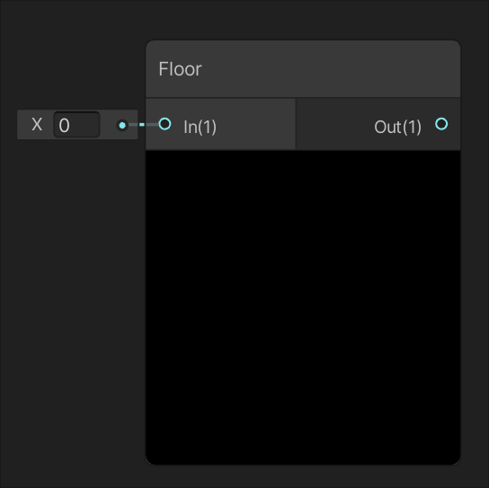 |
| 返回大于或等于输入 In 的值的最小整数。 | 返回小于或等于输入 In 的值的最大整数。 |
| [**Round**](Round-Node.md) | [**Sign**](Sign-Node.md) |
| 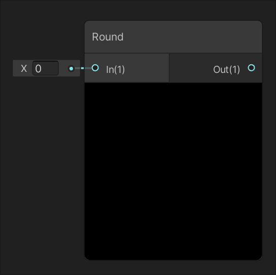 | 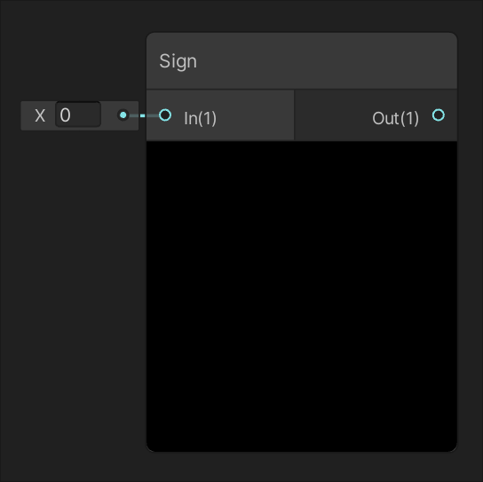 |
| 返回输入 In 四舍五入到最接近的整数的值。 | 如果输入 In 的值小于零，则返回 \-1，如果等于零，则返回 0，如果大于零，则返回 1。 |
| [**Step**](Step-Node.md) | [**Truncate**](Truncate-Node.md) |
| 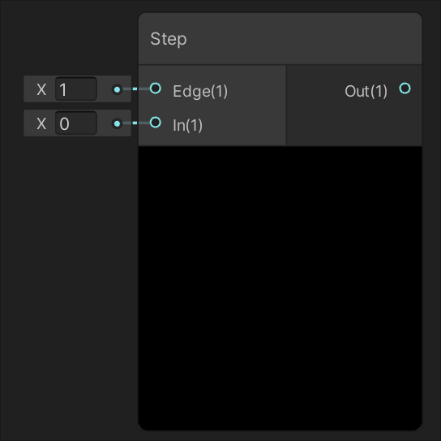 | 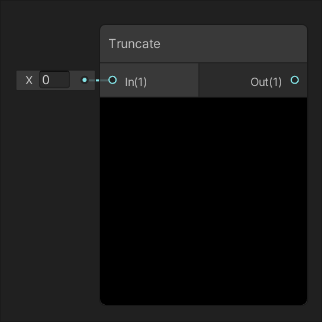 |
| 如果输入 In 的值大于或等于输入 Edge 的值，则返回 1，否则返回 0。 | 返回输入 In 的值的整数部分。 |

三角函数 Trigonometry
----

| [Arccosine](Arccosine-Node.md) | [Arcsine](Arcsine-Node.md) |
| --- | --- |
| 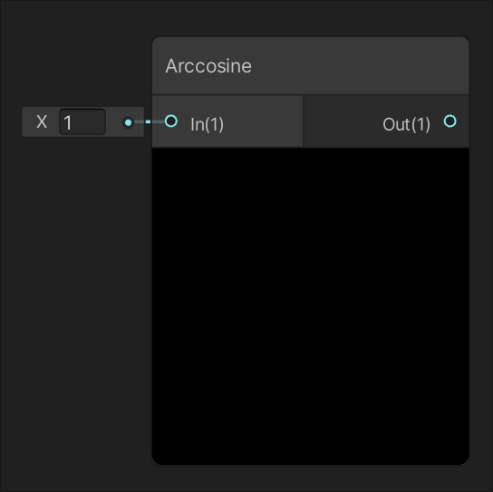 | 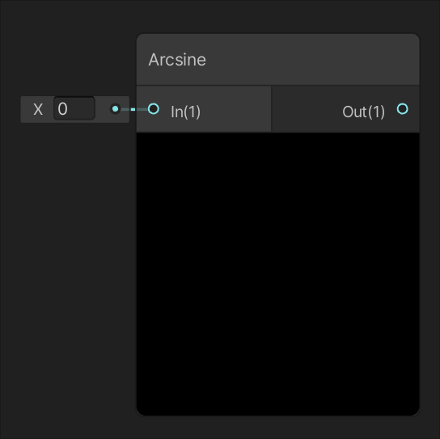 |
| 返回输入 In 的每个分量的反余弦值，作为相等长度的矢量。 | 返回输入 In 的每个分量的反正弦值，作为相等长度的矢量。 |
| [**Arctangent**](Arctangent-Node.md) | [**Arctangent2**](Arctangent2-Node.md) |
| 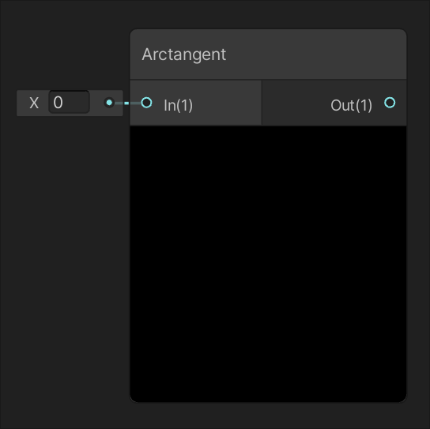 | 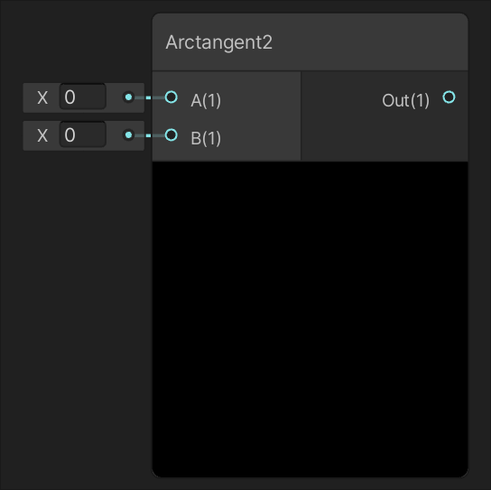 |
| 返回输入 In 的值的反正切值。每个分量都应在 \-Pi/2 到 Pi/2 的范围内。 | 返回输入 A 和输入 B 的值的反正切值。 |
| [**Cosine**](Cosine-Node.md) | [**Degrees to Radians**](Degrees-To-Radians-Node.md) |
| 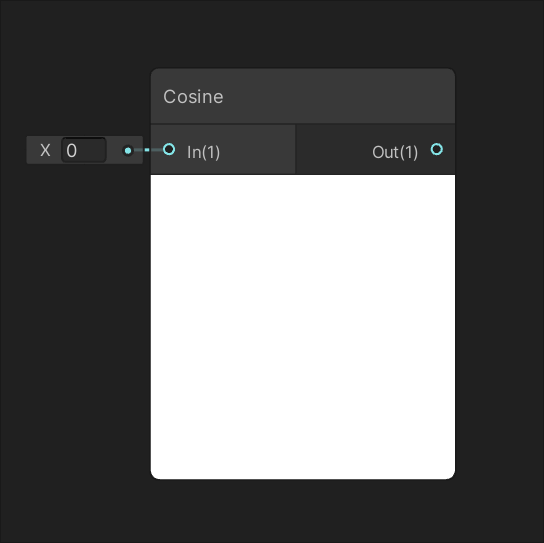 |  |
| 返回输入 In 的值的余弦值。 | 返回输入 In 从度转换为弧度的值。 |
| [**Hyperbolic Cosine**](Hyperbolic-Cosine-Node.md) | [**Hyperbolic Sine**](Hyperbolic-Sine-Node.md) |
| 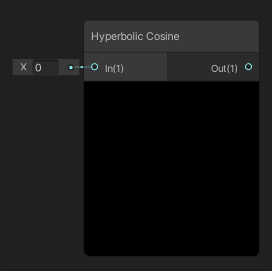 | 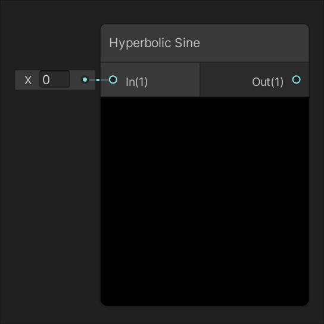 |
| 返回输入 In 的双曲余弦值。 | 返回输入 In 的双曲正弦值。 |
| [**Hyperbolic Tangent**](Hyperbolic-Tangent-Node.md) | [**Radians to Degrees**](Radians-To-Degrees-Node.md) |
| 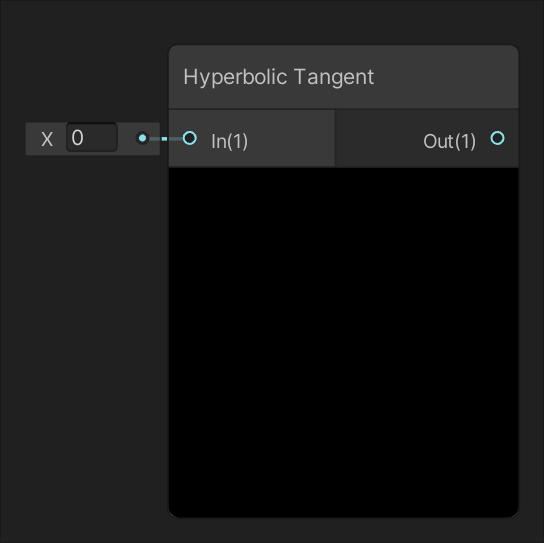 | 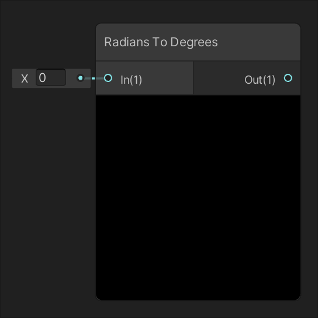 |
| 返回输入 In 的双曲正切值。 | 返回输入 In 从弧度转换为度的值。 |
| [**Sine**](Sine-Node.md) | [**Tangent**](Tangent-Node.md) |
| 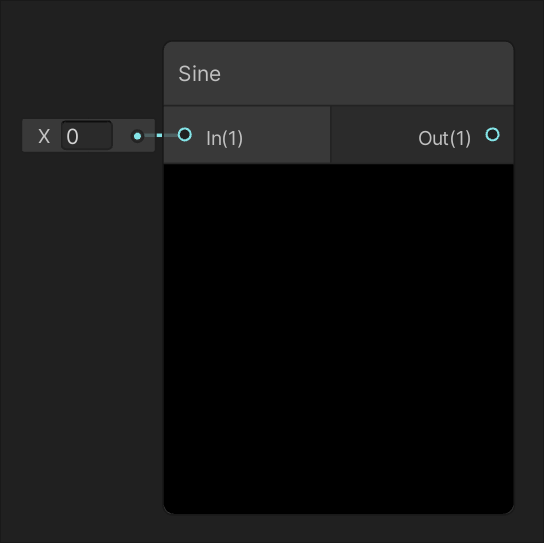 | 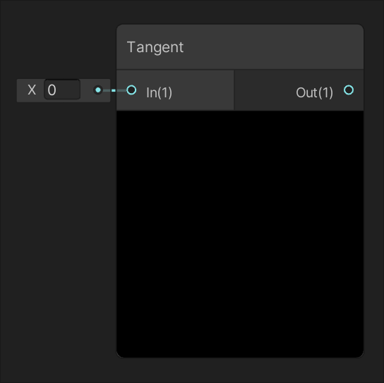 |
| 返回输入 In 的值的正弦值。 | 返回输入 In 的值的正切值。 |

矢量 Vector
--

| [Cross Product](Cross-Product-Node.md) | [Distance](Distance-Node.md) |
| --- | --- |
| 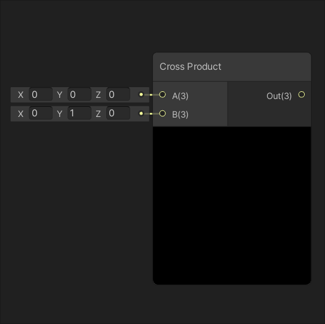 | 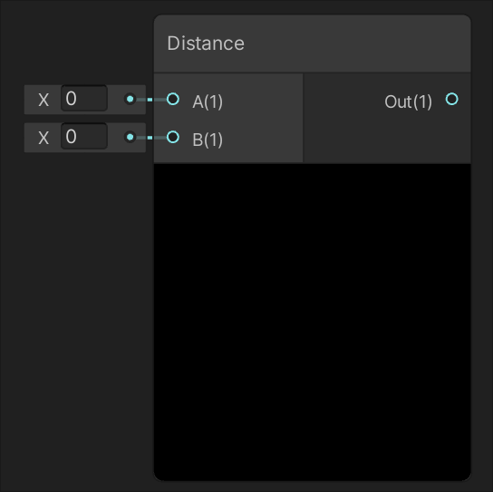 |
| 返回输入 A 和输入 B 的值的差积。 | 返回输入 A 和输入 B 的值之间的欧几里德距离。 |
| [**Dot Product**](Dot-Product-Node.md) | [**Fresnel Effect**](Fresnel-Effect-Node.md) |
| 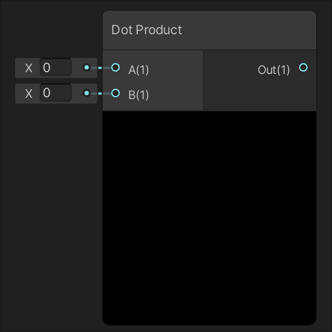 | 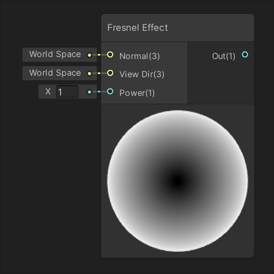 |
| 返回输入 A 和 B 值的点积或标量积。 | 菲涅耳效应 (Fresnel Effect) 是根据视角不同而在表面上产生不同反射率（接近掠射角时的反射光增多）的效果。 |
| [**Projection**](Projection-Node.md) | [**Reflection**](Reflection-Node.md) |
| 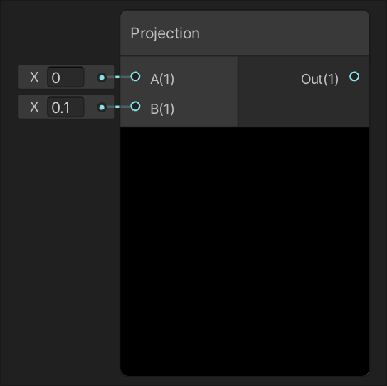 |  |
| 返回将输入 A 的值投影到与输入 B 的值平行的直线上的结果。 | 返回使用输入 In 和表面法线 Normal 的反射矢量。 |
| [**Rejection**](Rejection-Node.md) | [**Rotate About Axis**](Rotate-About-Axis-Node.md) |
| 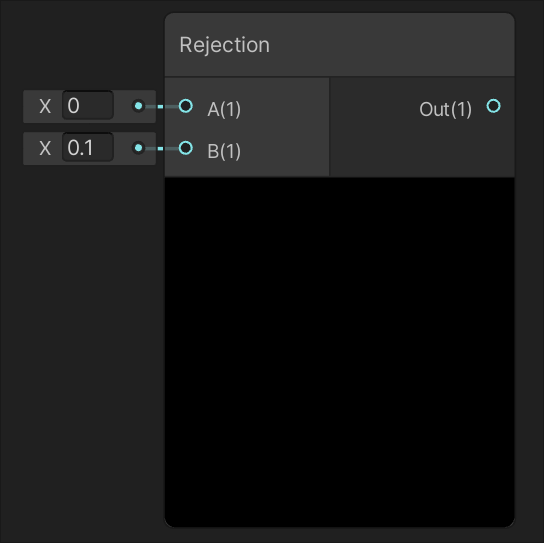 | 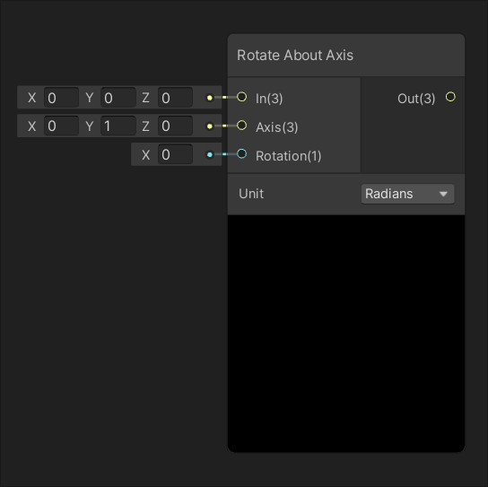 |
| 返回输入 A 的值投影到与输入 B 的值正交或垂直的平面上的结果。 | 绕轴 Axis 将输入矢量 In 旋转值 Rotation。 |
| [**Sphere Mask**](Sphere-Mask-Node.md) | [**Transform**](Transform-Node.md) |
| 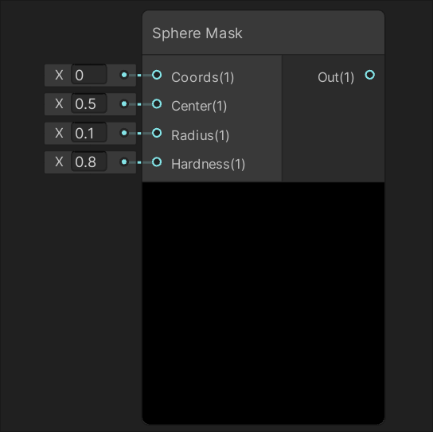 | 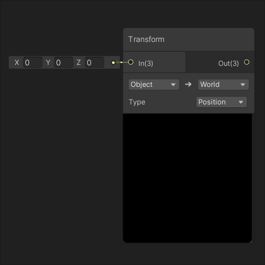 |
| 创建源自输入 Center 的球体遮罩。 | 返回将输入 In 的值从一个坐标空间变换为另一个坐标空间的结果。 |

波 Wave
-

| [Noise Sine Wave](Noise-Sine-Wave-Node.md) | [Sawtooth Wave](Sawtooth-Wave-Node.md) |
| --- | --- |
| 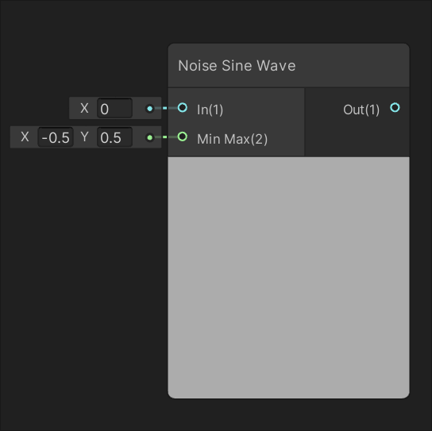 | 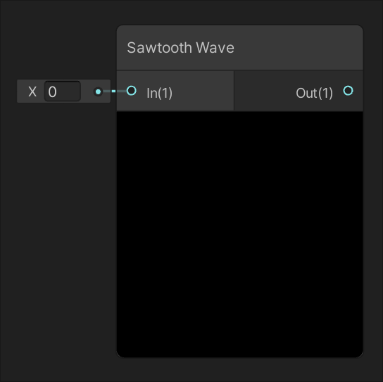 |
| 返回输入 In 的值的正弦波。为表现变化，正弦波的幅度中将添加随机噪声。 | 从输入 In 的值返回锯齿波。 |
| [Square Wave](Square-Wave-Node.md) | [Triangle Wave](Triangle-Wave-Node.md) |
| 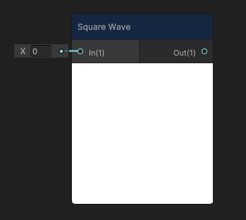 | 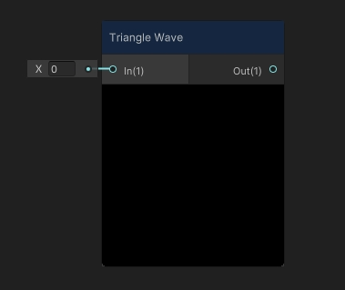 |
| 返回输入 In 的值的方波。 | 返回输入 In 的值的三角波。 |

