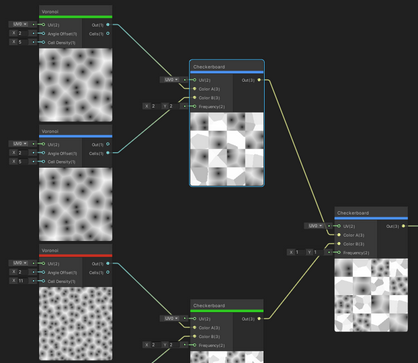

精度模式
====

描述
--

Shader Graph 为节点、图和子图提供了特定的[数据精度模式](https://en.wikipedia.org/wiki/Precision_(computer_science))，以帮助您针对不同平台优化内容。

要设置整个图的精度，在 [Graph Inspector](Internal-Inspector.md) 中选择 [Graph Settings](Graph-Settings-Tab.md) 标签页并调整 **Precision** 控制。要调整单个节点的精度，请在图中选择节点，然后在 Graph Inspector 中选择 **Node Settings** 标签页进行调整。

## 精度模式设置

| 名称 | 描述 |
| --- | --- |
| Single | 这是一个高精度浮点值，位数因平台而异。在现代桌面计算机上，通常为 32 位。该模式适用于世界空间位置、纹理坐标以及涉及复杂函数（如三角函数、幂运算和指数运算）的标量计算。 |
| Half | 这是一个低精度浮点值，位数因平台而异。在现代桌面计算机上，通常为 16 位。该模式适用于短向量、方向、物体空间位置以及许多高动态范围的颜色，但不适用于强光源（如太阳）。 |
| Switchable | 该模式仅适用于子图。当您为子图启用此模式时，该子图的默认精度由其子图节点决定。请参见下文的 **Use Graph Precision** 。 |
| Inherit | 该模式根据一组继承规则来决定节点的精度。请参见[精度继承](#精度继承)。 |
| Use Graph Precision | 此模式强制节点使用与图相同的精度设置。如果这是子图中的节点，且该子图的**精度**设置为**可切换（Switchable）**，则此节点的精度与表示此子图的子图节点的精度相同。 |

## 使用精度模式

### 在图中可视化精度

要在图中可视化数据精度，请将[颜色模式](Color-Modes.md)控制设置为**精度**。这会对您的节点进行颜色编码：

*   **Single** 节点为蓝色
*   **Half** 节点为红色
*   **Switchable** 节点为绿色

### 设置图精度

要将整个图的默认精度设置为 **Single** 或 **Half**，请打开 **Graph Settings** 并设置精度属性。在图中创建的新节点默认使用 **Inherit** 精度模式，并继承图的精度。

### 设置节点精度

选择节点以访问其精度设置。您为节点设置的精度决定了该节点用于计算的数据类型的精度。

### 精度继承

所有节点默认使用 **Inherit** 精度模式。在此模式下，有边连接的节点采用传入[边](Edge.md)（edge）的精度模式。没有边连接的节点则采用 **Graph Precision**。如果更改 **Graph Precision** 模式，这些节点的精度也会随之变化。

| **节点输入** | **最终继承的精度** |
| --- | --- |
| 无输入 | **Graph Precision** |
| 仅 **Half** 输入 | **Half** |
| 仅 **Single** 输入 | **Single** |
| **Half** 和 **Single** 输入 | **Single** |
| 仅 **Switchable** 输入 | **Switchable** |
| **Switchable** 和 **Half** 输入 | **Switchable** |
| **Switchable** 和 **Single** 输入 | **Single** |
| **Switchable**、**Half** 和 **Single** 输入 | **Single** |

#### 简单继承

简单继承指的是只有一种输入精度类型的节点的继承行为。

在下图中，节点 A 的精度模式为 **Inherit**。由于它没有传入边，因此采用 **Graph Precision**，即 **Half**。节点 B 也处于 **Inherit** 模式，因此从节点 A 继承 **Half** 精度模式。

#### 复杂继承

复杂继承指的是拥有多种精度类型输入的节点的继承行为。

节点从每个输入端口读取精度设置。如果将节点连接到具有不同精度模式的多个节点，分辨率最高的节点决定该组的精度模式。

在下图中，节点 D 处于 **Inherit** 模式。它通过输入 1 和输入 2 接收来自相邻边的输入。节点 B 通过输入 1 传递 **Half** 模式，节点 C 通过输入 2 传递 **Single** 模式。由于 **Single** 为 32 位，而 **Half** 仅为 16 位，因此 **Single** 优先级更高，所以节点 D 使用 **Single** 精度。

#### 混合继承

混合继承指的是包含简单和复杂继承类型节点的继承行为。

没有输入端口的节点（如[输入节点](Input-Nodes.md)）继承 **Graph Precision** 。然而，复杂的继承规则仍然会影响同一组中的其他节点。

### 可切换精度

**Switchable** 模式覆盖 **Half** 模式，但不覆盖 **Single** 模式。

### 子图精度

[子图](Sub-graph.md)的精度行为和用户界面元素与其他图和节点无异。子图表示一个函数，您可以通过修改相应的精度设置来影响该函数的输入、输出和操作符。

*   子图属性对应于函数的输入。
*   内部节点属性对应于函数的操作符。
*   输出节点对应于函数的输出。

#### 输出

要手动确定子图输出的精度，请修改**输出**节点的**精度模式**（Precision Mode）设置。

#### 输入

要手动确定**子图输入**的精度，请打开 [Graph Inspector](Internal-Inspector.md) 并为每个[属性](Property-Types.md)单独设置精度模式。使用继承选项的属性将采用您为子图设置的 **Graph Precision** 。

#### 子图在其他图中的精度

默认情况下，子图的精度模式为 `Switchable`。您可以为任何该子图的[子图节点](Sub-graph-Node.md)修改精度模式，但前提是将该子图的精度模式设置为 `Switchable`。

Shader Graph 不允许更改未设置为 `Switchable` 的子图节点的精度模式，因为子图中设置的输入和输出精度会定义其相关的子图节点的精度。

例如，假设子图 A 的精度模式为 **Switchable**。打开包含子图 A 节点引用的图表 Graph 1。与其他节点一样，子图节点 A 默认使用 **Inherit** 模式。将子图节点 A 的精度更改为 **Half** 后，子图 A 的精度也随之变为 **Half**。