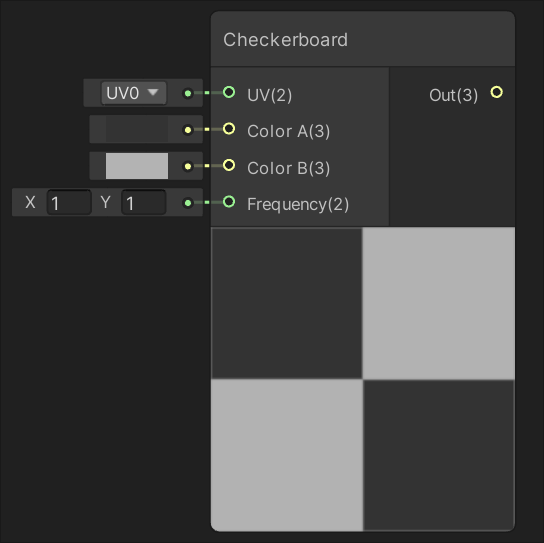
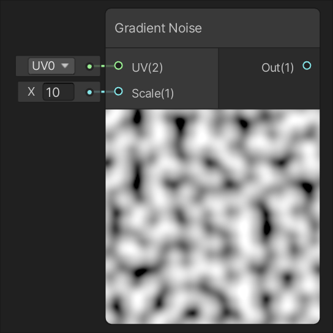
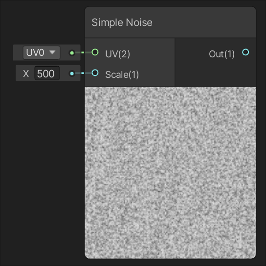
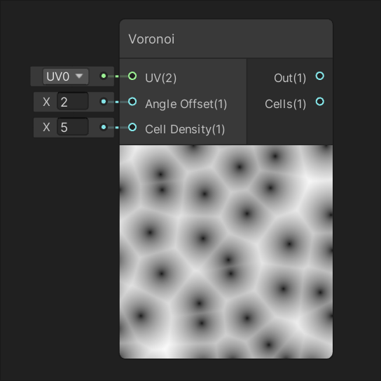
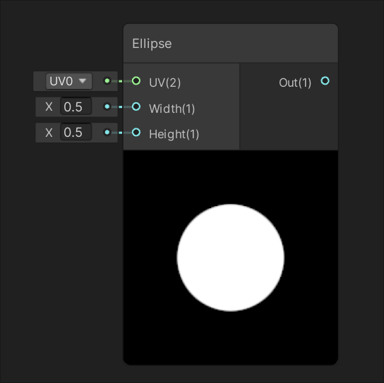
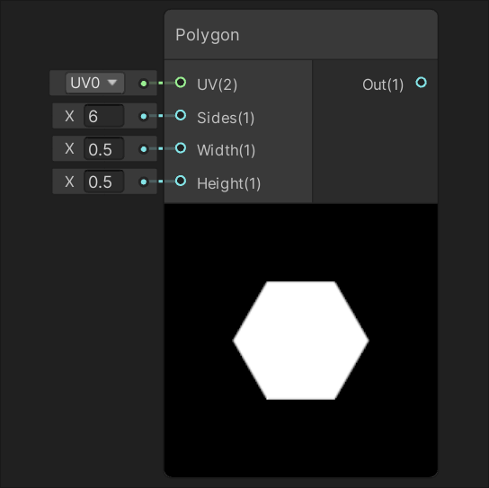
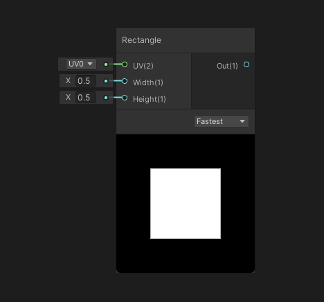
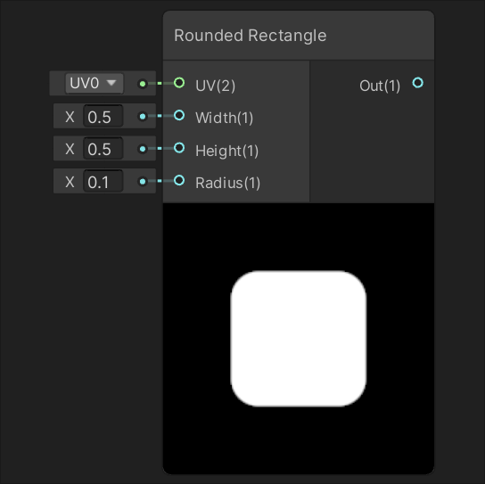
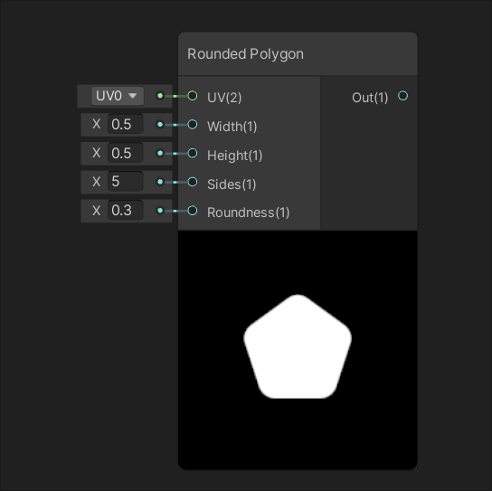

Procedural 节点
==========

| [Checkerboard](Checkerboard-Node.md) |
| --- |
|  |
| 根据输入 UV，在输入的颜色 A 和颜色 B 之间生成一个交替颜色的棋盘格。 |

噪声 Noise
-----------

| [Dynamic Noise](Dynamic-Noise-Node.md) | [Gradient Noise](Gradient-Noise-Node.md) |
| --- | --- |
|  |  |
| 基于输入 UV 生成动态噪声。 | 基于输入 UV 生成渐变（或 Perlin）噪声。 |
| [Simple Noise](Simple-Noise-Node.md) | [Simple Wood](Simple-Wood-Node.md) |
|  |  |
| 基于输入 UV 生成简单（或 Value）噪声。 | 基于输入 UV 生成简单木纹。 |
| [Voronoi](Voronoi-Node.md) |  |
|  |  |
| 基于输入 UV 生成 Voronoi（或 Worley）噪声。 |  |

形状 Shape
-----------
| [Bacteria](Bacteria-Node.md) | [Bricks](Bricks-Node.md) |
| -- | -- |
|  |  |
| 根据输入 UV 生成细菌形状。 | 根据输入 UV 生成砖墙形状。 |
| [Dots](Dots-Node.md) | [Ellipse](Ellipse-Node.md) |
|  |  |
| 根据输入 UV 生成点状图形。 | 根据输入 UV 生成一个由宽度和高度指定大小的椭圆形状。 |
| [Grid](Grid-Node.md) | [Herringbone](Herringbone-Node.md) |
|  |  |
| 根据输入 UV 生成圆点图案。 | 根据输入 UV 生成人字拼贴图形。 |
| [Honeycomb](Honeycomb-Node.md) | [Houndstooth](Houndstooth-Node.md) |
|  |  |
| 根据输入 UV 生成蜂窝纹理。 | 根据输入 UV 生成蜂犬牙交织理。 |
| [Polygon](Polygon-Node.md) | [Rectangle](Rectangle-Node.md) |
|  |   |
| 根据输入 UV 生成一个由宽度和高度指定大小的正多边形形状，边数由输入的边数指定。 | 根据输入 UV 生成一个由宽度和高度指定大小的矩形形状。 |
| [Rounded Rectangle](Rounded-Rectangle-Node.md) | [Rounded Polygon](Rounded-Polygon-Node.md) |
|   |   |
| 根据输入 UV 生成一个由宽度和高度指定大小的圆角矩形形状，圆角半径由输入的半径定义。| 根据输入 UV 生成一个由宽度和高度指定大小的圆角多边形形状。输入的边数指定边的数量，输入的圆角度定义每个角的圆角程度。 |
| [Smooth Wave](Smooth-Wave-Node.md) | [Spiral](Spiral-Node.md) |
|  |  |
| 根据输入 UV 生成波浪纹理。 | 根据输入 UV 生成螺旋线图案。 |
| [Stripes](Stripes-Node.md) | [Taiji](Taiji-Node.md) |
|  |  |
| 根据输入 UV 生成条纹图形。 | 根据输入 UV 生成太极图形。 |
| [Tile](Tile-Node.md) | [Truchet](Truchet-Node.md) |
|  |  |
| 根据输入 UV 生成地板状图案。 | 根据输入 UV 生成特鲁谢纹理。 |
| [Whirl](Whirl-Node.md) | [Zigzag](Zigzag-Node.md) |
|  |  |
| 根据输入 UV 生成旋转纹理。 | 根据输入 UV 生成z字拼贴纹理。 |
