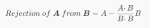

Rejection 节点
============

描述
--

返回输入 **A** 的值与输入 **B** 的值在正交或垂直的平面上投影的结果。剔除向量的值等于原始向量（输入 **A** 的值）减去相同输入的 [Projection](Projection-Node) 值。



端口
--

| 名称 | 方向 | 类型 | 描述 |
| --- | --- | --- | --- |
| A | 输入 | 动态矢量 | 第一个输入值 |
| B | 输入 | 动态矢量 | 第二个输入值 |
| Out | 输出 | 动态矢量 | 输出值 |


生成的代码示例
-------


以下示例代码表示此节点的一种可能结果。


```
void Unity_Rejection_float4(float4 A, float4 B, out float4 Out)
{
    Out = A - (B * dot(A, B) / dot(B, B))
}

```

